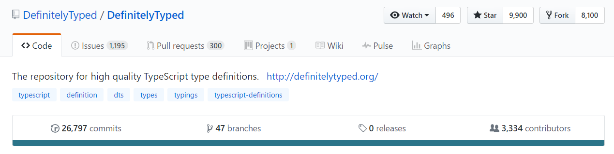

# TypeScript 手册

> 来自：[pagalvin/tsbook](https://github.com/pagalvin/tsbook)

## 盛大介绍

欢迎来到令人兴奋的 TypeScript 世界！

这本书旨在对 TypeScript 语言的主要特性进行轻松介绍。本章涵盖了：

+   这本书的目标读者是谁（即，我想象中会对阅读它感兴趣的人是谁？）

+   为什么学习 TypeScript？这里的投资回报是什么？

+   难道已经有足够多的书了吗？为什么要写*另一本*呢？

+   对于那些对我如何编写这本书感兴趣的人，这里有一些更个人化的说明，涉及到书籍的机制和其他指标。

## 版本

本书的当前版本是：1.0.2。最后一次推送于 2017 年 07 月 11 日。

详细版本历史请参见本章末尾。

## 目标读者

这本书面向三类用户：

+   你从未使用过 TypeScript，不确定是否想要使用它，但在社交媒体上听到了很多关于它的事情。你想要一个无忧无虑的介绍。

+   你一直在涉足 TypeScript，你对它大部分都满意。你想深入了解主流 TypeScript“东西”（如接口、类和泛型）。你想要一本以结构化方式进行这方面讨论的书籍，同时也不会让你被更加晦涩或先进的内容（如交叉类型、混合或装饰器）所压倒。

+   你是一位 Java 或 C#程序员，想要转向前端开发世界，但一直避免接触它，因为你不喜欢用纯 JavaScript 工作时那种油腻的感觉。鸭子类型并不是你的菜。

如果你符合这些类别中的任何一个，欢迎！

如果不是的话，你也欢迎！

在我们继续之前，如果你只是想开始学习这种语言，那就直接跳到第三章吧。本章是你典型的简单介绍，第二章，*概览*，实际上确定了不在范围内的主题。事情在第三章，*实际考虑*中开始变得有趣和实用。

## 介绍 - 为什么选择 TypeScript？

JavaScript 社区的规模正在增长，已经在增长，而且未来可能还会继续增长。为什么会这样？原因有很多。入门门槛非常低 - 你只需要一个文本编辑器和一个网络浏览器。如果你有一台相当现代化的电脑，你就可以开始编写 JavaScript 应用程序。新晋开发者可以通过最小的工具快速构建 JavaScript 解决方案，并且他们之前不需要进行奢侈的培训^(1)。一些经验丰富的服务器端开发者看到了相对容易的编辑/保存/部署过程，想要加入这一阵营。这种语言几乎无处不在。JavaScript 如今几乎无处不在 - 浏览器、服务器（通过 node）并且正在推动物联网（IoT）领域的发展。它甚至试图取代，或者至少在本地应用程序的桌子上占个座位^(2)。JavaScript 实际上是互联网的机器语言。

当我写下这些文字时，JavaScript 开发社区的规模仍在不断增长。其工具选择比以往任何时候都更多样化。优秀的工具为社区提供了在前端和后端构建真正惊人解决方案的机会。机会的领域每天都在扩展。这是一个我们这些幸运的人可以将智慧应用于一些迷人问题领域的时代。这是令人兴奋的时刻！

我们也被选项淹没了。我们有完整的框架，如 Angular、React、Ember、Meteor、Vue 等。我们有复杂的任务运行器和打包工具，如 gulp、grunt 和 webpack。我们有经典的实用程序库，如 JQuery、lodash 和 underscore。

这引出了一个问题，为什么我们要进一步复杂化我们的生活，并花时间学习 TypeScript，如果 JavaScript 已经具备了所有的功能呢？

我相信有两个很好的理由来看待 TypeScript - 它不断增长的流行度，以及 - 更重要的是 - 与之一起工作的纯粹快乐。

### TypeScript 的流行

首先，至少有一个主要框架，Angular 2+，强烈推动您使用 TypeScript。如果您在一个 Angular 团队工作，学习它有一个强有力的实际理由^(3)。其他框架提供了与 TypeScript 兼容的功能，反之亦然。例如，TypeScript 通过智能的 JSX 智能提示为 React 开发人员提供了一流的支持。

有些人可能将“学习它因为您*需要*它进行未来的开发工作”描述为“负外部性”，并不一定*受欢迎*。这是公平的。但请考虑这样一个事实，许多纯 JS 库的作者已经努力提供与 TypeScript 兼容的接口。这里是 DefinitelyTyped 的 github 项目：

[立即查看](https://github.com/DefinitelyTyped/DefinitelyTyped)，看看自 2017 年 3 月以来它的增长有多大。

从高层次上看，类型帮助弥合了 TypeScript 和纯 JavaScript 库之间的差距。我提到 DefinitelyTyped 的 github 项目是因为它显示了一个相当大的库开发人员和/或忠实支持者认为值得花时间创建这些类型。正如您在上面的屏幕截图中所看到的，拥有超过 3,000 名贡献者，近 27,000 次提交和接近 10,000 个星标 - 该项目提供了一些证据表明学习这个是值得的。

所有这些都表明 TypeScript 在 JavaScript 社区中已经获得并继续获得了足够的关注。关于它是否会“胜出”并成为真正的主流脚本语言用于 Web 开发，目前尚无定论。它可能不会成为*Web*的语言^(4)。但它的吸引力无法否认。越来越多的现有和未来的前端开发人员选择 TypeScript 而不是纯 JavaScript。一些人甚至在考虑是否应该仅学习 TypeScript 并跳过 JavaScript。

### 纯粹的快乐

TypeScript 的日益流行在一定程度上回答了“为什么选择 TypeScript”这个问题。然而，我们中的很多人并不受流行程度的影响。我对这个观点表示同情。

我在构建含有从次要到主要的客户端代码的解决方案大约三到四年后开始接触 TypeScript。我使用 jQuery 进行 DOM 操作和异步工作，以及大量的纯 JS 逻辑。一开始，我遇到了所有常见的问题，比如闭包、如何检测`null`或`undefined`以及`=``"==` "===" 这些运算符的使用。我最终对这些问题有了一种不安的理解，但有些问题始终无法解决。我发现很难有信心地应用常见的设计模式。纯 JavaScript 即使对于微不足道的更改也很难重构。

正如你将在第四章中发现的那样，TypeScript 是一种静态类型语言。或者至少，如果你想的话，你可以使用类型。从“意图”角度来看，它比纯 JavaScript 要清晰得多（“程序员对这段代码的意图是什么？”），以及从技术上的意义来说。由于 TypeScript 减少了歧义，IDE 可以提供更好的支持。你将在整本书中看到许多这样的例子。

这两点结合起来，使得使用 TypeScript 成为一种真正愉快的体验。闭包的复杂性减少了。意外地将字符串赋值给数字更加困难。重构不像以前那么困难，因此你很可能会及时进行必要的更改，而不是增加一些技术债务。管理复杂对象变得轻而易举。TypeScript 的语法很好地映射到许多常见的设计模式。

对我来说，TypeScript 就像在一个清洁整洁、组织良好且备有充足食材的厨房里开始烹饪一顿大而复杂的饭菜。你可以专注于制作美味的饭菜，而不是担心你的香料架上是否有足够的未过期龙蒿。

简而言之，这是一种乐趣。

## 为什么*又一个* TypeScript 书籍？

市场上已经出现了几本关于 TypeScript 的书籍，有免费的，也有付费的（更不用说成千上万的博客文章、付费文章、视频和 PluralSight 课程了）。这并没有阻止我写这本书，因为我相信市场能够容纳更多的选择。我也知道不同的人以不同的方式学习东西 - 更多的教学“声音”能够帮助更多的人。这本书就是这样一种声音。我希望你觉得它愉快，更重要的是，有帮助 :）。

目前，有几个学习 TypeScript 的好资源，包括那些具有原型图标的。*TypeScript 深入探讨*，你可以在这里阅读：[`basarat.gitbooks.io/typescript/`](http://basarat.gitbooks.io/typescript/)。

一些章节列出了一些“进一步调查”的链接，主要是博客文章。最后一章再次列出了所有这些链接，并包含了未在书中（当前）涵盖的高级主题的链接。它们应该能够帮助你在学习过程中。

## 关于本书

我总是对像这样的书是如何产生的感到好奇，想和你们中对此感兴趣的人分享一点我的过程。

我花了大约六个月的时间写这本书，包括两个时期（每个时期约 3 周）相当密集的写作，以及许多周没有写作。我倾向于写很多高层次的要点，然后去做一些完全无关的事情，比如一个失控的家庭装修项目^(6)。与此同时，我的脑袋里一直在酝酿着东西，当我坐下来写作时，一大部分内容会很快地流出来。

我决定使用 VS Code 来写这本书，而不是更传统的文本编辑器，比如 MS Word。VS Code 并不是一个文字处理软件，但它支持[markdown](https://github.com/adam-p/markdown-here/wiki/Markdown-Cheatsheet)。它与 Git 完美地集成在一起。我写了几千字，发现 markdown 对我想要的东西已经足够好了，特别是因为你可以直接在文本中注入纯 HTML。这就是我的引用框是如何工作的，以及我如何嵌入视频。

关于视频 - 多年来，我学会了“差异化教学”的价值，这是教学领域的一个术语。它只是描述了一种教授同一概念的两种或多种不同方式的过程。有些人对第一种方式反应良好，而有些人对第二种方式反应良好。

本书的视频没有任何声音。我不想引入任何障碍，比如插上耳机，来观看它们。它们包含许多注释，你可以、也应该根据需要暂停和倒带。

# 为本书做贡献

我认为大多数作者，我也算其中之一，从读者的反馈中得到了无法估量的满足感。如果你想以一种非物质的、精神的方式为这本书做出贡献（比如“干得好！”或“亲爱的上帝，你用这本书给世界带来了什么新鲜的地狱！”），最简单的方式就是给我发一封邮件至 galvin.paul@gmail.com。如果你在主题中加上“TypeScript Book”这几个词会很有帮助，但当然不是必需的。当有人在我的博客文章上留下评论或通过电子邮件联系我时，我总会感到额外的兴奋。这比得到报酬还要好^(7)。

我长久以来一直对*你不了解 JavaScript*系列感到印象深刻、感兴趣，甚至有点羡慕。凯尔·辛普森显然触动了某个神经，他的 Github 项目非常活跃。事实上，我曾试图追随他的模式。如果你想以更实质的方式参与进来，请访问本书的 github 网站，[`github.com/pagalvin/tsbook`](https://github.com/pagalvin/tsbook)：

+   给项目加星

+   记录一些问题

+   修正你发现的问题并发起一个拉取请求

+   提出甚至撰写全新领域的内容并发起一个拉取请求

我将尽一切可能回复你的邮件，审查和处理 github 问题，并接受高质量的拉取请求。

# 进一步阅读

这一章的 "进一步阅读列表" 比其他章节要广泛得多。这些文章反映了 TypeScript 日益增长的流行度，以及至少一个 "反 TypeScript" 文章。

在这里：

+   从 Flow 迁移到 TypeScript：[`jan.varwig.org/2017/02/15/flow-vs-typescript.html`](http://jan.varwig.org/2017/02/15/flow-vs-typescript.html)

+   更倾向于 Flow 而不是 TypeScript，因为它能更早地检测到错误：[`thejameskyle.com/adopting-flow-and-typescript.html`](http://thejameskyle.com/adopting-flow-and-typescript.html)

+   Stack Overflow 探讨了一个问题，"为什么选择 TypeScript 而不是 JavaScript？" [`stackoverflow.com/questions/12694530/what-is-typescript-and-why-would-i-use-it-in-place-of-javascript`](https://stackoverflow.com/questions/12694530/what-is-typescript-and-why-would-i-use-it-in-place-of-javascript)

+   C# 开发人员的 TypeScript 简介：[`www.codeguru.com/csharp/csharp/cs_webservices/tutorials/typescript-for-the-c-developer.html`](http://www.codeguru.com/csharp/csharp/cs_webservices/tutorials/typescript-for-the-c-developer.html)

+   Slack（团队消息平台）的优秀人员将他们的代码库迁移到了 TypeScript。这篇文章解释了原因：[`slack.engineering/typescript-at-slack-a81307fa288d`](https://slack.engineering/typescript-at-slack-a81307fa288d)

+   仍然不确定吗？也许这位作者的 "六个原因" 文章会说服你：[`www.siliconrepublic.com/enterprise/typescript-programming-javascript`](https://www.siliconrepublic.com/enterprise/typescript-programming-javascript)

+   一篇来自 2014 年的旧的 "反 TypeScript" 文章。其实有点难找到 "TS 很烂" 的文章，但我想至少包含一个经过深思熟虑的例子，这就是它：[`walkercoderanger.com/blog/2014/02/typescript-isnt-the-answer/`](http://walkercoderanger.com/blog/2014/02/typescript-isnt-the-answer/)

+   另一个软件开发团队解释他们决定使用 TypeScript 的原因：[`medium.com/@tomdale/glimmer-js-whats-the-deal-with-typescript-f666d1a3aad0`](https://medium.com/@tomdale/glimmer-js-whats-the-deal-with-typescript-f666d1a3aad0)

# 版权

© 2017 Paul Galvin.

# 版本历史

| 日期 | 版本 | 变更 |
| --- | --- | --- |
| 07/07/2017 | 1.0 | 书籍的初始上线，开始在社交媒体上 "推销"。 |
| 07/08/2017 | 1.01 | 在第四章 "引入类型" 中添加了 Ayo Alfonso 的链接 |
|  |  | 在继续学习章节中添加了 Navalia github 项目。 |
|  |  | 用章节编号更新了目录。 |
| 07/11/2017 | 1.02 | 合并了一个来自 Frank Ali 的拉取请求，修复了一个示例联合类型中的错误（使用 "up" 代替 "right"）。仍然需要更正相关视频。 |

# 进行下去

这就是给毛茸茸的人的。接下来的章节讨论了一些超出范围的话题，这样你就不会对这本书中未涉及的事情抱有希望。

* * *

> ¹. 这并不是说他们做得很好，但他们确实在努力尝试。 ↩
> 
> ². 例如，Electron 提供了一种在桌面上运行 JavaScript 应用程序的方式。Electron 本身非常友好于 TypeScript。 ↩
> 
> ³. 即使你现在是 Angular 1.x 的团队，你也应该尝试学习 TypeScript 来跟上潮流。你的团队在投资 Angular 2+ 之前只是时间问题。 ↩
> 
> ⁴. 鉴于 JavaScript 已经是“Web 的机器语言”，我们这些富有而尴尬的开发者将能够选择几乎任何我们想要使用的语言，并且与其他人无缝地协作。在这里可以查看我对这个主题的更多想法：["JavaScript 作为 Web 虚拟机语言的美妙后果"](https://hackernoon.com/the-wonderful-consequences-of-javascript-as-the-virtual-machine-language-of-the-web-3a65cbf887fa#.b9rxgbbrs "https://hackernoon.com/the-wonderful-consequences-of-javascript-as-the-virtual-machine-language-of-the-web-3a65cbf887fa#.b9rxgbbrs") ↩
> 
> ⁵. 至少我认为市场可以承受另一本免费的在线书籍 :). ↩
> 
> ⁶. 它始于“嘿，让我们把地毯拉起来，把硬木地板重新打磨一下！”然后，它逐渐进行，一点点地，重新做了整个一楼的硬木地板，拆下旧的装饰条并更换，修补天花板上的裂缝，油漆地下室的楼梯并安装新的台阶，新的吊灯和厨房用具... 它还没有完成。有趣的事情，但是... 或许我不应该开始。 ↩
> 
> ⁷. *大部分*比得到报酬更好。 ↩
