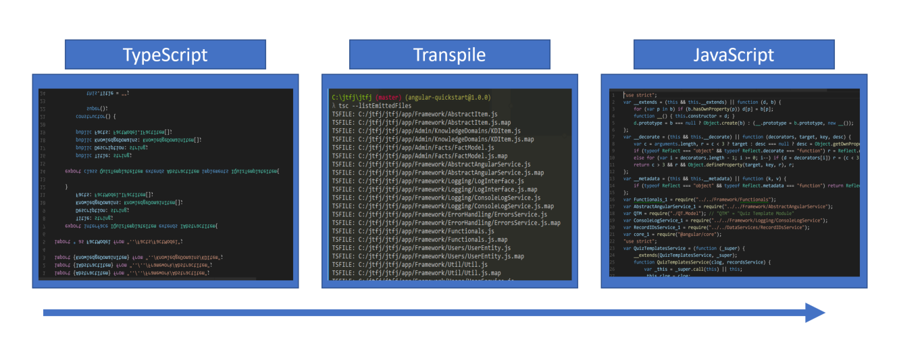

# 第三章：使用 TypeScript - 实用概述

# 使用 TypeScript - 实用概述

TypeScript 与几乎所有其他计算机语言都有一些共同之处 - 一个 TypeScript 程序只是一个文本文件。计算机不能在将该文本转换为机器语言之前运行它。当然，这个过程被称为*编译*，并不是太阳下的新鲜事^(1)。

当微软首次宣布 .NET 时，我愚蠢地嘲笑他们。

如今，许多流行的语言甚至不再编译成机器语言。Java 编译成字节码。一个虚拟机解释该字节码并执行您的应用程序。C# 和其他 .NET 语言也编译成字节码，尽管格式不同。它们在不同的虚拟环境中运行，即编译语言运行时或 CLR)^(2)。如果你眯起眼睛看，甚至浏览器也可以看作是虚拟机^(3)。

现代所有的网络浏览器都知道如何运行 JavaScript。它们不一定在 DOM 的一些细节上完全一致。它们可能会根据诸如控制台对象之类的东西而变化其行为。在不同供应商的浏览器中，这些 CSS 的这一小段行为可能会有所不同（甚至在同一供应商的不同版本中也有可能如此^(4)）。然而，尽管存在差异，它们更多地是一致的而不是不一致的^(5)。在大多数情况下，我今天写的 JavaScript 可以在地球上的任何浏览器上运行，或者至少是我关心的浏览器 :).

当然，TypeScript 并不是 JavaScript。它看起来很像 JavaScript，正如你将会看到的，您可以编写与纯 JavaScript 完全相同的有效 TypeScript。然而，今天没有任何主要的网络浏览器能够执行 TypeScript。这里存在一种差距。转译通过将 TypeScript 转换为 JavaScript 来弥合 TypeScript 和 JavaScript 之间的差距。

这是一个看待它的方式：

图：高级 TypeScript 转译流程

在实践中，这与我们在 Java、.NET、Rust 和其他语言中进行的编译过程没有什么不同。然而，它通常被称为转译过程而不是编译过程。在本书中，我会倾向于同时使用这两个词。

您无需拥有 Visual Studio 或使用 VS Community Edition 来编写 TypeScript 代码。许多流行的 IDE 都提供了一流的 TypeScript 体验，包括 Sublime、WebStorm 和 Visual Studio 的年轻兄弟，Visual Studio Code。JS 社区在很大程度上接受了 VS Code，所以这是一个安全且容易的选择。我已经使用 VS Code 来编写本书中的所有示例（确实，包括本书本身），许多屏幕截图显示的是 VS Code 的后台。也就是说，本书不是关于 VS Code 或任何其他集成开发环境（IDE）的。选择你喜欢的。

当今市场上为我们提供了一个 TypeScript 编译器。微软创建了它，他们在维护它，它是开源的。正如您所期望的那样，它与 Visual Studio 的集成良好，有趣的是，与 VS Code 一起使用效果更佳。但是，它实际上是一个独立的独立应用程序。从这里下载并安装：[`www.typescriptlang.org/`](https://www.typescriptlang.org/ "访问 TypeScript 语言站点")。

**任务运行器简要说明**

当您使用任务运行器时，您会定义单独的任务，通常您会通过 JavaScript 来“定义”它们。这意味着您也可以用 TypeScript 编写您的任务。

使用 IDE 加上 TypeScript 编译器可以实现大部分需求，但不一定是您想要的全部。根据您的 IDE，您可能还需要一个任务运行器。任务运行器执行……任务 :）。至少，您希望您的任务运行器在您编辑并保存 TypeScript 文件时调用 TypeScript 编译器。Visual Studio 和 Visual Studio Code 都配备了集成的任务运行器（前者为 MSBuild，后者为集成的运行器）。但是，您可能会逐渐发现集成的任务运行器不够用。当这个时机到来时，看看 gulp、grunt 或类似的工具。在撰写本文时，[gulp](http://gulpjs.com/)和[Webpack 2](https://webpack.js.org/)似乎是最受关注的。

从现在开始，我假设您已经选择了一个 IDE，并且您的 IDE 连接到一个任务运行器，每当您进行更改并保存时，它会自动编译您的 TypeScript。

## 调试

当我第一次开始思考 TypeScript 时，我最先想到的一个问题是 - 我怎样调试它呢？结果证明这是一个非常简单和自然的过程。由于它们没有配置为正确提供映射文件，因此 Web 服务器配置可能会有一些怪癖。这些问题都是可以解决的。我无法强调一下，一旦我了解了这个过程，调试问题就变得多么不值一提。

Chrome、Internet Explorer 和 Firefox 等 Web 浏览器提供了出色的调试工具。这些工具适用于纯 JavaScript。这里有一个视频展示了一些代码，该代码对对象集合进行迭代，以及 Chrome 调试器的体验：

[`www.youtube.com/embed/MFwfodjYFoo`](https://www.youtube.com/embed/MFwfodjYFoo)

（如果您无法观看此视频，请[尝试点击此处](https://youtu.be/MFwfodjYFoo)或在您的网络浏览器中输入此网址：[`youtu.be/MFwfodjYFoo`](https://youtu.be/MFwfodjYFoo)。）

看起来一切都很顺利，但是它与 TypeScript 的工作原理是怎样的呢？

首先，TypeScript 编译器旨在生成易于阅读的 JavaScript。因此，如果调试器中只有转译代码，通常很容易推理出其作用。让我们进行一个快速的视频演示。

[`www.youtube.com/embed/Xb6zREHBGV8`](https://www.youtube.com/embed/Xb6zREHBGV8)

(如果你无法看到这个视频，[尝试点击这里](https://youtu.be/Xb6zREHBGV8) 或在你的网络浏览器中输入这个网址：[`youtu.be/Xb6zREHBGV8`](https://youtu.be/Xb6zREHBGV8))。

正如你所见，生成的 JavaScript 与上述第一个普通 JS 加法器类似。然而，它与实际的 TypeScript 代码有很大不同。它并不是完全不同以至于无法理解，但确实会产生一些不必要的摩擦。幸运的是，TypeScript 编译器会为我们生成地图文件。这些文件提供了浏览器正在运行的实际 JavaScript 与其关联的 TypeScript 源代码之间的连接。

地图文件本身非常有趣。它们不仅适用于 TypeScript，还更普遍地适用于与任何 JavaScript 相关的源代码。例如，在开发情况下，你经常会将你的 JavaScript 进行最小化，但提供一个地图文件，将最小化的源代码映射回其未最小化的状态。其他语言，如 ClosureScript，也使用地图文件。这里的重点是，地图文件不是为 TypeScript 发明的，TypeScript 只是利用了这个现有的能力。[这是一篇古老的文章](https://www.html5rocks.com/en/tutorials/developertools/sourcemaps/)，介绍了 2012 年首次引入源码映射时的源码映射。对于历史学家来说，[这篇文章也非常有价值](http://blog.teamtreehouse.com/introduction-source-maps)。

这里是同样的体验，但这次使用了地图文件：

[`www.youtube.com/embed/RQEUdV84WJg`](https://www.youtube.com/embed/RQEUdV84WJg)

(如果你无法看到这个视频，[尝试点击这里] 或在你的网络浏览器中输入这个网址：[`youtu.be/RQEUdV84WJg`](https://youtu.be/RQEUdV84WJg)。)

可见，调试 TypeScript 真的没什么大不了的：)。

# 进一步阅读

你可能会发现以下文章有所帮助：

+   使用 Gulp 自动化 TypeScript 构建的轻松入门：[`david-barreto.com/introduction-to-the-typescript-transpiler/`](http://david-barreto.com/introduction-to-the-typescript-transpiler/)

+   使用 Gulp 自动化 TypeScript 构建：[`wipdeveloper.com/2015/12/12/typescript-compile-with-gulp/?utm_content=buffer15f75&utm_medium=social&utm_source=twitter.com&utm_campaign=buffer`](https://wipdeveloper.com/2015/12/12/typescript-compile-with-gulp/?utm_content=buffer15f75&utm_medium=social&utm_source=twitter.com&utm_campaign=buffer)

+   设置 VS Code 以使用 TypeScript：[`blog.mannsoftware.com/?p=1951`](http://blog.mannsoftware.com/?p=1951)

# 总结

我们使用我们喜欢的文本编辑器编写 TypeScript 源代码，这个编辑器通常是我们喜欢的集成开发环境的一部分。TypeScript 编译器根据我们的 TypeScript 源代码生成普通的 JavaScript。这是件好事，因为网页浏览器知道如何运行 JavaScript。

生成的源代码在很大程度上是人类可读的。这给了我们一个可以容忍的调试体验。然而，通过使用地图文件，我们可以获得一流的调试体验。

足够提供大局背景信息了。现在终于是介绍静态类型的时候了，下一章开始。

* * *

> ¹. 这本书的名称本身就是对 YACC 的致敬，YACC 是一个编译工具，其全名为“Yet Another Compiler Compiler”。如果你曾经对编写编译器感兴趣（实际上，谁没有听过这个诱人的呼唤呢？），那么 YACC 可能是你从这个有趣球中解开的第一根线。[你可以从这里开始](https://en.wikipedia.org/wiki/Yacc)。↩
> 
> ². 也许你对一点历史背景感兴趣。当微软首次推出并宣布了.NET 和这个共同语言运行时的概念时，相当多的人（包括我在内，不幸地说）嘲笑了这个想法。当时，还没有 C#，或者它还处于起步阶段。Borland C++和 Delphi 之类的东西占据了很多人的心智，即使没有市场份额。回顾这一路走来，意识到我们作为一个行业已经取得了多大的进步，这真是一段相当迷人的旅程。↩
> 
> ³. 严格来说，Web 浏览器不是虚拟机。然而，由于我们在本章仅仅是尝试着实用，这已经足够接近了。↩
> 
> ⁴. 特别是 Internet Explorer，多年来一直困扰着我。它今天还在困扰着我。↩
> 
> ⁵. 这个方便的网站帮助识别不同的浏览器如何实现 HTML 标记、CSS 和 JavaScript：[`caniuse.com/`](https://caniuse.com/)。↩
