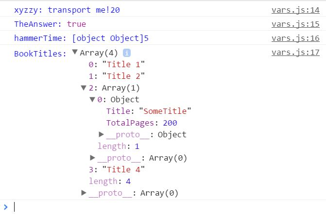
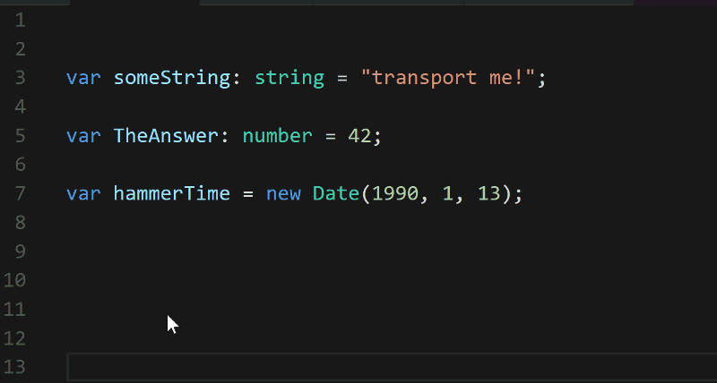

# 第四章：在 TypeScript 中加入类型

# 将*Type*放入 TypeScript 中

TypeScript 的名称并非偶然。它并不意味着“某种类型的脚本语言”。^(1) TypeScript 在纯 JavaScript 之上添加了静态类型。最好通过例子来解释这一点。让我们从一些有效但令人费解的纯 JS 代码开始：

```
var xyzzy = "transport me!";
var TheAnswer = 42;
var hammerTime = new Date(1990, 1, 13);
var BookTitles = []; 
```

上面的片段^(2)显示了四个变量，JavaScript 推断出它们的数据类型。这使得我们可以编写这样的代码：

```
xyzzy = "you've been transported";
TheAnswer = TheAnswer + 1;
hammerTime = hammerTime.addDays(5);
BookTitles = ["Title 1", "Title 2", "Title 3"]; 
```

纯 JavaScript*也*允许我们做以下事情：

```
var xyzzy = "transport me!";
xyzzy = xyzzy + 20;

var TheAnswer = 42;
TheAnswer = true;

var hammerTime = new Date(1990, 1, 13);
hammerTime = {};
hammerTime = hammerTime + 5;

var BookTitles = ["Title 1", "Title 2", "Title 3", "Title 4"];
BookTitles[2] = [{Title: "SomeTitle", TotalPages: 200}]

console.debug("xyzzy:",xyzzy);
console.debug("TheAnswer:",TheAnswer);
console.debug("hammerTime:", hammerTime);
console.debug("BookTitles:", BookTitles) 
```

这是有效的脚本，而在 chrome 中，输出看起来是这样的：



图：毫无意义但被允许的变量赋值

很多人真的不喜欢这种行为^(3)。就像我说的，这是一个人为的例子。如果你经常写这样的代码，你可能不适合在这个领域。真正的问题在于在纯 JS 中通过意外混合数据类型很容易引入错误。TypeScript 可以减轻这个问题。在 TypeScript 中，你可以在定义变量时指定其类型。让我们看一下：

```
var xyzzy: string = "transport me!";
var TheAnswer: number = 42;
var hammerTime = new Date(1990, 1, 13);
var whoKnows; 
```

上面的片段明确展示了 TypeScript 的类型系统的工作方式：

+   变量 xyzzy 是一个`string`。

+   “TheAnswer”是一个`number`。

+   hammerTime 是一个`Date`。为什么是一个 Date 而不是其他东西？因为 TypeScript 可以推断其数据类型。该代码将其初始化为一个 Date 对象，因此它只能是一个日期。

最后一个变量，`whoKnows`，也有一个类型，`any`。任意类型的变量的行为就像纯 JS 变量一样。你可以一会儿将字符串值分配给它，一会儿将布尔值分配给它，然后再分配数字。

如果你费心为你的变量定义类型，你的 IDE 将会为你提供一些出色的编辑时和编译时支持。考虑一下这个简短的动画：



图：IDE 支持定义的类型

（如果由于某种原因你无法看到动画，请[通过网络浏览器访问此链接](https://pagalvin.gitbooks.io/yet-another-typescript-book/content/assets/video/ch04_strongTypingExampleVideo/ch04_strongTypingExampleVideo.gif)或输入此网址：[`goo.gl/hEbWvq`](https://goo.gl/hEbWvq)）。

如果你已经是 JS 编程者，这是一个非常简单的入门语言的方法。选择几个变量，将一些类型与它们关联起来，然后看看会发生什么。当你这样做时，会发生一些事情或可能发生一些事情：

+   你的 IDE 将会更加智能地了解你的代码。它将知道变量类型，并阻止你将字符串赋值给数字等操作。

+   你可能会立即发现代码中的问题。你可能本意是让一个特定的变量，`myNumber`，保存数字。正如 JS 编程者所知，很容易错误地将字符串、日期、复杂对象赋给你的`myNumber`变量。

许多 TypeScript 开发者从这种方式开始，因为这样做非常简单。实际上，他们很快就会转向更有趣的类型，包括通过`interfaces`强类型嵌套对象的能力。下一章介绍接口作为数据描述符。

## 灯泡时间？

在 2015 年 12 月底，Eric Clemmons 在 Medium 上发表了一篇广受阅读的文章，标题为*JavaScript Fatigue*。[你可以在这里阅读。](https://medium.com/@ericclemmons/javascript-fatigue-48d4011b6fc4#.3jytn61rs) 如果你还没有阅读过，那么花点时间阅读一下^(4)。它很好地描述了一些 JavaScript 开发者有时陷入的倦怠感。要避免这种困境并不容易！有这么多框架、开发工具、IDE 和其他聪明的小玩意儿，可能会让人感到...疲劳。


许多第一次接触 TypeScript 的人会摆脱他们的怀疑，并从这个最简单的 TypeScript 功能中感受到一丝兴奋。只需在变量后面添加": string"或": number"，然后...

1.  更难误用不匹配的赋值。

1.  意图变得清晰。任何像样的 IDE 都会在运行时告诉你变量的数据类型。

这是非常有价值的东西。从中获取一些价值也非常容易。你需要做的就是：

1.  拿出你的一个 JS 文件

1.  用`.ts`扩展名复制它

1.  添加一些类型（数字、字符串、布尔值等）

1.  完成了！

你所有其他的 JS 代码都会像往常一样工作。对你的代码进行最简单的更改立即带来了显著的好处。这就是我的灯泡时刻。对我来说并没有止步，对你也不会止步。

可以肯定地说，如果你现在没有灯泡亮起，TypeScript 可能不适合你，至少今天不适合。我还是邀请你继续阅读 :).

## 声明变量

TypeScript 提供了三种不同的定义变量的方式：

+   `var`关键字

+   `let`关键字

+   `const`关键字

如果用`var`关键字声明一个变量，它的工作方式与纯 JavaScript 中的一样。它遵循相同的作用域规则，因此，你需要关注意外的提升效果和/或无意中污染全局命名空间。`const`和`let`通过减少这种风险和相关复杂性来简化事情。这里有一段纯粹的 JavaScript 代码，实现了一个函数`getTempLabel()`。它的作用是接受摄氏温度并返回一个文本标签。

这是纯粹的 JS 代码：

```
function getTempLabel(currentTempInCelsius) {

    if (currentTempInCelsius > 35 && currentTempInCelsius <= 40) {
        result = "Very warm";
    }

    else if (currentTempInCelsius > 40) {
        result = "Hot!";
    }

    else {
        var result = "Unexpected temperature value.";
    }

    console.log(result);

    return result;
} 
```

从这个例子中注意三件事：1）变量"result"直到第三次出现时才真正使用`var`修饰。2）通过"提升"的魔力，`result`在整个函数中都可用，而不仅仅在定义它的 else 块中。3）这也是完全有效的 TypeScript，尽管有一种更好的方法来实现这个函数。你马上就会看到。

许多编程语言规定更严格的作用域规则。许多人，包括作者在内，认为上面的例子在几个方面做得不好：

+   变量直到第一次使用之后才被正确声明。

+   代码没有很好地展示开发人员的意图。`result`可以在函数中的任何地方使用，无论是在表达式的左侧还是右侧，这会导致意外和难以跟踪的错误。

+   即使有经验的 JS 开发人员在变量作用域和提升方面也会遇到困难。为什么要接受这种头痛呢？

这里是用 TypeScript 编写的类似代码：

```
function getTempLabelTS(currentTempInCelsius: number): string {
    let result: string;

    if (currentTempInCelsius > 35 && currentTempInCelsius <= 40) {
        result = "Very warm";
    }
    else if (currentTempInCelsius > 40) {
        result = "Hot!";
    }
    else {
        result = "Unexpected temperature value.";
    }

    console.log(result);

    return result;
} 
```

正如你所看到的，代码中使用 TypeScript 的`let`来定义结果变量，而不是使用`var`。Let 定义变量的特性与 var 相同 - 你指定一个名称，可选地指定一个数据类型。不同之处在于变量的作用域。使用 let 定义的变量作用域限定在定义它的块内，并且可用于子块。它永远不会像在纯 JavaScript 中那样被提升。观看这个短片，看看 let 和变量作用域在几种不同情况下的效果：

[`www.youtube.com/embed/tMkqzIqhCwo`](https://www.youtube.com/embed/tMkqzIqhCwo)

（根据您阅读本书的方式，视频可能不会出现。如果没有，请通过[点击此链接](https://youtu.be/tMkqzIqhCwo)或在您的网络浏览器中输入以下 URL 来访问：[`youtu.be/tMkqzIqhCwo`](https://youtu.be/tMkqzIqhCwo)）

## TypeScript 最佳实践 - *Let*

通常情况下，优先使用"let"而不是 var。这样做将有助于通过 JavaScript 的提升机制减少代码中意外副作用的风险。

## Const 定义

TypeScript 提供了另一种定义变量的方法 - `const`。一个 const 变量：

1.  在声明时必须初始化。

1.  一旦声明，就不能被更改。

这里有一个例子：

```
const myName: string = "Paul"
myName = "Mary"; // <-- compiler error 
```

`const`在某种程度上带来了一些微妙之处，特别是当涉及到对象属性值时。考虑这段代码：

```
const Paul = { firstName: "Paul", lastName: "Galvin"}
const Kelly = { firstName: "TBD", lastName: "TBD"}
const Aidan; // <-- Not allowed, must always initialize const variables when defined
Kelly.firstName = "Kelly"; // <-- perfectly OK
Paul = null; // <-- Not allowed, cannot use const vars in LHS of an assignment 
```

代码定义了三个`any`变量^(5)，你可以看出它们意味着保存一种"人"记录，包含名字和姓氏。它将`Paul`和`Kelly`初始化为结构类似的对象。

然后尝试创建一个没有分配初始值的常量`Aidan`变量。这是不允许的。它不会编译通过，你的 IDE 应该将其标记为错误。

Kelly PersonName const 变量 *被* 定义了。然而，它被种子化为"TBD"值。稍后，代码更改了 Kelly 的 firstName 属性。这是有效的^(6)。

最后，Paul 变量在初始化后无法更改。最终的"Paul = null"赋值也是无效的。一旦声明和初始化后，const 变量永远不能出现在赋值的左侧。

## TypeScript 最佳实践 - *Let*

通常情况下，优先使用`const`而不是`let`。这个建议主要源于函数式编程原则。你在代码中���少变异的次数越多，你将经历的副作用就越少^(7)。

综上所述，我们可以总结如下：

+   在所有情况下，优先选择 `const`。

+   当 `const` 不能满足你的需求时，优先选择 `let` 而非 `var`。

+   如果你绝对需要 `var`，那就使用它。然而，在 TypeScript 中使用 `var` 强烈表明了一个逻辑问题和简化代码的机会。

## TypeScript Let、Const 和转译

最终，JavaScript 并不了解 `const` 或 `let`。它们总是编译成普通的旧 `var` 语句。以下是上述 `getTemperature` 函数的转译版本：

```
function getTemperatureLabel(forTemperature) {
    var errorResult = "ERROR: Failed to determine a temperature label!";
    var result;
    if (isNaN(forTemperature)) {
        result = errorResult;
    }
    else {
        var options = ["Cold", "Warm", "Hot"];
        result = forTemperature < 40 ? options[0] :
            forTemperature < 85 ? options[1] :
                options[3];
    }
    return result;
} 
```

TypeScript 在编译时强制执行变量范围和 `const` 初始化/赋值规则。一个好的 IDE 会在你编写代码时执行它。

# 进一步阅读

考虑阅读以下与本章内容相关的文章：

+   一篇在 stackexchange 上的非常好的讨论，深入探讨了 `let` vs `var` vs `const`：[`softwareengineering.stackexchange.com/questions/278652/how-much-should-i-be-using-let-vs-const-in-es6`](https://softwareengineering.stackexchange.com/questions/278652/how-much-should-i-be-using-let-vs-const-in-es6)

+   一个关于 `var/let/const` 的良好概述以及描述几种基本数据类型的文章：[`www.brainbell.com/typescript/data-types-let-var-cons.html`](http://www.brainbell.com/typescript/data-types-let-var-cons.html)

+   另一篇由 Ayo Alfonso 撰写的对比 JavaScript 和 TypeScript 的好文章：[`hackernoon.com/typescript-vs-javascript-b568bc4a4e58`](https://hackernoon.com/typescript-vs-javascript-b568bc4a4e58)

# 总结

在本章中，你学到了 TypeScript 是一种静态类型语言，引入了一些新的变量范围和不可变性管理方式。你看到了这些特性带来的一些实际效果，并且获得了一些关于如何使用它们的建议。

下一章将更深入地探讨这个主题，并介绍接口，这是一个非常有用和强大的语言元素。它还涵盖了枚举、联合类型等更多内容！深吸一口气，然后翻下一页。

* * *

> ¹. 尽管那将是真正光荣的。 ↩
> 
> ². 这三个变量让我想起了我的青春岁月，出于历史的原因，这里有一些链接供你参考，如果你还不知道它们：[42](https://en.wikipedia.org%2Fwiki%2F42_%28number%29%23The_Hitchhiker.27s_Guide_to_the_Galaxy)，[xyzzy](https://en.wikipedia.org/wiki/Colossal_Cave_Adventure)（你可能不相信，你可以在亚马逊 Echo 上玩这个游戏(!)）和 [Hammertime](http://ew.com/article/2010/01/08/20-years-ago-mc-hammers-u-cant-touch-this/)。 ↩
> 
> ³. 公平地说，很多人对此完全没问题。例如，Jeff Walker 断言： ↩
> 
> TypeScript 通过类型、类和接口增强了 JavaScript。有些人认为这是 JavaScript 的问题所在。其实不是。JavaScript 的问题不在于它是一种动态类型的基于原型的面向对象语言，没有类。这实际上是 JavaScript 的优势。

我不认识 JW，也不想暗示从他写的一篇文章中摘取的这个引用代表了他所信奉的一切 : )。然而，这个引用确实很好地阐述了某种关于 JavaScript 动态性质的思想流派。很多人喜欢它。那些人可能并不经常使用 TypeScript。

Eric Elliot 对这个主题进行了更深入的探讨：[`medium.com/javascript-scene/you-might-not-need-typescript-or-static-types-aa7cb670a77b#.5aideomvb`](https://medium.com/javascript-scene/you-might-not-need-typescript-or-static-types-aa7cb670a77b#.5aideomvb)。这也值得一读。

> ⁴. 有点讽刺的是，这也是一个列举出许多有趣工具和框架的不错清单，因此，另一个读这篇文章的好理由。当然，前提是它不会把你累坏。为了安全起见，先把这本书读完。↩
> 
> ⁵. 请记住，TypeScript 变量的默认数据类型是“any”。你应该尽量避免这种情况，特别是在开始一个全新的项目时。你可以通过编译器配置设置来禁止“隐式”any 变量。在这里阅读更多内容：[`basarat.gitbooks.io/typescript/docs/options/noImplicitAny.html`](https://basarat.gitbooks.io/typescript/docs/options/noImplicitAny.html)。↩
> 
> ⁶. 诚然，这是一种轻微的认知失调源头。既然变量本身是一个`const`，为什么还允许我们更改变量的属性呢？事实就是如此，并且在一天结束时证明是有帮助的。所以，我们必须接受它。↩
> 
> ⁷. 我发现函数式编程，像 TypeScript 一样，是一种乐趣。我在这里写了关于那种乐趣的文章：[`hackernoon.com/unexpected-joy-from-functional-programming-ed9d3adca77a`](https://hackernoon.com/unexpected-joy-from-functional-programming-ed9d3adca77a)。↩
