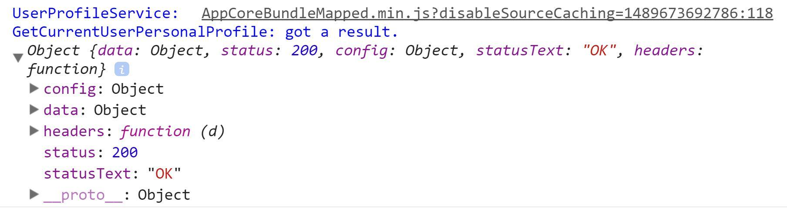
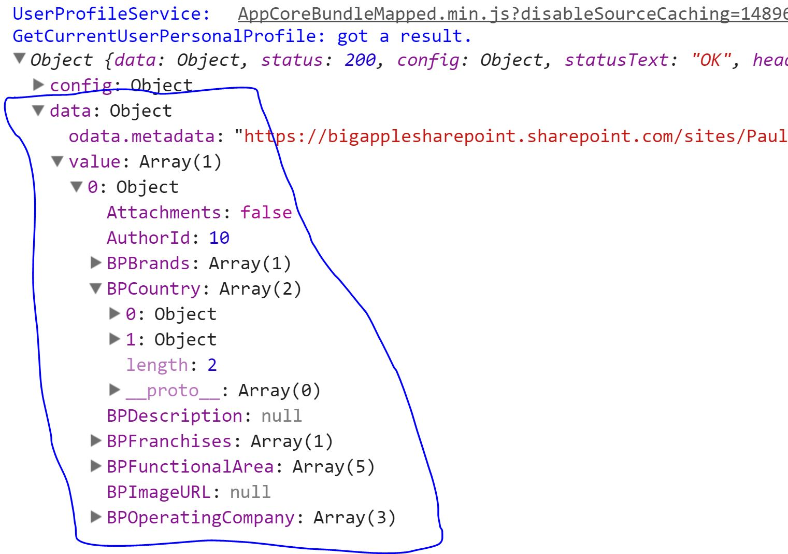

# 第五章：深入类型

# 使用接口的复杂类型

## 包含内容

我们将通过介绍 TypeScript *接口* 来开始本章。本章将在 JavaScript“数据”对象及其字段/属性的上下文中研究接口。正如许多人所知，接口在许多常见设计模式中扮演着超大的角色（想想 SOLID^(1)）。我们将在第九章中讨论接口在这个背景下的作用。

TypeScript 提供了其他更高级的类型支持，您可能在 C# 和 Java 中遇到过。本章涵盖了其中一些，包括：

***关于泛型的说明***

泛型提供了非常强大的数据类型能力。它们看起来和行为很像 C# 中的泛型，并且是一个非常有效的工具，帮助您遵循不要重复自己（DRY）原则。如果您不熟悉 DRY，这里是您可以开始的地方：[`deviq.com/don-t-repeat-yourself/`](http://deviq.com/don-t-repeat-yourself/)

尽管泛型是类型系统的一部分，但它们往往与类一起使用，因此我们将在第十章中描述它们，让您有机会阅读和消化 TypeScript 类之后再介绍它们。

+   枚举：将一个人类友好的标签附加到一个数字。

+   联合类型：一个变量可以是“数字”或“字符串”或“MyBrandShinyNewObject”，但不能是其他任何类型。

+   自定义类型：类似类但没有构造函数。（如果您不了解类，不用担心，您将在第九章中学到一些关于它们的知识）。

## 接口作为数据描述符

声明 TypeScript 接口如下：

```
interface myInterface {
} 
```

该代码定义了一个名为“myInterface”的新接口。它是一个空接口，但仍然有效^(2)。

变量现在可以声明它们的类型为该接口：

```
const myVariable: myInterface; 
```

尽管有一些空接口的用例，但通常您会以这种方式使用它们来描述复杂对象。让我们考虑一个业务场景，并在纯 JavaScript 中实现一个支持数据结构。

您的客户拥有一家书店，您正在开发一个简单的应用程序，让您的客户的客户查看所有可用书籍的列表。在 JavaScript 对象术语中，一个“书籍”具有以下属性：

+   作者

+   标题

+   类型（例如 传记，历史，科幻）

+   简短描述

+   总页数

+   条件（例如 新的，很棒，好，不太好）

在纯 JavaScript 中，我们可以这样建模一本书：

```
var bookModel = {
    Author,
    Title,
    Genre,
    ShortDescription,
    TotalPages,
    Condition
} 
```

这就足够简单了。我们有一个名为`bookModel`的对象。开发者的意图非常明确，尽管实际上还有很大的改进空间。如果您想在纯 JavaScript 中重用`bookModel`，您可以克隆它^(3)：

```
var aBookInstance = (JSON.parse(JSON.stringify(bookModel))); 
```

在 TypeScript 中，我们可以使用接口来定义一个更好的形状，甚至可以自我记录模型。以下是一种方法：

```
interface BookModel {
    Author: string;
    Title: string;
    Genre: string;
    ShortDescription: string;
    TotalPages: number;
    Condition: string;
} 
```

当我们想要一个实际的书籍实例时，在 TypeScript 中我们这样定义它：

```
let aBookInstance: BookModel; 
```

这个接口展示了 TypeScript 相对于 JavaScript 提供的三个立即优势：

1.  开发者的意图更加清晰。您可以看出 TotalPages 应该保存数值，而其余的应该保存字符串^(4)。

1.  准确的智能感知。

1.  *这真的是一个模型*。它不是一个伪装成模型的 JavaScript 变量。事实上，当你编译 TypeScript 接口时，它根本不会生成任何 JavaScript。只有编译器知道这个接口。没有运行时的产物。

假设您同意 TypeScript 比纯 JS 示例更清晰地传达了开发人员的意图^(5)。这里有一个短短 40 秒的视频展示了 VS Code 智能感知的工作：

[`www.youtube.com/embed/o_wxodLGT34`](https://www.youtube.com/embed/o_wxodLGT34)

(根据您阅读书籍的方式，该视频可能不会出现。在这种情况下，[点击此链接](https://www.youtube.com/watch?v=o_wxodLGT34&feature=youtu.be)或直接使用以下链接访问 YouTube 视频：[`youtu.be/o_wxodLGT34`](https://youtu.be/o_wxodLGT34))。

以下是视频中的一些关键要点：

1.  一旦定义了一个接口，它就成为另一个候选数据类型。使用它的方式与内置数据类型（如字符串、布尔值、数字等）相同。

1.  一旦您用接口数据类型定义一个变量，通常必须包含所有接口字段。注意：正如您很快会看到的，也可以定义可选的接口组件。

1.  不仅要将所有接口字段添加到"aBook"变量中，还必须以正确的类型添加它们。在视频中，我试图将字符串值分配给"TotalPages"字段，但 IDE 告诉我不允许这样做。

### 通过接口进行重构

接口为我们提供了更多有意义的信息，在重构代码时特别有用。

让我们想象一下，我们需要更改我们的书籍模型。当我们开始时，我们没有意识到许多书籍有多个作者。因此，我们需要重构模型，并将作者改为字符串的数组，而不仅仅是一个标量/单个字符串。

在纯 JS 中，我们不需要做任何特殊的事情。我们只需开始编写这样的代码：

```
var bookModel = {
    Author, // NOTE! On [such and such a date], this was converted to an array
    Title,
    Genre,
    ShortDescription,
    TotalPages,
    Condition
}

var aBookInstance = JSON.parse(JSON.stringify(bookModel));
//aBookInstance.Author = "Paul Galvin";
aBookInstance.Author = ["Paul Galvin"]; 
```

这是一个非常简单的更改，但很难找到需要进行更改的所有地方。您大多数时候必须在 IDE 中进行全局搜索，找到"Author"的实例并在找到它们的地方进行重构。

与 TypeScript 相比：

[`www.youtube.com/embed/fNtcCTeMAhQ`](https://www.youtube.com/embed/fNtcCTeMAhQ)

(根据您阅读书籍的方式，您可能无法看到视频。在这种情况下，[请点击这里](https://youtu.be/fNtcCTeMAhQ)或在您喜欢的网络浏览器中使用以下网址：[`youtu.be/fNtcCTeMAhQ`](https://youtu.be/fNtcCTeMAhQ))

当我将作者从`string`更改为`string[]`时，我使代码中每个书籍模型的每个实例都失效了。在我修复之前，我无法成功构建。我仍然需要处理一个潜在棘手的重构任务 - 毕竟，我仍然需要修复代码中引用作者的每个地方。然而，编译器不会让我错过任何这些更改。这是非常强大的东西。

### 嵌套对象和接口

尽管`BookModel`在技术上是一个复杂对象，但它并不是*非常*复杂。让我们给“Author”再添些调料并重新审视一下。我们已经为多个作者进行了模型重构。作者和我们其他人一样，都是普通人，在美国和其他地方，他们通常有名和姓。此外，作者*喜欢*反馈。为此，我们想要作者的首选反馈电子邮件。

下面的代码展示了新的`AuthorModel`并对`BookModel`进行了重构。

```
interface AuthorModel {
    FirstName: string;
    LastName: string;
    PreferredEmail: string;
}

interface BookModel {
    Authors: AuthorModel[];
    Title: string;
    Genre: string;
    ShortDescription: string;
    TotalPages: number;
    Condition: string;
}

// Example 1: Create an author object first, then add it to the book instance
const FoodBookAuthor1: AuthorModel = {
    FirstName: "Paul",
    LastName: "Galvin",
    PreferredEmail: "galvin.paul@gmail.com"
}

const FoodBookAuthor2: AuthorModel = {
    FirstName: "Kelly",
    LastName: "Smith",
    PreferredEmail: "ksmith123@awesomefoods.com"
}

const foodBook: BookModel = {
    Authors: [FoodBookAuthor1, FoodBookAuthor2],
    Title: "Foods - The Right Food for the Right Meal",
    Genre: "Life Hacks",
    ShortDescription: "Eggs are not for dinner",
    TotalPages: 158,
    Condition: "Used - Good"
}

// Example 2: Create a book instance in one line.
const GotM: BookModel = {
    Authors: [{
        FirstName: "Steven",
        LastName: "Erikson",
        PreferredEmail: "ganoes.paran@malazanempire.gov"
    }],
    Title: "Gardens of the Moon",
    Genre: "High Fantasy",
    ShortDescription: "Empress tries to conquer city, fails, but wins something better",
    TotalPages: 772,
    Condition: "New"
} 
```

正如你所看到的，TypeScript 很好地支持嵌套对象。

如果您使用的是 VSCode 或 Visual Studio，请尝试复制上面的代码。将鼠标悬停在示例 1 或示例 2 中的 Authors 字段上，然后按 F12。这在尝试理解给定类型/接口的基本定义时非常方便。

### 接口 - 映射 REST 响应

我们将通过逆向工程 REST 响应来总结接口的讨论。在这种情况下，我正在调用一个 SharePoint REST 端点，请求一个“用户”^(6)。当我发出调用时，我会得到很多信息，从我真正想要的东西周围的 HTTP 包装开始：



图：HTTP 包装

HTTP 包装包括：

+   配置（复杂对象）

+   数据（复杂对象）

+   标头（复杂对象）

+   状态（数字）

+   状态文本（字符串）

我们可以定义一个与之匹配的接口：

```
 interface httpResponse {
    config: any,
    headers: any,
    status: number,
    statusText: string;
} 
```

上面的示例有点懒惰 - 它没有尝试对`config`或`headers`下的数据进行建模。我在使用“任意”时只是在它们的大致方向上挥舞手臂。我当然可以对这些对象进行建模，但我将专注于`data`。您会注意到接口中缺少了`data`。让我们将其连接起来。但首先，我们需要定义一个接口，该接口模拟了 REST 响应的数据部分。首先，我需要知道 REST 响应给我的是什么：



图：REST 响应的数据部分

此接口将事物很好地映射：

```
interface userProfileRestModel {
    Attachments: boolean;
    AuthorId: number;
    BPBrands: string[];
    BPDescription: string;
    "odata.editLink": string;
    // and other user profile fields
} 
```

请注意响应中的`odata.editLink`字段 - 如果您的对象名称中包含其他无效字符，您仍然可以通过此方式引用其名称以获取和设置其值。

现在是将它们连接起来的时候了。下面是代码：

```
interface userProfileResponse extends httpResponse {
    data: {
        value: userProfileRestModel[]
    }
} 
```

注意`extends`关键字。我通过*扩展*先前定义的`httpResponse`接口来定义一个新的接口，`userProfileResponse`。新的`userProfileResponse`接口包含了两者的所有字段和结构。

这是另一个 40 秒的视频，以图像方式展示了这一点。

[`www.youtube.com/embed/oK3MpqhrVOo`](https://www.youtube.com/embed/oK3MpqhrVOo)

（根据您阅读本书的方式，您可能看不到视频。在这种情况下，请[点击这里](https://www.youtube.com/watch?v=oK3MpqhrVOo&feature=youtu.be)或直接在您的网络浏览器中转到 YouTube：[`youtu.be/oK3MpqhrVOo`](https://youtu.be/oK3MpqhrVOo)。）

视频的最后十几秒展示了 IDE 如何理解新的`userProfileResponse`接口的结构。

# 总结接口

TypeScript 接口是该语言非常有用的特性：

+   它们非常擅长展示开发者的意图

+   IDE 理解它们的结构并提供出色的智能感知支持。

+   它们比纯 JavaScript 更擅长建模内容。

+   如果您需要重构您的模型之一，很难遗漏某些内容，因为您使用接口的每个地方都会中断。

我们还没有完成接口 - 它们还在类中发挥作用。这正是它们模式实现力量的重要来源。在我们讨论这一点之前，我们将介绍几个其他出色的类型特性 - 枚举，联合类型和自定义类型。

# 枚举和联合类型

到目前为止，我们已经涵盖了基本数据类型（数字，布尔值等）以及如何使用这些基本类型来建模复杂对象。实际上，您可以使用接口本身创建深度嵌套的数据模型。TypeScript 提供了描述数据的其他方式。我们将看看其中的另外两种：枚举和联合类型。请注意，TypeScript 还提供了更多类型，如交集类型，泛型和类型别名。其中一些（例如交集）更适合工具编写者，而不是我为本书设想的普通读者。另一方面，泛型需要有自己的章节，并且与类和方法一起使用效果最佳。

## 枚举

枚举允许您将字符串标签连接到数值。最好通过示例来展示：

```
enum HttpStatusCodes {
    OK = 200,
    GENERAL_SERVER_ERROR = 500,
    RESOURCE_NOT_FOUND = 304,
    FORBIDDEN = 403
} 
```

在代码中使用枚举如下：

```
function parseResult(resultDetails: SomeInterface, resultCode: HttpStatusCodes) {
    if (resultCode === HttpStatusCodes.OK) {
        processSuccessfulResponse(resultDetails);
    }
    else if (resultCode === HttpStatusCodes.FORBIDDEN) {
        login();
    }
    else {
        processOtherError(resultCode, resultDetails);
    }
} 
```

许多语言提供类似的枚举语法，如果您已经使用过其中一种（如 C#或 Java），这一切看起来非常熟悉。

与 TypeScript 中的任何其他地方一样，一个好的 IDE 支持枚举与智能感知。

上面的示例显示了您可以将文本标签与任意整数值匹配。有时，您并不关心值。您只想要一个方便的可读标签在代码中使用。在这种情况下，您可以定义一个初始值，编译器将在幕后为您递增：

```
enum Direction {
    Up = 1,
    Down,
    Left,
    Right
} 
```

在这种情况下，Down，Left 和 Right 分别被分配值 2、3 和 4。

将标签映射，如"FORBIDDEN"到数字值"403"构成了枚举的主要用例。以这种方式使用，它们允许您在代码中更清晰地表达自己。*您*可能完全了解 http 403 是一个"forbidden"消息，但其他新手开发者可能不清楚。

### 枚举作为对象，或者不是

与接口不同，TypeScript 编��器默认生成枚举的代码。

这里是 TypeScript 代码和生成的 JS：

```
enum HttpStatus {
    OK = 200,
    GENERAL_SERVER_ERROR = 500,
    RESOURCE_NOT_FOUND = 304,
    FORBIDDEN = 403
}

function parseResult(resultCode: HttpStatus) {
    if (resultCode === HttpStatus.OK) {
        console.log("Success response");
    }
    else if (resultCode === HttpStatus.FORBIDDEN) {
        console.log("Forbidden response.");
    }
    else {
        console.log("Some other response");
    }
} 
```

这里是生成的 JavaScript：

```
var HttpStatus;
(function (HttpStatus) {
    HttpStatus[HttpStatus["OK"] = 200] = "OK";
    HttpStatus[HttpStatus["GENERAL_SERVER_ERROR"] = 500] = "GENERAL_SERVER_ERROR";
    HttpStatus[HttpStatus["RESOURCE_NOT_FOUND"] = 304] = "RESOURCE_NOT_FOUND";
    HttpStatus[HttpStatus["FORBIDDEN"] = 403] = "FORBIDDEN";
})(HttpStatus || (HttpStatus = {}));

function parseResult(resultCode) {
    if (resultCode === HttpStatus.OK) {
        console.log("Success response");
    }
    else if (resultCode === HttpStatus.FORBIDDEN) {
        console.log("Forbidden response.");
    }
    else {
        console.log("Some other response");
    }
} 
```

如您所见，TypeScript 将枚举包装在自己的立即调用的函数表达式 (IIFE) 中，并作为代码工件继续存在。大多数情况下，这是没有用的。您可以跳过代码生成，而是将枚举声明为 `const`：

##### 更喜欢使用 Const 枚举

您通常应该更喜欢使用 const 枚举。非 const 枚举可能有一些很好的用例，但在您的第一周或月甚至以后几乎肯定不会遇到它们。const 枚举生成的代码更少，生成的代码与非 const 生成的代码一样易于理解。

这也符合更广泛的 "首先使用 const" 规则。如果您能养成这个习惯，您将迈出一些向更功能性编程风格迈出的早期步伐，并显著降低代码中出现意外副作用的风险。

```
const enum constHttpStatus {
    OK = 200,
    GENERAL_SERVER_ERROR = 500,
    RESOURCE_NOT_FOUND = 304,
    FORBIDDEN = 403
}

function parseResult(resultCode: constHttpStatus) {
    if (resultCode === constHttpStatus.OK) {
        console.log("Success response");
    }
    else if (resultCode === constHttpStatus.FORBIDDEN) {
        console.log("Forbidden response.");
    }
    else {
        console.log("Some other response");
    }
} 
```

这导致 JavaScript 更加紧凑：

```
function parseResult(resultCode) {
    if (resultCode === 200 /* OK */) {
        console.log("Success response");
    }
    else if (resultCode === 403 /* FORBIDDEN */) {
        console.log("Forbidden response.");
    }
    else {
        console.log("Some other response");
    }
} 
```

它甚至加入了一些有用的注释，描述了如果您发现自己深入研究生成的 JS 时 "403" 或 "200" 的含义。

## 联合类型

联合类型允许您创建一个由多个类型或甚至值组成的新实体。这是一个简单的例子：

```
function move(inDirection: "left" | "up" | "down" | "right") {
    console.log(`Moving ${inDirection}.`);
} 
```

这段代码定义了一个函数 "move"，它接受一个参数 "inDirection"。智能提示确保您不会尝试传入无效的方向，比如 "sideways"。这里是一个演示的简短视频。

[`www.youtube.com/embed/lfAa1-b-sng`](https://www.youtube.com/embed/lfAa1-b-sng)

（如果您无法看到视频，请[单击此处](https://youtu.be/lfAa1-b-sng)。或者，打开您喜欢的网络浏览器并直接访问它：[`youtu.be/lfAa1-b-sng`](https://youtu.be/lfAa1-b-sng))）。

这并不是一个特别好的例子，因为在这种情况下，您可能会使用枚举，或者将其拆分为五个函数（moveLeft、moveRight、moveUp、moveDown 和较低级别的 "move" 函数）。对于一个更好的用例，让我们考虑遗留代码。假设您已经构建了一个 JavaScript 实用函数库，并且想要在 TypeScript 项目中开始使用该库。您的库有一个函数，`calculateCollectionTotal`。这个函数接受一个对象数组，并且只要它们有一个共同的字段 "Total"，它就会把它们全部加起来并返回结果。这是它可能看起来的样子：

```
function calculateCollectionTotal(itemCollection) {
    return itemCollection.reduce(function(prev, current) {
      return prev + current.Total;
    }, 0);
}

console.log("Invoice lines total:", calculateCollectionTotal(invoices));
console.log("Order lines total:", calculateCollectionTotal(orders));
console.log("Pick lines total:", calculateCollectionTotal(PickingSlips)); 
```

如果您将此旧代码转换为 TypeScript，则此处的 "正确" 方法是重构代码，首先查看您的发票、订单和拣货单对象。找到它们的共同元素，定义一个接口或可能是一个抽象基类^(7)。重新构造所有对象并更新整个代码库。然而，这是很多工作。联合类型可以立即帮助您，而无需进行如此多的重构。以下是可能的样子：

```
function calculateCollectionTotal(itemCollection: Invoice[] | Order[] | PickingSlip[]): number {
    return itemCollection.reduce(function(prev: number, current: Invoice | Order | PickingSlip) {
      return prev + current.Total;
    }, 0);
}

console.log("Invoice lines total:", calculateCollectionTotal(invoices));
console.log("Order lines total:", calculateCollectionTotal(orders));
console.log("Pick lines total:", calculateCollectionTotal(PickingSlips)); 
```

这段 TypeScript 代码与其普通的 JS 版本做的事情是一样的。然而，它增加了一些类型安全，你的 IDE 的智能感知功能可以使用。它也很好地自我记录。只需看一眼签名，任何人都可以明白这个函数是设计用来计算特定对象集合的总数，而不是其他对象。

你将了解到使用泛型来完成这个更好的方法，但这将迫使你对代码库进行更大的更改。

# 进一步阅读

以下文章提供了本章讨论的主题的替代和/或更深入的探讨：

+   这篇文章加视频基本上涵盖了我在上面关于接口的内容，但用了更少的文字 :). [`tech.queryhome.com/153271/what-is-interface-in-typescript?utm_source=dlvr.it&utm_medium=twitter`](http://tech.queryhome.com/153271/what-is-interface-in-typescript?utm_source=dlvr.it&utm_medium=twitter)

+   一篇长篇文章讨论了使用接口和联合类型来建模数据的方法：[`www.triplet.fi/blog/different-approaches-to-modeling-data-with-typescript/`](https://www.triplet.fi/blog/different-approaches-to-modeling-data-with-typescript/)

+   TypeScript 2.4（就在我完成第 1 版这本书的时候发布）引入了字符串枚举！你可以直接从微软的博客上了解更多：[`blogs.msdn.microsoft.com/typescript/2017/06/12/announcing-typescript-2-4-rc/`](https://blogs.msdn.microsoft.com/typescript/2017/06/12/announcing-typescript-2-4-rc/)。那个博客是一个非常好的资源，你应该定期关注它。

+   TypeScript 为枚举提供了更复杂的支持。你不仅限于分配整数，实际上，你可以分配在运行时计算的值。这最好由 TypeScript 语言手册网站在这里解释：[`www.typescriptlang.org/docs/handbook/enums.html`](https://www.typescriptlang.org/docs/handbook/enums.html)

# 摘要和总结

这一章首次介绍了接口作为数据描述符的能力。接口可以是空的，它们可以描述一组基本值（数字，字符串等）。你可以创建一个接口并将其扩展到另一个接口。它们可以表示嵌套对象，包括过于复杂的 SharePoint JSON 负载等深度嵌套对象。

你还会了解到枚举和联合类型。这两者都有助于明确程序员的意图，并帮助你避免在代码中犯错，确保只有特定类型的值或对象可以传递给函数。

我们将暂时离开繁重的主题，转而进入下一个模板字符串。在我们进入类之前，这是一个简单而美好的主题。

* * *

> ¹. 如果你不熟悉 SOLID 这个首字母缩略词，花点时间了解一下可能会很值得。[这篇 scotch.io 的文章是一个很好的开始](https://scotch.io/bar-talk/s-o-l-i-d-the-first-five-principles-of-object-oriented-design) ([`scotch.io/bar-talk/s-o-l-i-d-the-first-five-principles-of-object-oriented-design`](https://scotch.io/bar-talk/s-o-l-i-d-the-first-five-principles-of-object-oriented-design))。 ↩
> 
> ². 空接口通常并不那么有用，但是 TypeScript 中关于二分搜索的这篇文章提供了一个例外：[`blog.hellojs.org/implement-binary-search-in-typescript-using-generics-with-useful-refactorings-a4bcda932d7`](https://blog.hellojs.org/implement-binary-search-in-typescript-using-generics-with-useful-refactorings-a4bcda932d7)。鉴于我们在书中的进度，这可能有点复杂，但是在完成后回头看一看是值得的。 ↩
> 
> ³. 有很多种方法来克隆 JavaScript 对象。我在这些示例中使用的方法来自于这篇巧妙的博文：[`heyjavascript.com/4-creative-ways-to-clone-objects/`](http://heyjavascript.com/4-creative-ways-to-clone-objects/) ↩
> 
> ⁴. 很明显，名为"TotalPages"的属性应该是数值型的。然而，随着本章的进行，你会看到在描述不那么明显的属性时，接口如何展示开发者的意图。 ↩
> 
> ⁵. 如果你不同意，那么我不知道我还能告诉你什么 :). ↩
> 
> ⁶. 如果你了解 SharePoint 的话 - 我这里并不是检索 SPUser，而是从自定义列表中检索项目。 ↩
> 
> ⁷. 抽象类以及接口为你的 SOLID 编程工作提供了坚实的基础。本书在第九章讨论了抽象类。 ↩
