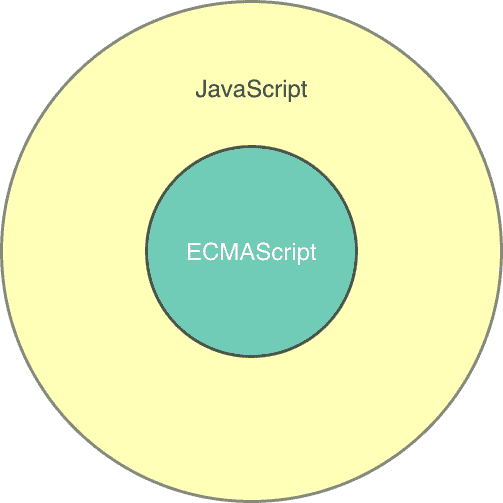

# JavaScript 简介

> 原文：[`jsprimer.net/basic/introduction/`](https://jsprimer.net/basic/introduction/)

在开始学习 JavaScript 之前，首先介绍一下 JavaScript 是什么编程语言。

JavaScript 主要是一种在网页浏览器中运行的编程语言。当在网站上进行操作时，可以更改显示内容，与网站服务器通信并获取数据，因此它是当前网站不可或缺的编程语言。利用这样的 JavaScript，可以实现类似应用程序的操作，这种网站也称为 Web 应用程序。

JavaScript 不仅用于网页浏览器，还用于创建服务器端应用程序的 Node.js。此外，还可以在桌面应用程序、智能手机应用程序和物联网（Internet of Things）设备中使用 JavaScript。因此，JavaScript 是一种在广泛的环境中运行的编程语言，可以创建各种类型的应用程序。

## [](#javascript-ecmascript)*JavaScript 与 ECMAScript*

*JavaScript 语言的行为由 ECMAScript 规范决定。 ECMAScript 规范仅定义了所有执行环境共有的行为，因此基本上在任何执行环境中都会有相同的行为。

另一方面，不同的执行环境可能会有所不同。例如，浏览器定义了操作用户界面的 JavaScript 功能，但在编写服务器端处理的 Node.js 中，这些功能是不需要的。因此，由于不同的执行环境需要不同的功能，这些功能在每个执行环境中都被定义（实现）。

因此，“ECMAScript”是所有执行环境共有的部分，“JavaScript”是包含 ECMAScript 和执行环境特定功能的范围的形象。



通过学习 ECMAScript 规范定义的功能，可以学习到在任何执行环境下都可以使用的基本部分。在本书中，当需要明确区分这些差异时，将使用“ECMAScript”和“JavaScript”这两个词。否则，将使用“JavaScript”一词。

此外，ECMAScript 规范（共同部分）每年都会更新，添加新的语法和功能。因此，执行环境可能会实现旧版本的 ECMAScript 规范。ECMAScript 在 2015 年作为 ECMAScript 2015（ES2015）大幅更新的规范发布。

如果要开始学习 JavaScript，请以 ES2015 为基础，因为这样更容易理解。此书还解释了基于 ES2015 之前版本的现有代码。

首先，我们大致了解一下 JavaScript（ECMAScript）是什么语言。

## [](#about-javascript)*JavaScript 是什么语言？*

*JavaScript 最初是为 Netscape Navigator 浏览器开发的编程语言。它受到了 C、Java、Self、Scheme 等编程语言的影响。

JavaScript 主要由对象（将值和处理组合在一起）组成，并通过这些对象之间的通信实现。对象包括 ECMAScript 规范定义的对象、执行环境定义的对象和用户（即您）定义的对象。

在本书的“第一部：基本语法”中，我们将学习 ECMAScript 定义的语法和对象。在“第二部：应用（用例）”中，我们将学习浏览器和 Node.js 等执行环境定义的对象，并创建一些小型应用程序。用户定义的对象会在编写代码时自然而然地出现，因此我们将在适当的时候介

接下来，我们将简要介绍 JavaScript 的语言特性。

### [](#case-sensitive)*区分大小写*

*首先，JavaScript 区分大小写。例如，如果以`name`和`NAME`的大小写编写`name`变量，则会分别将它们识别为不同的`name`和`NAME`变量。

```
// `name`という名前の変数を宣言
const name = "azu";
// `NAME`という名前の変数を宣言
const NAME = "azu"; 
```

此外，起始字母必须大写的命名规则并没有意义。因此，它们仅被视为不同的名称（有关变量的详细信息，请参阅“变量和声明”章节）。

### [](#reserved-keyword)*具有保留字*

*JavaScript 有一些具有特殊含义的关键字，这些关键字也被称为保留字。不能声明与这些关键字相同名称的变量或函数。刚才提到的声明变量的`const`也是其中之一。因此，不能声明名为`const`的变量名。

### [](#statement-semicolon)*语句用分号分隔*

*JavaScript 逐句处理，并以分号（`;`）分隔语句。根据特定规则，即使没有分号，语句末尾也会自动插入分号。^(1) 但是，依赖隐式规则会导致意外行为，因此应始终写上分号（详细信息请参见“语句和表达式”章节）。

此外，空格、制表符等称为空白字符（空格）。这些空白字符可以放置在语句中的任意位置，不会影响其行为。

例如，下面两个执行`1`加`1`的语句，虽然`+`前后的空白字符数量不同，但其实际意义完全相同。

```
// 式や文の間にスペースがいくつあっても同じ意味となる
1 + 1;
1   +   1; 
```

由于空格的使用方式因人而异，因此写法可能会有所不同。在多人开发的情况下，最好制定一套关于空格使用的编码风格。有关统一编码风格，请参考"附录: 参考链接集"。

### [](#strict-mode)*严格模式*

*JavaScript 有一个名为**strict mode**的执行模式。正如其名称所示，这是一种严格的执行模式，禁止了部分过时且不安全的语法和功能。

在文件或函数的开头写上`"use strict"`这个字符串，可以使该作用域内的代码以严格模式执行。此外，在后文提到的"Module"的执行上下文中，严格模式是默认的。

```
"use strict";
// このコードはstrict modeで実行される 
```

严格模式禁止使用`eval`和`with`等旧功能和语法。此外，对于明显存在问题的代码，通过提前抛出异常，使开发者更容易发现错误。

例如，如果尝试声明不包含像`const`这样的关键字的变量，严格模式将引发异常。在非严格模式下，将创建全局变量而不会引发异常。

```
"use strict";
mistypedVariable = 42; // => ReferenceError 
```

严格模式可以帮助开发者安全地编写代码，部分地堵住了 JavaScript 的陷阱。因此，编写始终可以在严格模式下执行的代码将导致更安全的代码。

本书将处理所有可以作为严格模式执行的代码，除非明确声明"不是严格模式"。

### [](#script-module)*执行上下文: Script 和 Module*

*JavaScript 有两种执行上下文，即"Script"和"Module"。在编写代码时，很少会意识到这两种执行上下文之间的区别。

"Script"的执行上下文在许多执行环境中是默认的执行上下文。在"Script"的执行上下文中，默认不是严格模式。

"Module"的执行上下文是为了在 ECMAScript 2015 中以模块的形式执行 JavaScript 而引入的。 "Module"的执行上下文默认为严格模式，部分过时且不安全的语法和功能被禁止。此外，模块的功能只能在"Module"的执行上下文中使用。有关模块的详细信息，请参阅"ECMAScript 模块"章节。

### [](#ecmascript-updates)*JavaScript 的规范每年都在更新*

*最后，ECMAScript 作为 JavaScript 的规范每年都在更新，JavaScript 也在不断增加新的语法和功能。因此，学完本书后仍会有更多未知的内容。

另一方面，由于 ECMAScript 考虑到向后兼容性，几乎不会对以前编写的 JavaScript 代码进行使其无法运行的更改。因此，本书学到的知识不会变得无用。

有关 ECMAScript 规范的制定方式，请参阅"ECMAScript"章节。

> ¹. 这被称为自动分号插入机制。 ↩********
