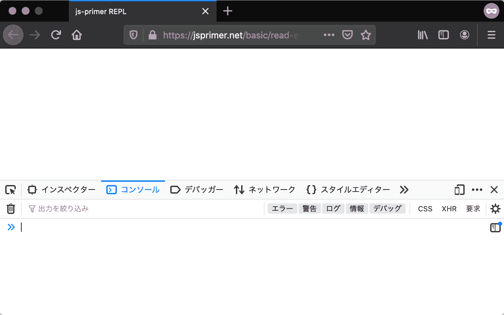
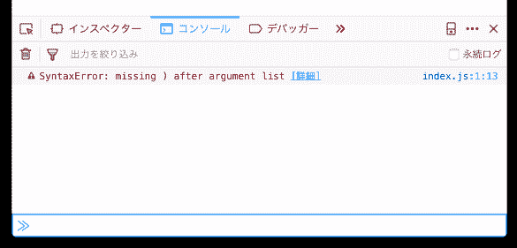

# 值的评估与显示

> 原文：[`jsprimer.net/basic/read-eval-print/`](https://jsprimer.net/basic/read-eval-print/)

我们已经学习了使用变量声明来给值命名的方法。 下面是如何对这些值进行评估的说明。

值的评估意味着对输入的值进行评估并返回结果。 例如，以下是一些值的评估示例。

+   评估表达式`1 + 1`后，将返回结果`2`

+   评估变量`bookTitle`后，将返回变量的值

+   通过评估文本`const x = 1;`，定义了一个变量，但该文本没有返回值

为了验证这种值的评估方法，我们将看看如何在 Web 浏览器（以下简称浏览器）中执行 JavaScript 代码。

## [](#recommended-browser)*本书中使用的浏览器*

*首先，在浏览器中执行 JavaScript 代码。 本书中将使用[Firefox](https://www.mozilla.org/ja/firefox/new/)作为浏览器。 请从以下 URL 下载和安装 Firefox。

+   Firefox: [`www.mozilla.org/ja/firefox/new/`](https://www.mozilla.org/ja/firefox/new/)

大多数本书介绍的示例代码也适用于 Google Chrome、Microsoft Edge、Safari 等浏览器的最新版本。 但是，老旧的仅支持旧版 JavaScript 的 Internet Explorer 可能无法运行许多代码。

此外，不同浏览器之间可能存在标准化的错误消息细微差异以及开发者工具使用方法的差异。 本书中描述的结果是在 Firefox 中执行的。 因此，请注意 Firefox 以外

## [](#execute-js-on-browser)*在浏览器中执行 JavaScript*

*有两种主要方法可以在浏览器中执行 JavaScript。 第一种方法是在浏览器的开发者工具控制台中评估 JavaScript 代码。 第二种方法是创建 HTML 文件并加载 JavaScript 代码。

### [](#repl-on-browser)*在浏览器的开发者工具控制台中评估 JavaScript 代码的方法*

*在浏览器或 Node.js 等许多执行环境中，存在一种称为 REPL（读取-求值-输出循环）的面向开发者的功能，用于评估代码并显示其结果。 在 Firefox 中，REPL 功能包含在名为**Web 控制台**的面板中的开发者工具中。 使用 REPL 功能，您可以即时在现场运行想要尝试的代码，这有助于理解 JavaScript 的工作原理。

要使用 REPL 功能，请先打开 Firefox 的开发者工具，方法如下。

+   在 Firefox 菜单（如果有菜单栏，或者在 macOS 上为工具菜单）中，选择"浏览器工具"下的子菜单"Web 开发工具"

+   按下键盘快捷键 Ctrl+Shift+K（macOS 上为 Command+Option+K）

有关详细信息，请参阅"[Firefox DevTools 用户文档](https://firefox-source-docs.mozilla.org/devtools-user/)"。



选择开发者工具的"控制台"选项卡后，您可以在命令行（以双尖括号`»`开头）中输入任何代码并进行评估。 这个命令行就是浏览器中的 REPL 功能。

输入`1`到 REPL 中并按 Enter 键，将在下一行显示评估结果`1`。

```
» 1
1 
```

输入表达式`1 + 1`，将在下一行显示评估结果`2`。

```
» 1 + 1
2 
```

接下来，我们尝试使用`const`关键字声明变量`bookTitle`，结果将在下一行显示为`undefined`。 变量声明仅与变量名和值相关联，因此变量声明本身不返回任何值，因此结果是`undefined`。 由于 REPL 直接接受下一条输入，因此输入`bookTitle`，将在下一行显示之前分配给变量的`"JavaScript Primer"`的值。

```
» const bookTitle = "JavaScript Primer";
undefined
» bookTitle
"JavaScript Primer" 
```

在命令行的 REPL 功能中，可以逐行执行 JavaScript 代码。 您还可以使用 Shift + Enter 换行以输入多行代码。 这使得您可以根据需要轻松地评估 JavaScript 代码的行为。

需要注意的是，只要 REPL 未结束，使用`const`关键字声明的变量将会保留。 例如，`const`关键字声明的变量不允许重复定义相同变量名。 因此，即使逐行执行，也将被视为重新定义相同变量名，从而导致语法错误（`SyntaxError`）。

```
» const bookTitle = "JavaScript Primer";
undefined
» const bookTitle = "JavaScript Primer";
SyntaxError: redeclaration of const bookTitle 
```

在浏览器中，打开开发者工具的网页重新加载时，REPL 的执行状态也将被重置。 当出现`redeclaration`（重新声明）错误消息时，请尝试重新加载页面。

### [](#js-in-html)*创建 HTML 文件并加载 JavaScript 代码的方法*

*REPL 功能仅面向开发者。 在网页上，通过 HTML 中的`<script>`标签加载和执行 JavaScript。 这里将介绍如何使用 HTML 和 JavaScript 文件执行 JavaScript 代码。

使用 HTML 文件和 JavaScript 文件两种类型，准备执行 JavaScript 代码。 准备一个支持 JavaScript 的编辑器，例如[Visual Studio Code](https://code.visualstudio.com/)，将使事情更加顺利。 编辑器可以是任何类型，但请务必将字符编码设置为**UTF-8**，换行符设置为**LF**，然后保存文件。

可以在任何位置创建文件夹，但是在这里，我们将在名为`example`的文件夹中创建文件。

首先，将`index.js`文件作为 JavaScript 文件创建在路径`example/index.js`中。 在`index.js`中写入以下代码。

index.js

```
1; 
```

接下来，将`index.html`文件作为 HTML 文件创建在路径`example/index.html`中。 从这个 HTML 文件中加载并执行先前创建的`index.js`文件。 在`index.html`中写入以下代码。

index.html

```
<html>
<head>
    <meta charset="UTF-8">
    <title>Example</title>
    <script src="./index.js"></script>
</head>
<body></body>
</html> 
```

重要的是`<script src="./index.js"></script>`这段描述。 这意味着将名为`index.js`的 JavaScript 文件作为脚本加载到同一目录中。

最后打开浏览器中创建的`index.html`。 要打开 HTML 文件，请将 HTML 文件拖放到浏览器中，或者从文件菜单中选择“打开文件”并选择 HTML 文件。 打开 HTML 文件后，浏览器地址栏将显示以`file:///`开头的本地文件路径。

与之前相同的步骤打开"Web Console"后，控制台应该不会显示任何内容。 在 REPL 中，将自动显示评估结果，但是如果作为 JavaScript 代码加载，则不会自动显示评估结果。 自动显示仅是 REPL 的功能。 因此，许多执行环境都提供用于**控制台显示**的 API（功能）。

## [](#console-api)*Console API*

*在许多 JavaScript 执行环境中，可以使用 Console API 进行**控制台显示**。 通过将值传递给`console.log(参数)`的参数，将评估结果显示在控制台上。

将`index.js`的内容更改如下。 然后重新加载页面，`1`的评估结果将显示在 Web 控制台中。

index.js

```
console.log(1); // => 1 
```

当参数中写入表达式时，首先评估参数（写在`(`和`)`之间的内容），然后将结果显示在控制台上。 因此，`1 + 1`的评估结果将显示为`2`。

index.js

```
console.log(1 + 1); // => 2 
```

同样，您也可以将变量作为参数传递。 在这种情况下，首先评估参数变量，然后将结果显示在控制台上。

index.js

```
const total = 42 + 42;
console.log(total); // => 84 
```

Console API 可用作基本的打印调试工具。 当想知道某个值是什么时，将其显示在控制台上通常可以解决问题。 此外，由于 JavaScript 的开发环境变得功能强大，因此除了 Console API 之外，还有各种各样的功能，但在此我们将不详细介绍。

在本书中，将使用 Console API 来显示代码中的评估结果。

此处已经出现多次，但是在代码中的注释中可能会写有`// => 评估结果`。 这些注释列出了评估结果或通过 Console API 显示的结果。

```
// 式の評価結果の例（コンソールには表示されない）
1; // => 1
const total = 42 + 42;
// 変数の評価結果の例（コンソールには表示されない）
total; // => 84
// Console APIでコンソールに表示する例
console.log("JavaScript"); // => "JavaScript" 
```

## [](#execute-on-web)*在网络上执行代码*

*在网络上的书籍中，可以执行的示例代码附有名为**执行**的按钮。 通过这个按钮，每次执行时都会创建一个新环境来执行代码，因此不会出现 REPL 中出现的变量重新定义等问题。

另一方面，执行代码`1`将返回评估结果`1`。 它也支持 Console API。 您可以修改示例代码并运行以更深入地理解代码。

```
console.log("Console APIで表示");
// 値を評価した場合は最後の結果が表示される
42; // => 42 
```

## [](#eval-code-and-error)*代码评估和错误*

*当执行 JavaScript 代码时，有时会出现错误消息，代码可能不会按预期运行。 写完程序而不出现错误几乎是不可能的。 特别是在学习新编程语言时，试错是非常重要的。

当错误消息显示在 Web 控制台中时，仔细阅读错误消息通常可以解决许多问题。 错误主要分为语法错误和运行时错误两种。 这里我们将简要介绍如何阅读错误消息，并提供修复错误的线索。

### [](#syntax-error)*语法错误*

*语法错误是指代码的语法有误时发生的错误。

JavaScript 引擎会对代码进行解析并转换为可执行的程序。 如果在解析代码时发现语法问题，将立即发生语法错误，因此无法将其作为程序执行。

下面的代码由于忘记给函数调用添加`)`而导致语法错误。

index.js

```
console.log(1; // => SyntaxError: missing ) after argument list 
```



在 Firefox 中运行此代码会在控制台中显示以下错误消息。

> SyntaxError: missing ) after argument list[详细信息] index.js:1:13

错误消息可能会因浏览器而异，但基本上具有相同的格式。 当分析这个错误消息的每个部分时，会看到以下内容。

```
SyntaxError: missing ) after argument list[詳細] index.js:1:13
^^^^^^^^^^^  ^^^^^^^^^^^^^^^^^^^^^^^^^^^^^      ^^^^^^^^　^^^^
エラーの種類                |                        | 　行番号:列番号
                  エラー内容の説明                 ファイル名 
```

| 消息 | 意义 |
| --- | --- |
| `SyntaxError: missing ) after argument list` | 错误类型为`SyntaxError`，原因是函数调用缺少`)` |
| `index.js:1:13` | 异常在`index.js`的第 1 行 13 列发生 |

在 Firefox 中，错误消息有时会显示一个名为**[详细信息]**的链接。 这个**[详细信息]**链接指向 MDN 的错误消息解释页面。 在这个例子中的错误消息链接如下。

+   [`developer.mozilla.org/ja/docs/Web/JavaScript/Reference/Errors/Missing_parenthesis_after_argument_list`](https://developer.mozilla.org/ja/docs/Web/JavaScript/Reference/Errors/Missing_parenthesis_after_argument_list)

从这个错误消息和解释页面可以看出，由于函数调用缺少`)`导致了语法错误。因此，通过添加缺少的`)`可以修复错误。

```
console.log(1); 
```

有些语法错误的错误消息可能难以从中理解含义。

在下面的代码中，由于将`const`拼写为`cosnt`，导致了语法错误。

index.js

```
cosnt a = 1; 
```

> SyntaxError: unexpected token: identifier[详细信息] index.js:1:6

| 消息 | 含义 |
| --- | --- |
| `SyntaxError: unexpected token: identifier` | 错误类型为`SyntaxError`，指定了意外的标识符（变量名 `a`） |
| `index.js:1:6` | 异常在`index.js`的第 1 行第 6 列发生 |

当解析程序在`index.js:1:6`处发现意外的（无法解释为语法的）标识符时，就会发生语法错误。在第 1 行第 6 列（行从 1 开始，列从 0 开始计数）发现了一个名为`a`的字符串，这是不正确的。但实际上，`cosnt`的拼写错误是这个语法错误的原因。

为什么会出现这样的错误消息呢？因为`cosnt`（`const`的拼写错误）不是关键字，所以被解释为普通变量名。因此，这段代码被解释为以下代码，这种语法是不被允许的，因此出现了语法错误。

```
cosntという変数名 aという変数名 = 1; 
```

错误消息和错误原因并不总是匹配。但是，语法错误的原因通常是代码书写错误。因此，通过仔细查看错误发生的位置及周围内容，可以确定错误的原因。

### [](#runtime-error)*运行时错误*

*运行时错误是在程序执行过程中发生的错误。由于是在运行时（runtime）发生的错误，因此也被称为运行时错误。由于 API 传递的值的数据类型问题导致的`TypeError`或尝试引用不存在的变量导致的`ReferenceError`等各种类型的错误都有可能发生。*

当发生运行时错误时，该代码在语法上是正确的（不是语法错误），但由于其他原因导致了错误。

在下面的代码中，由于引用了不存在的变量`x`，导致了`ReferenceError`这种运行时错误的发生。

index.js

```
const value = "値";
console.log(x); // => ReferenceError: x is not defined 
```

> ReferenceError: x is not defined[详细信息] index.js:2:1

| 消息 | 含义 |
| --- | --- |
| `ReferenceError: x is not defined` | 错误类型为`ReferenceError`，因为引用了未定义的标识符`x`而发生 |
| `index.js:2:1` | 异常在`index.js`的第 2 行第 1 列发生 |

变量或函数`x`是否存在，需要执行才能知道。因此，当首次引用`x`时，才会确定`x`是否存在，如果`x`不存在，则会出现`ReferenceError`。

在这个例子中，原因似乎是因为引用了不存在的变量`x`，而不是引用`value`变量。通过将引用的变量更改为`value`，可以修复错误。

```
const value = "値";
console.log(value); // => "値" 
```

这样，运行时错误有时直到执行相关部分才会出现错误。因此，有时需要逐步检查已经正确执行到哪里，以确定错误的原因。这种确定错误原因并进行修复的工作称为**调试**。

与语法错误相比，运行时错误的类型更多，原因也各不相同。因此，有时很难找到错误的原因。但是，由于 JavaScript 是一种非常常用的语言，因此在网络上有很多人报告了类似的错误。通过搜索错误消息，有���可以找到类似错误的原因和解决方法。

当发生运行时错误时，仔细查看发生错误的行周围内容和检查错误消息是很重要的。

## [](#conclusion)*总结*

*使用浏览器开发者工具执行 JavaScript 代码以及从 HTML 中加载 JavaScript 文件的方法已经介绍过。在“基本语法”部分介绍的示例代码基本上可以通过这些方法执行。尝试修改示例代码并执行，以加深理解，验证示例代码的运行结果。*

当执行代码并出现错误时，会显示错误消息和位置信息。通过使用这些错误信息进行调试，应该可以找到错误的原因。

在 JavaScript 中，许多错误已经在网络上报告过类似的情况。MDN 的[JavaScript 错误参考](https://developer.mozilla.org/ja/docs/Web/JavaScript/Reference/Errors)中总结了典型的语法错误和运行时错误。此外，通过在[Google](https://www.google.com/)、[GitHub](https://github.com/)、[Stack Overflow](https://stackoverflow.com/)等网站上搜索错误消息，也可以找到错误的原因。

如果错误消息显示在 Web 控制台中，那么这个错误是可以修复的。不需要过分害怕错误。利用错误消息等提示修复错误。
