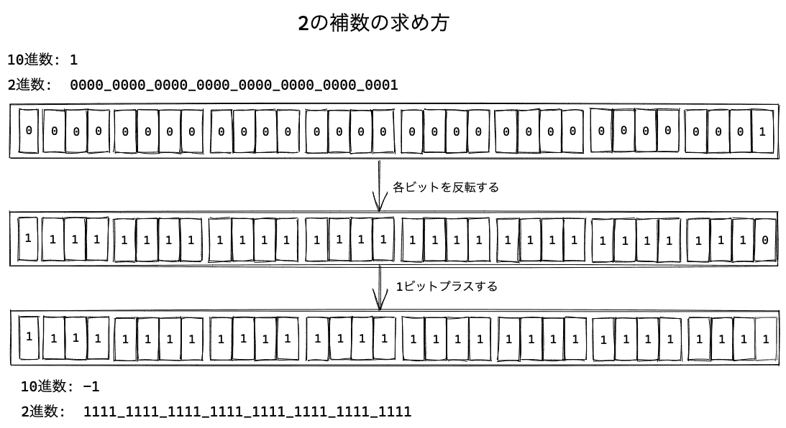

# 运算符

> 原文：[`jsprimer.net/basic/operator/`](https://jsprimer.net/basic/operator/)

运算符是使用符号等表示常用运算处理的。例如，加法运算的`+`也是运算符的一种。除此之外，还有许多种类的运算符。

运算符具有运算对象。这个运算符的目标被称为**被运算符（操作数）**。

下面的代码中，`+`运算符执行了值之间的加法运算。此时，`+`运算符的目标值`1`和`2`是操作数。

```
1 + 2; 
```

在此代码中，`+`运算符前后共有两个操作数。这样，取两个操作数的运算符被称为**二元运算符**。

```
// 二項演算子とオペランドの関係
左オペランド 演算子 右オペランド 
```

此外，有些运算符只需要一个操作数。例如，用于数值递增的`++`运算符，可以将操作数放在前后任一端。

```
let num = 1;
num++;
// または
++num; 
```

这样，只取一个操作数的运算符被称为**一元运算符**。由于一元运算符和二元运算符可能会使用相同的符号，因此我们使用不同的名称来区分。

在本章中，我们将分别学习每个运算符的处理过程。此外，比较运算符与 JavaScript 中的**隐式类型转换**问题密切相关。因此，在查看运算符之后，我们将学习隐式类型转换和显式类型转换。

由于运算符种类繁多，因此不需要在这里记住所有运算符的行为。在需要的时候，再次查看该运算符的行为会更好。

## *二元运算符*

*我们将查看基本的四则运算等二元运算符。

### *加法运算符（`+`）*

*这是一个加法运算符，返回两个数值的和。

```
console.log(1 + 1); // => 2 
```

在 JavaScript 中，数值内部以 IEEE 754 浮点数方式表示（请参阅数据类型和字面量）。因此，整数和浮点数的加法也可以使用加法运算符进行。

```
console.log(10 + 0.5); // => 10.5 
```

## *字符串连接运算符（`+`）*

*这是一个加法运算符，用于字符串的连接。

字符串连接运算符（`+`）返回连接两个字符串的字符串。

```
const value = "文字列" + "結合";
console.log(value); // => "文字列結合" 
```

也就是说，加法运算符（`+`）可以执行数值和字符串之间的运算。

### *减法运算符（`-`）*

*这是一个减法运算符，返回左操作数减去右操作数的值。

```
console.log(1 - 1); // => 0
console.log(10 - 0.5); // => 9.5 
```

### *乘法运算符（`*`）*

*这是一个乘法运算符，返回两个数值的乘积。

```
console.log(2 * 8); // => 16
console.log(10 * 0.5); // => 5 
```

### *除法运算符（`/`）*

*这是一个除法运算符，返回左操作数除以右操作数的值。

```
console.log(8 / 2); // => 4
console.log(10 / 0.5); // => 20 
```

但是，任何数值除以`0`的结果是表示无穷大的数值`Infinity`。

```
console.log(10 / 0); // => Infinity 
```

### *取模运算符（`%`）*

*这是一个除法运算符，返回左操作数除以右操作数的余数。

```
console.log(8 % 2); // => 0
console.log(9 % 2); // => 1
console.log(10 % 0.5); // => 0
console.log(10 % 4.5); // => 1 
```

### *[ES2016] 幂运算符（`**`）*

*这是一个求两个数值幂的运算符。返回左操作数以右操作数为幂的值。

```
// べき乗演算子（ES2016）で2の4 乗を計算
console.log(2 ** 4); // => 16 
```

幂运算符与`Math.pow`方法具有相同的操作。

```
console.log(Math.pow(2, 4)); // => 16 
```

幂运算符是在 ES2016 中后来添加的运算符，因此存在函数和运算符。另一方面，其他二元运算符由于运算符先存在，因此`Math`中没有对应的函数。

## *一元运算符（算术）*

*一元运算符是接受一个操作数并处理它的运算符。

### *一元加法运算符（`+`）*

*一元运算符的`+`将操作数转换为数值。

在下面的代码中，为了将数值`1`转换为数值，结果保持不变，仍然是数值`1`。几乎不会出现像`+数值`这样的在数值上添加一元加法运算符的情况。

```
console.log(+1); // => 1 
```

此外，一元加法运算符还可以将非数值转换为数值。在下面的代码中，将数字（字符串）转换为数值。

```
console.log(+"1"); // => 1 
```

另一方面，无法转换为数值的字符串等将转换为特殊的值`NaN`。

```
// 数値ではない文字列はNaNという値に変換される
console.log(+"文字列"); // => NaN 
```

`NaN`是"Not-a-Number"的缩写，表示不是数值但表示 Number 类型的值。`NaN`与任何值（包括自身）都不相等，可以使用`Number.isNaN`方法来检测`NaN`。

```
// 自分自身とも一致しない
console.log(NaN === NaN); // => false
// Number 型である
console.log(typeof NaN); // => "number"
// Number.isNaNでNaNかどうかを判定
console.log(Number.isNaN(NaN)); // => true 
```

但是，一元加法运算符不应用于字符串到数值的转换。因为存在`Number`构造函数或`parseInt`函数等明确的转换方法。有关详细信息，请参阅“隐式类型转换”章节。

### *一元减法运算符（`-`）*

*一元减法运算符用于表示负数值。

例如，可以写成`-1`的负数`-1`，是因为使用了单负运算符。

```
console.log(-1); // => -1 
```

此外，一元减法运算符还可以反转负数值。因此，“负的负数值”是正数值。

```
console.log(-(-1)); // => 1 
```

一元减法运算符也可以将字符串等转换为数值。

```
console.log(-"1"); // => -1 
```

此外，如果指定了无法转换为数值的字符串等作为操作数，则结果将是特殊的值`NaN`。因此，与一元加法运算符一样，不应使用一元减法运算符进行字符串到数值的转换。

```
console.log(-"文字列"); // => NaN 
```

### *增量运算符（`++`）*

*增量运算符（`++`）是一个将操作数的数值加`+1`的运算符。通过在操作数前后放置增量运算符，可以返回对操作数进行`+1`后的值。

```
let num = 1;
num++;
console.log(num); // => 2
// 次のようにした場合と結果は同じ
// num = num + 1; 
```

增量运算符（`++`）根据操作数的放置位置不同，其评估顺序也不同。

后置增量运算符（`num++`）的处理顺序如下。

1.  `num`的评估结果返回

1.  `num`对`+1`

因此，`num++`返回的值是加`+1`前的值。

```
let x = 1;
console.log(x++); // => 1
console.log(x);   // => 2 
```

另一方面，前置增量运算符（`++num`）的处理顺序如下。

1.  `num`对`+1`

1.  `num`的评估结果返回

因此，`++num`返回的值是加`+1`后的值。

```
let x = 1;
console.log(++x); // => 2
console.log(x);   // => 2 
```

这两个用法很少需要区分。因此，只需记住评估顺序的不同即可。

### *递减运算符（`--`）*

*递减运算符（`--`）是用于将操作数的数值减去`-1`的运算符。

```
let num = 1;
num--;
console.log(num); // => 0
// 次のようにした場合と結果は同じ
// num = num - 1; 
```

递减运算符与递增运算符类似，可以放在操作数的前面或后面。递减运算符的位置也会改变评估顺序。

```
// 後置デクリメント演算子
let x = 1;
console.log(x--); // => 1
console.log(x);   // => 0
// 前置デクリメント演算子
let y = 1;
console.log(--y); // => 0
console.log(y);   // => 0 
```

## *比较运算符*

*比较运算符是用于比较操作数的值并返回布尔值的运算符。

### *严格等价运算符（`===`）*

*严格等价运算符是，比较左右两个操作数。如果类型相同且值相同，则返回`true`。

```
console.log(1 === 1); // => true
console.log(1 === "1"); // => false 
```

此外，如果两个操作数都是对象，则只有在对象的引用相同的情况下才会返回`true`。

在以下代码中，正在比较两个空对象字面量（`{}`）。对象字面量会创建新的对象。因此，使用`===`比较引用不同对象的变量会返回`false`。

```
// {} は新しいオブジェクトを作成している
const objA = {};
const objB = {};
// 生成されたオブジェクトは異なる参照となる
console.log(objA === objB); // => false
// 同じ参照を比較している場合
console.log(objA === objA); // => true 
```

### *严格不等价运算符（`!==`）*

*严格不等价运算符是，比较左右两个操作数。如果类型不同或值不同，则返回`true`。

```
console.log(1 !== 1); // => false
console.log(1 !== "1"); // => true 
```

`===`是返回反转结果的运算符。

### *等价运算符（`==`）*

*等价运算符（`==`）比较两个操作数。如果操作数是相同的数据类型，则与严格等价运算符（`===`）的结果相同。

```
console.log(1 == 1); // => true
console.log("str" == "str"); // => true
console.log("JavaScript" == "ECMAScript"); // => false
// オブジェクトは参照が一致しているならtrueを返す
// {} は新しいオブジェクトを作成している
const objA = {};
const objB = {};
console.log(objA == objB); // => false
console.log(objA == objA); // => true 
```

然而，等价运算符（`==`）在比较不同类型的操作数时，会先进行**隐式类型转换**，使其成为相同类型后再进行比较。

因此，存在许多从外观上无法预测结果的异常行为。

```
// 文字列を数値に変換してから比較
console.log(1 == "1"); // => true
// "01"を数値にすると`1`となる
console.log(1 == "01"); // => true
// 真偽値を数値に変換してから比較
console.log(0 == false); // => true
// nullの比較はfalseを返す
console.log(0 == null); // => false
// nullとundefinedの比較は常にtrueを返す
console.log(null == undefined); // => true 
```

由于可能产生意外的行为，因此不应使用进行隐式类型转换的等价运算符（`==`）。相反，应使用严格等价运算符（`===`），并在需要比较不同类型时显式地转换类型。

例外情况下，使用等价运算符（`==`）的例子包括`null`和`undefined`的比较。

当需要判断比较的操作数是否为`null`或`undefined`时，如以下所示，使用严格等价运算符（`===`）可能需要两次比较。由于等价运算符（`==`）将`null`和`undefined`的比较结果视为`true`，因此一次比较就足够了。

```
const value = undefined; /* または null */
// === では2つの値と比較しないといけない
if (value === null || value === undefined) {
    console.log("valueがnullまたはundefinedである場合の処理");
}
// == では null と比較するだけでよい
if (value == null) {
    console.log("valueがnullまたはundefinedである場合の処理");
} 
```

这样，等价运算符（`==`）的例外用法是存在的，但由于等价运算符（`==`）会进行隐式类型转换，因此容易引发错误。因此，在理解其工作原理之前，建议始终使用严格等价运算符（`===`）。

### *不等价运算符（`!=`）*

*不等价运算符（`!=`）比较两个操作数，如果不相等则返回`true`。

```
console.log(1 != 1); // => false
console.log("str" != "str"); // => false
console.log("JavaScript" != "ECMAScript"); // => true
console.log(true != true);// => false
// オブジェクトは参照が一致していないならtrueを返す
const objA = {};
const objB = {};
console.log(objA != objB); // => true
console.log(objA != objA); // => false 
```

不等价运算符也像等价运算符（`==`）一样，在比较不同类型的操作数时，会先进行隐式类型转换后再进行比较。

```
console.log(1 != "1"); // => false
console.log(0 != false); // => false
console.log(0 != null); // => true
console.log(null != undefined); // => false 
```

因此，不等价运算符（`!=`）不应该使用。相反，应使用不进行隐式类型转换的严格不等价运算符（`!==`）。

### *大于运算符/比...大（`>`）*

*大于运算符是，如果左操作数大于右操作数，则返回`true`。

```
console.log(42 > 21); // => true
console.log(42 > 42); // => false 
```

### *大于等于运算符/比...大或等于（`>=`）*

*大于等于运算符是，如果左操作数大于或等于右操作数，则返回`true`。

```
console.log(42 >= 21); // => true
console.log(42 >= 42); // => true
console.log(42 >= 43); // => false 
```

### *小于运算符/比...小（`<`）*

*小于运算符是，如果左操作数小于右操作数，则返回`true`。

```
console.log(21 < 42); // => true
console.log(42 < 42); // => false 
```

### *小于等于运算符/比...小或等于（`<=`）*

*小于等于运算符是，如果左操作数小于或等于右操作数，则返回`true`。

```
console.log(21 <= 42); // => true
console.log(42 <= 42); // => true
console.log(43 <= 42); // => false 
```

## *位运算符*

*位运算符将操作数视为符号位 32 位整数（由`0`和`1`组成的 32 位集合）。

例如，数值`1`在符号位 32 位整数的位表示中为`00000000000000000000000000000001`。为了便于理解，可以将其分为每 4 位一组，形成一个 32 位的集合，如`0000_0000_0000_0000_0000_0000_0000_0001`。


符号位 32 位整数中，负数以 2 的补码形式表示。2 的补码是将每个位取反并加 1 的值。

例如，数值`-1`的符号位 32 位整数可以通过以下方式计算 2 的补码。

+   10 进制数`1`在符号位 32 位整数中表示为`0000_0000_0000_0000_0000_0000_0000_0001`。

+   将`0000_0000_0000_0000_0000_0000_0000_0001`的每个位取反后得到`1111_1111_1111_1111_1111_1111_1111_1110`。

+   将 1 位加到`1111_1111_1111_1111_1111_1111_1111_1111`上。

因此，`-1`的符号位 32 位整数表示为`1111_1111_1111_1111_1111_1111_1111_1111`。



*表示数值范围，符号位 32 位整数可以表示的数值范围是`1000_0000_0000_0000_0000_0000_0000_0000`到`0111_1111_1111_1111_1111_1111_1111_1111`。转换为十进制数是`-(2³¹)`（2 的 31 次幂的负数）到`(2³¹) - 1`（2 的 31 次幂减 1）。

接下来要查看的位运算符将操作数作为符号位 32 位整数处理，并以十进制数值返回运算结果。

### *位逻辑与（`&`)*

*位逻辑与运算符（`&`）返回各位**AND**运算的结果。AND 运算中，如果操作数的每一位都是`1`，则结果为`1`；否则为`0`。

在下面的代码中，对十进制数`15`和`9`进行 AND 运算。`15`在符号位 32 位整数中是`0000_0000_0000_0000_0000_0000_0000_1111`。`9`在符号位 32 位整数中是`0000_0000_0000_0000_0000_0000_0000_1001`。进行 AND 运算后的结果是`0000_0000_0000_0000_0000_0000_0000_1001`，返回十进制数`9`。

```
console.log(15     & 9);      // => 9
// 同じ位の各ビット同士をAND 演算する（上位の`0`は省略）
// 1111
// 1001
// ----
// 1001
console.log(0b1111 & 0b1001); // => 0b1001 
```

### *位逻辑或（`|`)*

*位逻辑或运算符（`|`）返回各位**OR**运算的结果。OR 运算中，如果操作数的任何一位是`1`，则结果为`1`；如果两位都是`0`，则结果为`0`。

```
console.log(15     | 9);      // => 15
// 同じ位の各ビット同士をOR 演算する（上位の`0`は省略）
// 1111
// 1001
// ----
// 1111
console.log(0b1111 | 0b1001); // => 0b1111 
```

### *位排他逻辑或（`^`)*

*位排他逻辑或运算符（`^`）返回各位**XOR**运算的结果。XOR 运算中，如果操作数的位不同，则结果为`1`；如果相同，则结果为`0`。

```
console.log(15     ^ 9);      // => 6
// 同じ位の各ビット同士をXOR 演算する（上位の`0`は省略）
// 1111
// 1001
// ----
// 0110
console.log(0b1111 ^ 0b1001); // => 0b0110 
```

### *位否定（`~`)*

*单项运算符的否定运算符（`~`）返回操作数各位的反转值。这被称为 1 的补码值。

在下面的代码中，使用否定运算符（`~`）将十进制数`15`的每一位反转，得到的结果。`15`是`0000_0000_0000_0000_0000_0000_0000_1111`。反转每一位后变为`1111_1111_1111_1111_1111_1111_1111_0000`，十进制数为`-16`。

```
console.log(~15); // => -16 
```

`~x`这样的`x`通过位否定运算符计算的结果是`-(x + 1)`。利用这一性质，位否定运算符（`~`）在位运算之外也有使用。

字符串（String 对象）的`indexOf`方法用于查找匹配的字符串，并返回其索引（位置）。如果找不到搜索对象，则`indexOf`方法返回`-1`。

```
const str = "森森本森森";
// 見つかった場合はインデックスを返す
// JavaScriptのインデックスは0から開始するので2を返す
console.log(str.indexOf("本")); // => 2
// 見つからない場合は-1を返す
console.log(str.indexOf("火")); // => -1 
```

否定运算符（`~`）返回 1 的补码，因此`~(-1)`是`0`。

```
console.log(~0); // => -1
console.log(~(-1)); // => 0 
```

在 JavaScript 中，`0`在 if 语句中被视为`false`。因此，`~indexOf 的结果`只有在字符串找不到时才会是`0`。以下代码中，使用否定运算符（`~`）和`indexOf`方法的一些惯用用法。

```
const str = "森森木森森";
// indexOfメソッドは見つからなかった場合は -1 を返す
if (str.indexOf("木") !== -1) {
    console.log("木を見つけました");
}
// 否定演算子（`~`）で同じ動作を実装
// (~(-1)) は 0 となるため、見つからなかった場合はif 文の中身は実行されない
if (~str.indexOf("木")) {
    console.log("木を見つけました");
} 
```

ES2015 为字符串（String 对象）实现了`includes`方法。`includes`方法以真值返回指定的字符串是否包含在内。

```
const str = "森森木森森";
if (str.includes("木")) {
    console.log("木を見つけました");
} 
```

因此，使用否定运算符（`~`）和`indexOf`方法的一些惯用用法可以替换为`includes`方法。

### *左移运算符（`<<`)*

*左移运算符将数值`num`向左移动`bit`位。左移溢出的位被丢弃，并用`0`的位从右填充。

```
num << bit; 
```

在下面的代码中，将`9`向左移动 2 位。

```
console.log(     9 << 2); // => 36
console.log(0b1001 << 2); // => 0b10_0100 
```

### *右移运算符（`>>`)*

*右移运算符将数值`num`向右移动`bit`位。右移溢出的位被丢弃，并用左端的位复制填充。

```
num >> bit; 
```

在下面的代码中，将`-9`向右移动 2 位。为了使用左端的位来复制，符号始终被保留。

```
console.log((-9) >> 2); // => -3
//    1111_1111_1111_1111_1111_1111_1111_0111 >> 2
// => 1111_1111_1111_1111_1111_1111_1111_1101 
```

### *零填充右移运算符（`>>>`)*

*零填充右移运算符将数值`num`向右移动`bit`位，与右移运算符（`>>`）相同。不同之处在于右移溢出的位被丢弃，并用`0`的位从左填充。

在下面的代码中，将`-9`向右移动 2 位。由于左端的位是`0`，因此始终是正数。

```
console.log((-9) >>> 2); // => 1073741821
//    1111_1111_1111_1111_1111_1111_1111_0111 >>> 2
// => 0011_1111_1111_1111_1111_1111_1111_1101 
```

## *代入运算符（`=`)*

*代入运算符（`=`）用于向变量赋值。有关代入运算符的更多信息，请参阅“变量与声明”章节。

```
let x = 1;
x = 42;
console.log(x); // => 42 
```

此外，代入运算符可以与二项运算符结合使用。例如，`+=`、`-=`、`*=`、`/=`、`%=`、`<<=`、`>>=`、`>>>=`、`&=`、`^=`、`|=`、`**=`等，可以将计算结果代入。

```
let num = 1;
num += 10; // num = num + 10; と同じ
console.log(num); // => 11 
```

### *[ES2015] 分割代入（Destructuring assignment)*

*之前看到的代入运算符是将值代入一个变量的。使用分割代入可以将数组或对象的值同时代入多个变量。分割代入是 ES2015 引入的一种缩写语法。

分割代入与代入运算符（`=`）使用相同，但左边的操作数是数组字面量或对象字面量。

在下面的代码中，将右边的数组的值代入到左边数组字面量的相应索引处的变量名中。

```
const array = [1, 2];
// aには`array`の0 番目の値、bには1 番目の値が代入される
const [a, b] = array;
console.log(a); // => 1
console.log(b); // => 2 
```

这与以下写法得到相同的结果。

```
const array = [1, 2];
const a = array[0];
const b = array[1]; 
```

同样，对象也支持分割代入。在对象的情况下，将右边的对象的属性值代入到左边的相应属性名中。

```
const obj = {
    "key": "value"
};
// プロパティ名`key`の値を、変数`key`として定義する
const { key } = obj;
console.log(key); // => "value" 
```

这与以下写法得到相同的结果。

```
const obj = {
    "key": "value"
};
const key = obj.key; 
```

## *逻辑运算符*

*逻辑运算符是基本处理真值运算的运算符，可以表示 AND（且）、OR（或）、NOT（否定）。

### *AND 运算符（`&&`)*

*AND 演算子（`&&`）は、左辺の値の評価結果が`true`ならば、右辺の評価結果を返します。 一方で、左辺の値の評価結果が`false`ならば、そのまま左辺の値を返します。

```
// 左辺はtrueであるため、右辺の評価結果を返す
console.log(true && "右辺の値"); // => "右辺の値"
// 左辺がfalseであるなら、その時点でfalseを返す
// 右辺は評価されない
console.log(false && "右辺の値"); // => false 
```

AND 演算子（`&&`）は、左辺の評価が`false`の場合、オペランドの右辺は評価されません。 次のように、左辺が`false`の場合は、右辺に書いた`console.log`関数自体が実行されません。

```
// 左辺がtrueなので、右辺は評価される
true && console.log("このコンソールログは実行されます");
// 左辺がfalseなので、右辺は評価されない
false && console.log("このコンソールログは実行されません"); 
```

このような値が決まった時点でそれ以上評価しないことを**短絡評価**と呼びます。

また、AND 演算子は左辺を評価する際に、左辺を真偽値へと暗黙的な型変換をしてから判定します。 真偽値への暗黙的な型変換では、次に挙げる値は`false`へ変換されます。

+   `false`

+   `undefined`

+   `null`

+   `0`

+   `0n`

+   `NaN`

+   `""`（空文字列）

暗黙的な型変換によって`false`に変換されるこれらの値をまとめて**falsy**な値と呼びます。 falsyではない値は、`true`へと変換されます。 `true`へと変換される値の種類は多いため、`false`へと変換されない値は`true`となることは覚えておくとよいです。 このオペランドを真偽値に変換してから評価するのはAND、OR、NOT 演算子で共通の動作です。

次のように、AND 演算子（`&&`）は左辺を真偽値へと変換した結果が`true`の場合に、右辺の評価結果を返します。 つまり、左辺がfalsyの場合は、右辺は評価されません。

```
// 左辺はfalsyではないため、評価結果として右辺を返す
console.log("文字列" && "右辺の値"); // => "右辺の値"
console.log(42 && "右辺の値"); // => "右辺の値"
// 左辺がfalsyであるため、評価結果として左辺を返す
console.log("" && "右辺の値"); // => ""
console.log(0 && "右辺の値"); // => 0
console.log(null && "右辺の値"); // => null 
```

AND 演算子は、if 文と組み合わせて利用することが多い演算子です。

次のように、`value`がString 型で **かつ** 値が`"str"`である場合という条件をひとつの式として書くことができます。

```
const value = "str";
if (typeof value === "string" && value === "str") {
    console.log(`${value} is string value`);
}
// if 文のネストで書いた場合と結果は同じとなる
if (typeof value === "string") {
    if (value === "str") {
        console.log(`${value} is string value`);
    }
} 
```

このときに、`value`がString 型でない場合は、その時点でif 文の条件式は`false`となります。 そのため、`value`がString 型ではない場合は、AND 演算子（`&&`）の右辺は評価されずに、if 文の中身も実行されません。

AND 演算子（`&&`）を使うと、if 文のネストに比べて短く書くことができます。

しかし、if 文が3 重 4 重にネストしているのは複雑なのと同様に、 AND 演算子やOR 演算子が3つ4つ連続すると複雑で読みにくいコードとなります。 その場合は抽象化ができないかを検討するべきサインとなります。

### *OR 演算子（`||`）*

*OR 演算子（`||`）は、左辺の値の評価結果が`true`ならば、そのまま左辺の値を返します。 一方で、左辺の値の評価結果が`false`であるならば、右辺の評価結果を返します。

```
// 左辺がtrueなので、左辺の値が返される
console.log(true || "右辺の値"); // => true
// 左辺がfalseなので、右辺の値が返される
console.log(false || "右辺の値"); // => "右辺の値" 
```

OR 演算子（`||`）は、左辺の評価が`true`の場合、オペランドの右辺を評価しません。 これは、AND 演算子（`&&`）と同様の短絡評価となるためです。

```
// 左辺がtrueなので、右辺は評価されない
true || console.log("このコンソールログは実行されません");
// 左辺がfalseなので、右辺は評価される
false || console.log("このコンソールログは実行されます"); 
```

また、OR 演算子は左辺を評価する際に、左辺を真偽値へと暗黙的な型変換をします。 次のように、OR 演算子は左辺がfalsyの場合には右辺の値を返します。

```
// 左辺がfalsyなので、右辺の値が返される
console.log(0 || "左辺はfalsy"); // => "左辺はfalsy"
console.log("" || "左辺はfalsy"); // => "左辺はfalsy"
console.log(null || "左辺はfalsy"); // => "左辺はfalsy"
// 左辺はfalsyではないため、左辺の値が返される
console.log(42 || "右辺の値"); // => 42
console.log("文字列" || "右辺の値"); // => "文字列" 
```

OR 演算子は、if 文と組み合わせて利用することが多い演算子です。

次のように、`value`が`0`**または**`1`の場合にif 文の中身が実行されます。

```
const value = 1;
if (value === 0 || value === 1) {
    console.log("valueは0または1です。");
} 
```

### *NOT 演算子（`!`）*

*NOT 演算子（`!`）は、`オペランド`の評価結果が`true`ならば、`false`を返します。 一方で、`オペランド`の評価結果が`false`ならば、`true`を返します。 つまり、オペランドの評価結果を反転した真偽値を返します。

```
console.log(!false); // => true
console.log(!true);  // => false 
```

NOT 演算子（`!`）もAND 演算子（`&&`）とOR 演算子（`||`）と同様に真偽値へと暗黙的な型変換します。 falsyである値は`true`へ変換され、falsyではない値は`false`へと変換されます。

```
// falsyな値は`true`となる
console.log(!0); // => true
console.log(!""); // => true
console.log(!null); // => true
// falsyではない値は`false`となる
console.log(!42);  // => false
console.log(!"文字列");  // => false 
```

NOT 演算子は必ず真偽値を返すため、次のように2つNOT 演算子を重ねて真偽値へ変換するという使い方も見かけます。 たとえば、`!!falsyな値`のように2 度反転すれば`false`になります。

```
const str = "";
// 空文字列はfalsyであるため、true -> falseへと変換される
console.log(!!str); // => false 
```

このようなケースの多くは、比較演算子���使うなどより明示的な方法で、真偽値を得ることができます。 安易に`!!`による変換に頼るよりは別の方法を探してみるのがいいでしょう。

```
const str = "";
// 空文字列(長さが0より大きな文字列)でないことを判定
console.log(str.length > 0); // => false 
```

## *[ES2020] Nullish coalescing 演算子(`??`)*

*Nullish coalescing 演算子(`??`)は、左辺の値が**nullish**であるならば、右辺の評価結果を返します。 **nullish**とは、評価結果が`null`または`undefined`となる値のことです。

```
// 左辺がnullishであるため、右辺の値の評価結果を返す
console.log(null ?? "右辺の値"); // => "右辺の値"
console.log(undefined ?? "右辺の値"); // => "右辺の値"
// 左辺がnullishではないため、左辺の値の評価結果を返す
console.log(true ?? "右辺の値"); // => true
console.log(false ?? "右辺の値"); // => false
console.log(0 ?? "右辺の値"); // => 0
console.log("文字列" ?? "右辺の値"); // => "文字列" 
```

Nullish coalescing 演算子(`??`)とOR 演算子（`||`）は、値のデフォルト値を指定する場合によく利用されています。 OR 演算子（`||`）は左辺がfalsyの場合に右辺を評価するため、意図しない結果となる場合があります。

次のコードは、`inputValue`が未定義だった場合に、`value`に対するデフォルト値をOR 演算子（`||`）で指定しています。 `inputValue`が未定義(`undefined`)の場合は、意図したようにOR 演算子（`||`）の右辺で指定した`42`が入ります。 しかし、`inputValue`が`0`という値であった場合は、`0`はfalsyであるため`value`には右辺の`42`が入ります。 これでは`0`という値が扱えないため、意図しない動作となっています。

```
const inputValue = 任意の値または未定義;
// `inputValue`がfalsyの場合は、`value`には`42`が入る
// `inputValue`が`0`の場合は、`value`に`42`が入ってしまう
const value = inputValue || 42;
console.log(value); 
```

この問題を解決するためにES2020でNullish coalescing 演算子(`??`)が導入されています。

Nullish coalescing 演算子(`??`)では、左辺がnullishの場合のみ、`value`に右辺で指定した`42`が入ります。 そのため、`inputValue`が`0`という値が入った場合は、`value`にはそのまま`inputValue`の値である`0`が入ります。

```
const inputValue = 任意の値または未定義;
// `inputValue`がnullishの場合は、`value`には42が入る
// `inputValue`が`0`の場合は、`value`に`0`が入る
const value = inputValue ?? 42;
console.log(value); 
```

## *条件（三項）演算子（`?`と`:`）*

*条件演算子（`?`と`:`）は三項をとる演算子であるため、三項演算子とも呼ばれます。

条件演算子は`条件式`を評価した結果が`true`ならば、`Trueのとき処理する式`の評価結果を返します。 `条件式`が`false`である場合は、`Falseのとき処理する式`の評価結果を返します。

```
条件式 ? Trueのとき処理する式 : Falseのとき処理する式; 
```

if 文との違いは、条件演算子は式として書くことができるため値を返すという点です。 たとえば、次のよう��`条件式`の評価結果により`"A"` または `"B"` どちらかを返します。

```
const valueA = true ? "A" : "B";
console.log(valueA); // => "A"
const valueB = false ? "A" : "B";
console.log(valueB); // => "B" 
```

条件分岐による値を返せるため、条件によって変数の初期値が違う場合などに使われます。

在下面的示例中，我们编写了一个函数，该函数将一个前缀字符串添加到`text`字符串的开头。如果第二个参数`prefix`被省略或者不是一个字符串，则会使用默认的`prefix`。如果省略了第二个参数，则`prefix`将被设为`undefined`。

条件运算符的评估结果会返回一个值，因此可以使用`const`进行声明和赋值。

```
function addPrefix(text, prefix) {
    // `prefix`が指定されていない場合は"デフォルト:"を付ける
    const pre = typeof prefix === "string" ? prefix : "デフォルト:";
    return pre + text;
}

console.log(addPrefix("文字列")); // => "デフォルト:文字列"
console.log(addPrefix("文字列", "カスタム:")); // => "カスタム:文字列" 
```

如果使用 if 语句，需要分开声明和赋值，因此无法使用`const`。

```
function addPrefix(text, prefix) {
    let pre = "デフォルト:";
    if (typeof prefix === "string") {
        pre = prefix;
    }
    return pre + text;
}

console.log(addPrefix("文字列")); // => "デフォルト:文字列"
console.log(addPrefix("文字列", "カスタム:")); // => "カスタム:文字列" 
```

## [分组运算符（`(`和`)`）](https://wiki.example.org/group-operator)*分组运算符（`(`和`)`）*

*分组运算符是一种可以明确表示多个二元运算符组合的运算符的优先级的运算符。

例如，由于首先处理了由分组运算符括起来的部分，因此结果也会发生变化。

```
const a = 1;
const b = 2;
const c = 3;
console.log(a + b * c); // => 7
console.log((a + b) * c); // => 9 
```

[运算符优先级](https://developer.mozilla.org/ja/docs/Web/JavaScript/Reference/Operators/Operator_Precedence#Table "运算符优先级 - JavaScript | MDN")由 ECMAScript 规范定义，但记住所有运算符的优先级是困难的。 在运算符优先级中，分组运算符的优先级较高，使用分组运算符可以明确优先级。

让我们看看不使用分组运算符编写的代码。 当`x`为`true`或`y`和`z`均为`true`时进行处理。

```
if (x || y && z) {
    // x が true または
    // y かつ z が true
} 
```

如果一个表达式中出现多种类型的运算符，往往会变得难以阅读。 在这种情况下，可以使用分组运算符并明确结合顺序进行编写。

```
if (x || (y && z)) {
    // x が true または
    // y かつ z が true
} 
```

但是，与其在一个表达式中进行多个运算，不如将表达式本身分开可能更易读。

让我们考虑一下当`a`和`b`是字符串类型或者`x`和`y`是数值类型时的 if 语句。 虽然可以使用分组运算符直接编写为一个条件表达式，但这会使代码难以阅读。

```
if ((typeof a === "string" && typeof b === "string") || (typeof x === "number" && typeof y === "number")) {
    // `a`と`b`が文字列型 または
    // `x`と`y`が数値型
} 
```

与其勉强写成一个表达式（一行），不如将条件表达式分解并将每个结果定义为变量更易于阅读。

```
const isAbString = typeof a === "string" && typeof b === "string";
const isXyNumber = typeof x === "number" && typeof y === "number";
if (isAbString || isXyNumber) {
    // `a`と`b`が文字列型 または
    // `x`と`y`が数値型
} 
```

因此，与其使用分组运算符将所有条件组合在一起，不如将每个条件分解并赋予名称（作为变量定义）同样重要。

## [逗号运算符（`,`）](https://wiki.example.org/comma-operator)*逗号运算符（`,`）*

*逗号运算符（`,`）会依次评估用逗号（`,`）分隔的表达式， 并返回最后一个表达式的评估结果。

在下面的示例中，将依次评估`expression1`、`expression2`和`expression3`，并返回`expression3`的评估结果。

```
式 1, 式 2, 式 3; 
```

到目前为止，我们已经看到，逗号分隔的概念也出现在使用`const`声明变量等地方。 在从左到右执行方面，逗号运算符的行为与其相同，但语法不同。

```
const a = 1, b = 2, c = a + b;
console.log(c); // => 3 
```

通常情况下，很少会使用逗号运算符，因此只需知道“逗号分隔的表达式会从左到右进行评估”就可以了。¹

## [总结](https://wiki.example.org/conclusion)*总结*

*本章介绍了运算符。

+   运算符是用符号等表示常用运算操作的符号

+   有各种类型的运算符，如四则运算和逻辑运算

+   运算符有优先级，可以通过分组运算符来明确

> ¹. 使用逗号运算符的技巧之一是间接调用。[2ality.com/2014/01/eval.html](https://2ality.com/2014/01/eval.html) ↩
