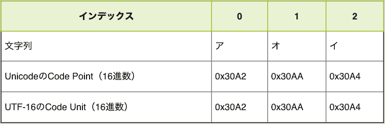
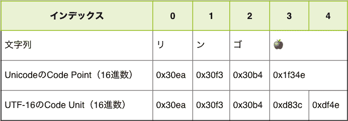

# 字符串和 Unicode

> 原文：[`jsprimer.net/basic/string-unicode/`](https://jsprimer.net/basic/string-unicode/)

「文字列」的章节介绍了，JavaScript 采用 Unicode 作为字符编码，并采用 UTF-16 作为编码方式。 采用 UTF-16 仅仅是为了在 JavaScript 内部处理字符串时使用的字符编码（内部编码）。 因此，文件本身的字符编码（外部编码）可以是 UTF-8 等 UTF-16 以外的字符编码。

在「字符串」章节中，我们并没有意识到这些字符编码，可以在不意识到内部使用的字符编码是什么的情况下进行字符串处理。 但是，JavaScript 的 String 对象也有针对这个字符编码（Unicode）的 API。 此外，在处理特定包含表情符号的字符或计算“字符数”时，必须意识到 UTF-16 作为内部编码。

本章将讨论需要意识到字符串中的 Unicode 的情况。 此外，Unicode 本身与 ECMAScript 一样具有历史悠久的规范，要介绍 Unicode 的所有内容需要大量的字符串。 因此，本章将限定讨论 JavaScript 中的 Unicode 和 UTF-16。

如果想要了解 Unicode 的历史以及字符编码本身的更多信息，请参考“[プログラマのための文字コード技術入門](https://gihyo.jp/book/2019/978-4-297-10291-3)”或“[文字コード「超」研究](https://www.rutles.net/products/detail.php?product_id=298)”等。

## [](#code-point)*Code Point*

*Unicode 是为所有字符（包括不可见字符等）定义 ID 的规范。 对于这些“字符”的“唯一 ID”，我们称之为**Code Point**（代码点）。

处理 Code Point 的方法大多是在 ECMAScript 2015 中添加的。 通过使用 ES2015 中添加的 String 的`codePointAt`方法和`String.fromCodePoint`静态方法，可以相互转换字符串和 Code Point。

String 的`codePointAt`方法^([ES2015])会返回字符串中指定索引处字符的 Code Point 值。

```
// 文字列"あ"のCode Pointを取得
console.log("あ".codePointAt(0)); // => 12354 
```

另一方面，`String.fromCodePoint`方法^([ES2015])会返回与指定 Code Point 对应的字符。

```
// Code Pointが`12354`の文字を取得する
console.log(String.fromCodePoint(12354)); // => "あ"
// `12354`を16 進数リテラルで表記しても同じ結果
console.log(String.fromCodePoint(0x3042)); // => "あ" 
```

此外，在字符串文字中，可以使用 Unicode 转义序列直接写入 Code Point。 Code Point 可以以`\u{Code Point 的 16 进制值}`的形式作为转义序列进行编写。 在 Unicode 转义序列中，需要提供 Code Point 的 16 进制值。 通过将 Number 的`toString`方法的基数参数设置为`16`，可以获取 16 进制字符串。

```
// "あ"のCode Pointは12354
const codePointOfあ = "あ".codePointAt(0);
// 12354の16 進数表現は"3042"
const hexOfあ = codePointOfあ.toString(16);
console.log(hexOfあ);// => "3042"
// Unicodeエスケープで"あ"を表現できる
console.log("\u{3042}"); // => "あ" 
```

## [](#code-point-is-not-code-unit)*Code Point 和 Code Unit 的区别*

*我们介绍了 Code Point（代码点），但 JavaScript 字符串的构成元素是经过 UTF-16 转换的 Code Unit（代码单元）（详细信息请参考“字符串”章节）。 对于某些范围的字符串，Code Point（代码点）和 Code Unit（代码单元）的值最终会相同。

在下面的代码中，我们展示了名为`アオイ`的字符串的每个元素作为 Code Point 和 Code Unit 的表示。 `convertCodeUnits`函数将字符串转换为 Code Unit 数组，`convertCodePoints`函数将字符串转换为 Code Point 数组。 暂时不需要理解这两个函数的具体实现。

```
// 文字列をCode Unit(16 進数)の配列にして返す
function convertCodeUnits(str) {
    const codeUnits = [];
    for (let i = 0; i < str.length; i++) {
        codeUnits.push(str.charCodeAt(i).toString(16));
    }
    return codeUnits;
}
// 文字列をCode Point(16 進数)の配列にして返す
function convertCodePoints(str) {
    return Array.from(str).map(char => {
        return char.codePointAt(0).toString(16);
    });
}

const str = "アオイ";
const codeUnits = convertCodeUnits(str);
console.log(codeUnits); // => ["30a2", "30aa", "30a4"]
const codePoints = convertCodePoints(str);
console.log(codePoints); // => ["30a2", "30aa", "30a4"] 
```

总结执行结果后，可以看出在这个字符串中，Code Point 和 Code Unit 的值是相同的。



然而，有些字符串的 Code Point 和 Code Unit 可能会有不同的值。

使用相同的函数，我们将比较`リンゴ🍎`（苹果表情符号）这个字符串的 Code Unit 和 Code Point。

```
// 文字列をCode Unit(16 進数)の配列にして返す
function convertCodeUnits(str) {
    const codeUnits = [];
    for (let i = 0; i < str.length; i++) {
        codeUnits.push(str.charCodeAt(i).toString(16));
    }
    return codeUnits;
}
// 文字列をCode Point(16 進数)の配列にして返す
function convertCodePoints(str) {
    return Array.from(str).map(char => {
        return char.codePointAt(0).toString(16);
    });
}

const str = "リンゴ🍎";
const codeUnits = convertCodeUnits(str);
console.log(codeUnits); // => ["30ea", "30f3", "30b4", "d83c", "df4e"]
const codePoints = convertCodePoints(str);
console.log(codePoints); // => ["30ea", "30f3", "30b4", "1f34e"] 
```

总结执行结果后，可以看出在包含表情符号的字符串中，Code Point 和 Code Unit 的值是不同的。



具体来说，Code Point 的元素数为 4，而 Code Unit 的元素数为 5。 此外，虽然一个 Code Point 对应于`🍎`，但在 Code Unit 中，`🍎`对应于两个 Code Unit。 在 JavaScript 中，字符串被视为按顺序排列的 Code Unit，因此该字符串的元素数（长度）为 Code Unit 的个数，即 5。

UTF-16 是一种编码方式，用 16 位（2 字节）的 Code Unit 来表示一个对应于 Code Point 的字符。 然而，16 位（2 字节）可以表示的范围只有 65536 种（2 的 16 次方）。 目前，Unicode 注册的 Code Point 已经超过 10 万种，因此无法将所有字符与 Code Unit 进行一对一的映射。

在这种情况下，UTF-16 使用两个 Code Unit 的组合（总共 4 个字节）来表示一个字符（一个 Code Point）。 这种机制被称为**代理对**。

## [](#surrogate-pair)*代理对*

*サロゲートペアでは、2つのCode Unitの組み合わせ（合計 4バイト）で1つの文字（1つのCode Point）を表現します。UTF-16では、次の範囲をサロゲートペアに利用する領域としています。

+   `\uD800`～`\uDBFF`：上位サロゲートの範囲

+   `\uDC00`～`\uDFFF`：下位サロゲートの範囲

文字列中に上位サロゲートと下位サロゲートのCode Unitが並んだ場合に、2つのCode Unitを組み合わせて1 文字（Code Point）として扱います。

次のコードでは、サロゲートペアの文字である「𩸽（ほっけ）」を次の2つのCode Unitで表現しています。Code Unitのエスケープシーケンス（`\uXXXX`）を2つ並べることで`𩸽`という文字を表現できます。一方で、ES2015からはCode Pointのエスケープシーケンス（`\u{XXXX}`）も書けるため、1つのCode Pointで`𩸽`という文字を表現できることもわかります。しかし、Code Pointのエスケープシーケンスで書いた場合でも、内部的にCode Unitに変換された値で保持されることは変わりません。

```
// 上位サロゲート + 下位サロゲートの組み合わせ
console.log("\uD867\uDE3D"); // => "𩸽"
// Code Pointでの表現
console.log("\u{29e3d}"); // => "𩸽" 
```

先ほどの例で登場した`🍎`（リンゴの絵文字）もサロゲートペアで表現される文字です。

```
// Code Unit（上位サロゲート + 下位サロゲート）
console.log("\uD83C\uDF4E"); // => "🍎"
// Code Point
console.log("\u{1F34E}"); // => "🍎" 
```

このようにサロゲートペアでは、2つのCode Unitで1つのCode Pointを表現します。

基本的には、文字列はCode Unitが順番に並んでいるものとして扱われるため、多くの`String`のメソッドはCode Unitごとに作用します。また、インデックスアクセスもCode Unitごととなります。そのため、サロゲートペアで表現している文字列では、上位サロゲート（0 番目）と下位サロゲート（1 番目）へのインデックスアクセスになります。

```
// 内部的にはCode Unitが並んでいるものとして扱われている
console.log("\uD867\uDE3D"); // => "𩸽"
// インデックスアクセスもCode Unitごととなる
console.log("𩸽"[0]); // => "\uD867"
console.log("𩸽"[1]); // => "\uDE3D" 
```

絵文字や「𩸽（ほっけ）」などのサロゲートペアで表現される文字が文字列中に含まれると、Code Unitごとに扱う文字列処理は複雑になります。

たとえば、Stringの`length`プロパティは文字列におけるCode Unitの要素数を数えるため、`"🍎".length`の結果は`2`となります。

```
console.log("🍎".length); // => 2 
```

このような場合には、文字列をCode Pointごとに処理することを考える必要があります。

## [](#handle-code-point)*Code Pointを扱う*

*文字列をCode Pointが順番に並んだものとして扱うには、Code Pointに対応したメソッドなどを利用する必要があります。

ES2015から文字列をCode Pointごとに扱うメソッドや構文が追加されています。次に紹介するものは、文字列をCode Pointごとに扱います。

+   `CodePoint`を名前に含むメソッド

+   `u`（Unicode）フラグが有効化されている正規表現

+   文字列のIteratorを扱うもの（Destructuring、`for...of`、`Array.from`メソッドなど）

これらのCode Pointを扱う処理と具体的な使い方を見ていきます。

### [](#regexp-unicode)*正規表現の`.`とUnicode*

*ES2015では、正規表現に`u`（Unicode）フラグが追加されました。この`u`フラグをつけた正規表現は、文字列をCode Pointが順番に並んだものと���て扱います。

具体的に`u`フラグの有無による`.`（改行文字以外のどの1 文字にもマッチする特殊文字）の動作の違いを見ていきます。

`/（.）のひらき/`というパターンで`.`にマッチする部分を取り出すことを例に見ていきます。

まずは、`u`フラグをつけていない正規表現とStringの`match`メソッドでマッチした範囲を取り出してみます。`match`メソッドの返す値は`[マッチした全体の文字列, キャプチャされた文字列]`です（詳細は「文字列」の章を参照）。

実際にマッチした結果を見��みると、`.`は`𩸽`の下位サロゲートである`\ude3d`にマッチしていることがわかります（`\ude3d`は単独では表示できないため、文字化けのように表示されます）。

```
const [all, fish] = "𩸽のひらき".match(/(.)のひらき/);
console.log(all); // => "\ude3dのひらき"
console.log(fish); // => "\ude3d" 
```

つまり、`u`フラグをつけていない正規表現は、文字列をCode Unitが順番に並んだものとして扱っています。

このような意図しない結果を避けるには、正規表現に`u`フラグをつけます。`u`フラグがついた正規表現は、文字列をCode Pointごとに扱います。そのため、任意の1 文字にマッチする`.`が`𩸽`という文字（Code Point）にマッチします。

```
const [all, fish] = "𩸽のひらき".match(/(.)のひらき/u);
console.log(all); // => "𩸽のひらき"
console.log(fish); // => "𩸽" 
```

基本的には正規表現に`u`フラグをつけて問題となるケースは少ないはずです。なぜなら、サロゲートペアの片方だけにマッチしたい正規表現を書くケースはまれであるためです。

### [](#count-of-code-points)*Code Pointの数を数える*

*Stringの`length`プロパティは、文字列を構成するCode Unitの個数を表すプロパティです。そのためサロゲートペアを含む文字列では、`length`の結果が見た目より大きな値となる場合があります。

```
// Code Unitの個数を返す
console.log("🍎".length); // => 2
console.log("\uD83C\uDF4E"); // => "🍎"
console.log("\uD83C\uDF4E".length); // => 2 
```

JavaScriptには、文字列におけるCode Pointの個数を数えるメソッドは用意されていません。これを行うには、文字列をCode Pointごとに区切った配列へ変換して、配列の長さを数えるのが簡潔です。

`Array.from`メソッド^([ES2015])は、引数にiterableなオブジェクトを受け取り、それを元にした新しい配列を返します。iterableオブジェクトとは`Symbol.iterator`という特別な名前のメソッドを実装したオブジェクトの総称で、`for...of`文などで反復処理が可能なオブジェクトです（詳細は「ループと反復処理のfor...of 文」を参照）。

文字列もiterableオブジェクトであるため、`Array.from`メソッドによって1 文字（厳密にはCode Point）ごとに区切った配列へと変換できます。先ほども紹介したように、文字列をiterableとして扱う場合はCode Pointごとに処理を行います。

```
// Code Pointごとの配列にする
// Array.fromメソッドはIteratorを配列にする
const codePoints = Array.from("リンゴ🍎");
console.log(codePoints); // => ["リ", "ン", "ゴ", "🍎"]
// Code Pointの個数を数える
console.log(codePoints.length); // => 4 
```

しかし、Code Pointの数を数えた場合でも、直感的な結果にならない場合もあります。なぜなら、Code Pointには制御文字などの視覚的に見えないものも定義されているためです。そのため、文字として数えたくないものは無視するなど、視覚的な**文字列の長さ**を数えるにはさらなる工夫が必要になります。

### [](#loop-each-code-point)*Code Pointごとに反復処理をする*

*先ほど紹介した`Array.from`メソッドを使えば、文字列をCode Pointで区切った文字の配列へと変換できます。配列にすれば、あとは「ループと反復処理」の章で学んだ方法を使って、Code Pointごとに反復処理ができます。

下面的代码计算了字符串中出现`🍎`的次数。`countOfCodePoints`函数将使用`Array.from`将字符串转换为 Code Point 数组，并返回由数组过滤器`codePoint`产生的数组的元素数。

```
// 指定した`codePoint`の個数を数える
function countOfCodePoints(str, codePoint) {
    return Array.from(str).filter(item => {
        return item === codePoint;
    }).length;
}
console.log(countOfCodePoints("🍎🍇🍎🥕🍒", "🍎")); // => 2 
```

`for...of`循环也可以按 Code Point 处理字符串。这是因为`for...of`语句会枚举目标作为迭代器。

我们将使用与之前相同的`countOfCodePoints`函数，但这次使用`for...of`来实现。

```
// 指定した`codePoint`の個数を数える
function countOfCodePoints(str, codePoint) {
    let count = 0;
    for (const item of str) {
        if (item === codePoint) {
            count++;
        }
    }
    return count;
}
console.log(countOfCodePoints("🍎🍇🍎🥕🍒", "🍎")); // => 2 
```

## [](#conclusion)*结论*

*本章简要介绍了字符串和 Unicode 之间的关系。Unicode 还有一些未在本章介绍的方面。此外，JavaScript 并非总是提供处理 Unicode 的完美 API。

另一方面，正如在“字符串”章节中介绍的那样，即使不考虑 Code Unit 或 Code Point，也可以进行灵活而强大的字符串处理。然而，由于近年来使用表情符号的情况越来越多，因此也越来越需要意识到 Code Point 进行编程的情况。

Unicode 是独立于 ECMAScript 的规范，因此，处理字符串的问题是所有编程语言都会遇到的共同问题。特别是 Java 采用了与 JavaScript 相同的 UTF-16 编码方式，因此存在类似的问题。因此，在遇到 JavaScript 中的字符串处理问题时，了解其他语言的处理方式也是很重要的。********
