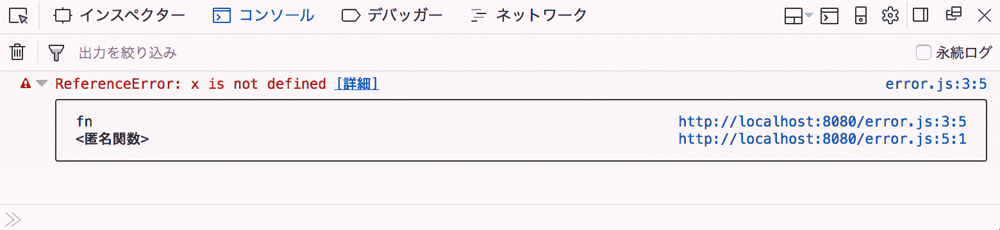
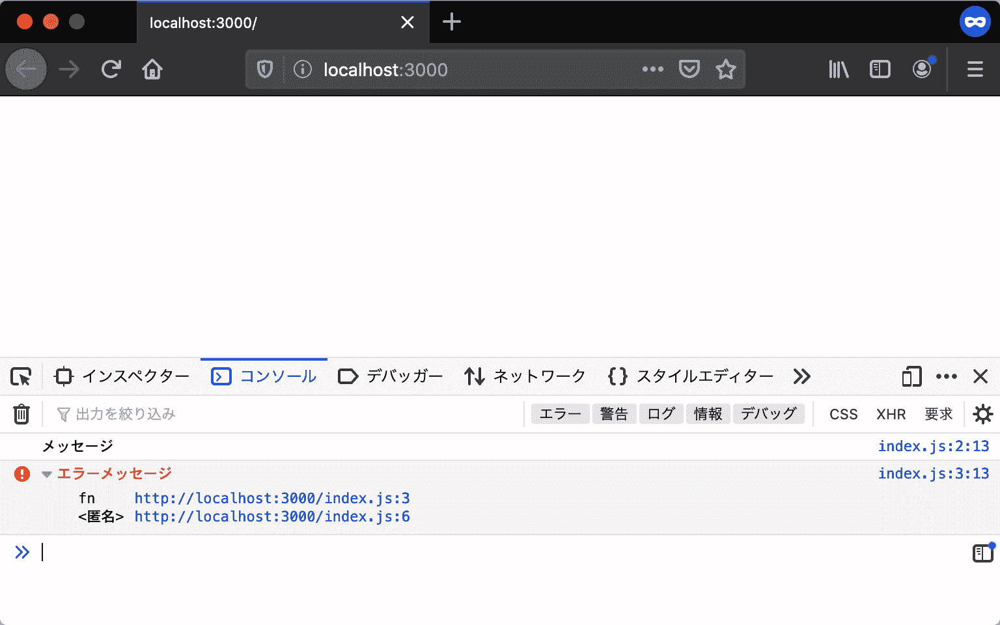
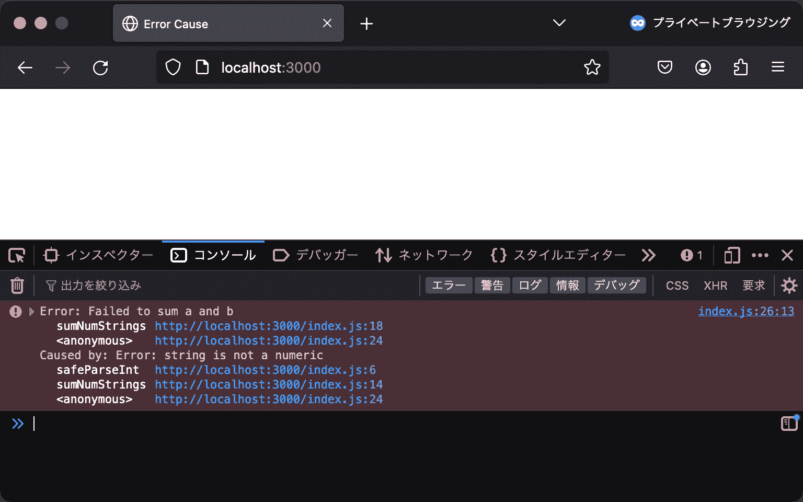

# 例外処理

> 原文：[`jsprimer.net/basic/error-try-catch/`](https://jsprimer.net/basic/error-try-catch/)

この章ではJavaScriptにおける例外処理について学びます。

## [](#try-catch)*try...catch 構文*

*[try...catch](https://developer.mozilla.org/ja/docs/Web/JavaScript/Reference/Statements/try...catch)構文は例外が発生しうるブロックをマークし、例外が発生したときの処理を記述するための構文です。

try...catch 構文の`try`ブロック内で例外が発生すると、`try`ブロック内のそれ以降の処理は実行されず、`catch`節に処理が移行します。 `catch`節は、`try`ブロック内で例外が発生すると、発生したエラーオブジェクトとともに呼び出されます。 `finally`節は、`try`ブロック内で例外が発生したかどうかには関係なく、必ず`try`文の最後に実行されます。

次のコードでは、`try`ブロックで例外が発生し、`catch`節の処理が実行され、最後に`finally`節の処理が実行されます。

```
try {
    console.log("try 節:この行は実行されます");
    // 未定義の関数を呼び出してReferenceError 例外が発生する
    undefinedFunction();
    // 例外が発生したため、この行は実行されません
} catch (error) {
    // 例外が発生したあとはこのブロックが実行される
    console.log("catch 節:この行は実行されます");
    console.log(error instanceof ReferenceError); // => true
    console.log(error.message); // => "undefinedFunction is not defined"
} finally {
    // このブロックは例外の発生に関係なく必ず実行される
    console.log("finally 節:この行は実行されます");
} 
```

また、`catch`節と`finally`節のうち、片方が存在していれば、もう片方の節は省略できます。 `finally`節のみを書いた場合は例外がキャッチされないため、`finally`節を実行後に例外が発生します。

```
// catch 節のみ
try {
    undefinedFunction();
} catch (error) {
    console.error(error);
}
// finally 節のみ
try {
    undefinedFunction();
} finally {
    console.log("この行は実行されます");
}
// finally 節のみでは例外がキャッチされないため、この行は実行されません 
```

## [](#throw)*throw 文*

*[throw](https://developer.mozilla.org/ja/docs/Web/JavaScript/Reference/Statements/throw)文を使うとユーザーが例外を投げることができます。 例外として投げられたオブジェクトは、`catch`節で関数の引数のようにアクセスできます。 `catch`節でオブジェクトを参照できる識別子を[例外識別子](https://developer.mozilla.org/ja/docs/Web/JavaScript/Reference/Statements/try...catch#The_exception_identifier)と呼びます。

次のコードでは、`catch`節の`error`識別子でキャッチしたエラーオブジェクトを参照しています。

```
try {
    // 例外を投げる
    throw new Error("例外が投げられました");
} catch (error) {
    // catch 節のスコープでerrorにアクセスできる
    console.log(error.message); // => "例外が投げられました"
} 
```

## [](#error-object)*エラーオブジェクト*

*`throw`文ではエラーオブジェクトを例外として投げることができます。 ここでは、`throw`文で例外として投げられるエラーオブジェクトについて見ていきます。

### [](#error)*Error*

*`Error`オブジェクトのインスタンスは`new Error("エラーメッセージ")`で作成します。 コンストラクタの第一引数には、エラーメッセージとなる文字列を渡します。 渡したエラーメッセージはErrorの`message`プロパティで参照できます。

次のコードでは、`assertPositiveNumber`関数でエラーオブジェクトを作成し、例外として`throw`しています。 投げられたオブジェクトはcatch 節の例外識別子（`error`）から取得でき、エラーメッセージが確認できます。

```
// 渡された数値が0 以上ではない場合に例外を投げる関数
function assertPositiveNumber(num) {
    if (num < 0) {
        throw new Error(`${num} is not positive.`);
    }
}

try {
    // 0 未満の値を渡しているので、関数が例外を投げる
    assertPositiveNumber(-1);
} catch (error) {
    console.log(error instanceof Error); // => true
    console.log(error.message); // => "-1 is not positive."
} 
```

`throw`文はあらゆるオブジェクトを例外として投げられますが、基本的に`Error`オブジェクトのインスタンスを投げることを推奨します。 その理由は後述する**スタックトレース**のためです。 `Error`オブジェクトはインスタンスの作成時に、そのインスタンスが作成されたファイル名や行数などのデバッグに役立つ情報を持っています。 文字列のような`Error`オブジェクトではないオブジェクトを投げてしまうと、スタックトレースが得られません。

そのため、次のように`throw`文で`Error`オブジェクトではないものを投げるのは非推奨です。

```
// 文字列を例外として投げるアンチパターンの例
try {
    throw "例外が投げられました";
} catch (error) {
    // catch 節の例外識別子は、投げられた値を参照する
    console.log(error); // => "例外が投げられました"
} 
```

### [](#built-in-error)*ビルトインエラー*

*エラーには状況に合わせたいくつかの種類があり、これらはビルトインエラーとして定義されています。 ビルトインエラーとは、ECMAScript 仕様や実行環境に組み込みで定義されているエラーオブジェクトです。 ビルトインエラーとして投げられるエラーオブジェクトは、すべて`Error`オブジェクトを継承したオブジェクトのインスタンスです。 そのため、ユーザーが定義したエラーと同じように例外処理できます。

ビルトインエラーにはいくつか種類がありますが、ここでは代表的なものを紹介します。

#### [](#reference-error)*ReferenceError*

*[ReferenceError](https://developer.mozilla.org/ja/docs/Web/JavaScript/Reference/Global_Objects/ReferenceError)は存在しない変数や関数などの識別子が参照された場合のエラーです。 次のコードでは、存在しない変数を参照しているため`ReferenceError`例外が投げられます。

```
try {
    // 存在しない変数を参照する
    console.log(x);
} catch (error) {
    console.log(error instanceof ReferenceError); // => true
    console.log(error.name); // => "ReferenceError"
    console.log(error.message); // エラーメッセージが表示される
} 
```

#### [](#syntax-error)*SyntaxError*

*[SyntaxError](https://developer.mozilla.org/ja/docs/Web/JavaScript/Reference/Global_Objects/SyntaxError)は構文的に不正なコードを解釈しようとした場合のエラーです。 基本的に`SyntaxError`例外は、JavaScriptを実行する前のパース段階で発生します。 そのため、実行前に発生する例外である`SyntaxError`は、実行時のエラーをキャッチする`try...catch`文ではcatchできません。

```
// JavaScriptとして正しくない構文をパースするとSyntaxErrorが発生する
foo! bar! 
```

次のコードでは、`eval`関数を使って実行時に`SyntaxError`を無理やり発生させ、構文エラーが`SyntaxError`であることを確認しています。 `eval`関数は渡した文字列をJavaScriptとして実行する関数です。 実行時に発生した`SyntaxError`は、`try...catch`文でもcatchできます。

```
try {
    // eval 関数は渡した文字列をJavaScriptとして実行する関数
    // 正しくない構文をパースさせ、SyntaxErrorを実行時に発生させる
    eval("foo! bar!");
} catch (error) {
    console.log(error instanceof SyntaxError); // => true
    console.log(error.name); // => "SyntaxError"
    console.log(error.message); // エラーメッセージが表示される
} 
```

#### [](#type-error)*TypeError*

*[TypeError](https://developer.mozilla.org/ja/docs/Web/JavaScript/Reference/Global_Objects/TypeError)は値が期待される型ではない場合のエラーです。 次のコードでは、関数ではないオブジェクトを関数呼び出ししているため、`TypeError`例外が投げられます。

```
try {
    // 関数ではないオブジェクトを関数として呼び出す
    const fn = {};
    fn();
} catch (error) {
    console.log(error instanceof TypeError); // => true
    console.log(error.name); // => "TypeError"
    console.log(error.message); // エラーメッセージが表示される
} 
```

### [](#throw-built-in-error)*ビルトインエラーを投げる*

*可以创建内置错误的实例，并将该实例作为异常抛出。与普通的`Error`对象一样，可以通过`new`每个内置错误对象来创建实例。

例如，如果要限制函数参数为字符串，可以抛出`TypeError`异常。即使不查看消息，仅凭错误名称就可以立即了解与类型相关的异常。

```
// 文字列を反転する関数
function reverseString(str) {
    if (typeof str !== "string") {
        throw new TypeError(`${str} is not a string`);
    }
    return Array.from(str).reverse().join("");
}

try {
    // 数値を渡す
    reverseString(100);
} catch (error) {
    console.log(error instanceof TypeError); // => true
    console.log(error.name); // => "TypeError"
    console.log(error.message); // => "100 is not a string"
} 
```

## [](#error-and-debug)*错误和调试*

*在 JavaScript 开发中，理解调试过程中发生的错误非常重要。通过利用错误提供的信息，可以了解源代码中发生异常的位置和类型。

所有错误都是由扩展自`Error`对象的对象声明的。也就是说，错误具有表示名称的`name`属性和表示内容的`message`属性。通过检查这两个属性，可以在许多情况下提供开发帮助。

在下面的代码中，未包含在`try...catch`块中的部分发生了异常。

```
function fn() {
    // 存在しない変数を参照する
    x++;
}
fn(); 
```

加载此脚本后，控制台将输出有关抛出异常的日志。以下是 Firefox 中的执行示例。



此错误日志包含以下信息。

| 消息 | 含义 |
| --- | --- |
| `ReferenceError: x is not defined` | 错误类型为`ReferenceError`，表示`x`未定义。 |
| `error.js:3:5` | 异常发生在`error.js`的第 3 行第 5 列。也就是`x++;`。 |

此外，消息后面还显示了异常的堆栈跟踪。堆栈跟踪记录了程序执行过程，指出了哪些处理导致错误。

+   堆栈跟踪的第一行是实际发生异常的位置。也就是说，在第 3 行的 `x++;` 发生了异常

+   接下来的行记录了该代码的调用者。也就是说，执行第 3 行代码的是第 5 行的`fn`函数调用

堆栈跟踪记录了调用者的信息。

控制台显示的错误日志包含大量信息。MDN 的[JavaScript 错误参考](https://developer.mozilla.org/ja/docs/Web/JavaScript/Reference/Errors)详细列出了浏览器抛出的内置错误类型和消息。在开发过程中遇到内置错误时，查阅参考以寻找解决方法是一个好习惯。

## [](#console.error)*`console.error`和堆栈跟踪*

*`console.error`方法可以将消息与堆栈跟踪一起输出到控制台。

运行以下代码，比较`console.log`和`console.error`的输出结果。

```
function fn() {
    console.log("メッセージ");
    console.error("エラーメッセージ");
}

fn(); 
```

在 Firefox 中运行此代码，控制台输出将如下图所示。



`console.log`只有消息，而`console.error`除了消息外还输出堆栈跟踪。因此，在控制台输出错误消息时，使用`console.error`可以更容易进行调试。

此外，大多数浏览器都提供了过滤`console.log`和`console.error`输出的功能。通过使用`console.log`进行普通日志输出，使用`console.error`进行与错误相关的日志输出，可以更容易区分日志的重要性。

## [](#error-cause)*[ES2022] 错误原因*

*通过捕获错误并重新抛出带有新消息的另一个错误，可以提供有用的调试信息。通过创建新的 Error 对象并抛出来实现。但是，这种方法会导致原始错误的堆栈跟踪丢失。

```
function somethingWork() {
    throw new Error("本来のエラー");
}

try {
    somethingWork();
} catch (error) {
    // `error` が持っていたスタックトレースが失われるため、実際にエラーが発生した場所がわからなくなる 
    throw new Error("somethingWork 関数でエラーが発生しました");
} 
```

要解决堆栈跟踪丢失的问题，可以使用 ES2022 中引入的 Error 的`cause`选项。在创建新错误对象时，通过将原始错误对象传递给第二个参数的`cause`选项，可以保留原始的堆栈跟踪。

```
// 数値の文字列を受け取り数値を返す関数
// 'text' など数値にはならない文字列を渡された場合は例外を投げられる
function safeParseInt(numStr) {
    const num = Number.parseInt(numStr, 10);
    if (Number.isNaN(num)) {
        throw new Error(`${numStr} is not a numeric`);
    }
    return num;
}

// 数字の文字列を二つ受け取り、合計を返す関数
function sumNumStrings(a, b) {
    try {
        const aNumber = safeParseInt(a);
        const bNumber = safeParseInt(b);
        return aNumber + bNumber;
    } catch (e) {
        throw new Error("Failed to sum a and b", { cause: e });
    }
}

try {
    // 数値にならない文字列 'string' を渡しているので例外が投げられる
    sumNumStrings("string", "2");
} catch (err) {
    console.error(err);
} 
```

加载此脚本后，控制台将输出带有从`sumNumsStrings`到`safeParseInt`抛出的堆栈跟踪的错误日志。以下是 Firefox 中的执行示例。



## [](#conclusion)*总结*

*本章介绍了异常处理和错误对象。

+   `try...catch`语法可以处理`try`块中发生的异常

+   `catch`块和`finally`块可以同时或单独编写

+   `throw`语句可以抛出异常，将`Error`对象作为异常抛出

+   `Error`对象包含了在 ECMAScript 规范和执行环境中定义的内置错误

+   `Error`对象中记录了堆栈跟踪，对调试非常有用

+   使用 Error Cause，可以创建一个新错误，继承另一个错误的堆栈跟踪*************
