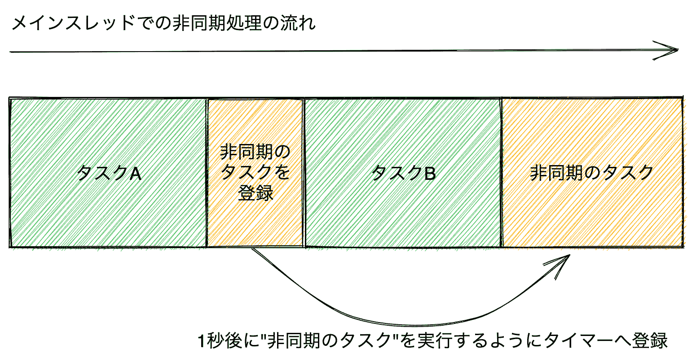
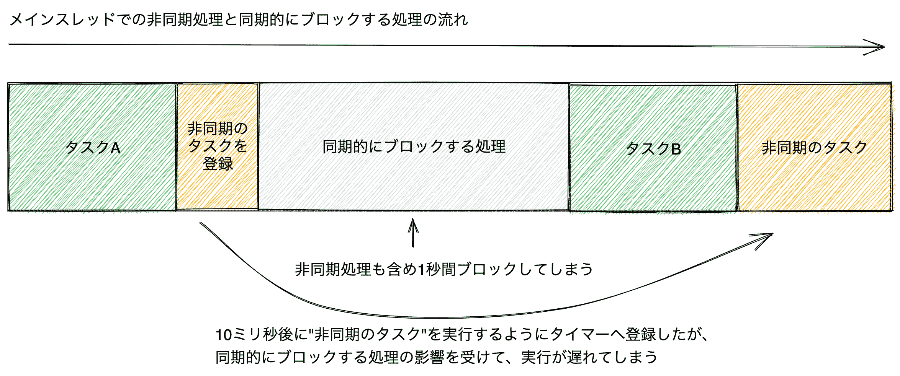
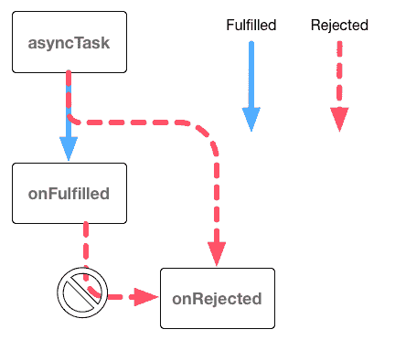
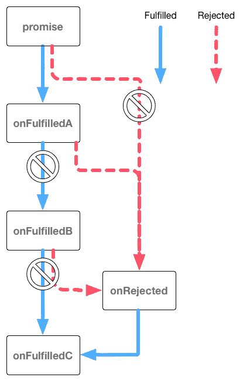

# 非同期処理:Promise/Async Function

> 原文：[`jsprimer.net/basic/async/`](https://jsprimer.net/basic/async/)

この章ではJavaScriptの非同期処理について学んでいきます。 非同期処理はJavaScriptにおけるとても重要な概念です。 また、ブラウザやNode.jsなどのAPIには非同期処理でしか扱えないものもあるため、非同期処理を避けることはできません。 JavaScriptには非同期処理を扱うためのPromiseというビルトインオブジェクト、さらにはAsync Functionと呼ばれる構文的なサポートがあります。

この章では非同期処理とはどのようなものかという話から、非同期処理での例外処理、非同期処理の扱い方を見ていきます。

## [](#sync-processing)*同期処理*

*多くのプログラミング言語にはコードの評価の仕方として、**同期処理**（sync）と**非同期処理**（async）という大きな分類があります。

今まで書いていたコードは**同期処理**と呼ばれているものです。 同期処理ではコードを順番に処理していき、ひとつの処理が終わるまで次の処理は行いません。 同期処理では実行している処理はひとつだけとなるため、とても直感的な動作となります。

一方、同期的にブロックする処理が行われていた場合には問題があります。 同期処理ではひとつの処理が終わるまで、次の処理へ進むことができないためです。

次のコードの`blockTime`関数は指定した`timeout`ミリ秒だけ無限ループを実行し、同期的にブロックする処理です。 `timeout`ミリ秒経過したかの判定には、無限ループの中でUnix 時間（1970 年 1 月 1 日午前 0 時 0 分 0 秒から経過した時間）のミリ秒を返す`Date.now`メソッドを利用しています。 この`blockTime`関数を呼び出すと、指定時間が経過するまで次の処理（タスクB）は呼ばれません。

```
function taskA() {
    console.log("タスクAを実行 at " + Date.now());
}
function taskB() {
    console.log("タスクBを実行 at " + Date.now());
}
// 指定した`timeout`ミリ秒経過するまで同期的にブロックする関数
function blockTime(timeout) {
    // Date.now()は現在の時間をUnix 時間（1970 年 1 月 1 日午前 0 時 0 分 0 秒から経過した時間）のミリ秒を返す
    const startTime = Date.now();
    // `timeout`ミリ秒経過するまで無限ループをする
    while (true) {
        const diffTime = Date.now() - startTime;
        if (diffTime >= timeout) {
            return; // 指定時間経過したら関数の実行を終了
        }
    }
}
taskA();
blockTime(1000); // 他の処理を1000ミリ秒（1 秒間）ブロックする
taskB(); 
```

同期的にブロックする処理があると、ブラウザでは大きな問題となります。 なぜなら、JavaScriptは基本的にブラウザのメインスレッド（UIスレッドとも呼ばれる）で実行されるためです。 メインスレッドは表示の更新といったUIに関する処理も行っています。 そのため、メインスレッドがJavaScriptの処理で専有されると、表示が更新されなくなりフリーズしたようになります。


先ほどの例では1 秒間も処理をブロックしているため、1 秒間スクロールなどの操作が効かないといった悪影響がでます。

## [](#async-processing)*非同期処理*

*非同期処理はコードを順番に処理していきますが、ひとつの非同期処理が終わるのを待たずに次の処理を評価します。 つまり、非同期処理では同時に実行している処理が複数あります。

JavaScriptにおいて非同期処理の代表的な関数として`setTimeout`関数があります。 `setTimeout`関数は`delay`ミリ秒後に、`コールバック関数`を呼び出すようにタイマーへ登録する非同期処理です。

```
setTimeout(コールバック関数, delay); 
```

次のコードでは、見た目上はタスクA → 非同期のタスク → タスクBという流れになっています。 しかし、`setTimeout`関数を使い、非同期のタスクは1000ミリ秒（1 秒）後に実行するようにタイマーへ登録しています。 そのため、実際にはタスクA → タスクB → 非同期のタスクという順番で実行されます。

```
function taskA() {
    console.log("タスクAを実行 at " + Date.now());
}
function taskB() {
    console.log("タスクBを実行 at " + Date.now());
}
function taskAsync() {
    console.log("非同期のタスクを実行 at " + Date.now());
}

taskA();
setTimeout(() => {
    taskAsync();
}, 1000);
taskB(); 
```

このように、非同期処理（`setTimeout`のコールバック関数）は、コードの見た目上の並びとは異なる順番で実行されることがわかります。



## [](#async-and-main-thread)*非同期処理はメインスレッドで実行される*

*メインスレッドはUIスレッドとも呼ばれ、重たいJavaScriptの同期処理はメインスレッドで実行する他の処理（画面の更新など）をブロックする問題につい���紹介しました。 これは非同期処理においても同様の問題があります。なぜならJavaScriptにおける非同期処理の大部分はメインスレッドで実行されるためです。

非同期処理は名前から考えるとメインスレッド以外で実行されるように見えますが、 基本的には非同期処理も同期処理と同じようにメインスレッドで実行されます。 このセクションでは非同期処理がどのようにメインスレッドで実行されているかを簡潔に見ていきます。

次のコードは、`setTimeout`関数でタイマーに登録したコールバック関数が呼ばれるまで、実際にどの程度の時間がかかったかを計測しています。 `setTimeout`関数で10ミリ秒後に非同期のタスクを実行するように登録し、その直後に1 秒間を同期的にブロックする処理を呼び出しています。 このコードを実行してみると、同期的にブロックする処理により、非同期のタスクはタイマーに登録した時間（10ミリ秒後）よりも大きく遅れて呼び出されます。

```
function taskA() {
    console.log("タスクAを実行 at " + Date.now());
}
function taskB() {
    console.log("タスクBを実行 at " + Date.now());
}
function taskAsync() {
    console.log("非同期のタスクを実行 at " + Date.now());
}
// 指定した`timeout`ミリ秒経過するまで同期的にブロックする関数
function blockTime(timeout) {
    const startTime = Date.now();
    while (true) {
        const diffTime = Date.now() - startTime;
        if (diffTime >= timeout) {
            return; // 指定時間経過したら関数の実行を終了
        }
    }
}

const startTime = Date.now();
taskA();
// 10ミリ秒後にコールバック関数を呼び出すようにタイマーに登録する
setTimeout(() => {
    const endTime = Date.now();
    taskAsync();
    console.log(`非同期処理のコールバックが呼ばれるまで${endTime - startTime}ミリ秒かかりました`);
}, 10);
blockTime(1000); // 1 秒間処理をブロックする
taskB(); 
```

非同期処理（`setTimeout`のコールバック関数）がメインスレッド以外のスレッドで実行されるならば、 この非同期処理はメインスレッドで同期的にブロックする処理の影響を受けないはずです。 しかし、実際にはこの非同期処理もメインスレッドで実行された同期的にブロックする処理の影響を受けます。

多くの環境では、このときの非同期処理のコールバック関数が呼ばれるまでは1 秒以上かかります。 これは、10ミリ秒後に非同期のコールバック関数を実行するようにタイマーへ登録自体はできていますが、同期的にブロックする処理によって非同期のタスクの実行も後ろにずれてしまうためです。 このように**非同期処理**も**同期���理**の影響を受けることから、同じメインスレッドで実行されていることがわかります。



JavaScriptでは一部の例外を除き非同期処理が**並行処理（Concurrent）**として扱われます。 並行処理とは、処理を一定の単位ごとに分けて処理を切り替えながら実行することです。 そのため非同期処理の実行前にとても重たい処理があると、非同期処理の実行が遅れるという現象を引き起こします。

ただし、非同期処理の中にもメインスレッドとは別のスレッドで実行できるAPIが実行環境によっては存在します。 たとえばブラウザでは[Web Worker](https://developer.mozilla.org/ja/docs/Web/API/Web_Workers_API/Using_web_workers) APIを使い、メインスレッド以外でJavaScriptを実行できます。 このWeb Workerにおける非同期処理は**並列処理（Parallel）**です。 並列処理とは、排他的に複数の処理を同時に実行することです。

Web Workerではメインスレッドとは異なるWorkerスレッドで実行されるため、Workerスレッド内で同期的にブロックする処理を実行してもメインスレッドは影響を受けにくくなります。 ただし、Web Workerとメインスレッドでのデータのやり取りには`postMessage`というメソッドを利用する必要があります。 そのため、重たい処理をWorkerに移動できるというメリットはありますが、メインスレッドとWorkerスレッドのデータのやり取りに制限があるというトレードオフの関係になります。

このように、非同期処理のすべてをひとくくりにはできませんが、基本的な非同期処理（タイマーなど）はメインスレッドで実行されているという性質を知ることは大切です。JavaScriptの大部分の**非同期処理**は**非同期的なタイミングで実行される処理**であると理解しておく必要があります。 この書籍で紹介する非同期処理のほとんどは、メインスレッドで処理を切り替えながら実行する**並行処理（Concurrent）**となっています。

## [](#async-processing-and-error-handling)*非同期処理と例外処理*

*非同期処理は処理の流れが同期処理とは異なることについて紹介しました。 これは非同期処理における**例外処理**においても大きな影響を与えます。

同期処理では、`try...catch`構文を使うことで同期的に発生した例外がキャッチできます（詳細は「例外処理」の章を参照）。

```
try {
    throw new Error("同期的なエラー");
} catch (error) {
    console.log("同期的なエラーをキャッチできる");
}
console.log("この行は実行されます"); 
```

非同期処理では、`try...catch`構文を使っても非同期的に発生した例外をキャッチできません。 次のコードでは、10ミリ秒後に非同期的なエラーを発生させています。 しかし、`try...catch`構文では次のような非同期エラーをキャッチできません。

```
try {
    setTimeout(() => {
        throw new Error("非同期的なエラー");
    }, 10);
} catch (error) {
    // 非同期エラーはキャッチできないため、この行は実行されません
}
console.log("この行は実行されます"); 
```

`try`ブロックはそのブロック内で発生した例外をキャッチする構文です。 しかし、`setTimeout`関数で登録されたコールバック関数が実際に実行されて例外を投げるのは、すべての同期処理が終わった後となります。 つまり、`try`ブロックで例外が発生しうるとマークした**範囲外**で例外が発生します。

そのため、`setTimeout`関数のコールバック関数における例外は、次のようにコールバック関数内で同期的なエラーとしてキャッチする必要があります。

```
// 非同期処理の外
setTimeout(() => {
    // 非同期処理の中
    try {
        throw new Error("エラー");
    } catch (error) {
        console.log("エラーをキャッチできる");
    }
}, 10);
console.log("この行は実行されます"); 
```

このようにコールバック関数内でエラーをキャッチできますが、**非同期処理の外**からは**非同期処理の中**で例外が発生したかがわかりません。 非同期処理の外から例外が起きたことを知るためには、非同期処理の中で例外が発生したことを非同期処理の外へ伝える方法が必要です。

また、JavaScriptでのHTTPリクエストやファイルの読み書きといった処理も非同期処理のAPIとして提供されています。 これらの非同期処理はネットワークにつながっていない場合やファイルが存在しない場合などには失敗します。 そのため、非同期処理における例外の扱い方（エラーハンドリング）は、極めて重要になります。

非同期処理で発生した例外の扱い方についてはさまざまなパターンがあります。 この章では主要な非同期処理と例外の扱い方として、主にPromise、Async Functionの2つを見ていきます。

Async FunctionはPromiseの上に成り立っている構文です。 そのため、どちらか片方ではなく両方とも理解することが重要です。

## [](#promise)*[ES2015] Promise*

*[Promise](https://developer.mozilla.org/ja/docs/Web/JavaScript/Reference/Global_Objects/Promise)はES2015で導入された非同期処理の状態や結果を表現するビルトインオブジェクトです。 非同期処理はPromiseのインスタンスを返し、そのPromiseインスタンスには状態変化をした際に呼び出されるコールバック関数を登録できます。

次のコードは、Promiseを扱う非同期処理を行う例です。

+   非同期処理をする部分（`asyncPromiseTask`関数）: Promiseのインスタンスを返す

+   非同期処理の結果を扱う部分: Promiseのインスタンスを受け取り、成功時の処理と失敗時の処理をコールバック関数で登録する

```
// asyncPromiseTask 関数は、Promiseインスタンスを返す
function asyncPromiseTask() {
    return new Promise((resolve, reject) => {
        // さまざまな非同期処理を行う
        // 非同期処理に成功した場合は、resolveを呼ぶ
        // 非同期処理に失敗した場合は、rejectを呼ぶ
    });
}
// asyncPromiseTask 関数の非同期処理が成功した時、失敗した時に呼ばれる処理をコールバック関数として登録する
asyncPromiseTask().then(()=> {
    // 非同期処理が成功したときの処理
}).catch(() => {
    // 非同期処理が失敗したときの処理
}); 
```

`asyncPromiseTask`関数は、`Promise`というビルトインオブジェクトのインスタンスを返しています。 `Promise`インスタンスは、`asyncPromiseTask`関数内で行った非同期処理が成功したか失敗したかの状態を表すオブジェクトです。 また、この`Promise`インスタンスに対して、`then`や`catch`メソッドで成功時や失敗時に呼び出される処理をコールバック関数として登録することで、非同期処理の結果を扱えます。

Promiseに慣れるまで少しややこしいように見えますが、Promiseは非同期処理の状態や結果をラップしたようなオブジェクトです。 同期的な関数では関数を実行するとすぐ結果がわかりますが、非同期な関数では関数を実行してもすぐには結果がわかりません。 そのため、非同期な関数はPromiseという非同期処理の状態をラップしたオブジェクトを返し、その結果が決まったら登録しておいたコールバック関数へ結果を渡すという仕組みになっています。

実際に`Promise`の使い方をみていき��す。

### [](#promise-instance)*`Promise`インスタンスの作成*

*Promiseは`new`演算子で`Promise`のインスタンスを作成して利用します。 このときのコンストラクタには`resolve`と`reject`の2つの引数を取る`executor`と呼ばれる関数を渡します。 `executor`関数の中で非同期処理を行い、非同期処理が成功した場合は`resolve`関数を呼び、失敗した場合は`reject`関数を呼び出します。

```
const executor = (resolve, reject) => {
    // 非同期の処理が成功したときはresolveを呼ぶ
    // 非同期の処理が失敗したときはrejectを呼ぶ
};
const promise = new Promise(executor); 
```

使用此`Promise`实例的`then`方法，您可以注册在 Promise`resolve`（成功）或`reject`（失败）时调用的回调函数。 将成功时的回调函数传递给`then`方法的第一个参数，将失败时的回调函数传递给`then`方法的第二个参数。

```
// `Promise`インスタンスを作成
const promise = new Promise((resolve, reject) => {
    // 非同期の処理が成功したときはresolve()を呼ぶ
    // 非同期の処理が失敗したときにはreject()を呼ぶ
});
const onFulfilled = () => {
    console.log("resolveされたときに呼ばれる");
};
const onRejected = () => {
    console.log("rejectされたときに呼ばれる");
};
// `then`メソッドで成功時と失敗時に呼ばれるコールバック関数を登録
promise.then(onFulfilled, onRejected); 
```

`Promise`构造函数的`resolve`和`reject`，以及`then`方法的`onFulfilled`和`onRejected`之间有如下关系。

+   当`resolve`（成功）时

    +   将调用`onFulfilled`。

+   当发生`reject`（失败）时

    +   将调用`onRejected`

### [](#promise-then-and-catch)*`Promise.prototype.then` and `Promise.prototype.catch`*

*因为以前没有像 Promise 这样将函数传递给构造函数的模式，所以我们将介绍具体的`then`方法用法示例。 同时，我们还将研究作为`then`方法别名的`catch`方法。

下面的代码中的`dummyFetch`函数创建并返回一个`Promise`实例。 如果成功获取资源，则调用`resolve`函数；如果失败，则调用`reject`函数。

传递给`resolve`的值将传递给`then`方法的第一个回调函数（`onFulfilled`）。 传递给`reject`的错误对象将传递给`then`方法的第二个回调函数（`onRejected`）。

```
/**
 * 1000ミリ秒未満のランダムなタイミングでレスポンスを疑似的にデータ取得する関数
 * 指定した`path`にデータがある場合、成功として**Resolved**状態のPromiseオブジェクトを返す
 * 指定した`path`にデータがない場合、失敗として**Rejected**状態のPromiseオブジェクトを返す
 */
function dummyFetch(path) {
    return new Promise((resolve, reject) => {
        setTimeout(() => {
            if (path.startsWith("/success")) {
                resolve({ body: `Response body of ${path}` });
            } else {
                reject(new Error("NOT FOUND"));
            }
        }, 1000 * Math.random());
    });
}
// `then`メソッドで成功時と失敗時に呼ばれるコールバック関数を登録
// /success/data のリソースは存在するので成功しonFulfilledが呼ばれる
dummyFetch("/success/data").then(function onFulfilled(response) {
    console.log(response); // => { body: "Response body of /success/data" }
}, function onRejected(error) {
    // この行は実行されません
});
// /failure/data のリソースは存在しないのでonRejectedが呼ばれる
dummyFetch("/failure/data").then(function onFulfilled(response) {
    // この行は実行されません
}, function onRejected(error) {
    console.error(error); // Error: "NOT FOUND"
}); 
```

Promise 的`then`方法接受两个回调函数参数：成功（`onFulfilled`）和失败（`onRejected`），但两者都可以省略。

下面的代码中的`delay`函数返回一个在一定时间后解决（`resolve`）的`Promise`实例。 在这个`Promise`实例上，仅注册了**成功时的回调函数**。

```
function delay(timeoutMs) {
    return new Promise((resolve) => {
        setTimeout(() => {
            resolve();
        }, timeoutMs);
    });
}
// `then`メソッドで成功時のコールバック関数だけを登録
delay(10).then(() => {
    console.log("10ミリ秒後に呼ばれる");
}); 
```

另一方面，`then`方法也可以仅注册失败时的回调函数。 在这种情况下，第一个参数应传递`undefined`，如`then(undefined, onRejected)`。 Promise 提供了`catch`方法，作为执行类似操作的替代方法，即`then(undefined, onRejected)`。

在下面的代码中，我们使用`then`方法和`catch`方法处理失败的错误，但两者的含义相同。 由于向`then`方法传递`undefined`不够直观，因此建议仅在注册失败处理时使用`catch`方法。

```
function errorPromise(message) {
    return new Promise((resolve, reject) => {
        reject(new Error(message));
    });
}
// 非推奨: `then`メソッドで失敗時のコールバック関数だけを登録
errorPromise("thenでエラーハンドリング").then(undefined, (error) => {
    console.log(error.message); // => "thenでエラーハンドリング"
});
// 推奨: `catch`メソッドで失敗時のコールバック関数を登録
errorPromise("catchでエラーハンドリング").catch(error => {
    console.log(error.message); // => "catchでエラーハンドリング"
}); 
```

### [](#promise-exception)*Promise and Exceptions*

*如果在构造函数中发生异常，则会自动捕获异常。 发生异常的`Promise`实例将被视为失败，就像调用`reject`函数一样。 因此，如果 Promise 内部发生异常，则将调用`then`方法的第二个参数或`catch`方法中注册的错误处理回调函数。

```
function throwPromise() {
    return new Promise((resolve, reject) => {
        // Promiseコンストラクタの中で例外は自動的にキャッチされrejectを呼ぶ
        throw new Error("例外が発生");
        // 例外が発生すると、これ以降のコンストラクタの処理は実行されません
    });
}

throwPromise().catch(error => {
    console.log(error.message); // => "例外が発生"
}); 
```

因此，在 Promise 处理中，无需使用`try...catch`语法，自动捕获异常。

### [](#promise-status)*Promise 的状态*

*现在我们已经了解了 Promise 的`then`方法和`catch`方法的处理方式，接下来我们将整理一下`Promise`实例的状态。

`Promise`实例内部实际上有三种状态。

+   **Fulfilled**

    +   当`resolve`（成功）时的状态。 这时将调用`onFulfilled`。

+   **Rejected**

    +   当发生`reject`（失败）或异常时的状态。 这时将调用`onRejected`。

+   **Pending**

    +   不是 Fulfilled 或 Rejected 的状态

    +   创建 Promise 实例时的初始状态

这些状态是 ECMAScript 规范中确定的内部状态。 但是，没有方法从 Promise 实例中获取这些状态。 因此，虽然不能直接处理此状态作为 API，但可以帮助理解 Promise。

Promise 实例的状态在创建时为**Pending**，一旦变为**Fulfilled**或**Rejected**，状态就不会再改变。 因此，将状态更改为**Fulfilled**或**Rejected**后，它将被称为**Settled**（已解决）。

一旦`Promise`实例变为**Settled**（**Fulfilled**或**Rejected**），它将不会再转换为其他状态。 因此，即使在调用`resolve`后调用`reject`，该`Promise`实例仍将保持最初的**Fulfilled**状态。

在下面的代码中，由于状态不会更改，因此不会调用注册的 onRejected 回调函数。 使用`then`方法注册的回调函数仅在状态更改时调用一次。

```
const promise = new Promise((resolve, reject) => {
    // 非同期でresolveする
    setTimeout(() => {
        resolve();
        // すでにresolveされているため無視される
        reject(new Error("エラー"));
    }, 16);
});
promise.then(() => {
    console.log("Fulfilledとなった");
}, (error) => {
    // この行は呼び出されない
}); 
```

同样，`Promise`构造函数内部多次调用`resolve`也不会改变`Promise`实例的状态。 因此，即使多次调用`resolve`，`then`方法注册的回调函数也只会被调用一次。

```
const promise = new Promise((resolve, reject) => {
    setTimeout(() => {
        resolve();
        resolve(); // 二度目以降のresolveやrejectは無視される
    }, 16);
});
promise.then(() => {
    console.log("最初のresolve 時に一度だけ呼ばれる");
}, (error) => {
    // この行は呼び出されない
}); 
```

当`Promise`实例的状态更改时，您可以注册一次性回调函数以通过`then`和`catch`方法深入了解。

此外，对于已更改状态的`Promise`实例，甚至可以稍后注册`then`或`catch`方法的回调函数。 对于已更改状态的`Promise`实例，通过`then`或`catch`方法注册的回调函数也会异步地调用。

具体的来说，我们将与已更改状态的`Promise`实例一起查看`Promise.resolve`和`Promise.reject`方法的结果。

### [](#promise-resolve)*`Promise.resolve`*

*`Promise.resolve`メソッドは**Fulfilled**の状態となった`Promise`インスタンスを作成します。

```
const fulfilledPromise = Promise.resolve(); 
```

`Promise.resolve`メソッドは`new Promise`の糖衣構文（シンタックスシュガー）です。 糖衣構文とは、同じ意味の処理を元の構文よりシンプルに書ける別の書き方のことです。 `Promise.resolve`メソッドは次のコードの糖衣構文です。

```
// const fulfilledPromise = Promise.resolve(); と同じ意味
const fulfilledPromise = new Promise((resolve) => {
    resolve();
}); 
```

`Promise.resolve`メソッドは引数に`resolve`される値を渡すこともできます。

```
// `resolve(42)`された`Promise`インスタンスを作成する
const fulfilledPromise = Promise.resolve(42);
fulfilledPromise.then(value => {
    console.log(value); // => 42
}); 
```

`Promise.resolve`メソッドで作成した**Fulfilled**の状態となった`Promise`インスタンスに対しても`then`メソッドでコールバック関数を登録できます。 状態が変化済みの`Promise`インスタンスに`then`メソッドで登録したコールバック関数は、常に非同期なタイミングで実行されます。

次のコードを実行すると、すべての同期的な処理が実行された後に、`then`メソッドのコールバック関数が非同期なタイミングで実行されることがわかります。

```
const promise = Promise.resolve();
promise.then(() => {
    console.log("2\. コールバック関数が実行されました");
});
console.log("1\. 同期的な処理が実行されました"); 
```

`Promise.resolve`メソッドは`new Promise`の糖衣構文であるため、この実行順序は`new Promise`を使った場合も同じです。 次のコードは、先ほどの`Promise.resolve`メソッドを使ったものと同じ動作になります。

```
const promise = new Promise((resolve) => {
    console.log("1\. resolveします");
    resolve();
});
promise.then(() => {
    console.log("3\. コールバック関数が実行されました");
});
console.log("2\. 同期的な処理が実行されました"); 
```

このコードを実行すると、まず`Promise`のコンストラクタ関数が実行され、続いて同期的な処理が実行されます。最後に`then`メソッドで登録していたコールバック関数が非同期的に呼ばれることがわかります。

### [](#promise-reject)*`Promise.reject`*

*`Promise.reject`メソッドは **Rejected**の状態となった`Promise`インスタンスを作成します。

```
const rejectedPromise = Promise.reject(new Error("エラー")); 
```

`Promise.reject`メソッドは`new Promise`の糖衣構文（シンタックスシュガー）です。 そのため、`Promise.reject`メソッドは次のコードと同じ意味になります。

```
const rejectedPromise = new Promise((resolve, reject) => {
    reject(new Error("エラー"));
}); 
```

`Promise.reject`メソッドで作成した**Rejected**状態の`Promise`インスタンスに対しても`then`や`catch`メソッドでコールバック関数を登録できます。 **Rejected**状態へ変化済みの`Promise`インスタンスに登録したコールバック関数は、常に非同期なタイミングで実行されます。これは**Fulfilled**の場合と同様です。

```
Promise.reject(new Error("エラー")).catch(() => {
    console.log("2\. コールバック関数が実行されました");
});
console.log("1\. 同期的な処理が実行されました"); 
```

`Promise.resolve`や`Promise.reject`は短く書けるため、テストコードなどで利用されることがあります。 また、`Promise.reject`は次に解説するPromiseチェーンにおいて、Promiseの状態を操作するのに利用できます。

### [](#promise-chain)*Promiseチェーン*

*Promiseは非同期処理における統一的なインターフェースを提供するビルトインオブジェクトです。 Promiseによる統一的な処理方法は複数の非同期処理を扱う場合に特に効力を発揮します。 これまでは、1つの`Promise`インスタンスに対して`then`や`catch`メソッドで1 組のコールバック処理を登録するだけでした。

非同期処理が終わったら次の非同期処理というように、複数の非同期処理を順番に扱いたい場合もあります。 Promiseではこのような複数の非同期処理からなる一連の非同期処理を簡単に書く方法が用意されています。

この仕組みのキーとなるのが`then`や`catch`メソッドは常に新しい`Promise`インスタンスを作成して返すという仕様です。 そのため`then`メソッドの返り値である`Promise`インスタンスにさらに`then`メソッドで処理を登録できます。 これはメソッドチェーンと呼ばれる仕組みですが、この書籍ではPromiseをメソッドチェーンでつなぐことを**Promiseチェーン**と呼びます（メソッドチェーンは「配列」の章を参照）。

次のコードでは、`then`メソッドでPromiseチェーンをしています。 Promiseチェーンでは、Promiseが失敗（**Rejected**な状態）しない限り、順番に`then`メソッドで登録した成功時のコールバック関数を呼び出します。 そのため、次のコードでは、`1`、`2`と順番にコンソールへログが出力されます。

```
// Promiseインスタンスでメソッドチェーン
Promise.resolve()
    // thenメソッドは新しい`Promise`インスタンスを返す
    .then(() => {
        console.log(1);
    })
    .then(() => {
        console.log(2);
    }); 
```

このPromiseチェーンは、次のコードのように毎回新しい変数に入れて処理をつなげるのと結果的には同じ意味となります。

```
// Promiseチェーンを変数に入れた場合
const firstPromise = Promise.resolve();
const secondPromise = firstPromise.then(() => {
    console.log(1);
});
const thirdPromise = secondPromise.then(() => {
    console.log(2);
});
// それぞれ新しいPromiseインスタンスが作成される
console.log(firstPromise === secondPromise); // => false
console.log(secondPromise === thirdPromise); // => false 
```

もう少し具体的なPromiseチェーンの例を見ていきましょう。

次のコードの`asyncTask`関数はランダムでFulfilledまたはRejected 状態の`Promise`インスタンスを返します。 この関数が返す`Promise`インスタンスに対して、`then`メソッドで成功時の処理を書いています。 `then`メソッドの返り値は新しい`Promise`インスタンスであるため、続けて`catch`メソッドで失敗時の処理を書けます。

```
// ランダムでFulfilledまたはRejectedの`Promise`インスタンスを返す関数
function asyncTask() {
    return Math.random() > 0.5
        ? Promise.resolve("成功")
        : Promise.reject(new Error("失敗"));
}

// asyncTask 関数は新しい`Promise`インスタンスを返す
asyncTask()
    // thenメソッドは新しい`Promise`インスタンスを返す
    .then(function onFulfilled(value) {　
        console.log(value); // => "成功"
    })
    // catchメソッドは新しい`Promise`インスタンスを返す
    .catch(function onRejected(error) {
        console.log(error.message); // => "失敗"
    }); 
```

`asyncTask`関数が成功（resolve）した場合は`then`メソッドで登録した成功時の処理だけが呼び出され、`catch`メソッドで登録した失敗時の処理は呼び出されません。 一方、`asyncTask`関数が失敗（reject）した場合は`then`メソッドで登録した成功時の処理は呼び出されずに、`catch`メソッドで登録した失敗時の処理だけが呼び出されます。

先ほどのコードにおけるPromiseの状態とコールバック関数は次のような処理の流れとなります。



Promiseの状態が**Rejected**となった場合は、もっとも近い失敗時の処理（`catch`または`then`の第二引数）が呼び出されます。 このとき間にある成功時の処理（`then`の第一引数）はスキップされます。

次のコードでは、**Rejected**のPromiseに対して`then` → `then` → `catch`とPromiseチェーンで処理を記述しています。 このときもっとも近い失敗時の処理（`catch`）が呼び出されますが、間にある2つの成功時の処理（`then`）は実行されません。

```
// RejectedなPromiseは次の失敗時の処理までスキップする
const rejectedPromise = Promise.reject(new Error("失敗"));
rejectedPromise.then(() => {
    // このthenのコールバック関数は呼び出されません
}).then(() => {
    // このthenのコールバック関数は呼び出されません
}).catch(error => {
    console.log(error.message); // => "失敗"
}); 
```

与 Promise 构造函数处理相同，`then`或`catch`中发生的异常将自动捕获。 当发生异常时，`then`或`catch`方法将返回**Rejected**的`Promise`实例。 因此，当发生异常时，将调用最接近的失败处理（`catch`或`then`的第二个参数）。

```
Promise.resolve().then(() => {
    // 例外が発生すると、thenメソッドはRejectedなPromiseを返す
    throw new Error("例外");
}).then(() => {
    // このthenのコールバック関数は呼び出されません
}).catch(error => {
    console.log(error.message); // => "例外"
}); 
```

此外，一旦在 Promise 链中使用`catch`方法捕获失败，下一步调用的是成功处理。 这是因为`then`和`catch`方法返回的是**Fulfilled**状态的 Promise 实例。 因此，一旦捕获，就会返回到使用下一个`then`注册的处理的 Promise 链。

```
Promise.reject(new Error("エラー")).catch(error => {
    console.error(error); // Error: エラー
}).then(() => {
    console.log("thenのコールバック関数が呼び出される");
}); 
```

就这样，通过`then`方法或`catch`方法链接，编写成功或失败的处理被称为 Promise 链。

#### [](#promise-chain-value)*在 Promise 链中返回值*

*在 Promise 链中，可以通过回调返回的值将其传递给下一个回调函数。

`then`和`catch`方法的回调函数可以返回数字、字符串、对象等任意值。 回调函数返回的值将传递给下一个`then`的回调函数作为参数。

```
Promise.resolve(1).then((value) => {
    console.log(value); // => 1
    return value * 2;
}).then(value => {
    console.log(value); // => 2
    return value * 2;
}).then(value => {
    console.log(value); // => 4
    // 値を返さない場合は undefined を返すのと同じ
}).then(value => {
    console.log(value); // => undefined
}); 
```

在这里，我们以`then`方法为基础进行解释，但是`catch`方法是`then`方法的语法糖，因此具有相同的行为。 一旦在 Promise 链中捕获一次，下一步调用的是成功处理。 因此，通过`catch`方法返回的值将作为参数传递给下一个`then`方法的回调函数。

```
Promise.reject(new Error("失敗")).catch(error => {
    // 一度 catchすれば、次に呼ばれるのは成功時のコールバック
    return 1;
}).then(value => {
    console.log(value); // => 1
    return value * 2;
}).then(value => {
    console.log(value); // => 2
}); 
```

#### [](#promise-then-return-promise)*通过回调函数返回`Promise`实例*

*一旦在 Promise 链中捕获一次，下一步调用的是成功处理（`then`方法）。 这是因为，当回调函数返回任意值时，将创建一个以该值解析为**Fulfilled**状态的`Promise`实例。 但是，如果回调函数返回`Promise`实例，则情况就会有所不同。

如果在回调函数中返回`Promise`实例，则`then`或`catch`方法的返回值将是具有相同状态的`Promise`实例。 换句话说，如果在`then`方法中返回**Rejected**状态的`Promise`实例，则下一步调用的是失败处理。

在下面的代码中，`then`方法的回调函数使用`Promise.reject`方法返回了一个**Rejected**的`Promise`实例。 **Rejected**的`Promise`实例会跳过`then`方法的成功处理，直到调用了下一个`catch`方法的失败处理。

```
Promise.resolve().then(function onFulfilledA() {
    return Promise.reject(new Error("失敗"));
}).then(function onFulfilledB() {
    // onFulfilledBは呼び出されません
}).catch(function onRejected(error) {
    console.log(error.message); // => "失敗"
}).then(function onFulfilledC() {
    console.log("onFulfilledCは呼び出されます");
}); 
```

在这段代码中，Promise 的状态和回调函数的处理流程如下所示。



通常情况下，一旦进行了`catch`处理，下一步调用的是成功处理。 使用此`Promise`实例返回机制，即使进行了`catch`处理，也可以保持**Rejected**状态。

在下面的代码中，我们在`catch`方法中输出日志，并使用`Promise.reject`方法返回了一个**Rejected**的`Promise`实例。 这样，我们可以在处理链中保持错误的同时记录错误日志。

```
function main() {
    return Promise.reject(new Error("エラー"));
}
// mainはRejectedなPromiseを返す
main().catch(error => {
    // mainで発生したエラーのログを出力する
    console.error(error);
    // Promiseチェーンはそのままエラーを継続させる
    return Promise.reject(error);
}).then(() => {
    // 前のcatchでRejectedなPromiseが返されたため、この行は実行されません
}).catch(error => {
    console.log("メインの処理が失敗した");
}); 
```

#### [](#promise-finally)*[ES2018] 在 Promise 链的最后写入处理*

*Promise 的`finally`方法允许注册一个回调函数，在成功或失败时都会被调用。 这类似于`try...catch...finally`结构中的`finally`块。

```
// `promise`にはResolvedまたはRejectedなPromiseインスタンスがランダムで入る
const promise = Math.random() < 0.5 ? Promise.resolve() : Promise.reject();
promise.then(() => {
    console.log("Promiseのthenメソッド");
}).catch((error) => {
    console.log("Promiseのcatchメソッド");
}).finally(() => {
    // 成功、失敗どちらの場合でも呼び出される
    console.log("Promiseのfinallyメソッド");
}); 
```

在下面的代码中，我们获取资源并在`then`中注册成功处理，在`catch`中注册失败处理。 此外，我们使用一个名为`isLoading`的变量来管理是否正在获取资源。 无论成功与否，一旦获取完成，`isLoading`都将设置为`false`。 我们可以在`then`和`catch`中都将`false`分配给`isLoading`，但使用`finally`方法可以将分配集中到一个位置。

```
function dummyFetch(path) {
    return new Promise((resolve, reject) => {
        setTimeout(() => {
            if (path.startsWith("/resource")) {
                resolve({ body: `Response body of ${path}` });
            } else {
                reject(new Error("NOT FOUND"));
            }
        }, 1000 * Math.random());
    });
}
// リソースを取得中かどうかのフラグ
let isLoading = true;
dummyFetch("/resource/A").then(response => {
    console.log(response);
}).catch(error => {
    console.error(error);
}).finally(() => {
    isLoading = false;
    console.log("Promiseのfinallyメソッド");
}); 
```

### [](#promise-sequential)*在 Promise 链中进行顺序处理*

*Promise 链中编写异步处理流程的一个主要优点是，它可以适应异步处理的各种模式。

在这里，我们将考虑逐个处理多个异步处理作为一个典型的例子。 使用 Promise 进行顺序处理并不复杂，只需简单地使用`then`连接异步处理即可。

在下面的代码中，我们依次获取 Resource A 和 Resource B。 我们将获取的每个资源添加到变量`results`中，并在所有获取完成后将其输出到控制台。

```
function dummyFetch(path) {
    return new Promise((resolve, reject) => {
        setTimeout(() => {
            if (path.startsWith("/resource")) {
                resolve({ body: `Response body of ${path}` });
            } else {
                reject(new Error("NOT FOUND"));
            }
        }, 1000 * Math.random());
    });
}

const results = [];
// Resource Aを取得する
dummyFetch("/resource/A").then(response => {
    results.push(response.body);
    // Resource Bを取得する
    return dummyFetch("/resource/B");
}).then(response => {
    results.push(response.body);
}).then(() => {
    console.log(results); // => ["Response body of /resource/A", "Response body of /resource/B"]
}); 
```

### [](#promise-all)*使用`Promise.all`将多个 Promise 组合在一起*

*通过使用`Promise.all`，可以将多个 Promise 作为一个 Promise 处理。

`Promise.all`方法接受一个`Promise`实例数组，并返回一个新的`Promise`实例。 如果数组中的所有`Promise`实例都处于**Fulfilled**状态，则返回的`Promise`实例也将处于**Fulfilled**状态。 反之，如果有一个**Rejected**，则返回的`Promise`实例也将处于**Rejected**状态。

通过`then`方法注册的回调函数，将接收到一个包含 Promise 结果的数组。 在这种情况下，数组中的元素顺序与传递给`Promise.all`方法的数组的 Promise 元素的顺序相同。

```
// `timeoutMs`ミリ秒後にresolveする
function delay(timeoutMs) {
    return new Promise((resolve) => {
        setTimeout(() => {
            resolve(timeoutMs);
        }, timeoutMs);
    });
}
const promise1 = delay(1);
const promise2 = delay(2);
const promise3 = delay(3);

Promise.all([promise1, promise2, promise3]).then(function(values) {
    console.log(values); // => [1, 2, 3]
}); 
```

在前面的 Promise 链中，获取资源的例子是逐步进行的，先获取资源 A，然后获取资源 B。但是，如果无论是先获取资源 A 还是 B 都没有问题，那么可以使用`Promise.all`方法将多个 Promise 合并为一个 Promise。此外，同时获取资源 A 和 B 将更快地完成处理。

下面的代码同时开始获取资源 A 和 B。当两个资源都获取完成后，`then`的回调函数会以数组的形式传递 A 和 B 的结果。

```
function dummyFetch(path) {
    return new Promise((resolve, reject) => {
        setTimeout(() => {
            if (path.startsWith("/resource")) {
                resolve({ body: `Response body of ${path}` });
            } else {
                reject(new Error("NOT FOUND"));
            }
        }, 1000 * Math.random());
    });
}

const fetchedPromise = Promise.all([
    dummyFetch("/resource/A"),
    dummyFetch("/resource/B")
]);
// fetchedPromiseの結果をDestructuringでresponseA, responseBに代入している
fetchedPromise.then(([responseA, responseB]) => {
    console.log(responseA.body); // => "Response body of /resource/A"
    console.log(responseB.body); // => "Response body of /resource/B"
}); 
```

如果传递的 Promise 中有一个变为**Rejected**，则会调用失败时的处理。

```
function dummyFetch(path) {
    return new Promise((resolve, reject) => {
        setTimeout(() => {
            if (path.startsWith("/resource")) {
                resolve({ body: `Response body of ${path}` });
            } else {
                reject(new Error("NOT FOUND"));
            }
        }, 1000 * Math.random());
    });
}

const fetchedPromise = Promise.all([
    dummyFetch("/resource/A"),
    dummyFetch("/not_found/B") // Bは存在しないため失敗する
]);
fetchedPromise.then(([responseA, responseB]) => {
    // この行は実行されません
}).catch(error => {
    console.error(error); // Error: NOT FOUND
}); 
```

### [](#promise-race)*`Promise.race`*

*`Promise.all`方法等待多个 Promise 全部完成。`Promise.race`方法接收��个 Promise，但只要有一个 Promise 完成（变为 Settled 状态），就会执行下一步操作。

`Promise.race`方法接收一个`Promise`实例数组，并返回一个新的`Promise`实例。这个新的`Promise`实例将与数组中第一个**Settled**状态的`Promise`实例具有相同的状态。

+   配列の中で一番最初に**Settled**となったPromiseが**Fulfilled**の場合は、新しい`Promise`インスタンスも**Fulfilled**になる

+   配列中第一个**Settled**的 Promise 如果是**Rejected**，那么新的`Promise`实例也会变为**Rejected**

换句话说，通过同时执行多个 Promise 的异步处理并使它们竞争，可以在第一个完成的`Promise`实例上调用下一步处理。

下面的代码定义了一个名为`delay`的函数，该函数返回一个在`timeoutMs`毫秒后变为**Fulfilled**的`Promise`实例。`Promise.race`方法接收一个在 1 毫秒、32 毫秒、64 毫秒、128 毫秒后完成的`Promise`实例数组。在这个数组中，第一个完成的是在 1 毫秒后变为**Fulfilled**的`Promise`实例。

```
// `timeoutMs`ミリ秒後にresolveする
function delay(timeoutMs) {
    return new Promise((resolve) => {
        setTimeout(() => {
            resolve(timeoutMs);
        }, timeoutMs);
    });
}
// 1つでもresolveまたはrejectした時点で次の処理を呼び出す
const racePromise = Promise.race([
    delay(1),
    delay(32),
    delay(64),
    delay(128)
]);
racePromise.then(value => {
    // もっとも早く完了するのは1ミリ秒後
    console.log(value); // => 1
}); 
```

在这种情况下，第一个`resolve`的值将使`racePromise`也`resolve`。因此，`then`方法的回调函数将收到值`1`。

其他`delay`函数创建的`Promise`实例也会在 32 毫秒、64 毫秒、128 毫秒后被`resolve`。但是，一旦`Promise`实例变为**Settled**（**Fulfilled**或**Rejected**），它将保持不变，不会再改变状态，也不会再调用`then`的回调函数。因此，`racePromise`会被多次`resolve`，但除了第一次外都会被忽略，因此`then`的回调函数只会被调用一次。

使用`Promise.race`方法可以实现基于 Promise 的异步操作的超时处理。这里的超时是指，如果经过一定时间仍未完成处理，则将其视为错误处理。

下面的代码使用`Promise.race`方法竞争`timeout`函数和`dummyFetch`函数返回的`Promise`实例。`dummyFetch`函数会以随机时间获取资源并`resolve`返回`Promise`实例。`timeout`函数会在指定的毫秒数后`reject`返回`Promise`实例。

通过让这两个`Promise`实例竞争，如果`dummyFetch`先完成，则处理成功，如果`timeout`先完成，则处理失败，可以实现超时处理。

```
// `timeoutMs`ミリ秒後にrejectする
function timeout(timeoutMs) {
    return new Promise((resolve, reject) => {
        setTimeout(() => {
            reject(new Error(`Timeout: ${timeoutMs}ミリ秒経過`));
        }, timeoutMs);
    });
}
function dummyFetch(path) {
    return new Promise((resolve, reject) => {
        setTimeout(() => {
            if (path.startsWith("/resource")) {
                resolve({ body: `Response body of ${path}` });
            } else {
                reject(new Error("NOT FOUND"));
            }
        }, 1000 * Math.random());
    });
}
// 500ミリ秒以内に取得できなければ失敗時の処理が呼ばれる
Promise.race([
    dummyFetch("/resource/data"),
    timeout(500),
]).then(response => {
    console.log(response.body); // => "Response body of /resource/data"
}).catch(error => {
    console.log(error.message); // => "Timeout: 500ミリ秒経過"
}); 
```

使用 Promise 可以创建各种异步处理模式。有关更详细的 Promise 用法，请参阅在线公开文档“[JavaScript Promise 的本](https://azu.github.io/promises-book/)”。

另一方面，Promise 只是一个内置对象，因此在处理异步操作之间的协作时，需要使用类似 Promise 链的特殊写法和外观。此外，关于错误处理，Promise 使用`catch`方法和`finally`方法，类似于`try...catch`语法。但是，由于 Promise 只是一个对象而不是语法，因此必须将它们实现为方法链。

ES2017では、このPromiseチェーンの不格好な見た目を解決するためにAsync Functionと呼ばれる構文が導入されました。

## [](#async-function)*[ES2017] 异步函数*

*ES2017 引入了一种称为 Async Function 的语法，用于定义执行异步操作的函数。 Async Function 与普通函数不同，它定义了一个必须返回`Promise`实例的函数。

通过在函数前加上`async`，可以定义 Async Function。这个`doAsync`函数总是返回一个`Promise`实例。

```
async function doAsync() {
    return "値";
}
// doAsync 関数はPromiseを返す
doAsync().then(value => {
    console.log(value); // => "値"
}); 
```

这个 Async Function 是这样写的，与下面的写法意思相同。在 Async Function 中，返回的不是`return`的值，而是将返回值包装成`Promise`实例返回，类似于`Promise.resolve(返回值)`。

```
// 通常の関数でPromiseインスタンスを返している
function doAsync() {
    return Promise.resolve("値");
}
doAsync().then(value => {
    console.log(value); // => "値"
}); 
```

重要的是 Async Function 是建立在 Promise 之上的语法。因此，请注意要理解 Async Function，您需要先理解 Promise。

此外，在 Async Function 内部，可以使用`await`表达式，该表达式等待 Promise 的异步操作完成。通过使用`await`表达式，可以像处理同步操作一样处理异步操作，使得处理流程更易于阅读。

本节将介绍 Async Function 和`await`表达式。

## [](#declare-async-function)*Async Functionの定義*

*Async Functionは関数の定義に`async`キーワードをつけることで定義できます。 JavaScriptの関数定義には関数宣言や関数式、Arrow Function、メソッドの短縮記法などがあります。 どの定義方法でも`async`キーワードを前につけるだけでAsync Functionとして定義できます。

```
// 関数宣言のAsync Function 版
async function fn1() {}
// 関数式のAsync Function 版
const fn2 = async function() {};
// Arrow FunctionのAsync Function 版
const fn3 = async() => {};
// メソッドの短縮記法のAsync Function 版
const obj = { async method() {} }; 
```

これらのAsync Functionは、次の点以外は通常の関数と同じ性質を持ちます。

+   Async Functionは必ず`Promise`インスタンスを返す

+   Async Function 内では`await`式が利用できる

## [](#async-function-return-promise)*Async FunctionはPromiseを返す*

*Async Functionとして定義した関数は必ず`Promise`インスタンスを返します。 具体的にはAsync Functionが返す値は次の3つのケースが考えられます。

1.  Async Functionが値をreturnした場合、その返り値を持つ**Fulfilled**なPromiseを返す

1.  Async FunctionがPromiseをreturnした場合、その返り値のPromiseをそのまま返す

1.  Async Function 内で例外が発生した場合は、そのエラーを持つ**Rejected**なPromiseを返す

次のコードでは、Async Functionがそれぞれの返り値によってどのような`Promise`インスタンスを返すかを確認できます。 この1から3の挙動は、Promiseの`then`メソッドの返り値とそのコールバック関数の関係とほぼ同じです。

```
// 1\. resolveFnは値を返している
// 何もreturnしていない場合はundefinedを返したのと同じ扱いとなる
async function resolveFn() {
    return "返り値";
}
resolveFn().then(value => {
    console.log(value); // => "返り値"
});

// 2\. rejectFnはPromiseインスタンスを返している
async function rejectFn() {
    return Promise.reject(new Error("エラーメッセージ"));
}

// rejectFnはRejectedなPromiseを返すのでcatchできる
rejectFn().catch(error => {
    console.log(error.message); // => "エラーメッセージ"
});

// 3\. exceptionFnは例外を投げている
async function exceptionFn() {
    throw new Error("例外が発生しました");
    // 例外が発生したため、この行は実行されません
}

// Async Functionで例外が発生するとRejectedなPromiseが返される
exceptionFn().catch(error => {
    console.log(error.message); // => "例外が発生しました"
}); 
```

どの場合でもAsync Functionは必ずPromiseを返すことがわかります。 このようにAsync Functionを呼び出す側から見れば、Async FunctionはPromiseを返すただの関数と何も変わりません。

## [](#await-expression)*`await`式*

*`await`式は次の箇所で利用できる式です。 次の箇所以外では`await`式は構文エラーとなるため、利用できません。

+   Async Functionの関数の直下

+   ECMAScriptモジュールの直下

まず最初に、一般的に使われるAsync Functionの関数の直下における`await`式を見ていきます。

`await`式は右辺の`Promise`インスタンスが**Fulfilled**または**Rejected**になるまでその場で非同期処理の完了を待ちます。 そして`Promise`インスタンスの状態が変わると、次の行の処理を再開します。

```
async function asyncMain() {
    // PromiseがFulfilledまたはRejectedとなるまで待つ
    await Promiseインスタンス;
    // Promiseインスタンスの状態が変わったら処理を再開する
} 
```

普通の処理の流れでは、非同期処理を実行した場合にその非同期処理の完了を待つことなく、次の行（次の文）を実行します。 しかし`await`式では非同期処理を実行して完了するまで、次の行（次の文）を実行しません。 そのため`await`式を使うことで非同期処理が同期処理のように上から下へと順番に実行するような処理順で書けます。

```
// async functionは必ずPromiseを返す
async function doAsync() {
    // 非同期処理
}
async function asyncMain() {
    // doAsyncの非同期処理が完了するまでまつ
    await doAsync();
    // 次の行はdoAsyncの非同期処理が完了されるまで実行されない
    console.log("この行は非同期処理が完了後に実行される");
} 
```

`await`式は、`await`の右辺（`Promise`インスタンス）の評価結果を値として返します（**式**については「文と式」の章を参照）。 この`await`式の評価方法は評価するPromiseの状態（**Fulfilled**または**Rejected**）によって異なります。

`await`の右辺のPromiseが**Fulfilled**となった場合は、resolveされた値が`await`式の返り値となります。

次のコードでは、`await`の右辺にある`Promise`インスタンスは`42`という値でresolveされています。 そのため`await`式の返り値は`42`となり、`value`変数にもその値が入ります。

```
async function asyncMain() {
    const value = await Promise.resolve(42);
    console.log(value); // => 42
}
asyncMain(); // Promiseインスタンスを返す 
```

これはPromiseを使って書くと次のコードと同様の意味となります。 `await`式を使うこでコールバック関数を使わずに非同期処理の流れを表現できていることがわかります。

```
function asyncMain() {
    return Promise.resolve(42).then(value => {
        console.log(value); // => 42
    });
}
asyncMain(); // Promiseインスタンスを返す 
```

`await`式の右辺のPromiseが**Rejected**となった場合は、その場でエラーを`throw`します。 またAsync Function 内で発生した例外は自動的にキャッチされます。 そのため`await`式でPromiseが**Rejected**となった場合は、そのAsync Functionが**Rejected**なPromiseを返すことになります。

次のコードでは、`await`の右辺にある`Promise`インスタンスが**Rejected**の状態になっています。 そのため`await`式は`エラー`を`throw`します。そのエラーを自動的にキャッチするため`asyncMain`関数は**Rejected**なPromiseを返します。

```
async function asyncMain() {
    // `await`式で評価した右辺のPromiseがRejectedとなったため、例外がthrowされる
    const value = await Promise.reject(new Error("エラーメッセージ"));
    // await 式で例外が発生したため、この行は実行されません
}
// Async Functionは自動的に例外をキャッチできる
asyncMain().catch(error => {
    console.log(error.message); // => "エラーメッセージ"
}); 
```

`await`式がエラーを`throw`するということは、そのエラーは`try...catch`構文でキャッチできます（詳細は「例外処理」の章の「try...catch 構文」を参照）。 通常の非同期処理では完了する前に次の行が実行されてしまうため`try...catch`構文ではエラーをキャッチできませんでした。 そのためPromiseでは`catch`メソッドを使ってPromise 内で発生したエラーをキャッチしていました。

次のコードでは、`await`式で発生した例外を`try...catch`構文でキャッチしています。 そのため、`asyncMain`関数はResolvedなPromiseを返し、`catch`メソッドのコールバック関数は呼び出されません。

```
async function asyncMain() {
    // await 式のエラーはtry...catchできる
    try {
        // `await`式で評価した右辺のPromiseがRejectedとなったため、例外がthrowされる
        const value = await Promise.reject(new Error("エラーメッセージ"));
        // await 式で例外が発生したため、この行は実行されません
    } catch (error) {
        console.log(error.message); // => "エラーメッセージ"
    }
}
// asyncMainはResolvedなPromiseを返す
asyncMain().catch(error => {
    // すでにtry...catchされているため、この行は実行されません
}); 
```

このように`await`式を使うことで、`try...catch`構文のように非同期処理を同期処理と同じ構文を使って扱えます。 またコードの見た目も同期処理と同じように、その行（その文）の処理が完了するまで次の行を評価しないという分かりやすい形になるのは大きな利点です。

### [](#promise-chain-to-async-function)*Promiseチェーンを`await`式で表現する*

*Async Functionと`await`式を使うことでPromiseチェーンとして表現していた非同期処理を同期処理のような見た目で書けます。 まずは、Promiseチェーンで複数の非同期処理を逐次的に行うケースを見ていきます。 その後に、同様の処理をAsync Functionと`await`式で書き直して比較してみます。

次のコードの`fetchAB`関数はリソースAとリソースBを順番に取得する処理をPromiseチェーンで書いています。

```
function dummyFetch(path) {
    return new Promise((resolve, reject) => {
        setTimeout(() => {
            if (path.startsWith("/resource")) {
                resolve({ body: `Response body of ${path}` });
            } else {
                reject(new Error("NOT FOUND"));
            }
        }, 1000 * Math.random());
    });
}
// リソースAとリソースBを順番に取得する
function fetchAB() {
    const results = [];
    return dummyFetch("/resource/A").then(response => {
        results.push(response.body);
        return dummyFetch("/resource/B");
    }).then(response => {
        results.push(response.body);
        return results;
    });
}
// リソースを取得して出力する
fetchAB().then((results) => {
    console.log(results); // => ["Response body of /resource/A", "Response body of /resource/B"]
}); 
```

同様の処理をAsync Functionと`await`式で書くと次のように書けます。 `await`式を使ってリソースが取得できるまで待ち、その結果を変数`results`に追加していくという形で逐次処理が実装できます。

```
function dummyFetch(path) {
    return new Promise((resolve, reject) => {
        setTimeout(() => {
            if (path.startsWith("/resource")) {
                resolve({ body: `Response body of ${path}` });
            } else {
                reject(new Error("NOT FOUND"));
            }
        }, 1000 * Math.random());
    });
}
// リソースAとリソースBを順番に取得する
async function fetchAB() {
    const results = [];
    const responseA = await dummyFetch("/resource/A");
    results.push(responseA.body);
    const responseB = await dummyFetch("/resource/B");
    results.push(responseB.body);
    return results;
}
// リソースを取得して出力する
fetchAB().then((results) => {
    console.log(results); // => ["Response body of /resource/A", "Response body of /resource/B"]
}); 
```

Promiseチェーンで`fetchAB`関数を書いた場合は、コールバックの中で処理するためややこしい見た目になりがちです。 一方、Async Functionと`await`式で書いた場合は、取得と追加を順番に行うだけとなり、ネストがなく、見た目はシンプルです。

## [](#async-function-combination)*Async Functionと組み合わせ*

*これまでで基本的なAsync Functionの動きを見てきましたが、他の構文やPromise APIと組み合わせたAsync Functionの使い方を見ていきましょう。

### [](#async-function-array)*Async Functionと反復処理*

*複数の非同期処理を行う際に、Async Functionはforループなどの反復処理と組み合わせることが可能です。

次のコードでは、指定したリソースのパスの配列を渡してそれらを順番に取得する`fetchResources`関数を実装しています。 Async Function 内でfor 文を使った反復処理を行い、forループの中で`await`文を使ってリソースの取得を待ち、その結果を追加しています。

```
function dummyFetch(path) {
    return new Promise((resolve, reject) => {
        setTimeout(() => {
            if (path.startsWith("/resource")) {
                resolve({ body: `Response body of ${path}` });
            } else {
                reject(new Error("NOT FOUND"));
            }
        }, 1000 * Math.random());
    });
}
// 複数のリソースを順番に取得する
async function fetchResources(resources) {
    const results = [];
    // for...of 文でresourcesの配列から1つずつ要素を取り出して処理
    for (const resource of resources) {
        // ループ内で非同期処理の完了を待っている
        const response = await dummyFetch(resource);
        results.push(response.body);
    }
    // 反復処理がすべて終わったら結果を返す(返り値となるPromiseを`results`でresolveする)
    return results;
}
// 取得したいリソースのパス配列
const resources = [
    "/resource/A",
    "/resource/B"
];
// リソースを取得して出力する
fetchResources(resources).then((results) => {
    console.log(results); // => ["Response body of /resource/A", "Response body of /resource/B"]
}); 
```

Async Functionでは、非同期処理であってもforループのような既存の構文と組み合わせて利用することが簡単です。 Promiseのみの場合は、Promiseチェーンでコールバック関数を使った反復処理を実装する必要があります。

### [](#relationship-promise-async-function)*Promise APIとAsync Functionを組み合わせる*

*Async Functionと`await`式を使うことで、非同期処理を同期処理のような見た目で書けます。 一方で同期処理のような見た目となるため、複数の非同期処理を反復処理する場合に無駄な待ち時間を作ってしまうコードを書きやすくなります。

先ほどの`fetchResources`関数ではリソースを順番に1つずつ取得していました。 たとえば、リソースAとBを取得しようとした場合にかかる時間は、リソースAとBの取得時間の合計となります。 このとき、リソースAに1 秒、リソースBに2 秒かかるとした場合、すべてのリソースを取得するのに3 秒かかります。

取得する順番に意味がない場合は、複数のリソースを同時に取得することで余計な待ち時間を解消できます。 先ほどの例ならば、リソースAとBを同時に取得すれば、最大でもリソースBの取得にかかる2 秒程度ですべてのリソースが取得できるはずです。

Promiseチェーンでは`Promise.all`メソッドを使って、複数の非同期処理を1つの`Promise`インスタンスにまとめることで同時に取得していました。 `await`式が評価するのは`Promise`インスタンスであるため、`await`式も`Promise.all`メソッドと組み合わせて利用できます。

次のコードでは、`Promise.all`メソッドとAsync Functionを組み合わせて、同時にリソースを取得する`fetchAllResources`関数を実装しています。 `Promise.all`メソッドは複数のPromiseを配列で受け取り、それを1つのPromiseとしてまとめたものを返す関数です。 `Promise.all`メソッドの返す`Promise`インスタンスを`await`することで、非同期処理の結果を配列としてまとめて取得できます。

```
function dummyFetch(path) {
    return new Promise((resolve, reject) => {
        setTimeout(() => {
            if (path.startsWith("/resource")) {
                resolve({ body: `Response body of ${path}` });
            } else {
                reject(new Error("NOT FOUND"));
            }
        }, 1000 * Math.random());
    });
}
// 複数のリソースをまとめて取得する
async function fetchAllResources(resources) {
    // それぞれのリソースを取得する非同期処理を呼び出す
    const promises = resources.map((resource) => {
        return dummyFetch(resource);
    });
    // すべてのリソースが取得できるまで待つ
    // Promise.allは [ResponseA, ResponseB] のように結果が配列となる
    const responses = await Promise.all(promises);
    // 取得した結果からレスポンスのボディだけを取り出す
    return responses.map((response) => {
        return response.body;
    });
}
const resources = [
    "/resource/A",
    "/resource/B"
];
// リソースを取得して出力する
fetchAllResources(resources).then((results) => {
    console.log(results); // => ["Response body of /resource/A", "Response body of /resource/B"]
}); 
```

このようにAsync Functionや`await`式は既存のPromise APIと組み合わせて利用できます。 Async Functionも内部的にPromiseの仕組みを利用しているため、両者は対立関係ではなく共存関係になります。

### [](#await-in-async-function)*`await`式はAsync Functionの直下でのみ利用可能*

*Async Functionで`await`式を利用する際には、`await`式が関数の直下でのみ利用可能な点に注意が必要です。

次のコードのように、Async Functionではない通常の関数で`await`式を使うと構文エラー（`SyntaxError`）となります。 これは、間違った`await`式の使い方を防止するための仕様です。

```
// asyncではない関数では`await`式は利用できない
function main(){
    // SyntaxError: await is only valid in async functions
    await Promise.resolve();
} 
```

Async Function 内で`await`式を使って処理を待っている間も、関数の外側では通常どおり処理が進みます。 次のコードを実行してみると、Async Function 内で`await`しても、Async Function 外の処理は停止していないことがわかります。

```
async function asyncMain() {
    // 中でawaitしても、Async Functionの外側の処理まで止まるわけではない
    await new Promise((resolve) => {
        setTimeout(resolve, 16);
    });
}
console.log("1\. asyncMain 関数を呼び出します");
// Async Functionは外から見れば単なるPromiseを返す関数
asyncMain().then(() => {
    console.log("3\. asyncMain 関数が完了しました");
});
// Async Functionの外側の処理はそのまま進む
console.log("2\. asyncMain 関数外では、次の行が同期的に呼び出される"); 
```

このように`await`式でAsync Function 内の非同期処理を一時停止しても、Async Function 外の処理が停止するわけではありません。 Async Function 外の処理も停止できてしまうと、JavaScriptでは基本的にメインスレッドで多くの処理をするため、UIを含めた他の処理が止まってしまいます。 これが`await`式がAsync Functionの外で利用できない理由の1つです。

この仕様は、Async Functionをコールバック関数内で利用しようとしたときに混乱を生む場合があります。 具体例として、先ほどの逐次的にリソースを取得する`fetchResources`関数を見てみます。

先ほどの`fetchResources`関数ではforループと`await`式を利用していました。 このときにforループの代わりにArrayの`forEach`メソッドは利用できません。

単純に`fetchResources`関数のforループから`Array`の`forEach`メソッドに書き換えてみると、構文エラー（`SyntaxError`）が発生してしまいます。 これは`await`式がAsync Functionの中でのみ利用ができる構文であるためです。

```
async function fetchResources(resources) {
    const results = [];
    // Syntax Errorとなる例
    resources.forEach(function(resource) {
        // Async Functionではないスコープで`await`式を利用しているためSyntax Errorとなる
        const response = await dummyFetch(resource);
        results.push(response.body);
    });
    return results;
} 
```

そのため、Arrayの`forEach`メソッドのコールバック関数もAsync Functionとして定義しないと、コールバック関数では`await`式が利用できません。

この構文エラーはArrayの`forEach`メソッドのコールバック関数をAsync Functionにすることで解決できます。 しかし、コールバック関数をAsync Functionにしただけでは、`fetchResources`関数は常に空の配列で解決されるPromiseを返すという意図しない挙動となります。

```
function dummyFetch(path) {
    return new Promise((resolve, reject) => {
        setTimeout(() => {
            if (path.startsWith("/resource")) {
                resolve({ body: `Response body of ${path}` });
            } else {
                reject(new Error("NOT FOUND"));
            }
        }, 1000 * Math.random());
    });
}
// リソースを順番に取得する
async function fetchResources(resources) {
    const results = [];
    // コールバック関数をAsync Functionに変更
    resources.forEach(async function(resource) {
        // await 式を利用できるようになった
        const response = await dummyFetch(resource);
        results.push(response.body);
    });
    return results;
}
const resources = ["/resource/A", "/resource/B"];
// リソースを取得して出力する
fetchResources(resources).then((results) => {
    // しかし、resultsは空になってしまう
    console.log(results); // => []
}); 
```

なぜこのようになるかを`fetchResources`関数の動きを見てみましょう。

将 Async Function 作为`forEach`方法的回调函数传递，并在回调函数中使用`await`表达式等待异步处理的完成。 但是，仅在回调函数内部等待异步处理完成，而在回调函数外部，`fetchResources`函数的处理会继续进行。

将一些控制台日志放入`fetchResources`函数中会使情况更清晰。 仅当`forEach`方法的回调函数完成时，才会发生，而`fetchResources`函数的调用在所有调用结束之后。 因此，在`forEach`方法的回调函数中完成资源获取之前，`fetchResources`函数将使用当前的`results`，即空数组，解决。

```
function dummyFetch(path) {
    return new Promise((resolve, reject) => {
        setTimeout(() => {
            if (path.startsWith("/resource")) {
                resolve({ body: `Response body of ${path}` });
            } else {
                reject(new Error("NOT FOUND"));
            }
        }, 1000 * Math.random());
    });
}
// リソースを順番に取得する
async function fetchResources(resources) {
    const results = [];
    console.log("1\. fetchResourcesを開始");
    resources.forEach(async function(resource) {
        console.log(`2\. ${resource}の取得開始`);
        const response = await dummyFetch(resource);
        // `dummyFetch`が完了するのは、`fetchResources`関数が返したPromiseが解決された後
        console.log(`5\. ${resource}の取得完了`);
        results.push(response.body);
    });
    console.log("3\. fetchResourcesを終了");
    return results;
}
const resources = ["/resource/A", "/resource/B"];
// リソースを取得して出力する
fetchResources(resources).then((results) => {
    console.log("4\. fetchResourcesの結果を取得");
    console.log(results); // => []
}); 
```

因此，当结合使用 Async Function 和回调函数时，需要注意。

为了解决这个问题，可以像第一个`fetchResources`函数那样，通过结合使用 for 循环和`await`表达式而无需使用回调函数。 另外，还可以通过将多个异步处理组合到一个 Promise 中来避免在循环中使用`await`表达式，例如`fetchAllResources`函数。

### [](#top-level-await-in-module)*[ES2022] Module 直下での`await`式*

*之前已经介绍过，ES2021 中`await`表达式只能在 Async Function 的直接作用域中使用。 在 ES2022 中，除了这一点之外，在 Module 的直接作用域中也可以使用`await`表达式。

在“JavaScript 是什么”章节中首次讨论了 JavaScript 具有"Script"和"Module"作为执行上下文的概念。 例如，在浏览器中，`<script>`将作为"Script"执行，而`<script type="module">`将作为"Module"执行。

只有在将 JavaScript 作为"Module"执行时，才能在顶层（最外层的作用域）中使用`await`表达式而无需 Async Function。

例如，如果将以下代码作为"Module"执行，就可以看到在顶层可以使用`await`表达式，而无需使用 Async Function。

```
// このコードはModuleのトップレベルでのみ動作する
console.log("実行開始");
const startTime = Date.now();
// awaitを使って1 秒待つ
await new Promise(resolve => setTimeout(resolve, 1000));
console.log(`実行終了: ${Date.now() - startTime}ms 経過しました`); 
```

这种在 Module 顶层使用`await`表达式的功能称为顶层`await`。

在 ES2021 之前，只有在 Async Function 的直接作用域中才能使用`await`表达式。 因此，在像主要处理调用其他处理的脚本的起始点处使用`await`的情况下，可能会使用立即执行函数来包装`await`。

```
// awaitを使うためだけに、Async Functionの即時実行関数を実行している
(async function() {
    // awaitを使う処理
    const result = await doAsyncTask();
    // ...
})(); 
```

然而，由于 ES2022 中引入了顶层`await`，因此在"Module"中，此类即时执行函数是不必要的。

## [](#error-first-callback)*[专栏] 错误优先回调*

*在 ECMAScript 2015（ES2015）之前，没有规范处理异步处理中的异常。 因此，在 ES2015 之前，人们普遍使用**错误优先回调**这种方式来处理异步处理中的异常。

错误优先回调是一种规则，用于确定在异步处理中如何调用回调函数。

+   如果处理失败，将传递错误对象作为回调函数的第一个参数进行调用。

+   如果操作成功，则将`null`传递给回调函数的第一个参数，并将成功的结果传递给第二个参数及以后的参数进行调用。

换句话说，这个规则涵盖了处理失败和成功两种情况的单个回调函数。

例如，在 Node.js 中有一个名为`fs.readFile`的函数，用于从文件系统异步加载文件。 由于文件可能不存在或因权限问题而导致读取失败，因此在传递给`fs.readFile`函数的第二个参数中，应该传递符合错误优先回调风格的函数。

如果读取文件失败，将在回调函数的第一个参数中传递一个`Error`对象。 如果读取文件成功，将在回调函数的第一个参数中传递`null`，第二个参数中传递读取的数据。

```
fs.readFile("./example.txt", (error, data) => {
    if (error) {
        // 読み込み中にエラーが発生しました
    } else {
        // データを読み込むことができました
    }
}); 
```

这种错误优先回调在 Node.js 中得到了广泛的应用，并且在 Node.js 的标准 API 中也被使用。 更多细节请参考“用例：Node.js CLI 应用程序”章节。

现在让我们尝试编写一些使用错误优先回调处理异步异常的实际代码。

下面的`dummyFetch`函数是一个模拟获取资源的异步操作。 它接受任意路径作为第一个参数，并接受符合错误优先回调风格的函数作为第二个参数。

这个`dummyFetch`函数会根据任意路径是否匹配资源来调用第二个参数的回调函数，如果匹配，则传递`null`和响应对象，如果不匹配，则传递错误对象。

```
/**
 * 1000ミリ秒未満のランダムなタイミングでレスポンスを疑似的にデータ取得する関数
 * 指定した`path`にデータがある場合は`callback(null, レスポンス)`を呼ぶ
 * 指定した`path`にデータがない場合は`callback(エラー)`を呼ぶ
 */
function dummyFetch(path, callback) {
    setTimeout(() => {
        // /success からはじまるパスにはリソースがあるという設定
        if (path.startsWith("/success")) {
            callback(null, { body: `Response body of ${path}` });
        } else {
            callback(new Error("NOT FOUND"));
        }
    }, 1000 * Math.random());
}
// /success/data にリソースが存在するので、`response`にはデータが入る
dummyFetch("/success/data", (error, response) => {
    if (error) {
        // この行は実行されません
    } else {
        console.log(response); // => { body: "Response body of /success/data" }
    }
});
// /failure/data にリソースは存在しないので、`error`にはエラーオブジェクトが入る
dummyFetch("/failure/data", (error, response) => {
    if (error) {
        console.log(error.message); // => "NOT FOUND"
    } else {
        // この行は実行されません
    }
}); 
```

因此，如上所述，将错误对象或`null`作为回调函数的第一个参数，然后将数据传递给后续参数的规则被称为**错误优先回调**。

错误优先回调并不是语言规范，而是社区制定的一种规则，用于处理异步处理函数的调用方式。 因此，即使违反了错误优先回调的规则，代码也不会因此而无法运行。 此外，与 Promise 不同，错误优先回调没有自动捕获回调中抛出的异常的机制。

自从 Promise 标准化以来，许多异步 API 都以 Promise 为基础提供。这也适用于 Node.js 的核心模块，目前（Node.js v20.11.1）提供了基于 Promise 的 API。因此，在新代码中使用错误优先回调的情况相当有限。

## [](#conclusion)*まとめ*

*在本章中，我们学习了关于 Promise 和 Async Function 的异步处理。

+   非同期処理是在等待处理完成之前评估下一个处理的过程

+   即使是异步处理，也可能在主线程中执行

+   Promise 是处理异步操作的内置对象，引入自 ES2015

+   Async Function 是处理异步操作的语法，引入自 ES2017

+   Async Function 是建立在 Promise 之上的语法，因此与 Promise 结合使用

+   错误优先回调是处理异步操作中异常的一种规则，在 Node.js 中被广泛使用。

有关 Promise 和 Async Function 的应用模式，请参考「[JavaScript Promiseの本](https://azu.github.io/promises-book/)」。
