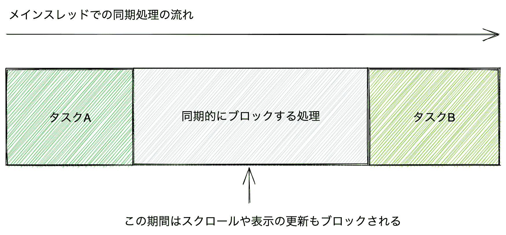

# 异步处理:Promise/Async Function

> 原文：[`jsprimer.net/basic/async/`](https://jsprimer.net/basic/async/)

本章我们将学习 JavaScript 的异步处理。异步处理是 JavaScript 中一个非常重要的概念。此外，由于浏览器和 Node.js 等 API 中有些内容只能通过异步处理来处理，因此无法避免异步处理。JavaScript 有用于处理异步处理的内置对象 Promise，以及称为 Async Function 的语法支持。

本章将从异步处理是什么开始，探讨异步处理中的异常处理和异步处理的方法。

## *同步处理*

*许多编程语言将代码的评估方式分为**同步处理（sync）**和**异步处理（async）**两大类。

之前编写的代码被称为**同步处理**。在同步处理中，代码按顺序处理，一个处理完成后再进行下一个处理。因此，同步处理中正在执行的处理只有一个，这使得操作非常直观。

另一方面，如果执行了同步阻塞处理，则会出现问题。因为同步处理中，一个处理完成之前，无法进行下一个处理。

下面的代码中的`blockTime`函数执行指定的`timeout`毫秒的无限循环，这是一个同步阻塞处理。使用`Date.now`方法返回自 1970 年 1 月 1 日午夜 0 时 0 分 0 秒以来经过的毫秒数来判定`timeout`毫秒是否已过。调用`blockTime`函数时，直到指定时间过去，下一个处理（任务 B）不会被调用。

```
function taskA() {
    console.log("タスクAを実行 at " + Date.now());
}
function taskB() {
    console.log("タスクBを実行 at " + Date.now());
}
// 指定した`timeout`ミリ秒経過するまで同期的にブロックする関数
function blockTime(timeout) {
    // Date.now()は現在の時間をUnix 時間（1970 年 1 月 1 日午前 0 時 0 分 0 秒から経過した時間）のミリ秒を返す
    const startTime = Date.now();
    // `timeout`ミリ秒経過するまで無限ループをする
    while (true) {
        const diffTime = Date.now() - startTime;
        if (diffTime >= timeout) {
            return; // 指定時間経過したら関数の実行を終了
        }
    }
}
taskA();
blockTime(1000); // 他の処理を1000ミリ秒（1 秒間）ブロックする
taskB(); 
```

如果同时进行阻塞处理，在浏览器中会引发大问题。这是因为 JavaScript 基本上是在浏览器的主线程（也称为 UI 线程）中执行的。主线程还负责执行与 UI 相关的处理，例如显示更新。因此，如果主线程被 JavaScript 的处理所占用，则显示将无法更新，看起来就像冻结了一样。



在之前的例子中，处理被阻塞了 1 秒钟，因此会导致 1 秒钟内的滚动等操作无法执行。

## *异步处理*

*异步处理按顺序处理代码，但不会等待一个异步处理完成就评估下一个处理。也就是说，在异步处理中，同时执行的处理有多个。

在 JavaScript 中，`setTimeout`函数是异步处理的代表性函数之一。`setTimeout`函数将`回调函数`注册到计时器，以便在`delay`毫秒后调用。

```
setTimeout(コールバック関数, delay); 
```

在下面的代码中，表面上看起来是任务 A → 异步任务 → 任务 B 的顺序。然而，使用`setTimeout`函数将异步任务注册为 1000 毫秒（1 秒）后执行。因此，实际上执行顺序是任务 A → 任务 B → 异步任务。

```
function taskA() {
    console.log("タスクAを実行 at " + Date.now());
}
function taskB() {
    console.log("タスクBを実行 at " + Date.now());
}
function taskAsync() {
    console.log("非同期のタスクを実行 at " + Date.now());
}

taskA();
setTimeout(() => {
    taskAsync();
}, 1000);
taskB(); 
```

因此，异步处理（`setTimeout`的回调函数）的执行顺序与代码的表面顺序不同。


## *异步处理是在主线程中执行的*

*正如之前所介绍的，主线程（也称为 UI 线程）是执行重型的 JavaScript 同步处理，这会阻塞其他处理（如屏幕更新）的问题。在异步处理中也有类似的问题。这是因为 JavaScript 中的大部分异步处理都是在主线程中执行的。

虽然从名称上看，异步处理似乎是在主线程之外执行的，但基本上异步处理也像同步处理一样在主线程中执行。在本节中，我们将简要地了解异步处理是如何在主线程中执行的。

下面的代码使用`setTimeout`函数注册了计时器的回调函数，并测量了实际花费的时间。使用`setTimeout`函数注册了 10 毫秒后执行异步任务的异步任务，并在其之后立即调用了一个持续 1 秒钟的同步阻塞处理。运行此代码时，由于同步阻塞处理，异步任务比注册到计时器的时间（10 毫秒后）晚得多地被调用。

```
function taskA() {
    console.log("タスクAを実行 at " + Date.now());
}
function taskB() {
    console.log("タスクBを実行 at " + Date.now());
}
function taskAsync() {
    console.log("非同期のタスクを実行 at " + Date.now());
}
// 指定した`timeout`ミリ秒経過するまで同期的にブロックする関数
function blockTime(timeout) {
    const startTime = Date.now();
    while (true) {
        const diffTime = Date.now() - startTime;
        if (diffTime >= timeout) {
            return; // 指定時間経過したら関数の実行を終了
        }
    }
}

const startTime = Date.now();
taskA();
// 10ミリ秒後にコールバック関数を呼び出すようにタイマーに登録する
setTimeout(() => {
    const endTime = Date.now();
    taskAsync();
    console.log(`非同期処理のコールバックが呼ばれるまで${endTime - startTime}ミリ秒かかりました`);
}, 10);
blockTime(1000); // 1 秒間処理をブロックする
taskB(); 
```

如果异步处理（`setTimeout`的回调函数）在主线程之外的线程中执行，那么这个异步处理不应该受到主线程中同步阻塞处理的影响。然而，实际上，这个异步处理也受到主线程中同步阻塞处理的影响。

在许多环境中，异步处理回调函数被调用之前可能需要 1 秒钟以上。这是因为虽然可以注册在 10 毫秒后执行异步回调函数的计时器，但由于同步阻塞处理，异步任务的执行也会推迟。因此，从异步处理也受到同步处理影响的事实来看，可以知道它们是在同一个主线程中执行的。


在 JavaScript 中，除了少数例外，异步处理被视为**并行处理（Concurrent）**。并行处理是指将处理分成一定的单位，在执行处理的同时切换处理的过程。因此，如果在执行异步处理之前有非常重的处理，就会导致异步处理的执行延迟。

但是，在某些执行环境中，异步处理中也可能存在可以在主线程之外执行的 API。 例如，在浏览器中，可以使用[Web Worker](https://developer.mozilla.org/ja/docs/Web/API/Web_Workers_API/Using_web_workers) API 在主线程之外执行 JavaScript。 在这个 Web Worker 中的异步处理是**并行处理（Parallel）**。 并行处理是指同时执行多个排他性处理。

Web Worker 在主线程之外的不同 Worker 线程中执行，因此即使在 Worker 线程中执行同步阻塞处理，也不会影响主线程。 但是，Web Worker 和主线程之间的数据交互需要使用`postMessage`方法。 因此，虽然可以将重处理移动到 Worker 中，但主线程和 Worker 线程之间的数据交互存在限制，这是一种权衡的关系。

这样，不能一概而论所有非同步处理，但了解基本非同步处理（如定时器等）是在主线程中执行的这一性质是很重要的。 JavaScript 的大部分**非同步处理**都是**非同步执行的处理**。 本书介绍的非同步处理大多数是在主线程中切换处理而执行的**并行处理（Concurrent）**。

## *非同步处理与异常处理*

*介绍了非同步处理与同步处理流程的不同之处。 这对非同步处理中的**异常处理**也有很大的影响。

在同步处理中，可以使用`try...catch`结构来捕获同步发生的异常（详细信息请参考“异常处理”章节）。

```
try {
    throw new Error("同期的なエラー");
} catch (error) {
    console.log("同期的なエラーをキャッチできる");
}
console.log("この行は実行されます"); 
```

在非同步处理中，即使使用`try...catch`结构也无法捕获非同步发生的异常。 下面的代码在 10 毫秒后引发了一个非同步错误。 但是，`try...catch`结构无法捕获如下非同步错误。

```
try {
    setTimeout(() => {
        throw new Error("非同期的なエラー");
    }, 10);
} catch (error) {
    // 非同期エラーはキャッチできないため、この行は実行されません
}
console.log("この行は実行されます"); 
```

`try`块是捕获该块内发生的异常的结构。 但是，使用`setTimeout`函数注册的回调函数实际上执行并抛出异常是在所有同步处理完成之后。 也就是说，标记为**范围外**的**try**块中可能会发生异常。

因此，`setTimeout`函数的回调函数中的异常需要按如下方式在回调函数内以同步错误的形式捕获。

```
// 非同期処理の外
setTimeout(() => {
    // 非同期処理の中
    try {
        throw new Error("エラー");
    } catch (error) {
        console.log("エラーをキャッチできる");
    }
}, 10);
console.log("この行は実行されます"); 
```

这样可以在回调函数内捕获错误，但**非同步处理之外**无法知道是否在**非同步处理中**发生了异常。 要知道非同步处理之外是否发生了异常，需要有一种方法将非同步处理中发生的异常传递到非同步处理之外。

此外，JavaScript 中的 HTTP 请求或文件读写等处理也提供了作为异步处理 API。 这些异步处理在连接不到网络或文件不存在的情况下会失败。 因此，异步处理中的异常处理（错误处理）非常重要。

非同步处理中发生的异常的处理方法有很多种。 本章主要介绍主要非同步处理和异常处理方法，主要关注 Promise 和 Async Function 两种。

Async Function 是建立在 Promise 之上的语法结构。 因此，理解两者都很重要，而不是只理解其中之一。

## *[ES2015] Promise*

*[Promise](https://developer.mozilla.org/ja/docs/Web/JavaScript/Reference/Global_Objects/Promise)是 ES2015 中引入的用于表示异步处理状态或结果的内置对象。 异步处理返回 Promise 实例，可以在 Promise 实例上注册状态变化时调用的回调函数。

下面的代码是一个处理 Promise 的异步处理的示例。

+   执行异步处理的部分（`asyncPromiseTask`函数）：返回 Promise 的实例

+   处理异步处理结果的部分：接收 Promise 的实例，通过回调函数注册成功时的处理和失败时的处理

```
// asyncPromiseTask 関数は、Promiseインスタンスを返す
function asyncPromiseTask() {
    return new Promise((resolve, reject) => {
        // さまざまな非同期処理を行う
        // 非同期処理に成功した場合は、resolveを呼ぶ
        // 非同期処理に失敗した場合は、rejectを呼ぶ
    });
}
// asyncPromiseTask 関数の非同期処理が成功した時、失敗した時に呼ばれる処理をコールバック関数として登録する
asyncPromiseTask().then(()=> {
    // 非同期処理が成功したときの処理
}).catch(() => {
    // 非同期処理が失敗したときの処理
}); 
```

`asyncPromiseTask`函数返回`Promise`这个内置对象的实例。 `Promise`实例表示`asyncPromiseTask`函数内进行的异步处理是成功还是失败的状态。 此外，可以通过对`Promise`实例使用`then`或`catch`方法，将成功时或失败时调用的处理注册为回调函数，以处理异步处理的结果。

Promise 看起来可能有些复杂，但它是用于封装异步处理的状态或结果的类似对象。 同步函数执行函数后立即得到结果，而非同步函数执行函数后不会立即得到结果。 因此，非同步函数返回一个封装了异步处理状态的 Promise 对象，并在结果确定时将结果传递给之前注册的回调函数。

实际上，让我们看看`Promise`的使用方法。

### *`Promise`实例的创建*

*使用`new`运算符创建`Promise`实例，此时需要传递一个名为`executor`的函数作为参数，该函数接受`resolve`和`reject`两个参数。 在`executor`函数中执行非同步处理，如果非同步处理成功，则调用`resolve`函数，如果失败，则调用`reject`函数。

```
const executor = (resolve, reject) => {
    // 非同期の処理が成功したときはresolveを呼ぶ
    // 非同期の処理が失敗したときはrejectを呼ぶ
};
const promise = new Promise(executor); 
```

使用此`Promise`实例的`then`方法，您可以注册在 Promise`resolve`（成功）或`reject`（失败）时调用的回调函数。 将成功时的回调函数传递给`then`方法的第一个参数，将失败时的回调函数传递给`then`方法的第二个参数。

```
// `Promise`インスタンスを作成
const promise = new Promise((resolve, reject) => {
    // 非同期の処理が成功したときはresolve()を呼ぶ
    // 非同期の処理が失敗したときにはreject()を呼ぶ
});
const onFulfilled = () => {
    console.log("resolveされたときに呼ばれる");
};
const onRejected = () => {
    console.log("rejectされたときに呼ばれる");
};
// `then`メソッドで成功時と失敗時に呼ばれるコールバック関数を登録
promise.then(onFulfilled, onRejected); 
```

`Promise`构造函数的`resolve`和`reject`，以及`then`方法的`onFulfilled`和`onRejected`之间有如下关系。

+   当`resolve`（成功）时

    +   将调用`onFulfilled`。

+   当发生`reject`（失败）时

    +   将调用`onRejected`

### *`Promise.prototype.then` 和 `Promise.prototype.catch`*

*因为以前没有像 Promise 这样将函数传递给构造函数的模式，所以我们将介绍具体的`then`方法用法示例。 同时，我们还将研究作为`then`方法别名的`catch`方法。

下面的代码中的`dummyFetch`函数创建并返回一个`Promise`实例。 如果成功获取资源，则调用`resolve`函数；如果失败，则调用`reject`函数。

传递给`resolve`的值将传递给`then`方法的第一个回调函数（`onFulfilled`）。 传递给`reject`的错误对象将传递给`then`方法的第二个回调函数（`onRejected`）。

```
/**
 * 1000ミリ秒未満のランダムなタイミングでレスポンスを疑似的にデータ取得する関数
 * 指定した`path`にデータがある場合、成功として**Resolved**状態のPromiseオブジェクトを返す
 * 指定した`path`にデータがない場合、失敗として**Rejected**状態のPromiseオブジェクトを返す
 */
function dummyFetch(path) {
    return new Promise((resolve, reject) => {
        setTimeout(() => {
            if (path.startsWith("/success")) {
                resolve({ body: `Response body of ${path}` });
            } else {
                reject(new Error("NOT FOUND"));
            }
        }, 1000 * Math.random());
    });
}
// `then`メソッドで成功時と失敗時に呼ばれるコールバック関数を登録
// /success/data のリソースは存在するので成功しonFulfilledが呼ばれる
dummyFetch("/success/data").then(function onFulfilled(response) {
    console.log(response); // => { body: "Response body of /success/data" }
}, function onRejected(error) {
    // この行は実行されません
});
// /failure/data のリソースは存在しないのでonRejectedが呼ばれる
dummyFetch("/failure/data").then(function onFulfilled(response) {
    // この行は実行されません
}, function onRejected(error) {
    console.error(error); // Error: "NOT FOUND"
}); 
```

Promise 的`then`方法接受两个回调函数参数：成功（`onFulfilled`）和失败（`onRejected`），但两者都可以省略。

下面的代码中的`delay`函数返回一个在一定时间后解决（`resolve`）的`Promise`实例。 在这个`Promise`实例上，仅注册了**成功时的回调函数**。

```
function delay(timeoutMs) {
    return new Promise((resolve) => {
        setTimeout(() => {
            resolve();
        }, timeoutMs);
    });
}
// `then`メソッドで成功時のコールバック関数だけを登録
delay(10).then(() => {
    console.log("10ミリ秒後に呼ばれる");
}); 
```

另一方面，`then`方法也可以仅注册失败时的回调函数。 在这种情况下，第一个参数应传递`undefined`，如`then(undefined, onRejected)`。 Promise 提供了`catch`方法，作为执行类似操作的替代方法，即`then(undefined, onRejected)`。

在下面的代码中，我们使用`then`方法和`catch`方法处理失败的错误，但两者的含义相同。 由于向`then`方法传递`undefined`不够直观，因此建议仅在注册失败处理时使用`catch`方法。

```
function errorPromise(message) {
    return new Promise((resolve, reject) => {
        reject(new Error(message));
    });
}
// 非推奨: `then`メソッドで失敗時のコールバック関数だけを登録
errorPromise("thenでエラーハンドリング").then(undefined, (error) => {
    console.log(error.message); // => "thenでエラーハンドリング"
});
// 推奨: `catch`メソッドで失敗時のコールバック関数を登録
errorPromise("catchでエラーハンドリング").catch(error => {
    console.log(error.message); // => "catchでエラーハンドリング"
}); 
```

### *Promise 和异常*

*如果在构造函数中发生异常，则会自动捕获异常。 发生异常的`Promise`实例将被视为失败，就像调用`reject`函数一样。 因此，如果 Promise 内部发生异常，则将调用`then`方法的第二个参数或`catch`方法中注册的错误处理回调函数。

```
function throwPromise() {
    return new Promise((resolve, reject) => {
        // Promiseコンストラクタの中で例外は自動的にキャッチされrejectを呼ぶ
        throw new Error("例外が発生");
        // 例外が発生すると、これ以降のコンストラクタの処理は実行されません
    });
}

throwPromise().catch(error => {
    console.log(error.message); // => "例外が発生"
}); 
```

因此，在 Promise 处理中，无需使用`try...catch`语法，自动捕获异常。

### *Promise 的状态*

*现在我们已经了解了 Promise 的`then`方法和`catch`方法的处理方式，接下来我们将整理一下`Promise`实例的状态。

`Promise`实例内部实际上有三种状态。

+   **已解决**

    +   当`resolve`（成功）时的状态。 这时将调用`onFulfilled`。

+   **已解决**

    +   当发生`reject`（失败）或异常时的状态。 这时将调用`onRejected`。

+   **挂起**

    +   不是已解决或已拒绝的状态

    +   创建 Promise 实例时的初始状态

这些状态是 ECMAScript 规范中确定的内部状态。 但是，没有方法从 Promise 实例中获取这些状态。 因此，虽然不能直接处理此状态作为 API，但可以帮助理解 Promise。

Promise 实例的状态在创建时为**挂起**，一旦变为**已解决**或**已拒绝**，状态就不会再改变。 因此，将状态更改为**已解决**或**已拒绝**后，它将被称为**已解决**（已确定）。

一旦`Promise`实例变为**已解决**（**已解决**或**已拒绝**），它将不会再转换为其他状态。 因此，即使在调用`resolve`后调用`reject`，该`Promise`实例仍将保持最初的**已解决**状态。

在下面的代码中，由于状态不会更改，因此不会调用注册的 onRejected 回调函数。 使用`then`方法注册的回调函数仅在状态更改时调用一次。

```
const promise = new Promise((resolve, reject) => {
    // 非同期でresolveする
    setTimeout(() => {
        resolve();
        // すでにresolveされているため無視される
        reject(new Error("エラー"));
    }, 16);
});
promise.then(() => {
    console.log("Fulfilledとなった");
}, (error) => {
    // この行は呼び出されない
}); 
```

同样，`Promise`构造函数内部多次调用`resolve`也不会改变`Promise`实例的状态。 因此，即使多次调用`resolve`，`then`方法注册的回调函数也只会被调用一次。

```
const promise = new Promise((resolve, reject) => {
    setTimeout(() => {
        resolve();
        resolve(); // 二度目以降のresolveやrejectは無視される
    }, 16);
});
promise.then(() => {
    console.log("最初のresolve 時に一度だけ呼ばれる");
}, (error) => {
    // この行は呼び出されない
}); 
```

当`Promise`实例的状态更改时，您可以注册一次性回调函数以通过`then`和`catch`方法深入了解。

此外，对于已更改状态的`Promise`实例，甚至可以稍后注册`then`或`catch`方法的回调函数。 对于已更改状态的`Promise`实例，通过`then`或`catch`方法注册的回调函数也会异步地调用。

具体来说，我们将与已更改状态的`Promise`实例一起查看`Promise.resolve`和`Promise.reject`方法的结果。

### *`Promise.resolve`*

*`Promise.resolve`方法是将状态变为**已解决**的`Promise`实例。

```
const fulfilledPromise = Promise.resolve(); 
```

`Promise.resolve`方法是将`new Promise`的语法简化为糖衣语法。 糖衣语法是指可以用更简洁的方式表达相同含义的语法。 `Promise.resolve`方法的糖衣语法如下。

```
// const fulfilledPromise = Promise.resolve(); と同じ意味
const fulfilledPromise = new Promise((resolve) => {
    resolve();
}); 
```

`Promise.resolve`方法也可以将值传递给`resolve`。

```
// `resolve(42)`された`Promise`インスタンスを作成する
const fulfilledPromise = Promise.resolve(42);
fulfilledPromise.then(value => {
    console.log(value); // => 42
}); 
```

使用`Promise.resolve`方法创建的**已解决**状态的`Promise`实例也可以通过`then`方法注册回调函数。 状态已更改的`Promise`实例上注册的回调函数将始终在异步时机执行。

执行此代码后，所有同步处理完成后，`then`方法中的回调函数将在异步时机执行。

```
const promise = Promise.resolve();
promise.then(() => {
    console.log("2\. コールバック関数が実行されました");
});
console.log("1\. 同期的な処理が実行されました"); 
```

`Promise.resolve`方法作为`new Promise`的糖衣语法，其执行顺序与使用`new Promise`相同。 下面的代码与之前使用的`Promise.resolve`方法具有相同的操作。

```
const promise = new Promise((resolve) => {
    console.log("1\. resolveします");
    resolve();
});
promise.then(() => {
    console.log("3\. コールバック関数が実行されました");
});
console.log("2\. 同期的な処理が実行されました"); 
```

执行此代码时，首先执行`Promise`的构造函数，然后执行同步处理，最后通过`then`方法异步调用之前注册的回调函数。

### *`Promise.reject`*

*`Promise.reject`方法创建一个**Rejected**状态的`Promise`实例。

```
const rejectedPromise = Promise.reject(new Error("エラー")); 
```

`Promise.reject`方法是`new Promise`的语法糖。 因此，`Promise.reject`方法与以下代码具有相同的意义。

```
const rejectedPromise = new Promise((resolve, reject) => {
    reject(new Error("エラー"));
}); 
```

即使是使用`Promise.reject`方法创建的**Rejected**状态的`Promise`实例，也可以通过`then`或`catch`方法注册回调函数。 对于已经变为**Rejected**状态的`Promise`实例注册的回调函数，将始终在非同步的时间点执行。 这与**Fulfilled**的情况相同。

```
Promise.reject(new Error("エラー")).catch(() => {
    console.log("2\. コールバック関数が実行されました");
});
console.log("1\. 同期的な処理が実行されました"); 
```

`Promise.resolve`或`Promise.reject`可以简写，因此在测试代码等情况下经常被使用。 此外，`Promise.reject`在接下来要解释的 Promise 链中用于操作 Promise 的状态。

### *Promise 链*

*Promise 是提供非同步处理统一接口的内置对象。 使用 Promise 的统一处理方法在处理多个非同步处理时特别有效。 之前，我们只是对单个`Promise`实例使用`then`或`catch`方法注册一组回调处理。

有时需要按顺序处理多个非同步处理。 Promise 提供了一种简单的方法来编写由多个非同步处理组成的一系列非同步处理。

这个机制的关键在于`then`或`catch`方法始终创建并返回一个新的`Promise`实例。 因此，可以将`then`方法的返回值（`Promise`实例）进一步注册`then`方法以进行处理。 这被称为方法链，但在本书中，我们将 Promise 通过方法链连接称为**Promise 链**（请参考“数组”章节）。

在下面的代码中，我们使用`then`方法进行 Promise 链。 在 Promise 链中，只要 Promise 不失败（**Rejected**状态），就会按顺序调用注册在`then`方法中的成功时回调函数。 因此，在下面的代码中，将按顺序在控制台输出`1`和`2`。

```
// Promiseインスタンスでメソッドチェーン
Promise.resolve()
    // thenメソッドは新しい`Promise`インスタンスを返す
    .then(() => {
        console.log(1);
    })
    .then(() => {
        console.log(2);
    }); 
```

这个 Promise 链与每次将新的变量放入并连接处理的方式在结果上是相同的。

```
// Promiseチェーンを変数に入れた場合
const firstPromise = Promise.resolve();
const secondPromise = firstPromise.then(() => {
    console.log(1);
});
const thirdPromise = secondPromise.then(() => {
    console.log(2);
});
// それぞれ新しいPromiseインスタンスが作成される
console.log(firstPromise === secondPromise); // => false
console.log(secondPromise === thirdPromise); // => false 
```

让我们来看一个更具体的 Promise 链的例子。

在下面的代码中，`asyncTask`函数随机返回 Fulfilled 或 Rejected 状态的`Promise`实例。 对于这个函数返回的`Promise`实例，我们使用`then`方法编写了成功时的处理。 由于`then`方法的返回值是新的`Promise`实例，因此我们可以继续使用`catch`方法编写失败时的处理。

```
// ランダムでFulfilledまたはRejectedの`Promise`インスタンスを返す関数
function asyncTask() {
    return Math.random() > 0.5
        ? Promise.resolve("成功")
        : Promise.reject(new Error("失敗"));
}

// asyncTask 関数は新しい`Promise`インスタンスを返す
asyncTask()
    // thenメソッドは新しい`Promise`インスタンスを返す
    .then(function onFulfilled(value) {　
        console.log(value); // => "成功"
    })
    // catchメソッドは新しい`Promise`インスタンスを返す
    .catch(function onRejected(error) {
        console.log(error.message); // => "失敗"
    }); 
```

当`asyncTask`函数成功（resolve）时，只有注册在`then`方法中的成功时处理会被调用，而注册在`catch`方法中的失败时处理则不会被调用。 另一方面，当`asyncTask`函数失败（reject）时，注册在`then`方法中的成功时处理不会被调用，而只有注册在`catch`方法中的失败时处理会被调用。

在之前的代码中，Promise 的状态和回调函数的处理流程如下。


当 Promise 的状态变为**Rejected**时，将调用最近的失败处理（`catch`或`then`的第二引数）。 在这种情况下，将跳过成功时的处理（`then`的第一引数）。

在下面的代码中，对于**Rejected**的 Promise，我们使用 Promise 链来编写`then` → `then` → `catch`的处理。 在这种情况下，最近的失败处理（`catch`）将被调用，但中间的两个成功处理（`then`）则不会执行。

```
// RejectedなPromiseは次の失敗時の処理までスキップする
const rejectedPromise = Promise.reject(new Error("失敗"));
rejectedPromise.then(() => {
    // このthenのコールバック関数は呼び出されません
}).then(() => {
    // このthenのコールバック関数は呼び出されません
}).catch(error => {
    console.log(error.message); // => "失敗"
}); 
```

与 Promise 构造函数处理相同，`then`或`catch`中发生的异常将自动捕获。 当发生异常时，`then`或`catch`方法将返回**Rejected**的`Promise`实例。 因此，当发生异常时，将调用最接近的失败处理（`catch`或`then`的第二个参数）。

```
Promise.resolve().then(() => {
    // 例外が発生すると、thenメソッドはRejectedなPromiseを返す
    throw new Error("例外");
}).then(() => {
    // このthenのコールバック関数は呼び出されません
}).catch(error => {
    console.log(error.message); // => "例外"
}); 
```

此外，一旦在 Promise 链中使用`catch`方法捕获失败，下一步调用的是成功处理。 这是因为`then`和`catch`方法返回的是**Fulfilled**状态的 Promise 实例。 因此，一旦捕获，就会返回到使用下一个`then`注册的处理的 Promise 链。

```
Promise.reject(new Error("エラー")).catch(error => {
    console.error(error); // Error: エラー
}).then(() => {
    console.log("thenのコールバック関数が呼び出される");
}); 
```

就这样，通过`then`方法或`catch`方法链接，编写成功或失败的处理被称为 Promise 链。

#### *在 Promise 链中返回值*

在 Promise 链中，可以通过回调返回的值将其传递给下一个回调函数。

`then`和`catch`方法的回调函数可以返回数字、字符串、对象等任意值。 回调函数返回的值将作为参数传递给下一个`then`的回调函数。

```
Promise.resolve(1).then((value) => {
    console.log(value); // => 1
    return value * 2;
}).then(value => {
    console.log(value); // => 2
    return value * 2;
}).then(value => {
    console.log(value); // => 4
    // 値を返さない場合は undefined を返すのと同じ
}).then(value => {
    console.log(value); // => undefined
}); 
```

在这里，我们以`then`方法为基础进行解释，但是`catch`方法是`then`方法的语法糖，因此具有相同的行为。 一旦在 Promise 链中捕获一次，下一步调用的是成功处理。 因此，通过`catch`方法返回的值将作为参数传递给下一个`then`方法的回调函数。

```
Promise.reject(new Error("失敗")).catch(error => {
    // 一度 catchすれば、次に呼ばれるのは成功時のコールバック
    return 1;
}).then(value => {
    console.log(value); // => 1
    return value * 2;
}).then(value => {
    console.log(value); // => 2
}); 
```

#### *通过回调函数返回`Promise`实例*

*一旦在 Promise 链中捕获一次，下一步调用的是成功处理（`then`方法）。 这是因为，当回调函数返回任意值时，将创建一个以该值解析为**Fulfilled**状态的`Promise`实例。 但是，如果回调函数返回`Promise`实例，则情况就会有所不同。

如果在回调函数中返回`Promise`实例，则`then`或`catch`方法的返回值将是具有相同状态的`Promise`实例。 换句话说，如果在`then`方法中返回**Rejected**状态的`Promise`实例，则下一步调用的是失败处理。

在下面的代码中，`then`方法的回调函数使用`Promise.reject`方法返回了一个**Rejected**的`Promise`实例。 **Rejected**的`Promise`实例会跳过`then`方法的成功处理，直到调用了下一个`catch`方法的失败处理。

```
Promise.resolve().then(function onFulfilledA() {
    return Promise.reject(new Error("失敗"));
}).then(function onFulfilledB() {
    // onFulfilledBは呼び出されません
}).catch(function onRejected(error) {
    console.log(error.message); // => "失敗"
}).then(function onFulfilledC() {
    console.log("onFulfilledCは呼び出されます");
}); 
```

在这段代码中，Promise 的状态和回调函数的处理流程如下所示。


通常情况下，一旦进行了`catch`处理，下一步调用的是成功处理。 使用此`Promise`实例返回机制，即使进行了`catch`处理，也可以保持**Rejected**状态。

在下面的代码中，我们在`catch`方法中输出日志，并使用`Promise.reject`方法返回了一个**Rejected**的`Promise`实例。 这样，我们可以在处理链中保持错误的同时记录错误日志。

```
function main() {
    return Promise.reject(new Error("エラー"));
}
// mainはRejectedなPromiseを返す
main().catch(error => {
    // mainで発生したエラーのログを出力する
    console.error(error);
    // Promiseチェーンはそのままエラーを継続させる
    return Promise.reject(error);
}).then(() => {
    // 前のcatchでRejectedなPromiseが返されたため、この行は実行されません
}).catch(error => {
    console.log("メインの処理が失敗した");
}); 
```

#### *[ES2018] 在 Promise 链的最后写入处理*

*Promise 的`finally`方法允许注册一个回调函数，在成功或失败时都会被调用。 这类似于`try...catch...finally`结构中的`finally`块。

```
// `promise`にはResolvedまたはRejectedなPromiseインスタンスがランダムで入る
const promise = Math.random() < 0.5 ? Promise.resolve() : Promise.reject();
promise.then(() => {
    console.log("Promiseのthenメソッド");
}).catch((error) => {
    console.log("Promiseのcatchメソッド");
}).finally(() => {
    // 成功、失敗どちらの場合でも呼び出される
    console.log("Promiseのfinallyメソッド");
}); 
```

在下面的代码中，我们获取资源并在`then`中注册成功处理，在`catch`中注册失败处理。 此外，我们使用一个名为`isLoading`的变量来管理是否正在获取资源。 无论成功与否，一旦获取完成，`isLoading`都将设置为`false`。 我们可以在`then`和`catch`中都将`false`分配给`isLoading`，但使用`finally`方法可以将分配集中到一个位置。

```
function dummyFetch(path) {
    return new Promise((resolve, reject) => {
        setTimeout(() => {
            if (path.startsWith("/resource")) {
                resolve({ body: `Response body of ${path}` });
            } else {
                reject(new Error("NOT FOUND"));
            }
        }, 1000 * Math.random());
    });
}
// リソースを取得中かどうかのフラグ
let isLoading = true;
dummyFetch("/resource/A").then(response => {
    console.log(response);
}).catch(error => {
    console.error(error);
}).finally(() => {
    isLoading = false;
    console.log("Promiseのfinallyメソッド");
}); 
```

### *在 Promise 链中进行顺序处理*

*Promise 链中编写异步处理流程的一个主要优点是，它可以适应异步处理的各种模式。

在这里，我们将考虑逐个处理多个异步处理作为一个典型的例子。 使用 Promise 进行顺序处理并不复杂，只需简单地使用`then`连接异步处理即可。

在下面的代码中，我们依次获取 Resource A 和 Resource B。 我们将获取的每个资源添加到变量`results`中，并在所有获取完成后将其输出到控制台。

```
function dummyFetch(path) {
    return new Promise((resolve, reject) => {
        setTimeout(() => {
            if (path.startsWith("/resource")) {
                resolve({ body: `Response body of ${path}` });
            } else {
                reject(new Error("NOT FOUND"));
            }
        }, 1000 * Math.random());
    });
}

const results = [];
// Resource Aを取得する
dummyFetch("/resource/A").then(response => {
    results.push(response.body);
    // Resource Bを取得する
    return dummyFetch("/resource/B");
}).then(response => {
    results.push(response.body);
}).then(() => {
    console.log(results); // => ["Response body of /resource/A", "Response body of /resource/B"]
}); 
```

### *使用`Promise.all`将多个 Promise 组合在一起*

*通过使用`Promise.all`，可以将多个 Promise 作为一个 Promise 处理。

`Promise.all`方法接受一个`Promise`实例数组，并返回一个新的`Promise`实例。 如果数组中的所有`Promise`实例都处于**Fulfilled**状态，则返回的`Promise`实例也将处于**Fulfilled**状态。 反之，如果有一个**Rejected**，则返回的`Promise`实例也将处于**Rejected**状态。

通过`then`方法注册的回调函数，将接收到一个包含 Promise 结果的数组。 在这种情况下，数组中的元素顺序与传递给`Promise.all`方法的数组的 Promise 元素的顺序相同。

```
// `timeoutMs`ミリ秒後にresolveする
function delay(timeoutMs) {
    return new Promise((resolve) => {
        setTimeout(() => {
            resolve(timeoutMs);
        }, timeoutMs);
    });
}
const promise1 = delay(1);
const promise2 = delay(2);
const promise3 = delay(3);

Promise.all([promise1, promise2, promise3]).then(function(values) {
    console.log(values); // => [1, 2, 3]
}); 
```

在前面的 Promise 链中，获取资源的例子是逐步进行的，先获取资源 A，然后获取资源 B。但是，如果无论是先获取资源 A 还是 B 都没有问题，那么可以使用`Promise.all`方法将多个 Promise 合并为一个 Promise。此外，同时获取资源 A 和 B 将更快地完成处理。

下面的代码同时开始获取资源 A 和 B。当两个资源都获取完成后，`then`的回调函数会以数组的形式传递 A 和 B 的结果。

```
function dummyFetch(path) {
    return new Promise((resolve, reject) => {
        setTimeout(() => {
            if (path.startsWith("/resource")) {
                resolve({ body: `Response body of ${path}` });
            } else {
                reject(new Error("NOT FOUND"));
            }
        }, 1000 * Math.random());
    });
}

const fetchedPromise = Promise.all([
    dummyFetch("/resource/A"),
    dummyFetch("/resource/B")
]);
// fetchedPromiseの結果をDestructuringでresponseA, responseBに代入している
fetchedPromise.then(([responseA, responseB]) => {
    console.log(responseA.body); // => "Response body of /resource/A"
    console.log(responseB.body); // => "Response body of /resource/B"
}); 
```

如果传递的 Promise 中有一个变为**Rejected**，则会调用失败时的处理。

```
function dummyFetch(path) {
    return new Promise((resolve, reject) => {
        setTimeout(() => {
            if (path.startsWith("/resource")) {
                resolve({ body: `Response body of ${path}` });
            } else {
                reject(new Error("NOT FOUND"));
            }
        }, 1000 * Math.random());
    });
}

const fetchedPromise = Promise.all([
    dummyFetch("/resource/A"),
    dummyFetch("/not_found/B") // Bは存在しないため失敗する
]);
fetchedPromise.then(([responseA, responseB]) => {
    // この行は実行されません
}).catch(error => {
    console.error(error); // Error: NOT FOUND
}); 
```

### *`Promise.race`*

*`Promise.all`方法等待多个 Promise 全部完成。`Promise.race`方法接收一个 Promise，但只要有一个 Promise 完成（变为 Settled 状态），就会执行下一步操作。

`Promise.race`方法接收一个`Promise`实例数组，并返回一个新的`Promise`实例。这个新的`Promise`实例将与数组中第一个**Settled**状态的`Promise`实例具有相同的状态。

+   配列の中で一番最初に**Settled**となったPromiseが**Fulfilled**の場合は、新しい`Promise`インスタンスも**Fulfilled**になる

+   配列中第一个**Settled**的 Promise 如果是**Rejected**，那么新的`Promise`实例也会变为**Rejected**

换句话说，通过同时执行多个 Promise 的异步处理并使它们竞争，可以在第一个完成的`Promise`实例上调用下一步处理。

下面的代码定义了一个名为`delay`的函数，该函数返回一个在`timeoutMs`毫秒后变为**Fulfilled**的`Promise`实例。`Promise.race`方法接收一个在 1 毫秒、32 毫秒、64 毫秒、128 毫秒后完成的`Promise`实例数组。在这个数组中，第一个完成的是在 1 毫秒后变为**Fulfilled**的`Promise`实例。

```
// `timeoutMs`ミリ秒後にresolveする
function delay(timeoutMs) {
    return new Promise((resolve) => {
        setTimeout(() => {
            resolve(timeoutMs);
        }, timeoutMs);
    });
}
// 1つでもresolveまたはrejectした時点で次の処理を呼び出す
const racePromise = Promise.race([
    delay(1),
    delay(32),
    delay(64),
    delay(128)
]);
racePromise.then(value => {
    // もっとも早く完了するのは1ミリ秒後
    console.log(value); // => 1
}); 
```

在这种情况下，第一个`resolve`的值将使`racePromise`也`resolve`。因此，`then`方法的回调函数将收到值`1`。

其他`delay`函数创建的`Promise`实例也会在 32 毫秒、64 毫秒、128 毫秒后被`resolve`。但是，一旦`Promise`实例变为**Settled**（**Fulfilled**或**Rejected**），它将保持不变，不会再改变状态，也不会再调用`then`的回调函数。因此，`racePromise`会被多次`resolve`，但除了第一次外都会被忽略，因此`then`的回调函数只会被调用一次。

使用`Promise.race`方法可以实现基于 Promise 的异步操作的超时处理。这里的超时是指，如果经过一定时间仍未完成处理，则将其视为错误处理。

下面的代码使用`Promise.race`方法竞争`timeout`函数和`dummyFetch`函数返回的`Promise`实例。`dummyFetch`函数会以随机时间获取资源并`resolve`返回`Promise`实例。`timeout`函数会在指定的毫秒数后`reject`返回`Promise`实例。

通过让这两个`Promise`实例竞争，如果`dummyFetch`先完成，则处理成功，如果`timeout`先完成，则处理失败，可以实现超时处理。

```
// `timeoutMs`ミリ秒後にrejectする
function timeout(timeoutMs) {
    return new Promise((resolve, reject) => {
        setTimeout(() => {
            reject(new Error(`Timeout: ${timeoutMs}ミリ秒経過`));
        }, timeoutMs);
    });
}
function dummyFetch(path) {
    return new Promise((resolve, reject) => {
        setTimeout(() => {
            if (path.startsWith("/resource")) {
                resolve({ body: `Response body of ${path}` });
            } else {
                reject(new Error("NOT FOUND"));
            }
        }, 1000 * Math.random());
    });
}
// 500ミリ秒以内に取得できなければ失敗時の処理が呼ばれる
Promise.race([
    dummyFetch("/resource/data"),
    timeout(500),
]).then(response => {
    console.log(response.body); // => "Response body of /resource/data"
}).catch(error => {
    console.log(error.message); // => "Timeout: 500ミリ秒経過"
}); 
```

使用 Promise 可以创建各种异步处理模式。有关更详细的 Promise 用法，请参阅在线公开文档“[JavaScript Promise 的本](https://azu.github.io/promises-book/)”。

另一方面，Promise 只是一个内置对象，因此在处理异步操作之间的协作时，需要使用类似 Promise 链的特殊写法和外观。此外，关于错误处理，Promise 使用 `catch` 方法和 `finally` 方法，类似于 `try...catch` 语法。但是，由于 Promise 只是一个对象而不是语法，因此必须将它们实现为方法链。

在 ES2017 中，为了解决 Promise 链的不雅外观，引入了名为 Async Function 的语法结构。

## *[ES2017] 异步函数*

*ES2017 引入了一种称为 Async Function 的语法，用于定义执行异步操作的函数。Async Function 与普通函数不同，它定义了一个必须返回 `Promise` 实例的函数。

通过在函数前加上 `async`，可以定义 Async Function。这个 `doAsync` 函数总是返回一个 `Promise` 实例。

```
async function doAsync() {
    return "値";
}
// doAsync 関数はPromiseを返す
doAsync().then(value => {
    console.log(value); // => "値"
}); 
```

这个 Async Function 的写法如下，与下面的写法意思相同。在 Async Function 中，返回的不是 `return` 的值，而是将返回值包装成 `Promise` 实例返回，类似于 `Promise.resolve(返回值)`。

```
// 通常の関数でPromiseインスタンスを返している
function doAsync() {
    return Promise.resolve("値");
}
doAsync().then(value => {
    console.log(value); // => "値"
}); 
```

重要的是 Async Function 是建立在 Promise 之上的语法。因此，请注意要理解 Async Function，您需要先理解 Promise。

此外，在 Async Function 内部，可以使用 `await` 表达式，该表达式等待 Promise 的异步操作完成。通过使用 `await` 表达式，可以像处理同步操作一样处理异步操作，使得处理流程更易于阅读。

本节将介绍 Async Function 和 `await` 表达式。

## *Async Function 的定义*

*Async Function 是通过在函数定义中添加 `async` 关键字来定义的。JavaScript 的函数定义可以是函数声明、函数表达式、箭头函数、方法简写等。无论哪种定义方法，只要在前面加上 `async` 关键字，就可以将其定义为 Async Function。

```
// 関数宣言のAsync Function 版
async function fn1() {}
// 関数式のAsync Function 版
const fn2 = async function() {};
// Arrow FunctionのAsync Function 版
const fn3 = async() => {};
// メソッドの短縮記法のAsync Function 版
const obj = { async method() {} }; 
```

这些 Async Function 除了以下几点外，通常具有与普通函数相同的性质。

+   Async Function 必定返回 `Promise` 实例

+   Async Function 内部可以使用 `await` 表达式

## *Async Function 返回 Promise*

*定义了 Async Function 的函数必定返回 `Promise` 实例。具体来说，Async Function 返回的值可以考虑以下三种情况。

1.  当 Async Function 返回值时，它将返回一个包含该值的 **Fulfilled** 的 Promise

1.  当 Async Function 返回 Promise 时，它将直接返回该返回值的 Promise

1.  如果在 Async Function 内发生异常，则返回一个包含该错误的 **Rejected** 的 Promise

在下面的代码中，可以确认 Async Function 根据各自的返回值返回什么样的 `Promise` 实例。这 1 到 3 的行为与 Promise 的 `then` 方法的返回值及其回调函数的关系几乎相同。

```
// 1\. resolveFnは値を返している
// 何もreturnしていない場合はundefinedを返したのと同じ扱いとなる
async function resolveFn() {
    return "返り値";
}
resolveFn().then(value => {
    console.log(value); // => "返り値"
});

// 2\. rejectFnはPromiseインスタンスを返している
async function rejectFn() {
    return Promise.reject(new Error("エラーメッセージ"));
}

// rejectFnはRejectedなPromiseを返すのでcatchできる
rejectFn().catch(error => {
    console.log(error.message); // => "エラーメッセージ"
});

// 3\. exceptionFnは例外を投げている
async function exceptionFn() {
    throw new Error("例外が発生しました");
    // 例外が発生したため、この行は実行されません
}

// Async Functionで例外が発生するとRejectedなPromiseが返される
exceptionFn().catch(error => {
    console.log(error.message); // => "例外が発生しました"
}); 
```

在任何情况下，Async Function 都会返回一个 Promise。从调用者的角度来看，Async Function 与返回 Promise 的普通函数没有区别。

## *`await` 表达式*

*`await` 表达式是以下位置可用的表达式。在以下位置之外，`await` 表达式会导致语法错误，因此无法使用。

+   Async Function 的函数定义下方

+   在 ECMAScript 模块的最底层

首先来看一下通常使用的 Async Function 的函数定义下方的 `await` 表达式。

`await` 表达式会在右边的 `Promise` 实例被评估为 **Fulfilled** 或 **Rejected** 之前等待异步操作的完成。一旦 `Promise` 实例的状态发生变化，就会继续执行下一行的处理。

```
async function asyncMain() {
    // PromiseがFulfilledまたはRejectedとなるまで待つ
    await Promiseインスタンス;
    // Promiseインスタンスの状態が変わったら処理を再開する
} 
```

在普通处理流程中，执行异步操作时，不会等待异步操作完成就执行下一行（下一句）。但是，`await` 表达式会在异步操作执行并完成之前，不执行下一行（下一句）。因此，使用 `await` 表达式可以使异步操作像同步操作一样，按照从上到下的顺序执行。

```
// async functionは必ずPromiseを返す
async function doAsync() {
    // 非同期処理
}
async function asyncMain() {
    // doAsyncの非同期処理が完了するまでまつ
    await doAsync();
    // 次の行はdoAsyncの非同期処理が完了されるまで実行されない
    console.log("この行は非同期処理が完了後に実行される");
} 
```

`await` 表达式返回 `await` 右边（`Promise` 实例）的评估结果（**表达式**请参考“文与表达式”章节）。`await` 表达式的评估方法取决于评估的 Promise 的状态（**Fulfilled** 或 **Rejected**）。

当 `await` 右边的 Promise 被评估为 **Fulfilled** 时，resolve 的值将成为 `await` 表达式的返回值。

在下面的代码中，`await` 右边的 `Promise` 实例以 `42` 这个值进行 resolve。因此，`await` 表达式的返回值是 `42`，并且这个值也赋给了 `value` 变量。

```
async function asyncMain() {
    const value = await Promise.resolve(42);
    console.log(value); // => 42
}
asyncMain(); // Promiseインスタンスを返す 
```

这与使用 Promise 编写的代码具有相同的意义。使用 `await` 表达式，可以不使用回调函数就表达异步处理的流程。

```
function asyncMain() {
    return Promise.resolve(42).then(value => {
        console.log(value); // => 42
    });
}
asyncMain(); // Promiseインスタンスを返す 
```

当 `await` 表达式的右边的 Promise 被评估为 **Rejected** 时，会立即抛出错误。此外，Async Function 内发生的异常会自动捕获。因此，当 `await` 表达式中的 Promise 被评估为 **Rejected** 时，该 Async Function 将返回一个 **Rejected** 的 Promise。

在这个代码示例中，`await`右侧的`Promise`实例处于**Rejected**状态。因此，`await`表达式会抛出`错误`。为了自动捕获这个错误，`asyncMain`函数返回一个**Rejected**的 Promise。

```
async function asyncMain() {
    // `await`式で評価した右辺のPromiseがRejectedとなったため、例外がthrowされる
    const value = await Promise.reject(new Error("エラーメッセージ"));
    // await 式で例外が発生したため、この行は実行されません
}
// Async Functionは自動的に例外をキャッチできる
asyncMain().catch(error => {
    console.log(error.message); // => "エラーメッセージ"
}); 
```

`await`表达式会抛出异常，这意味着这个异常可以用`try...catch`结构捕获（有关详细信息，请参阅“异常处理”章节中的“try...catch 结构”）。由于常规的异步处理在完成前会执行下一行，因此无法在`try...catch`结构中捕获异常。因此，在 Promise 中使用`catch`方法来捕获 Promise 内部发生的异常。

在下面的代码中，使用`try...catch`结构捕获了由`await`表达式引发的异常。因此，`asyncMain`函数返回一个 Resolved 的 Promise，而`catch`方法中的回调函数不会被调用。

```
async function asyncMain() {
    // await 式のエラーはtry...catchできる
    try {
        // `await`式で評価した右辺のPromiseがRejectedとなったため、例外がthrowされる
        const value = await Promise.reject(new Error("エラーメッセージ"));
        // await 式で例外が発生したため、この行は実行されません
    } catch (error) {
        console.log(error.message); // => "エラーメッセージ"
    }
}
// asyncMainはResolvedなPromiseを返す
asyncMain().catch(error => {
    // すでにtry...catchされているため、この行は実行されません
}); 
```

这样使用`await`表达式，就可以像使用`try...catch`结构一样处理异步处理，而且代码的视觉效果也像同步处理一样，直到当前行（当前语句）的处理完成，才会评估下一行。

### Promise 链转换为 Async Function*

*使用 Async Function 和`await`式可以将以 Promise 链形式表示的异步处理以同步处理的外观来编写。首先，让我们看看逐次执行多个异步处理的 Promise 链的例子。然后，我们将以相同的方式使用 Async Function 和`await`式重写这些处理，并进行比较。

下面的`fetchAB`函数使用 Promise 链按顺序获取资源 A 和 B。

```
function dummyFetch(path) {
    return new Promise((resolve, reject) => {
        setTimeout(() => {
            if (path.startsWith("/resource")) {
                resolve({ body: `Response body of ${path}` });
            } else {
                reject(new Error("NOT FOUND"));
            }
        }, 1000 * Math.random());
    });
}
// リソースAとリソースBを順番に取得する
function fetchAB() {
    const results = [];
    return dummyFetch("/resource/A").then(response => {
        results.push(response.body);
        return dummyFetch("/resource/B");
    }).then(response => {
        results.push(response.body);
        return results;
    });
}
// リソースを取得して出力する
fetchAB().then((results) => {
    console.log(results); // => ["Response body of /resource/A", "Response body of /resource/B"]
}); 
```

使用 Async Function 和`await`式编写相同处理的方式如下。使用`await`表达式等待资源获取，并将结果逐次添加到变量`results`中，从而实现逐次处理。

```
function dummyFetch(path) {
    return new Promise((resolve, reject) => {
        setTimeout(() => {
            if (path.startsWith("/resource")) {
                resolve({ body: `Response body of ${path}` });
            } else {
                reject(new Error("NOT FOUND"));
            }
        }, 1000 * Math.random());
    });
}
// リソースAとリソースBを順番に取得する
async function fetchAB() {
    const results = [];
    const responseA = await dummyFetch("/resource/A");
    results.push(responseA.body);
    const responseB = await dummyFetch("/resource/B");
    results.push(responseB.body);
    return results;
}
// リソースを取得して出力する
fetchAB().then((results) => {
    console.log(results); // => ["Response body of /resource/A", "Response body of /resource/B"]
}); 
```

如果使用 Promise 链编写`fetchAB`函数，那么在回调中处理可能会变得复杂。另一方面，使用 Async Function 和`await`式编写时，只需按顺序执行获取和添加即可，没有嵌套，外观简单。

## Async Function 与组合*

*到目前为止，我们已经了解了基本的 Async Function 的工作方式，接下来让我们看看与其他结构或 Promise API 结合使用的 Async Function 的使用方法。

### Async Function 与循环处理*

*在执行多个异步处理时，Async Function 可以与 for 循环等循环处理结合使用。

在下面的代码中，实现了`fetchResources`函数，该函数通过传递指定资源的路径数组来按顺序获取这些资源。在 Async Function 内使用 for 循环进行循环处理，在 for 循环中使用`await`语句等待资源的获取，并将结果添加到其中。

```
function dummyFetch(path) {
    return new Promise((resolve, reject) => {
        setTimeout(() => {
            if (path.startsWith("/resource")) {
                resolve({ body: `Response body of ${path}` });
            } else {
                reject(new Error("NOT FOUND"));
            }
        }, 1000 * Math.random());
    });
}
// 複数のリソースを順番に取得する
async function fetchResources(resources) {
    const results = [];
    // for...of 文でresourcesの配列から1つずつ要素を取り出して処理
    for (const resource of resources) {
        // ループ内で非同期処理の完了を待っている
        const response = await dummyFetch(resource);
        results.push(response.body);
    }
    // 反復処理がすべて終わったら結果を返す(返り値となるPromiseを`results`でresolveする)
    return results;
}
// 取得したいリソースのパス配列
const resources = [
    "/resource/A",
    "/resource/B"
];
// リソースを取得して出力する
fetchResources(resources).then((results) => {
    console.log(results); // => ["Response body of /resource/A", "Response body of /resource/B"]
}); 
```

在 Async Function 中，可以轻松地将 for 循环等现有结构与非同步处理结合使用。如果只有 Promise，则需要使用 Promise 链和回调函数来实现循环处理。

### Promise API 与 Async Function 结合使用*

*使用 Async Function 和`await`式可以使异步处理看起来像同步处理。由于这种同步处理的外观，在执行多个异步处理时，容易编写出产生无谓等待时间的代码。

在先前的`fetchResources`函数中，是按顺序逐个获取资源的。例如，如果获取资源 A 和 B，所需的时间是资源 A 和 B 获取时间的总和。假设资源 A 需要 1 秒，资源 B 需要 2 秒，那么获取所有资源需要 3 秒。

如果获取的顺序没有意义，可以通过同时获取多个资源来消除多余的等待时间。在先前的例子中，如果同时获取资源 A 和 B，那么所有资源最多只需要等待资源 B 获取的 2 秒即可全部获取。

在 Promise 链中，使用`Promise.all`方法将多个异步处理汇总为一个`Promise`实例，以同时获取。由于`await`表达式评估的是`Promise`实例，因此也可以将`await`表达式与`Promise.all`方法结合使用。

在下面的代码中，结合使用`Promise.all`方法和 Async Function 实现了`fetchAllResources`函数，该函数同时获取资源。`Promise.all`方法接收多个 Promise 作为数组，并返回一个将它们汇总为一个 Promise 的函数。通过`await``Promise.all`方法返回的`Promise`实例，可以以数组的形式获取异步处理的最终结果。

```
function dummyFetch(path) {
    return new Promise((resolve, reject) => {
        setTimeout(() => {
            if (path.startsWith("/resource")) {
                resolve({ body: `Response body of ${path}` });
            } else {
                reject(new Error("NOT FOUND"));
            }
        }, 1000 * Math.random());
    });
}
// 複数のリソースをまとめて取得する
async function fetchAllResources(resources) {
    // それぞれのリソースを取得する非同期処理を呼び出す
    const promises = resources.map((resource) => {
        return dummyFetch(resource);
    });
    // すべてのリソースが取得できるまで待つ
    // Promise.allは [ResponseA, ResponseB] のように結果が配列となる
    const responses = await Promise.all(promises);
    // 取得した結果からレスポンスのボディだけを取り出す
    return responses.map((response) => {
        return response.body;
    });
}
const resources = [
    "/resource/A",
    "/resource/B"
];
// リソースを取得して出力する
fetchAllResources(resources).then((results) => {
    console.log(results); // => ["Response body of /resource/A", "Response body of /resource/B"]
}); 
```

如此，Async Function 和`await`表达式可以与现有的 Promise API 结合使用。由于 Async Function 内部也使用 Promise 的机制，因此它们不是对立关系，而是共存关系。

### Async Function 中的 await 式*`await`式只能在 Async Function 的直下使用*

*在 Async Function 中使用`await`表达式时，需要注意`await`表达式只能在函数的直下使用。

如果在不是 Async Function 的普通函数中使用`await`表达式，则会引发语法错误（`SyntaxError`）。这是为了防止错误的`await`表达式使用而设定的规范。

```
// asyncではない関数では`await`式は利用できない
function main(){
    // SyntaxError: await is only valid in async functions
    await Promise.resolve();
} 
```

Async Function 内で`await`式を使って処理を待っている間も、関数の外側では通常どおり処理が進みます。 次のコードを実行してみると、Async Function 内で`await`しても、Async Function 外の処理は停止していないことがわかります。

```
async function asyncMain() {
    // 中でawaitしても、Async Functionの外側の処理まで止まるわけではない
    await new Promise((resolve) => {
        setTimeout(resolve, 16);
    });
}
console.log("1\. asyncMain 関数を呼び出します");
// Async Functionは外から見れば単なるPromiseを返す関数
asyncMain().then(() => {
    console.log("3\. asyncMain 関数が完了しました");
});
// Async Functionの外側の処理はそのまま進む
console.log("2\. asyncMain 関数外では、次の行が同期的に呼び出される"); 
```

このように`await`式でAsync Function 内の非同期処理を一時停止しても、Async Function 外の処理が停止するわけではありません。 Async Function 外の処理も停止できてしまうと、JavaScriptでは基本的にメインスレッドで多くの処理をするため、UIを含めた他の処理が止まってしまいます。 これが`await`式がAsync Functionの外で利用できない理由の1つです。

这种规范在尝试在回调函数内使用 Async Function 时可能会引起混淆。 具体例子，可以看看之前逐次获取资源的`fetchResources`関数。

在之前的`fetchResources`関数中，使用了 for 循环和`await`表达式。这时，不能使用`Array`的`forEach`方法。

将`fetchResources`関数从简单的 for 循环转换为`Array`的`forEach`方法时，会出现语法错误（`SyntaxError`）。这是因为`await`表达式只能在 Async Function 中使用的语法。

```
async function fetchResources(resources) {
    const results = [];
    // Syntax Errorとなる例
    resources.forEach(function(resource) {
        // Async Functionではないスコープで`await`式を利用しているためSyntax Errorとなる
        const response = await dummyFetch(resource);
        results.push(response.body);
    });
    return results;
} 
```

因此，如果要将`Array`的`forEach`方法中的回调函数定义为 Async Function，那么在回调函数中就不能使用`await`表达式。

这种语法错误可以通过将`Array`的`forEach`方法中的回调函数定义为 Async Function 来解决。但是，仅仅将回调函数定义为 Async Function 并不能改变`fetchResources`函数总是返回一个空数组解决的 Promise 的不当行为。

```
function dummyFetch(path) {
    return new Promise((resolve, reject) => {
        setTimeout(() => {
            if (path.startsWith("/resource")) {
                resolve({ body: `Response body of ${path}` });
            } else {
                reject(new Error("NOT FOUND"));
            }
        }, 1000 * Math.random());
    });
}
// リソースを順番に取得する
async function fetchResources(resources) {
    const results = [];
    // コールバック関数をAsync Functionに変更
    resources.forEach(async function(resource) {
        // await 式を利用できるようになった
        const response = await dummyFetch(resource);
        results.push(response.body);
    });
    return results;
}
const resources = ["/resource/A", "/resource/B"];
// リソースを取得して出力する
fetchResources(resources).then((results) => {
    // しかし、resultsは空になってしまう
    console.log(results); // => []
}); 
```

为什么会这样，我们可以通过查看`fetchResources`関数的运行来了解。

将 Async Function 作为`forEach`方法的回调函数传递，并在回调函数中使用`await`表达式等待异步处理的完成。 但是，仅在回调函数内部等待异步处理完成，而在回调函数外部，`fetchResources`関数的处理会继续进行。

在`fetchResources`関数中添加一些控制台日志可以使情况更清晰。 只有当`forEach`方法的回调函数完成时，才会发生，而`fetchResources`関数的调用在所有调用结束之后。 因此，在`forEach`方法的回调函数中完成资源获取之前，`fetchResources`関数将使用当前的`results`，即空数组，解决。

```
function dummyFetch(path) {
    return new Promise((resolve, reject) => {
        setTimeout(() => {
            if (path.startsWith("/resource")) {
                resolve({ body: `Response body of ${path}` });
            } else {
                reject(new Error("NOT FOUND"));
            }
        }, 1000 * Math.random());
    });
}
// リソースを順番に取得する
async function fetchResources(resources) {
    const results = [];
    console.log("1\. fetchResourcesを開始");
    resources.forEach(async function(resource) {
        console.log(`2\. ${resource}の取得開始`);
        const response = await dummyFetch(resource);
        // `dummyFetch`が完了するのは、`fetchResources`関数が返したPromiseが解決された後
        console.log(`5\. ${resource}の取得完了`);
        results.push(response.body);
    });
    console.log("3\. fetchResourcesを終了");
    return results;
}
const resources = ["/resource/A", "/resource/B"];
// リソースを取得して出力する
fetchResources(resources).then((results) => {
    console.log("4\. fetchResourcesの結果を取得");
    console.log(results); // => []
}); 
```

因此，当结合使用 Async Function 和回调函数时，需要注意。

为了解决这个问题，可以像第一个`fetchResources`関数那样，通过结合使用 for 循环和`await`表达式而无需使用回调函数。 另外，还可以通过将多个异步处理组合到一个 Promise 中来避免在循环中使用`await`表达式，例如`fetchAllResources`関数。

### *[ES2022] Module 直下での`await`式*

*之前已经介绍过，ES2021 中`await`表达式只能在 Async Function 的直接作用域中使用。 在 ES2022 中，除了这一点之外，在 Module 的直接作用域中也可以使用`await`表达式。

在“JavaScript 是什么”章节中首次讨论了 JavaScript 具有"Script"和"Module"作为执行上下文的概念。 例如，在浏览器中，`<script>`将作为"Script"执行，而`<script type="module">`将作为"Module"执行。

只有在将 JavaScript 作为"Module"执行时，才能在顶层（最外层的作用域）中使用`await`表达式而无需 Async Function。

例如，如果将以下代码作为"Module"执行，就可以看到在顶层可以使用`await`表达式，而无需使用 Async Function。

```
// このコードはModuleのトップレベルでのみ動作する
console.log("実行開始");
const startTime = Date.now();
// awaitを使って1 秒待つ
await new Promise(resolve => setTimeout(resolve, 1000));
console.log(`実行終了: ${Date.now() - startTime}ms 経過しました`); 
```

这种在 Module 顶层使用`await`表达式的功能称为顶层`await`。

在 ES2021 之前，只有在 Async Function 的直接作用域中才能使用`await`表达式。 因此，在像主要处理调用其他处理的脚本的起始点处使用`await`的情况下，可能会使用立即执行函数来包装`await`。

```
// awaitを使うためだけに、Async Functionの即時実行関数を実行している
(async function() {
    // awaitを使う処理
    const result = await doAsyncTask();
    // ...
})(); 
```

然而，由于 ES2022 中引入了顶层`await`，因此在"Module"中，此类即时执行函数是不必要的。

## *[专栏] 错误优先回调*

*在 ECMAScript 2015（ES2015）之前，没有规范处理异步处理中的异常。 因此，在 ES2015 之前，人们普遍使用**错误优先回调**这种方式来处理异步处理中的异常。

错误优先回调是一种规则，用于确定在异步处理中如何调用回调函数。

+   如果处理失败，将传递错误对象作为回调函数的第一个参数进行调用。

+   如果操作成功，则将`null`传递给回调函数的第一个参数，并将成功的结果传递给第二个参数及以后的参数进行调用。

换句话说，这个规则涵盖了处理失败和成功两种情况的单个回调函数。

例如，在 Node.js 中有一个名为`fs.readFile`的函数，用于从文件系统异步加载文件。 由于文件可能不存在或因权限问题而导致读取失败，因此在传递给`fs.readFile`関数的第二个参数中，应该传递符合错误优先回调风格的函数。

如果读取文件失败，将在回调函数的第一个参数中传递一个`Error`对象。 如果读取文件成功，将在回调函数的第一个参数中传递`null`，第二个参数中传递读取的数据。

```
fs.readFile("./example.txt", (error, data) => {
    if (error) {
        // 読み込み中にエラーが発生しました
    } else {
        // データを読み込むことができました
    }
}); 
```

这种错误优先回调在 Node.js 中得到了广泛的应用，并且在 Node.js 的标准 API 中也被使用。 更多细节请参考“用例：Node.js CLI 应用程序”章节。

现在让我们尝试编写一些使用错误优先回调处理异步异常的实际代码。

下面的`dummyFetch`函数是一个模拟获取资源的异步操作。 它接受任意路径作为第一个参数，并接受符合错误优先回调风格的函数作为第二个参数。

这个`dummyFetch`函数会根据任意路径是否匹配资源来调用第二个参数的回调函数，如果匹配，则传递`null`和响应对象，如果不匹配，则传递错误对象。

```
/**
 * 1000ミリ秒未満のランダムなタイミングでレスポンスを疑似的にデータ取得する関数
 * 指定した`path`にデータがある場合は`callback(null, レスポンス)`を呼ぶ
 * 指定した`path`にデータがない場合は`callback(エラー)`を呼ぶ
 */
function dummyFetch(path, callback) {
    setTimeout(() => {
        // /success からはじまるパスにはリソースがあるという設定
        if (path.startsWith("/success")) {
            callback(null, { body: `Response body of ${path}` });
        } else {
            callback(new Error("NOT FOUND"));
        }
    }, 1000 * Math.random());
}
// /success/data にリソースが存在するので、`response`にはデータが入る
dummyFetch("/success/data", (error, response) => {
    if (error) {
        // この行は実行されません
    } else {
        console.log(response); // => { body: "Response body of /success/data" }
    }
});
// /failure/data にリソースは存在しないので、`error`にはエラーオブジェクトが入る
dummyFetch("/failure/data", (error, response) => {
    if (error) {
        console.log(error.message); // => "NOT FOUND"
    } else {
        // この行は実行されません
    }
}); 
```

因此，如上所述，将错误对象或`null`作为回调函数的第一个参数，然后将数据传递给后续参数的规则被称为**错误优先回调**。

错误优先回调并不是语言规范，而是社区制定的一种规则，用于处理异步处理函数的调用方式。 因此，即使违反了错误优先回调的规则，代码也不会因此而无法运行。 此外，与 Promise 不同，错误优先回调没有自动捕获回调中抛出的异常的机制。

自从 Promise 标准化以来，许多异步 API 都以 Promise 为基础提供。这也适用于 Node.js 的核心模块，目前（Node.js v20.11.1）提供了基于 Promise 的 API。因此，在新代码中使用错误优先回调的情况相当有限。

## *总结*

*在本章中，我们学习了关于 Promise 和 Async Function 的异步处理。

+   非同期処理是在等待处理完成之前评估下一个处理的过程

+   即使是异步处理，也可能在主线程中执行

+   Promise 是处理异步操作的内置对象，引入自 ES2015

+   Async Function 是处理异步操作的语法，引入自 ES2017

+   Async Function 是建立在 Promise 之上的语法，因此与 Promise 结合使用

+   错误优先回调是处理异步操作中异常的一种规则，在 Node.js 中被广泛使用。

有关 Promise 和 Async Function 的应用模式，请参考「[JavaScript Promiseの本](https://azu.github.io/promises-book/)」。
