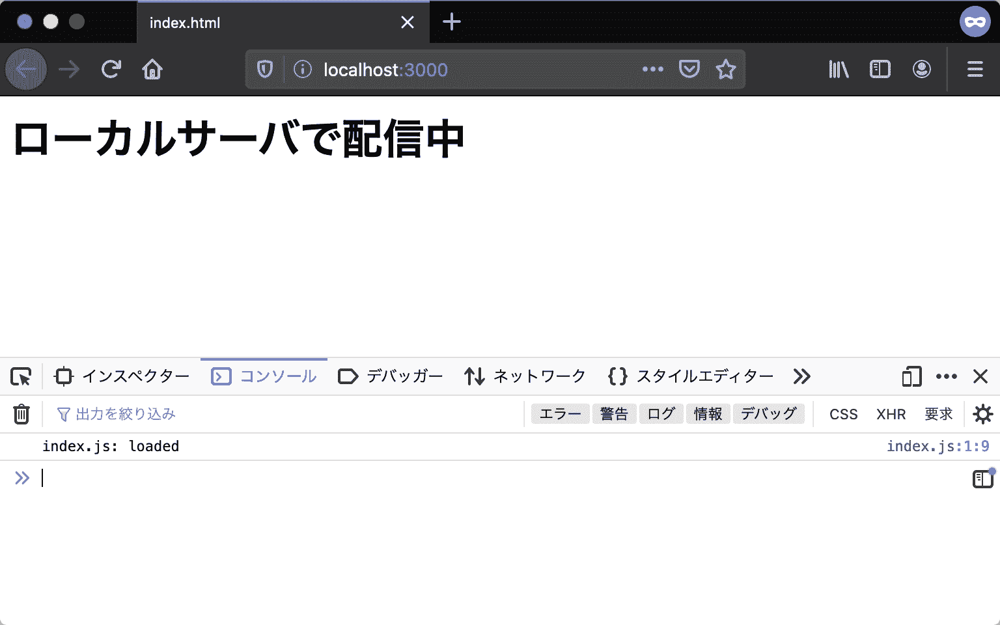

# アプリケーション開発の準備

> 原文：[`jsprimer.net/use-case/setup-local-env/`](https://jsprimer.net/use-case/setup-local-env/)

これまでに学んだJavaScriptの基本構文は、実行環境を問わずに使えるものです。 しかしこの後に続くユースケースの章では、具体的な実行環境としてウェブブラウザと[Node.js](https://nodejs.org/)の2つを扱います。 また、ブラウザで実行するアプリケーションであっても、その開発にはツールとしてのNode.jsが欠かせません。 このセクションではユースケースの学習へ進むために必要なアプリケーション開発環境の準備をします。

## [](#install-nodejs)*Node.jsのインストール*

*[Node.js](https://nodejs.org/)はサーバーサイドJavaScript 実行環境のひとつで、次のような特徴があります。

+   ウェブブラウザのChromeと同じ[V8](https://v8.dev/) JavaScriptエンジンで動作する

+   オープンソースで開発されている

+   OSを問わずクロスプラットフォームで動作する

Node.jsはサーバーサイドで使うために開発されました。 しかし今ではコマンドラインツールや[Electron](https://www.electronjs.org/)などのデスクトップアプリケーションにも利用されています。 そのため、Node.jsはサーバーサイドに限らずクライアントサイドのJavaScript 実行環境としても幅広く使われています。

Node.jsは多くの他のプログラミング言語と同じように、実行環境をマシンにインストールすることで使用できます。 公式の[ダウンロードページ](https://nodejs.org/en/download/)から、開発用のマシンに合わせたインストーラをダウンロードして、インストールしましょう。

+   ダウンロードページのURL: [`nodejs.org/en/download/`](https://nodejs.org/en/download/)

Node.jsには**LTS（Long-Term Support）**版と最新版の2つのリリース版が��ります。 **LTS（Long-Term Support）**版は2 年間のメンテナンスとサポートが宣言されたバージョンです。 具体的には、後方互換性を壊さない範囲でのアップデートと、継続的なセキュリティパッチの提供が行われます。 一方で、最新版はNode.jsの最新の機能を使用できますが、常に最新のバージョンしかメンテナンスされません。 ほとんどのユーザーは、LTS 版を用いることが推奨されます。Node.jsでの開発が初めてであれば、迷わずにLTS 版のインストーラをダウンロードしましょう。 この章では執筆時点の最新 LTS 版であるバージョン20.11.1で動作するように開発します。

インストールが完了すると、コマンドラインで`node`コマンドが使用可能になっているはずです。 次のコマンドを実行して、インストールされたNode.jsのバージョンを確認しましょう （`$`はコマンドラインの入力欄を表す記号であるため、実際に入力する必要はありません）。

```
$ node -v
v20.11.1 
```

また、Node.jsには[npm](https://www.npmjs.com/)というパッケージマネージャーが同梱されています。 Node.jsをインストールすると、`node`コマンドだけでなくnpmを扱うための`npm`コマンドも使えるようになっています。 次のコマンドを実行して、インストールされたnpmのバージョンを確認しましょう。

```
$ npm -v
10.2.4 
```

Node.jsとnpmのバージョン番号は`{major}.{minor}.{patch}`という構成になっていて、先頭のメジャーバージョンが同じなら互換性は保証されています。

Node.jsのライブラリのほとんどはnpmを使ってインストールできます。 npmや`npm`コマンドについての詳細は[npmの公式ドキュメント](https://docs.npmjs.com/)や[npmのGitHubリポジトリ](https://github.com/npm/cli)を参照してください。 実際に、ユースケースの章ではnpmを使ってライブラリをインストールして利用します。

## [](#npx-execution)*npxコマンドによるnpmパッケージの実行*

*Node.jsを使ったコマンドラインツールは数多く公開されており、npmでインストールすることによりコマンドとして実行できるようになります。 ところで、Node.jsのインストールにより、[npx](https://docs.npmjs.com/cli/v8/commands/npx/)というコマンドも使えるようになっています。 `npx`コマンドを使うと、npmで公開されている実行可能なパッケージのインストールと実行をまとめてできます。 この後のユースケースでも`npx`コマンドでツールを利用するため、ここでツールの実行を試してみましょう。

ここでは例として[@js-primer/hello-world](https://github.com/js-primer/hello-world)というサンプル用のパッケージを実行します。 `npx`コマンドでコマンドラインツールを実行するには、次のように `npx`コマンドにパッケージ名を渡して実行します。 npx 7から、初めて実行するコマンドは対話式のプロンプトでパッケージをインストールするかが確認されます。 このプロンプトに対してEnterキーを押すとインストールが開始され、コマンドが実行されます。

```
$ npx @js-primer/hello-world
Need to install the following packages:
  @js-primer/[[email protected]](/cdn-cgi/l/email-protection)
Ok to proceed? (y)
# 初回は@js-primer/hello-worldをインストールしていいかを確認するプロンプトが表示される
# Enterを押すとインストールが開始され、コマンドが実行される

Hello World! 
```

デフォルトでは対話式のプロンプトが挟まれますが、次のように`--yes`オプションを付与すると自動的にインストールとコマンドが実行され��す。

```
# --yesオプションで、インストールの確認プロンプトをスキップする
$ npx --yes @js-primer/hello-world
Hello World! 
```

このように、`npx`コマンドを使うことによりnpmで公開されているコマンドラインツールを簡単に実行できます。

### [](#command-line-tools-installation)*[コラム] コマンドラインツールのインストールと実行*

*npmで公開されているコマンドラインツールを実行する方法は`npx`コマンドだけではありません。 `npm install`コマンドを使ってパッケージをインストールし、インストールされたパッケージのコマンドを実行する方法があります。 通常の`npm install`コマンドは実行したカレントディレクトリにパッケージをインストールしますが、`--global`フラグを加えるとパッケージをグローバルインストールします。 グローバルインストールされたパッケージのコマンドは、`node`コマンドや`npm`コマンドと同じように、任意の場所から実行できます。

下面的示例中，全局安装了`@js-primer/hello-world`包。 然后，调用包含的`js-primer-hello-world`命令而无需指定绝对路径。

```
$ npm install --global @js-primer/hello-world
$ js-primer-hello-world
Hello World! 
```

## [](#local-server)*本地服务器的设置*

*在“值的评估和显示”章节中，创建了名为`index.html`和`index.js`的文件并在浏览器中显���。 当直接在浏览器中加载本地创建的 HTML 文件时，浏览器的地址栏将显示以`file:///`开头的 URL。 使用`file`模式时，由于[同源策略](https://developer.mozilla.org/ja/docs/Web/Security/Same-origin_policy)的安全限制，应用程序在许多情况下将无法正常运行。

在接下来的用例章节中，我们将编写的应用程序为了避免[同源策略](https://developer.mozilla.org/ja/docs/Web/Security/Same-origin_policy)的限制，假定使用`http`模式的 URL 进行访问。 通过使用开发用的本地服务器，可以使用`http`模式的 URL 来显示在本地创建的 HTML 文件。

在这里，我们将看到如何设置用于开发的本地服务器。

### [](#preparing-html)*准备 HTML 文件*

*首先，让我们创建一个只放置最基本元素的 HTML 文件。 在这里，我们创建了名为`index.html`的文件，并在 HTML 文件中编写如下内容。 在这个 HTML 文件中，使用`script`元素加载名为`index.js`的 JavaScript 文件。

index.html

```
<!DOCTYPE html>
<html lang="ja">
  <head>
    <meta charset="utf-8" />
    <title>index.html</title>
  </head>
  <body>
    <h1>ローカルサーバで配信中</h1>
    <script src="index.js"></script>
  </body>
</html> 
```

类似地，创建名为`index.js`的 JavaScript 文件。 在这个`index.js`文件中，只需编写输出日志以确认脚本已正确加载的处理。

index.js

```
console.log("index.js: loaded"); 
```

### [](#open-js-primer-local-server)*启动本地服务器*

*在与刚刚创建的`index.html`相同的目录中，启动本地服务器。 使用以下命令，可以下载并执行为本书创建的本地服务器模块[@js-primer/local-server](https://github.com/js-primer/local-server)。 该本地服务器模块具有提供在执行目录中的文件的功能，以便通过`http`模式的 URL 访问本地文件。

```
# からはじまる行はコメントなので実行はしなくてよい
# cdコマンドでファイルがあるディレクトリまで移動
$ cd "index.htmlがあるディレクトリのパス"

# npx コマンドでローカルサーバーを起動
$ npx --yes @js-primer/local-server

js-primerのローカルサーバーを起動しました。
次のURLをブラウザで開いてください。

  URL: http://localhost:3000 
```

当访问启动的本地服务器的 URL（`http://localhost:3000`）时，将显示先前的`index.html`内容。 在许多服务器中，如果不指定文件路径，例如`http://localhost:3000`，则会提供`index.html`。 `@js-primer/local-server`也具有此功能，因此`http://localhost:3000`和`http://localhost:3000/index.html`两个 URL 都提供相同的`index.html`。



如果可以访问`index.html`，请检查`index.js`是否正确加载。 要查看通过 Console API 输出的日志，请打开浏览器的开发者工具。 大多数浏览器都包含开发者工具，但本书中将使用 Firefox 进行演示。

可以通过以下任一方法打开 Firefox 的开发者工具。

+   从 Firefox 菜单（如果有菜单栏或在 macOS 上，从工具菜单）中选择“Web 开发工具”子菜单中的“浏览器工具”

+   按下键盘快捷键 Ctrl+Shift+K（在 macOS 上为 Command+Option+K）

有关详细信息，请参阅“[浏览器的开发者工具是什么？](https://developer.mozilla.org/ja/docs/Learn/Common_questions/What_are_browser_developer_tools)”。

### [](#close-js-primer-local-server)*关闭本地服务器*

*最后，关闭启动的本地服务器。 可以通过在启动本地服务器的命令行中按下`Ctrl+C`来关闭。

可以同时启动多个本地服务器，但不能在多个服务器上使用相同的端口号。 端口是指刚刚启动的本地服务器 URL 中的`:3000`部分，表示在 3000 端口上启动了本地服务器。

如果默认端口（3000 端口）已被占用，则`@js-primer/local-server`将查找未使用的端口并启动本地服务器。此外，可以使用`--port`选项在任意端口号上启动本地服务器。

```
$ npx --yes @js-primer/local-server --port 8000 
```

本书将在默认端口号 3000 上使用`@js-primer/local-server`进行操作。 因此，通过按下`Ctrl+C`关闭不再使用的本地服务器，可以确保可以继续使用与书中相同的 URL（端口号）。

## [](#conclusion)*结论*

*在本章中，我们准备好了接下来用例章节所需的环境。

+   安装了 Node.js 的 LTS 版本

+   使用 npm 和 npx 安装和运行模块

+   使用`@js-primer/local-server`模块启动并关闭了本地服务器

npm 中已经有各种各样的本地服务器模块可供使用。本书将使用名为`@js-primer/local-server`的专用本地服务器模块，以确保所使用的本地服务器功能没有差异。
