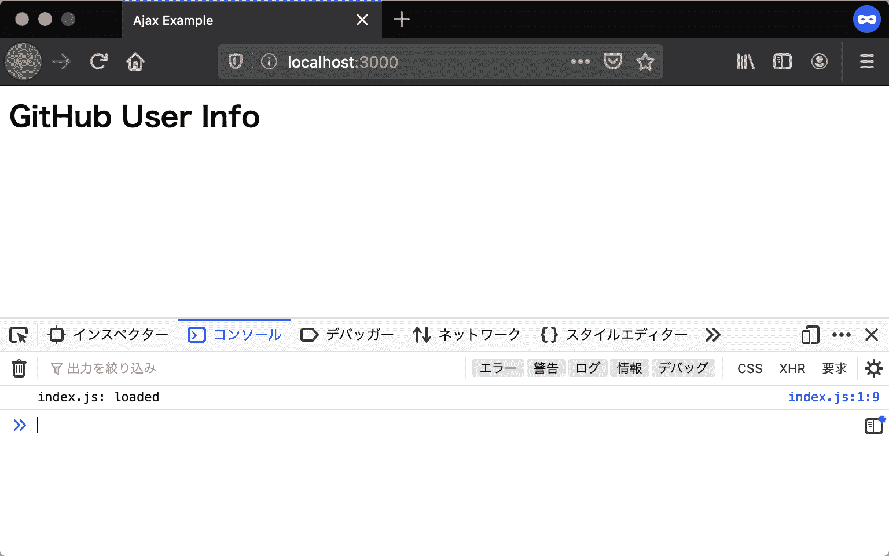

# 入口点

> 原文：[`jsprimer.net/use-case/ajaxapp/entrypoint/`](https://jsprimer.net/use-case/ajaxapp/entrypoint/)

入口点是应用程序中首先调用的部分。 在创建应用程序时，首先需要准备入口点。

在 Web 应用程序中，HTML 文档始终是入口点。 在 Web 浏览器加载 HTML 文档后，将执行在 HTML 文档中加载的 JavaScript。

## [](#create-project-directory)*创建项目目录*

*今次创建的应用程序需要多个文件，包括 HTML 和 JavaScript。 因此，首先要创建一个用于放置这些文件的目录。

在这里，我们将创建一个名为 `ajaxapp` 的新目录。 从这里开始，我们将在创建的 `ajaxapp` 目录下进行操作。

此项目中创建的文件必须保存为 **UTF-8** 编码，并使用 **LF** 作为换行符。

## [](#preparing-html)*准备 HTML 文件*

*作为入口点，首先创建一个名为 `index.html` 的文件，其中仅包含最基本的元素。 在 `body` 元素的底部加载的 `index.js` 是负责处理本次应用程序逻辑的 JavaScript 文件。

index.html

```
<!DOCTYPE html>
<html lang="ja">
  <head>
    <meta charset="utf-8" />
    <title>Ajax Example</title>
  </head>
  <body>
    <h2>GitHub User Info</h2>
    <script src="index.js"></script>
  </body>
</html> 
```

接下来在同一目录下创建一个名为 `index.js` 的文件。 在 `index.js` 中，只需编写输出控制台日志以确认脚本已正确加载的代码。

index.js

```
console.log("index.js: loaded"); 
```

在 `ajaxapp` 目录中，文件布局应如下所示。

```
ajaxapp
├── index.html
└── index.js 
```

接下来，打开浏览器查看 `index.html`，并确保控制台输出日志。

## [](#local-server)*在本地服务器上查看 HTML*

*在打开 `index.html` 之前，请准备开发用的本地服务器。 虽然可以直接打开 HTML 文件而不启动本地服务器，但在这种情况下，URL 将以 `file:///` 开头。 使用 `file` 协议时，由于[同源策略](https://developer.mozilla.org/ja/docs/Web/Security/Same-origin_policy)的安全限制，应用程序在许多情况下将无法正常工作。 本章假定您已经启动了本地服务器，并使用 `http` 协议的 URL 进行访问。

在命令行中切换到 `ajaxapp` 目录，并使用以下命令启动本地服务器。 使用以下命令，将下���并执行为本书创建的名为 `@js-primer/local-server` 的本地服务器模块。 如果尚未准备好 `npx` 命令，请先参考“应用程序开发的准备”章节。

```
# cdコマンドでajaxapp/ディレクトリに移動する
$ cd ajaxapp/
# ajaxapp/をルートにしたローカルサーバーを起動する
$ npx --yes @js-primer/local-server 
```

访问启动的本地服务器的 URL（`http://localhost:3000`），将在控制台中输出 `"index.js: loaded"`。 要查看使用 Console API 输出的日志，请打开 Web 浏览器的开发者工具。 大多数浏览器都包含开发者工具，但本章将使用 Firefox 进行演示。 可以通过以下任一方法打开 Firefox 的开发者工具。

+   Firefox 菜单（如果有菜单栏或 macOS，则为工具菜单）中选择“浏览器工具”子菜单中的“Web 开发工具”

+   按下键盘快捷键 Ctrl+Shift+K（macOS 中为 Command+Option+K）

请参考“[浏览器开发者工具是什么？](https://developer.mozilla.org/ja/docs/Learn/Common_questions/What_are_browser_developer_tools)”获取更多详细信息。



## [](#web-browsers-and-dom)*Web 浏览器和 DOM*

*在加载 HTML 文档到浏览器时，会生成一种称为 DOM（[文档对象模型](https://developer.mozilla.org/ja/docs/Web/API/Document_Object_Model/Introduction)）的编程数据表示。 **DOM（文档对象模型）** 是一种可以从 JavaScript 中操作 HTML 文档内容和结构的对象。 DOM 使用树结构表示 HTML 文档中标签的嵌套关系，因此 DOM 表示的 HTML 标签树结构被称为 **DOM 树**。

例如，DOM 中有一个表示 HTML 文档本身的 `document` 全局对象。 `document` 全局对象实现了获取指定 HTML 元素和创建新 HTML ���素的方法。 使用 `document` 全局对象，可以从 JavaScript 中操作先前在 `index.html` 中编写的 HTML。

```
// CSSセレクタを使ってDOMツリー中のh2 要素を取得する
const heading = document.querySelector("h2");
// h2 要素に含まれるテキストコンテンツを取得する
const headingText = heading.textContent;

// button 要素を作成する
const button = document.createElement("button");
button.textContent = "Push Me";
// body 要素の子要素としてbuttonを挿入する
document.body.appendChild(button); 
```

JavaScript 和 DOM 在 Web 应用程序开发中是密不可分的关系。 要创建动态 Web 应用程序，必须使用 JavaScript 操作 DOM。 在本用例中，我们将根据从 GitHub API 获取的数据动态操作 DOM 树以更新屏幕显示。

但是，DOM 不是语言功能（ECMAScript），而是浏览器实现的 API。 因此，在没有 DOM 的执行环境（如 Node.js）中无法使用，需要注意的是，像 `document` 这样的全局对象也不存在。

## [](#section-checklist)*本节的检查清单*

*このセクションでは、エントリーポイントとなるHTMLを作成し、JavaScriptモジュールのエントリーポイントとなるJavaScriptファイルを読み込むところまでを実装しました。

+   `ajaxapp`という名前のプロジェクトディレクトリを作成した

+   エントリーポイントとなる`index.html`を作成した

+   JavaScriptのエントリーポイントとなる`index.js`を作成し`index.html`から読み込んだ

+   ローカルサーバーを使ってブラウザで`index.html`を表示した

+   `index.js`からコンソールに出力されたログを確認した

+   JavaScriptからHTMLドキュメントを操作するDOMについて学んだ

ここまでのアプリは次のURLで確認できます。

+   [`jsprimer.net/use-case/ajaxapp/entrypoint/example/`](https://jsprimer.net/use-case/ajaxapp/entrypoint/example/)*****
