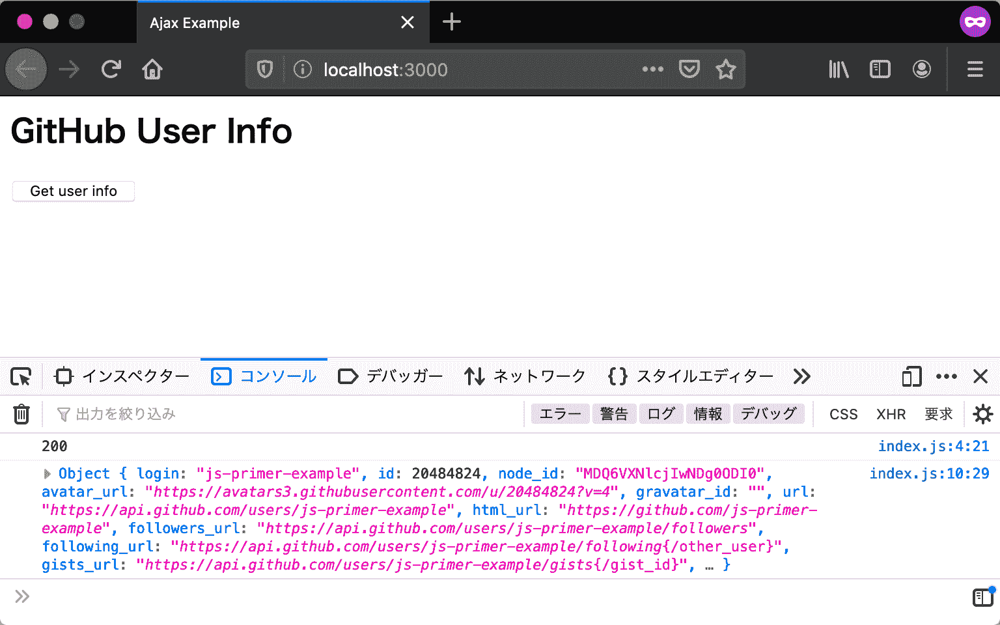
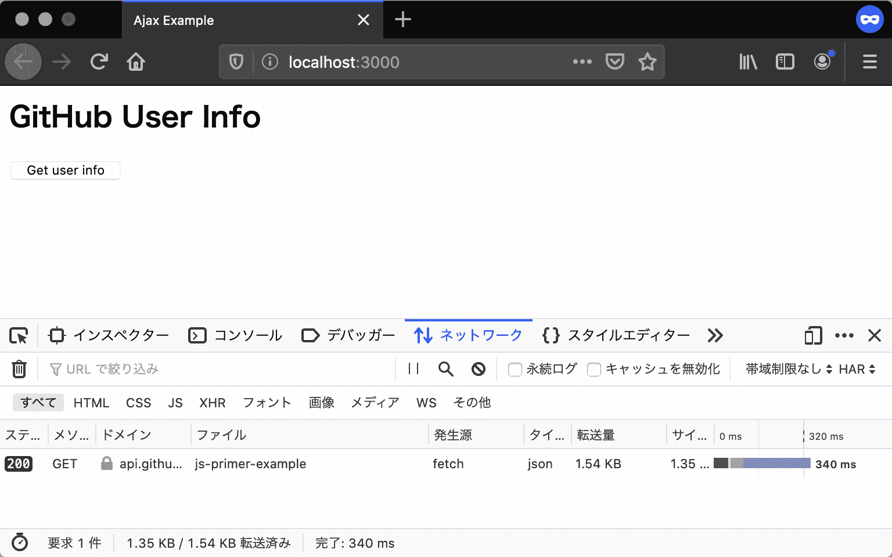

# HTTP 通信

> 原文：[`jsprimer.net/use-case/ajaxapp/http/`](https://jsprimer.net/use-case/ajaxapp/http/)

ローカルサーバーでアプリケーションが実行できるようになったので、次はGitHubのAPIを呼び出す処理を実装していきます。 GitHubのAPIを呼び出すためにはHTTP 通信をする必要があります。 ウェブブラウザ上でJavaScriptからHTTP 通信するために、[Fetch API](https://developer.mozilla.org/ja/docs/Web/API/Fetch_API)という機能を使います。

## [](#fetch-api)*Fetch API*

***Fetch API**はHTTP 通信を行ってリソースを取得するためのAPIです。 Fetch APIを使うことで、ページ全体を再読み込みすることなく指定したURLからデータを取得できます。 Fetch APIは同じくHTTP 通信を扱う[XMLHttpRequest](https://developer.mozilla.org/ja/docs/Web/API/XMLHttpRequest)と似たAPIですが、より強力で柔軟な操作が可能です。

リクエストを送信するためには、`fetch`メソッドを利用します。 `fetch`メソッドは引数で指定したURLに対して、HTTPリクエストを行えます。

GitHubにはユーザー情報を取得するAPIとして、`https://api.github.com/users/GitHubユーザーID`というURLが用意されています。 GitHubのユーザーIDには、英数字と`-`（ハイフン）以外は利用できないため、ユーザーIDは`encodeURIComponent`関数を使ってエスケープしたものを結合します。`encodeURIComponent`は`/`や`%`などURLとして特殊な意味を持つ文字列をただの文字列として扱えるようにエスケープする関数です。

次のコードでは、指定したGitHubユーザーIDの情報を取得するURLに対して`fetch`メソッドで、GETのHTTPリクエストを行っています。

```
const userId = "任意のGitHubユーザーID";
fetch(`https://api.github.com/users/${encodeURIComponent(userId)}`); 
```

## [](#receive-response)*レスポンスの受け取り*

*GitHubのAPIに対してHTTPリクエストを送信しましたが、まだレスポンスを受け取る処理を書いていません。 次はサーバーから返却されたレスポンスのログをコンソールに出力する処理を実装します。

`fetch`メソッドは`Promise`を返します。この`Promise`インスタンスはリクエストのレスポンスを表す`Response`オブジェクトでresolveされます。 送信したリクエストにレスポンスが返却されると、`then`コールバックが呼び出されます。

次のように、`Response`オブジェクトの`status`プロパティからは、HTTPレスポンスのステータスコードが取得できます。 また、`Response`オブジェクトの`json`メソッドも`Promise`を返します。これは、HTTPレスポンスボディをJSONとしてパースしたオブジェクトでresolveされます。 ここでは、書籍用に用意した`js-primer-example`というGitHubアカウントのユーザー情報を取得しています。

```
const userId = "js-primer-example";
fetch(`https://api.github.com/users/${encodeURIComponent(userId)}`)
    .then(response => {
        console.log(response.status); // => 200
        return response.json().then(userInfo => {
            // JSONパースされたオブジェクトが渡される
            console.log(userInfo); // => {...}
        });
    }); 
```

## [](#error-handling)*エラーハンドリング*

*HTTP 通信にはエラーがつきものです。 そのためFetch APIを使った通信においても、エラーをハンドリングする必要があります。 たとえば、サーバーとの通信に際してネットワークエラーが発生した場合は、ネットワークエラーを表す`NetworkError`オブジェクトでrejectされた`Promise`が返されます。 すなわち、`then`メソッドの第二引数か`catch`メソッドのコールバック関数が呼び出されます。

```
const userId = "js-primer-example";
fetch(`https://api.github.com/users/${encodeURIComponent(userId)}`)
    .then(response => {
        console.log(response.status);
        return response.json().then(userInfo => {
            console.log(userInfo);
        });
    }).catch(error => {
        console.error(error);
    }); 
```

一方で、リクエストが成功したかどうかは`Response`オブジェクトの`ok`プロパティで認識できます。 `ok`プロパティは、HTTPステータスコードが200 番台であれば`true`を返し、それ以外の400や500 番台などなら`false`を返します。 次のように、`ok`プロパティが`false`となるエラーレスポンスをハンドリングできます。

```
const userId = "js-primer-example";
fetch(`https://api.github.com/users/${encodeURIComponent(userId)}`)
    .then(response => {
        console.log(response.status); 
        // エラーレスポンスが返されたことを検知する
        if (!response.ok) {
            console.error("エラーレスポンス", response);
        } else {
            return response.json().then(userInfo => {
                console.log(userInfo);
            });
        }
    }).catch(error => {
        console.error(error);
    }); 
```

ここまでの内容をまとめ、GitHubからユーザー情報を取得する関数を`fetchUserInfo`という名前で定義します。

```
function fetchUserInfo(userId) {
    fetch(`https://api.github.com/users/${encodeURIComponent(userId)}`)
        .then(response => {
            console.log(response.status);
            // エラーレスポンスが返されたことを検知する
            if (!response.ok) {
                console.error("エラーレスポンス", response);
            } else {
                return response.json().then(userInfo => {
                    console.log(userInfo);
                });
            }
        }).catch(error => {
            console.error(error);
        });
} 
```

index.jsでは関数を定義しているだけで、呼び出しは行っていません。

ページを読み込むたびにGitHubのAPIを呼び出すと、呼び出し回数の制限を超えるおそれがあります。 呼び出し回数の制限を超えると、APIからの��スポンスがステータスコード403のエラーになってしまいます。

そのため、HTMLドキュメント側に手動で`fetchUserInfo`関数を呼び出すためのボタンを追加します。 ボタンのclickイベントで`fetchUserInfo`関数を呼び出し、取得したいユーザーIDを引数として与えています。 例として`js-primer-example`という書籍用に用意したGitHubアカウントを指定しています。

```
<!DOCTYPE html>
<html lang="ja">
  <head>
    <meta charset="utf-8" />
    <title>Ajax Example</title>
  </head>
  <body>
    <h2>GitHub User Info</h2>

    <button onclick="fetchUserInfo('js-primer-example');">Get user info</button>
    <script src="index.js"></script>
  </body>
</html> 
```

準備ができたら、ローカルサーバーを立ち上げてindex.htmlにアクセスしましょう。 ボタンを押すとHTTP 通信が行われ、コンソールにステータスコードとレスポンスのログが出力されます。



また、開発者ツールのネットワークパネルを開くと、GitHubのサーバーに対してHTTP 通信が行われていることを確認できます。



## [](#xhr)*[コラム] XMLHttpRequest*

*[XMLHttpRequest](https://developer.mozilla.org/ja/docs/Web/API/XMLHttpRequest)（**XHR**）はFetch APIと同じくHTTP 通信を行うためのAPIです。 Fetch APIが標準化される以��は、ブラウザとサーバーの間で通信するにはXHRを使うのが一般的でした。 このセクションで扱ったFetch APIによる`fetchUserInfo`関数は、XHRを使うと次のように書けます。

```
function fetchUserInfo(userId) {
    // リクエストを作成する
    const request = new XMLHttpRequest();
    request.open("GET", `https://api.github.com/users/${encodeURIComponent(userId)}`);
    request.addEventListener("load", () => {
        // リクエストが成功したかを判定する
        // Fetch APIのresponse.okと同等の意味
        if (request.status >= 200 && request.status < 300) {
            // レスポンス文字列をJSONオブジェクトにパースする
            const userInfo = JSON.parse(request.responseText);
            console.log(userInfo);
        } else {
            console.error("エラーレスポンス", request.statusText);
        }
    });
    request.addEventListener("error", () => {
        console.error("ネットワークエラー");
    });
    // リクエストを送信する
    request.send();
} 
```

Fetch API 是为了取代 XHR 而创建的，大多数情况下不再需要使用 XHR。 另外，由于旧浏览器不支持 Fetch API，为了保持浏览器兼容性，有时会继续使用 XHR。 有关 XHR 的详细用法，请参考[XHR 的使用文档](https://developer.mozilla.org/ja/docs/Web/API/XMLHttpRequest/Using_XMLHttpRequest)。

## [](#section-checklist)*本节的检查清单*

**使用[Fetch API](https://developer.mozilla.org/ja/docs/Web/API/Fetch_API)发送 HTTP 请求

+   将从 GitHub API 获取的用户信息的 JSON 对象输出到控制台

+   对 Fetch API 的调用进行错误处理

+   声明`fetchUserInfo`函数，并在按钮的点击事件中调用它

您可以在以下 URL 中查看到目前的应用程序。

+   [`jsprimer.net/use-case/ajaxapp/http/example/`](https://jsprimer.net/use-case/ajaxapp/http/example/)
