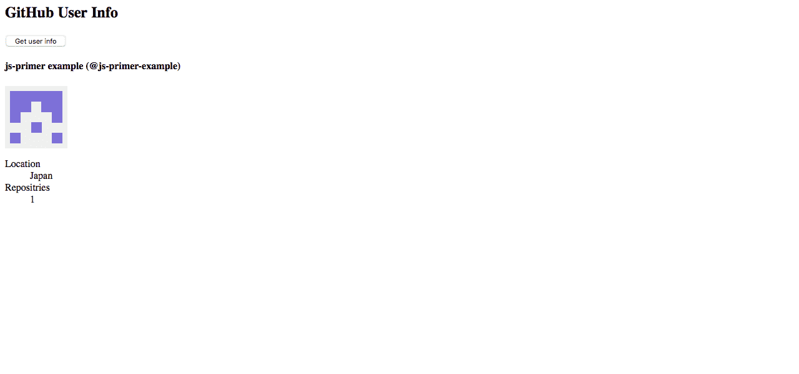

# データを表示する

> 原文：[`jsprimer.net/use-case/ajaxapp/display/`](https://jsprimer.net/use-case/ajaxapp/display/)

前のセクションでは、Fetch APIを使ってGitHubのAPIからユーザー情報を取得しました。 このセクションでは取得したデータをHTMLに整形して、アプリケーションにユーザー情報を表示してみましょう。

## [](#markup-html)*HTMLを組み立てる*

*HTML 文字列の生成にはテンプレートリテラルを使います。 テンプレートリテラルは文字列中の改行が可能なため、HTMLのインデントを表現できて見通しが良くなります。 また、変数の埋め込みも簡単なため、HTMLのテンプレートに対して動的なデータをあてはめるのに適しています。

次のコードではGitHubのユーザー情報から組み立てるHTMLのテンプレートを宣言しています。

```
const view = `
<h4>${userInfo.name} (@${userInfo.login})</h4>

<dl>
    <dt>Location</dt>
    <dd>${userInfo.location}</dd>
    <dt>Repositories</dt>
    <dd>${userInfo.public_repos}</dd>
</dl>
`; 
```

このテンプレートに`userInfo`オブジェクトの値をあてはめると、次のようなHTML 文字列になります。

```
<h4>js-primer example (@js-primer-example)</h4>

<dl>
    <dt>Location</dt>
    <dd>Japan</dd>
    <dt>Repositories</dt>
    <dd>1</dd>
</dl> 
```

## [](#html-to-dom)*HTML 文字列をDOMに追加する*

*次に、生成したHTML 文字列をDOMツリーに追加して表示します。 まずは動的にHTMLをセットするために、目印となる要素を`index.html`に追加します。 今回は`result`というidを持ったdiv 要素（以降`div#result`要素と表記します）を配置します。

index.html

```
<!DOCTYPE html>
<html lang="ja">
  <head>
    <meta charset="utf-8" />
    <title>Ajax Example</title>
  </head>
  <body>
    <h2>GitHub User Info</h2>

    <button onclick="fetchUserInfo('js-primer-example');">Get user info</button>
    <!-- 整形したHTMLの挿入先 -->
    <div id="result"></div>

    <script src="index.js"></script>
  </body>
</html> 
```

ここから、`div#result`要素の子要素としてHTML 文字列を挿入することになります。 [document.getElementById](https://developer.mozilla.org/ja/docs/Web/API/Document/getElementById)メソッドを使い、id 属性が設定された要素にアクセスします。 `div#result`要素が取得できたら、先ほど生成したHTML 文字列を`innerHTML`プロパティにセットします。

```
const result = document.getElementById("result");
result.innerHTML = view; 
```

JavaScriptによってHTML 要素をDOMに追加する方法には、大きく分けて２つあります。 1つは、今回のようにHTML 文字列を[ElementのinnerHTML](https://developer.mozilla.org/ja/docs/Web/API/Element/innerHTML)プロパティにセットする方法です。 もう1つは、文字列ではなく[Element](https://developer.mozilla.org/ja/docs/Web/API/Element)オブジェクトを生成して[手続き的にツリー構造を構築する](https://developer.mozilla.org/ja/docs/Web/API/Node/appendChild)方法です。 後者はセキュリティ的に安全ですが、コードは少し冗長になります。 今回はElementの`innerHTML`プロパティを使いつつ、セキュリティのためのエスケープ処理を行います。

## [](#escape-html)*HTML 文字列をエスケープする*

*Elementの`innerHTML`プロパティに文字列をセットすると、その文字列はHTMLとして解釈されます。 たとえばGitHubのユーザー名に`<`記号や`>`記号が含まれていると、意図しない構造のHTMLになる可能性があります。 これを回避するために、文字列���セットする前に、特定の記号を安全な表現に置換する必要があります。 この処理を一般にHTMLのエスケープと呼びます。

多くのViewライブラリは内部にエスケープ機構を持っていて、動的にHTMLを組み立てるときにはデフォルトでエスケープをしてくれます。 または、[HTMLエスケープ用のライブラリ](https://github.com/teppeis/htmlspecialchars)を利用するケースも多いでしょう。 今回のように独自実装するのは特別なケースで、一般的にはライブラリが提供する機能を使うのがほとんどです。

次のように、特殊な記号に対するエスケープ処理を`escapeSpecialChars`関数として宣言します。

```
function escapeSpecialChars(str) {
    return str
        .replace(/&/g, "&amp;")
        .replace(/</g, "&lt;")
        .replace(/>/g, "&gt;")
        .replace(/"/g, "&quot;")
        .replace(/'/g, "&#039;");
} 
```

この`escapeSpecialChars`関数を、HTML 文字列の中で`userInfo`から値を注入しているすべての箇所で呼び出します。 ただし、テンプレートリテラル中で挿入している部分すべてに関数を適用するのは手間ですし、メンテナンス性もよくありません。 そこで、タグつきテンプレート関数を利用することで、明示的にエスケープ用の関数を呼び出す必要がないようにします。 タグつきテンプレート関数は、テンプレートによる値の埋め込み時に呼ばれる関数を扱えます。

次の`escapeHTML`関数は**タグ関数**です（詳細は「文字列」の章の「タグつきテンプレート関数」を参照）。 タグ関数には、第一引数に文字列リテラルの配列、第二引数に埋め込まれる値の配列が与えられます。 `escapeHTML`関数では、文字列リテラルと値が元の順番どおりに並ぶように文字列を組み立てつつ、 値が文字列型であればエスケープするようにしています。

```
function escapeHTML(strings, ...values) {
    return strings.reduce((result, str, i) => {
        const value = values[i - 1];
        if (typeof value === "string") {
            return result + escapeSpecialChars(value) + str;
        } else {
            return result + String(value) + str;
        }
    });
} 
```

`escapeHTML`関数はタグ関数なので、通常の`()`による呼び出しではなく、テンプレートリテラルに対してタグづけして使います。 テンプレートリテラルのバッククォート記号の前に関数を書くと、関数をタグ関数として呼び出せます。

```
const view = escapeHTML`
<h4>${userInfo.name} (@${userInfo.login})</h4>

<dl>
    <dt>Location</dt>
    <dd>${userInfo.location}</dd>
    <dt>Repositories</dt>
    <dd>${userInfo.public_repos}</dd>
</dl>
`;

const result = document.getElementById("result");
result.innerHTML = view; 
```

これでHTML 文字列の生成とエスケープができました。 これらの処理を前のセクションで作成した `fetchUserInfo` 関数の中で呼び出します。 ここまでで、index.jsとindex.htmlは次のようになっています。

index.js

```
function fetchUserInfo(userId) {
    fetch(`https://api.github.com/users/${encodeURIComponent(userId)}`)
        .then(response => {
            if (!response.ok) {
                console.error("エラーレスポンス", response);
            } else {
                return response.json().then(userInfo => {
                    // HTMLの組み立て
                    const view = escapeHTML`
                    <h4>${userInfo.name} (@${userInfo.login})</h4>
                    
                    <dl>
                        <dt>Location</dt>
                        <dd>${userInfo.location}</dd>
                        <dt>Repositories</dt>
                        <dd>${userInfo.public_repos}</dd>
                    </dl>
                    `;
                    // HTMLの挿入
                    const result = document.getElementById("result");
                    result.innerHTML = view;
                });
            }
        }).catch(error => {
            console.error(error);
        });
}

function escapeSpecialChars(str) {
    return str
        .replace(/&/g, "&amp;")
        .replace(/</g, "&lt;")
        .replace(/>/g, "&gt;")
        .replace(/"/g, "&quot;")
        .replace(/'/g, "&#039;");
}

function escapeHTML(strings, ...values) {
    return strings.reduce((result, str, i) => {
        const value = values[i - 1];
        if (typeof value === "string") {
            return result + escapeSpecialChars(value) + str;
        } else {
            return result + String(value) + str;
        }
    });
} 
```

index.html

```
<!DOCTYPE html>
<html lang="ja">
  <head>
    <meta charset="utf-8" />
    <title>Ajax Example</title>
  </head>
  <body>
    <h2>GitHub User Info</h2>

    <button onclick="fetchUserInfo('js-primer-example');">Get user info</button>
    <!-- 整形したHTMLの挿入先 -->
    <div id="result"></div>

    <script src="index.js"></script>
  </body>
</html> 
```

アプリケーションを開いてボタンを押すと、次のようにユーザー情報が表示されます。



## [](#section-checklist)*このセクションのチェックリスト*

**   テンプレートリテラルを使ってHTML 文字列を組み立てた

+   `innerHTML`プロパティを使ってHTML 文字列をDOMに追加した

+   タグつきテンプレート関数を使ってHTML 文字列をエスケープした

+   `fetchUserInfo`関数を呼び出し、HTMLにユーザー情報が表示されることを確認した

ここまでのアプリは次のURLで確認できます。

+   [`jsprimer.net/use-case/ajaxapp/display/example/`](https://jsprimer.net/use-case/ajaxapp/display/example/)
