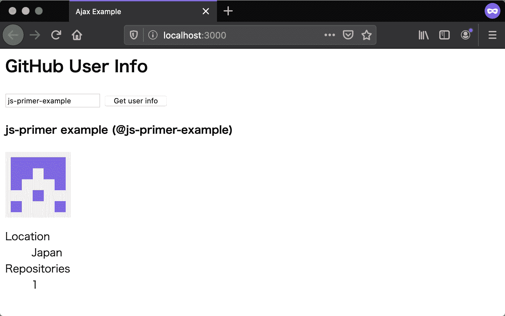

# 利用 Promise

> 原文：[`jsprimer.net/use-case/ajaxapp/promise/`](https://jsprimer.net/use-case/ajaxapp/promise/)

在之前的部分中，我们使用 Fetch API 进行了 Ajax 通信，并且可以显示从服务器获取的数据。最后，通过利用 Fetch API 的返回值，也就是**Promise**，我们可以整理代码并严格进行错误处理。

## [](#split-function)*函数的分割*

*首先，让我们整理一下过大的`fetchUserInfo`函数。在该函数中，我们进行了数据获取、HTML 字符串的构建以及构建的 HTML 的显示。因此，我们将创建一个用于构建 HTML 字符串的`createView`函数和一个用于显示 HTML 的`displayView`函数，并将处理过程分割开来。*

另外，为了更容易进行错误处理，我们将在应用程序中设定一个入口点。我们在`index.js`中创建一个新的`main`函数，并确保从`main`函数调用`fetchUserInfo`函数。

```
function main() {
    fetchUserInfo("js-primer-example");
}

function fetchUserInfo(userId) {
    fetch(`https://api.github.com/users/${encodeURIComponent(userId)}`)
        .then(response => {
            if (!response.ok) {
                console.error("エラーレスポンス", response);
            } else {
                return response.json().then(userInfo => {
                    // HTMLの組み立て
                    const view = createView(userInfo);
                    // HTMLの挿入
                    displayView(view);
                });
            }
        }).catch(error => {
            console.error(error);
        });
}

function createView(userInfo) {
    return escapeHTML`
    <h4>${userInfo.name} (@${userInfo.login})</h4>
    
    <dl>
        <dt>Location</dt>
        <dd>${userInfo.location}</dd>
        <dt>Repositories</dt>
        <dd>${userInfo.public_repos}</dd>
    </dl>
    `;
}

function displayView(view) {
    const result = document.getElementById("result");
    result.innerHTML = view;
} 
```

在按钮的 click 事件中调用的函数将从之前的`fetchUserInfo`函数更改为`main`函数。

index.html

```
<!DOCTYPE html>
<html lang="ja">
  <head>
    <meta charset="utf-8" />
    <title>Ajax Example</title>
  </head>
  <body>
    <h2>GitHub User Info</h2>

    <input id="userId" type="text" value="js-primer-example" />
    <button onclick="main();">Get user info</button>

    <div id="result"></div>

    <script src="index.js"></script>
  </body>
</html> 
```

## [](#error-handling)*Promise 的错误处理*

*接下来，我们将修改`fetchUserInfo`函数，并使其返回 Fetch API 的返回值，即 Promise 对象。通过这种修改，我们可以在调用`fetchUserInfo`函数的`main`函数中处理异步处理的结果。通过 Promise 链抛出的错误可以通过 Promise 的`catch`方法在一个地方处理。*

在下面的代码中，我们将在`main`函数中处理从`fetchUserInfo`函数返回的 Promise 对象的错误，并将其记录到日志中。之前在`fetchUserInfo`函数的`catch`方法中处理的错误将在`main`函数的`catch`方法中处理。另外，无法直接在`main`函数中处理像 400 或 500 这样的错误响应，这些错误通常是通过 Response 的`ok`属性进行判断的。因此，我们使用`Promise.reject`方法返回一个 Rejected 状态的 Promise，以将 Promise 链置于错误状态。由于 Promise 链处于错误状态，因此可以在`main`函数的`catch`中处理它们。

```
function main() {
    fetchUserInfo("js-primer-example")
        .catch((error) => {
            // Promiseチェーンの中で発生したエラーを受け取る
            console.error(`エラーが発生しました (${error})`);
        });
}

function fetchUserInfo(userId) {
    // fetchの返り値のPromiseをreturnする
    return fetch(`https://api.github.com/users/${encodeURIComponent(userId)}`)
        .then(response => {
            if (!response.ok) {
                // エラーレスポンスからRejectedなPromiseを作成して返す
                return Promise.reject(new Error(`${response.status}: ${response.statusText}`));
            } else {
                return response.json().then(userInfo => {
                    // HTMLの組み立て
                    const view = createView(userInfo);
                    // HTMLの挿入
                    displayView(view);
                });
            }
        })
        .catch(err => {
            return Promise.reject(new Error(`Failed fetch user(id: ${userId}) info`, { cause: err }));
        });
} 
```

### [](#refactor-promise-chain)*Promise 链的重构*

*当前的`fetchUserInfo`函数除了获取数据外，还进行了 HTML 的构建（`createView`）和显示（`displayView`）。由于`fetchUserInfo`函数集中了处理，可读性不佳，因此我们将其修改为仅进行数据获取的函数。同时，在`main`函数中，我们将数据获取（`fetchUserInfo`）、HTML 的构建（`createView`）和显示（`displayView`）这一系列流程改为使用 Promise 链进行。*

Promise 的`then`方法连接的 Promise 链会将传递给`then`的回调函数的返回值直接传递给下一个`then`。但是，如果回调函数的返回值是一个 Promise，则将传递给下一个`then`的是该 Promise 解析后的值。换句话说，即使`then`的回调函数从同步处理变为异步处理，下一个`then`接收的值的类型也不会改变。

利用 Promise 链分割处理的优点是可以将处理过程连接起来，而无需区分同步和异步处理。通常来说，将同步编写的处理过程后来改为异步处理是很困难的，因为需要重写整个过程。因此，最好一开始就将处理过程分开，并使用`then`来连接处理过程，这样就能编写出更易于变更的代码。要注意如何分割处理过程，关键是关注每个函数接收的值类型和返回的值类型。通过 Promise 链分割处理过程，可以使每个处理过程简洁明了，代码更具可读性。

我们将`index.js`中的`fetchUserInfo`函数和`main`函数更改如下。首先，我们将使`fetchUserInfo`函数返回 Response 的`json`方法的返回值。Response 的`json`方法的返回值是一个解析为 JSON 对象的 Promise，因此在下一个`then`中将传递用户信息的 JSON 对象。然后，我们将`main`函数修改为在`fetchUserInfo`函数的 Promise 链中执行 HTML 的构建（`createView`）和显示（`displayView`）。

```
function main() {
    fetchUserInfo("js-primer-example")
        // ここではJSONオブジェクトで解決されるPromise
        .then((userInfo) => createView(userInfo))
        // ここではHTML 文字列で解決されるPromise
        .then((view) => displayView(view))
        // Promiseチェーンでエラーがあった場合はキャッチされる
        .catch((error) => {
            console.error(`エラーが発生しました (${error})`);
        });
}

function fetchUserInfo(userId) {
    return fetch(`https://api.github.com/users/${encodeURIComponent(userId)}`)
        .then(response => {
            if (!response.ok) {
                return Promise.reject(new Error(`${response.status}: ${response.statusText}`));
            } else {
                // JSONオブジェクトで解決されるPromiseを返す
                return response.json();
            }
        })
        .catch(err => {
            return Promise.reject(new Error(`Failed fetch user(id: ${userId}) info`, { cause: err }));
        });
} 
```

### [](#rewrite-to-async-function)*重写为 Async Function*

*通过 Promise 链，我们可以以与 Promise 的异步处理相同的方式编写同步处理。此外，使用 Async Function，可以以与同步处理相同的方式编写 Promise 的异步处理。不再需要 Promise 的`then`方法中嵌套的回调函数，代码更加过程化和可读性更高。此外，错误处理与同步处理一样，也可以使用`try...catch`语法。*

我们将`main`函数改写如下。首先，在函数声明之前加上`async`，将其变为 Async Function。然后，在调用`fetchUserInfo`函数时加上`await`。这样，我们就可以将解析为 Promise 的 JSON 对象赋值给`userInfo`变量。

如果在`fetchUserInfo`函数中抛出异常，则可以使用`try...catch`语法进行错误处理。通过这种方式，如果预先让异步处理函数返回 Promise，则更容易重构为 Async Function。

```
async function main() {
    try {
        const userInfo = await fetchUserInfo("js-primer-example");
        const view = createView(userInfo);
        displayView(view);
    } catch (error) {
        console.error(`エラーが発生しました (${error})`);
    }
} 
```

## [](#changeable-userid)*可以更改用户 ID*

*作为最后一步，让我们修改之前在`js-primer-example`中固定的用户 ID。 在 index.html 中添加`<input>`标签，并为从 JavaScript 中获取值而赋予一个名为`userId`的 ID。

index.html

```
<!DOCTYPE html>
<html lang="ja">
  <head>
    <meta charset="utf-8" />
    <title>Ajax Example</title>
  </head>
  <body>
    <h2>GitHub User Info</h2>

    <input id="userId" type="text" value="js-primer-example" />
    <button onclick="main();">Get user info</button>

    <div id="result"></div>

    <script src="index.js"></script>
  </body>
</html> 
```

在 index.js 中添加处理来自`<input>`标签的值的代码后，最终结果如下。

index.js

```
async function main() {
    try {
        const userId = getUserId();
        const userInfo = await fetchUserInfo(userId);
        const view = createView(userInfo);
        displayView(view);
    } catch (error) {
        console.error(`エラーが発生しました (${error})`);
    }
}

function fetchUserInfo(userId) {
    return fetch(`https://api.github.com/users/${encodeURIComponent(userId)}`)
        .then(response => {
            if (!response.ok) {
                return Promise.reject(new Error(`${response.status}: ${response.statusText}`));
            } else {
                return response.json();
            }
        });
}

function getUserId() {
    return document.getElementById("userId").value;
}

function createView(userInfo) {
    return escapeHTML`
    <h4>${userInfo.name} (@${userInfo.login})</h4>
    
    <dl>
        <dt>Location</dt>
        <dd>${userInfo.location}</dd>
        <dt>Repositories</dt>
        <dd>${userInfo.public_repos}</dd>
    </dl>
    `;
}

function displayView(view) {
    const result = document.getElementById("result");
    result.innerHTML = view;
}

function escapeSpecialChars(str) {
    return str
        .replace(/&/g, "&amp;")
        .replace(/</g, "&lt;")
        .replace(/>/g, "&gt;")
        .replace(/"/g, "&quot;")
        .replace(/'/g, "&#039;");
}

function escapeHTML(strings, ...values) {
    return strings.reduce((result, str, i) => {
        const value = values[i - 1];
        if (typeof value === "string") {
            return result + escapeSpecialChars(value) + str;
        } else {
            return result + String(value) + str;
        }
    });
} 
```

运行应用程序后，情况如下。 由于满足了要求，因此该应用程序已完成。



## [](#section-checklist)*本节的检查清单*

**将 HTML 的构建和显示逻辑分离到`createView`函数和`displayView`函数中**

+   声明了`main`函数，并处理了`fetchUserInfo`函数返回的 Promise 的错误

+   使用 Promise 链对`fetchUserInfo`函数进行了重构

+   使用 Async Function 对`main`函数进行了重构

+   在`index.html`中添加`<input>`标签，并在`getUserId`函数中获取用户 ID

本章创建的应用程序可以在以下 URL 中查看。

+   [`jsprimer.net/use-case/ajaxapp/promise/example/`](https://jsprimer.net/use-case/ajaxapp/promise/example/)******
