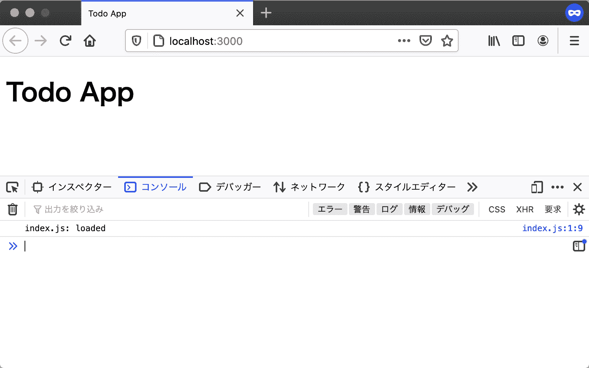

# 入口点

> 原文：[`jsprimer.net/use-case/todoapp/entrypoint/`](https://jsprimer.net/use-case/todoapp/entrypoint/)

エントリーポイント指的是应用程序中首先调用的部分。

在“Ajax 通信:エントリーポイント”用例中，入口点只是 HTML（`index.html`）。 首先加载 HTML，然后加载 HTML 中的`script`元素指定的 JavaScript 文件。

本 Todo 应用程序将 JavaScript 处理模块化，并将每个模块作为单独的 JavaScript 文件创建。 JavaScript 模块可以通过 HTML 中的`<script type="module">`加载，但每个`script`元素都有自己的模块作用域。 模块作用域是指在模块的顶层自动创建的作用域，位于全局作用域下。 通过在不同的`script`元素中加载 JavaScript 模块，模块之间的作用域不同，因此无法协作。

下面的代码示例展示了由于每个`<script type="module">`的作用域不同，无法访问在另一个`script`元素中定义的变量。 这也适用于将 JavaScript 模块作为文件并通过`src`属性加载的情况。

```
 <script type="module"> export const scopeA = "A"; </script>
  <script type="module"> // 異なるmoduleスコープの変数には直接アクセスできない
    console.log(scopeA); // => ReferenceError: scopeA is not defined </script> 
```

当将模块分别放在不同的`script`元素中处理时，模块之间无法协作。 因此，在 HTML 中只加载`index.js`的`script`元素，并从`index.js`中使用`import`语句加载其他模块。 通过使用`import`语句，模块之间将位于一个`<script type="module">`的作用域内，从而实现模块之间的协作。 将从 HTML 加载的 JavaScript 文件（`index.js`）作为 JavaScript 的入口点。

因此，在本次创建的 Todo 应用程序中，我们将准备 HTML 和 JavaScript 这两个入口点。

+   `index.html`：首先加载的文件，加载`index.js`

+   `index.js`：从`index.html`加载的文件，JavaScript 中首先加载的文件

在本节中，我们将创建这两个入口点并加载它们。

## [](#project-directory)*创建项目目录*

*在这个应用中，需要多个文件，包括 HTML 和 JavaScript 等。因此，首先要创建一个目录来存放这些文件。

在这里，我们将创建一个名为`todoapp`的新目录。 然后我们将在创建的`todoapp`目录下继续操作。

在这个项目中，确保将文件保存为**UTF-8**编码，并使用**LF**作为换行符。

## [](#preparing-html)*准备 HTML 文件*

*首先，创建一个包含最基本元素的 HTML 文件作为入口点。 在`todoapp`目录中创建名为`index.html`的 HTML 文件，并编写以下内容。 在`body`元素的底部使用`script`元素加载`index.js`，这是本应用程序的处理 JavaScript 文件。

index.html

```
<!DOCTYPE html>
<html lang="ja">
  <head>
    <meta charset="utf-8" />
    <title>Todo App</title>
  </head>
  <body>
    <h1>Todo App</h1>
    <script type="module" src="index.js"></script>
  </body>
</html> 
```

接下来，在`todoapp`目录中创建`index.js`，内容如下。 为了确保`index.js`被正确加载，我们只编写输出日志到控制台的处理。

index.js

```
console.log("index.js: loaded"); 
```

到目前为止，`todoapp`目录的文件布局如下：

```
todoapp
├── index.html
└── index.js 
```

接下来，我们将在浏览器中打开`index.html`，并确认控制台中是否输出了日志。

## [](#local-server)*在本地服务器上查看 HTML*

*在打开`index.html`之前，准备一个用于开发的本地服务器。 虽然可以直接打开 HTML 文件而不启动本地服务器，但这样的 URL 将以`file:///`开头。 使用`file`协议时，由于[同源策略](https://developer.mozilla.org/ja/docs/Web/Security/Same-origin_policy)，JavaScript 模块将无法正常工作。 因此，在本章中，我们假设已经启动了本地服务器，并通过以`http`开头的 URL 进行访问。

在命令行中进入`todoapp`目录，并使用以下命令启动本地服务器。 使用`npx`命令下载并执行为本书创建的`@js-primer/local-server`本地服务器模块。 如果尚未准备好`npx`命令，请先参考“应用程序开发准备”章节。

```
# todoapp/ディレクトリに移動する
$ cd todoapp/
# todoapp/をルートにしたローカルサーバーを起動する
$ npx --yes @js-primer/local-server

todoappのローカルサーバーを起動しました。
次のURLをブラウザで開いてください。

  URL: http://localhost:3000 
```

访问启动的本地服务器的 URL（`http://localhost:3000`）。 页面将显示`index.html`的内容，并且可以在开发者工具的控制台中看到`index.js: loaded`的日志输出。



### [](#view-console-log-in-dev-tools)*在开发者工具中查看控制台日志*

*要查看通过 Console API 输出的日志，需要打开 Web 浏览器的开发者工具。 大多数浏览器都内置了开发者工具，但本章将使用 Firefox 进行演示。 打开开发者工具的**控制台**选项卡，可以查看通过 Console API 输出的日志。

可以通过以下任一方法打开 Firefox 的开发者工具。

+   Firefox メニュー（メニューバーがある場合や macOS では、ツールメニュー）の "ブラウザーツール"のサブメニューから "ウェブ開発ツール" を選択する

+   キーボードショートカット`Ctrl+Shift+K`（macOSでは`Command+Option+K`）を押下する

詳細は「[ブラウザーの開発者ツールとは？](https://developer.mozilla.org/ja/docs/Learn/Common_questions/What_are_browser_developer_tools)」を参照してください。

### [](#error-not-display-console-log)*コンソールログが表示されない*

*HTMLは表示されるがコンソールログに`index.js: loaded`が表示されない場合は、次のような問題に該当してないかを確認してください。

#### [](#fail-to-load-javascript-module)*[エラー例] `index.js`の読み込みに失敗している*

*`script`要素の`src`属性に指定した`index.js`のパスにファイルが存在しているかを確認してください。 `<script type="module" src="index.js">`とした場合は`index.html`と`index.js`は同じディレクトリに配置する必要があります。

また、*CORS policy Invalid*のようなエラーがコンソールに表示されている場合は、[Same Origin Policy](https://developer.mozilla.org/ja/docs/Web/Security/Same-origin_policy)により`index.js`の読み込みが失敗しています。 先ほども紹介したように、`file:`からはじまるページ上からはJavaScriptモジュールは正しく動作しません。 そのため、ローカルサーバーを起動し、ローカルサーバー（`http:`からはじまるURL）にアクセスしていることを確認してください。

#### [](#unsupport-javascript-module)*[エラー例] JavaScriptモジュールに非対応のブラウザを利用している*

*JavaScriptモジュールはまだ新しい機能であるため、バージョンが60 以上のFirefoxが必要です。 バージョンが60 未満のFirefoxでは、JavaScript���ジュールである`index.js`が読み込めないためコンソールログは出力されません。

今回のTodoアプリでは、ネイティブでJavaScriptモジュールに対応しているブラウザが必要です。 [Can I Use](https://caniuse.com/#feat=es6-module)にネイティブでJavaScriptモジュールに対応しているブラウザがまとめられています。 非対応のブラウザでもBundlerと呼ばれるツールを使うことで対応できますが、本章では省略します。

* * *

## [](#module-entry-point)*モジュールのエントリーポイントの作成*

*最後にエントリーポイントとなる`index.js`から別のJavaScriptファイルをモジュールとして読み込んでみましょう。 このアプリではJavaScriptモジュールが複数登場するため`src/`というディレクトリを作り、`src/`の下にJavaScriptモジュールを書くことにします。 今回は`src/App.js`というファイルを作成し、これを`index.js`からモジュールとして読み込みます。

次のようなファイル配置となるように`src/App.js`を作成します。

```
todoapp
├── index.html
├── index.js
└── src
    └── App.js 
```

`src/App.js`ファイルを作成し、次のような内容のJavaScriptモジュールとします。 `App.js`は`App`というクラスを名前つきエクスポートしているモジュールです。 また、`App`クラスのコンストラクタにはコンソールログを出力するコードを確認用に書いておきます。

src/App.js

```
console.log("App.js: loaded");
export class App {
    constructor() {
        console.log("App initialized");
    }
} 
```

次に、この`src/App.js`を`index.js`から利用するために`import`します。 `index.js`を次のように書き換え、`App.js`から`App`クラスをインポートしてインスタンス化します。

index.js

```
import { App } from "./src/App.js";
const app = new App(); 
```

再度ローカルサーバーのURL（`http://localhost:3000`）にブラウザでアクセスし、リロードしてみましょう。 コンソールログには、次のように処理の順番どおりのログが出力されます。

```
App.js: loaded
App initialized 
```

まず`index.js`から`src/App.js`が名前つきエクスポートしている`App`クラスを名前つきインポートしています。 次に`App`クラスがインスタンス化されていることがログから確認できます。

これでHTMLとJavaScriptそれぞれのエントリーポイントの作成と動作を確認できました。

### [](#error-import-app-js)*App.jsの読み込みに失敗する*

*ここまでのJavaScriptモジュールの読み込みでエラーが発生して動かない場合には、次のことを確認します。

ディレクトリ構造や`import`文で指定したファイルパスが異なると、ファイルを読み込むことができずにエラーとなってしまいます。 この場合は開発者ツールを開き、コンソールにエラーが出ていないかを確認してみてください。

`import`文を使ったJavaScriptのモジュール読み込み時に起きる典型的なエラーと対処を次にまとめています。

#### [](#syntax-error-import-declarations)*[エラー例] SyntaxError: import declarations may only appear at top level of a module*

*「`import`宣言はモジュールのトップレベルでしか利用できません」というエラーが出ています。 このエラーが出ているということは、`import`文を使える条件を満たしていないということです。 つまり、`import`文がトップレベルではないところに書かれている、またはモジュールではない実行コンテキストで実行されているということです。

関数の中などに`import`宣言していると、`import`宣言がトップレベルではないためエラーが発生します。 この場合は`import`文をトップレベル（プログラムの直下）に移動させてみてください。

モジュールではない実行コンテキストで実行されているというのは、裏を返せば実行コンテキストがScriptとなっているということです。 JavaScriptには実行コンテキストとしてScriptとModuleがあります。 `import`文は実行コンテキストがModuleでないと利用できません。 そのため、`script`要素の`type`属性に`module`指定を忘れていないかをチェックしてみてください。

若要将执行上下文作为模块执行，需要指定`type=module`，如`<script type="module" src="index.js">`（由于从`index.js`中的`import`语句引入的`App.js`将继承执行上下文，因此将在模块的执行上下文中处理）。

#### [](#fail-to-load-src-app)*[错误示例] 无法加载模块源 “[`localhost:3000/src/App”`](http://localhost:3000/src/App”)。*

*出现了无法加载`App.js`的错误。仔细查看错误消息，发现`App`而不是`App.js`。

在`import`语句中，不要省略要加载的文件的扩展名。因此，如果省略了扩展名（`.js`），则会出现此错误。

```
// エラーとなる例
import { App } from "./src/App"; 
```

应正确编写路径，包括文件扩展名。还要确保指定的路径（`./src/App.js`）中存在文件。

```
// 正しい例
import { App } from "./src/App.js"; 
```

## [](#conclusion)*结论*

*在此部分中，我们创建了作为 HTML 入口点的文件，并加载了 JavaScript 模块的入口点 JavaScript 文件。

## [](#section-checklist)*此部分的检查清单*

创建了名为**`todoapp`**的项目目录。

+   创建了入口点`index.html`。

+   创建了 JavaScript 的入口点`index.js`，并从`index.html`中加载了它。

+   使用本地服务器显示了`index.html`。

+   `src/App.js`文件已创建，并确保可以通过`import`语句从`index.js`中进行引用。

到目前为止的 Todo 应用程序可以在以下 URL 中找到。

+   [`jsprimer.net/use-case/todoapp/entrypoint/module-entry/`](https://jsprimer.net/use-case/todoapp/entrypoint/module-entry/)*************
