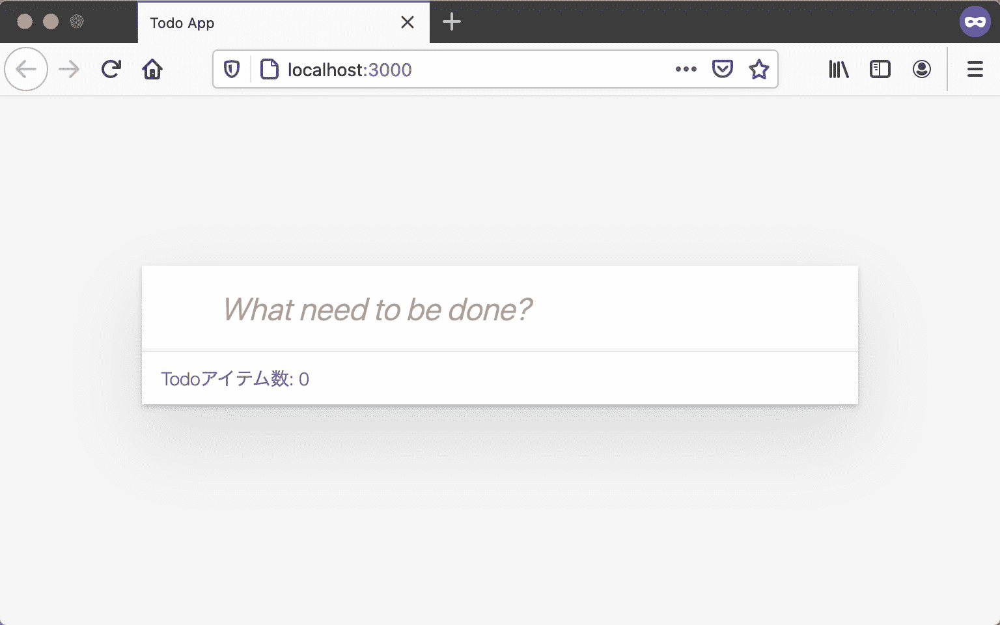

# 应用程序的组成要素

> 原文：[`jsprimer.net/use-case/todoapp/app-structure/`](https://jsprimer.net/use-case/todoapp/app-structure/)

创建了 HTML 和 JavaScript 的入口点，接下来让我们重新审视一下这个 Todo 应用程序的组成要素。

Todo 应用程序将实现以下功能。 添加、更新、删除 Todo 项目，以及显示当前状态等多个功能。

+   添加 Todo 项目

+   更新 Todo 项目

+   Todo 项目删除

+   显示 Todo 项目数（总数）

此外，要称之为应用程序，外观也必须稍微精心设计。 在本节中，首先我们将了解构成 Web 应用程序的 HTML、CSS 和 JavaScript 的角色。 在本节中，我们将完成一个只有外观没有功能的 Todo 应用程序，然后从下一节开始，我们将使用 JavaScript 实际实现 Todo 应用程序的功能。

## [](#html-css-javascript)*HTML、CSS 和 JavaScript*

*Todo 应用程序将作为在浏览器中运行的应用程序创建，但是要创建 Web 应用程序，需要结合 HTML、CSS 和 JavaScript 进行编写。 由于这次是一个仅在客户端解决的 Web 应用程序，不涉及 HTTP 通信等，因此不涉及服务器端语言。

+   HTML：用于描述内容结构的标记语言

+   CSS：用于装饰 HTML 外观的样式表语言

+   JavaScript：处理交互等操作的编程语言

许多 Web 应用程序通过定义 HTML 的内容结构，使用 CSS 装饰外观，并通过 JavaScript 添加功能来实现。 因此，Web 应用程序是由 HTML、CSS 和 JavaScript 组合而成的。

另一方面，浏览器没有像 iOS 或 Android 那样由操作系统提供的 UI 框架标准。 此外，用户实现了各种类型的 UI 框架。 因此，即使以 Todo 应用程序为例，不同的框架或人员可能会有完全不同的编写方式。

本次 Todo 应用程序将直接使用原始的 HTML、CSS 和 JavaScript 进行编写，而不使用特殊的 UI 框架。

## [](#todo-html)*使用 HTML 定义 Todo 应用程序的结构*

*首先定义了要创建的 Todo 应用程序的 HTML 结构。 此处定义的 HTML 和 CSS 将在整个过程中保持不变。 从下一部分开始，将仅更改 JavaScript。

在“入口点”部分中，将`todoapp`目录的`index.html`更改为以下内容。

index.html

```
<!DOCTYPE html>
<html lang="ja">
  <head>
    <meta charset="UTF-8" />
    <title>Todo App</title>
    <!-- 1\. CSSファイルを読み込み -->
    <link
      href="https://jsprimer.net/use-case/todoapp/final/final/index.css"
      rel="stylesheet"
    />
  </head>
  <body>
    <!-- 2\. class 属性をCSSのために指定 -->
    <div class="todoapp">
      <!-- 3\. id 属性をJavaScriptのために指定 -->
      <form id="js-form">
        <input
          id="js-form-input"
          class="new-todo"
          type="text"
          placeholder="What need to be done?"
          autocomplete="off"
        />
      </form>
      <!-- 4\. TodoアプリのメインとなるTodoリスト -->
      <div id="js-todo-list" class="todo-list">
        <!-- 動的に更新されるTodoリスト -->
      </div>
      <footer class="footer">
        <!-- 5\. Todoアイテム数の表示 -->
        <span id="js-todo-count">Todoアイテム数: 0</span>
      </footer>
    </div>
    <script src="./index.js" type="module"></script>
  </body>
</html> 
```

更改 HTML 内容后，在浏览器中访问将显示如下内容。 尽管尚未使用 JavaScript 实现 Todo 应用程序的功能，但仅外��的 Todo 应用程序已经完成。



让我们逐步查看实际更改的 HTML。

### [](#comment-css-file-load)*1\. 加载 CSS 文件*

*在`head`元素中使用`link`标签，加载外部 CSS 文件。 此次加载的 CSS 文件包含了实现 Todo 应用程序外观所需的 CSS 定义。

+   [`jsprimer.net/use-case/todoapp/final/final/index.css`](https://jsprimer.net/use-case/todoapp/final/final/index.css)

由于此 CSS 对操作没有影响，因此在本用例中仅导入外部文件而省略解释。 要正确应用定义的样式，`class`属性或 HTML 元素的结构必须匹配。 如果显示出现问题，请检查`class`属性是否正确，HTML 结构是否相同。

### [](#comment-class-for-css)*2\. 为 CSS 指定 class 属性*

*`div`标签的`class`属性设置为`todoapp`。 `class`属性基本上用作 CSS 装饰的标志。 此外，在同一页面中，可以为多个元素设置相同的类名。 需要注意的是，HTML 的`class`属性与 JavaScript 的`class`语法无关。

可以使用`.todoapp` CSS 选择器从 CSS 中选择具有`todoapp`类名的元素。 [CSS 选择器](https://developer.mozilla.org/ja/docs/Learn/CSS/Building_blocks/Selectors)是一种通过类名等选择 HTML 元素的记法。 对于具有特定“类名”的元素，可以使用`.class name`（在类名前加上点）进行选择。

在下面的 CSS 代码中，将具有名为`todoapp`的类名的元素的`background`属性值设置为`black`。 这意味着将`todoapp`类名元素的背景颜色设置为黑色。

```
.todoapp {
    background: black;
} 
```

CSS 选择器还可以指定标签名称、`id`属性和结构等。 例如，可以使用`#id name`选择具有特定“id name”的元素。

```
#id 名 {
  /* CSSプロパティで装飾する */
} 
```

### [](#comment-id-for-js)*3\. 为 JavaScript 指定 id 属性*

*`id`属性用于为该元素指定页面内唯一的标识符。 `id`属性用于 CSS、JavaScript、链接锚点等各种用途。 此外，在同一页面中，不能为多个元素设置相同的 id 属性名。

在本次待办事项应用中，我们设置了`id`属性以便从 JavaScript 中选择元素。 前面提到的 CSS 选择器不仅可以用于从 CSS 中选择元素，还可以用于从 JavaScript 中选择元素。 在浏览器的 DOM API 中，可以使用`document.querySelector` API 通过 CSS 选择器选择元素。

在下面的代码中，我们使用`document.querySelector("CSS 选择器")`来获取特定 id 属性名的元素。

```
// id 属性の値が"js-form"である要素を取得する
const form = document.querySelector("#js-form"); 
```

因此，为了 JavaScript 能够引用这些元素，我们给元素添加了`id`属性作为标识。 为了更好地理解，我们约定 JavaScript 处理的 id 属性以`js-`开头命名。

### [](#comment-todo-list)*4\. 待办事项应用的主要待办事项列表*

*带有`id`属性`js-todo-list`的`div`元素是本次待办事项应用的主要待办事项列表。 由于这个`div`元素的内容会在 JavaScript 中动态更新，因此在 HTML 中我们添加了一个标识性的`id`属性。

初次显示时，待办事项列表还是空的，因此没有任何内容显示。 同时，被`<!--`和`-->`包围的部分是 HTML 注释，不会被显示。

### [](#comment-todo-count)*5\. 显示待办事项数*

*带有`id`属性`js-todo-count`的`span`元素用于显示当前待办事项的数量。 初次显示时，由于待办事项列表为空，数量为 0，但在添加或删除待办事项时需要相应更新。

## [](#conclusion)*总结*

*在这一部分中，我们使用 HTML 定义了应用的结构，用 CSS 定义了应用的样式。 在接下来的部分中，我们将创建 JavaScript 模块，并更新当前为空的待办事项列表。

## [](#section-checklist)*本节的检查清单*

**   理解了要实现的待办事项应用的组成要素

+   理解了 HTML、CSS、JavaScript 的不同作用

+   Todo 应用的外观是用 HTML 和 CSS 定义的

您可以在以下 URL 中查看到目前为止的待办事项应用。

+   [`jsprimer.net/use-case/todoapp/app-structure/todo-html/`](https://jsprimer.net/use-case/todoapp/app-structure/todo-html/)*********
