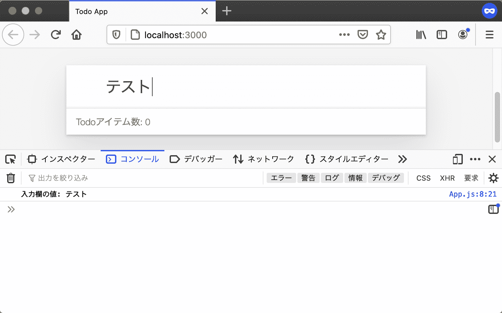
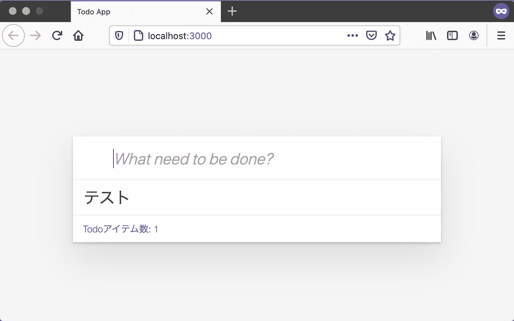

# 实现添加 Todo 项目的功能

> 原文：[`jsprimer.net/use-case/todoapp/form-event/`](https://jsprimer.net/use-case/todoapp/form-event/)

接下来，我们将使用 JavaScript 创建 Todo 应用程序的功能。

在这一节中，将实现在前一节中已标记了的 Todo 列表（`#js-todo-list`）上添加 Todo 项目的功能。

## [](#add-todo-item)*添加 Todo 项目*

*首先，我们将看看在 Todo 应用程序中，执行哪些操作会添加 Todo 项目。

在 Todo 应用程序中，当用户执行以下操作时，将添加 Todo 项目。

1.  在输入框中输入 Todo 项目的标题

1.  通过在输入框中按 Enter 键提交

1.  将 Todo 项目添加到 Todo 列表中

要实现这一点，需要：

+   为了获取 Todo 项目的标题，需要从 input 元素（输入框）中获取内容

+   为了知道已使用 Enter 键进行了提交，需要监视 form 元素的`submit`事件（提交）

+   创建以输入内容为标题的 Todo 项目，并将 Todo 项目元素添加到 Todo 列表（`#js-todo-list`）中

首先，从表单元素接收提交事件，并尝试在控制台日志中显示输入内容。

## [](#input-to-console)*将输入内容显示在控制台中*

*当在表单元素中按下 Enter 键进行提交时，将触发`submit`事件。 可以使用 HTML 元素的`addEventListener`方法来接收此`submit`事件。

下面的代码注册了一个回调函数，当指定的表单元素触发`submit`事件时调用。

```
// `id="js-form"`の要素を取得
const formElement = document.querySelector("#js-form");
// form 要素から発生したsubmitイベントを受け取る
formElement.addEventListener("submit", (event) => {
    // イベントが発生したときに呼ばれるコールバック関数（イベントリスナー）
}); 
```

当发生这样的事件时，被调用的回调函数称为**事件监听器**（监听事件的东西）。 另外，事件监听器有时也称为事件处理程序，但在本书中，这两个词语具有相同的含义。

要在表单提交时将输入内容显示在控制台中，只需在`addEventListener`回调函数内使用 Console API 输出输入内容即可。

可以从 input 元素的`value`属性中获取输入内容。

```
const inputElement = document.querySelector("#js-form-input");
console.log(inputElement.value); // => "input 要素の入力内容" 
```

将这些组合起来，实现在`App.js`中将输入内容显示在控制台的功能。 定义一个名为`mount`的方法，并在其中编写处理逻辑。

下面的代码注册了一个回调函数，当表单（`#js-form`）按 Enter 键提交时，将 input 元素（`#js-form-input`）的内容显示在控制台上。

src/App.js

```
export class App {
    mount() {
        const formElement = document.querySelector("#js-form");
        const inputElement = document.querySelector("#js-form-input");
        formElement.addEventListener("submit", (event) => {
            // submitイベントの本来の動作を止める
            event.preventDefault();
            console.log(`入力欄の値: ${inputElement.value}`);
        });
    }
} 
```

由于此时尚未调用 App 的`mount`方法，因此不会执行任何操作。 因此，还需要更改`index.js`以调用`App`类的`mount`方法。

index.js

```
import { App } from "./src/App.js";
const app = new App();
app.mount(); 
```

在进行这些更改后，刷新页面，将执行 App 的`mount`方法。 因为已经监听了`submit`事件，所以尝试在输入框中输入内容并按 Enter 键提交，该内容将显示在控制台中。



在上述 App 的`mount`方法中，调用了`event.preventDefault`方法来取消`submit`事件的默认行为。 `event.preventDefault`方法用于取消表单所在的默认操作。

表单的默认行为是将表单内容提交到指定的 URL。 由于在这里没有为`form`元素指定目标，因此将表单内容提交到当前 URL。 但是，由于这种行为会干扰，因此调用`event.preventDefault`方法来取消此默认行为。

摘自 src/App.js

```
formElement.addEventListener("submit", (event) => {
    // submitイベントの本来の動作を止める
    event.preventDefault();
    console.log(`入力欄の値: ${inputElement.value}`);
}); 
```

当表单提交到当前 URL 时，页面将被重新加载。 因此，调用了`event.preventDefault()`来取消默认行为。 如果取消注释`event.preventDefault()`，则可以确认页面将被重新加载。

示例中摘自 src/App.js 的部分

```
formElement.addEventListener("submit", (event) => {
    // preventDefaultしないとページがリロードされてしまう
    // event.preventDefault();
    console.log(`入力欄の値: ${inputElement.value}`);
}); 
```

已经在`todoapp`目录下做出如下更改。

```
todoapp
├── index.html
├── index.js (Appクラスのmountメソッドの呼び出し)
└── src
    └── App.js (Appクラスのmountメソッドの実装) 
```

可以在以下 URL 中查看到此 Todo 应用程序。

+   [`jsprimer.net/use-case/todoapp/form-event/prevent-event/`](https://jsprimer.net/use-case/todoapp/form-event/prevent-event/)

## [](#input-to-todolist)*将输入内容显示在 Todo 列表中*

*已经了解到如何获取表单提交时的输入内容，接下来将在 Todo 列表（`#js-todo-list`）中显示这些输入内容。

在 HTML 中，要描述列表项，需要使用`<li>`标签。 另外，希望包含有表示完成状态的复选框和删除按钮等的 Todo 项目元素。 由于从 DOM API 以程序方式创建这些元素会使代码难以阅读，因此创建一个从 HTML 字符串生成 HTML 元素的实用程序模块。

将名为`html-util.js`的文件创建在路径`src/view/html-util.js`下。

此`html-util.js`基于在「ajaxapp: 将 HTML 字符串添加到 DOM」中使用的`escapeSpecialChars`。 在 ajaxapp 中，`escapeHTML`函数的输出是**HTML 字符串**，而本次创建的`element`函数的输出是**HTML 元素**（Element）。

Todoリスト（`#js-todo-list`）というすでに存在する要素に対して要素を**追加**するには、HTML 文字列ではなくHTML 要素が必要になります。 また、HTML 文字列に対しては`addEventListener`でイベントをリッスンできません。 そのため、チェックボックスの状態が変わったことや削除ボタンが押されたことを知る必要があるTodoアプリではHTML 要素が必要になります。

src/view/html-util.js

```
export function escapeSpecialChars(str) {
    return str
        .replace(/&/g, "&amp;")
        .replace(/</g, "&lt;")
        .replace(/>/g, "&gt;")
        .replace(/"/g, "&quot;")
        .replace(/'/g, "&#039;");
}

/**
 * HTML 文字列からHTML 要素を作成して返す
 * @param {string} html 
 */
export function htmlToElement(html) {
    const template = document.createElement("template");
    template.innerHTML = html;
    return template.content.firstElementChild;
}

/**
 * HTML 文字列からDOM Nodeを作成して返すタグ関数
 * @return {Element}
 */
export function element(strings, ...values) {
    const htmlString = strings.reduce((result, str, i) => {
        const value = values[i - 1];
        if (typeof value === "string") {
            return result + escapeSpecialChars(value) + str;
        } else {
            return result + String(value) + str;
        }
    });
    return htmlToElement(htmlString);
}

/**
 * コンテナ要素の中身をbodyElementで上書きする
 * @param {Element} bodyElement コンテナ要素の中身となる要素
 * @param {Element} containerElement コンテナ要素
 */
export function render(bodyElement, containerElement) {
    // containerElementの中身を空にする
    containerElement.innerHTML = "";
    // containerElementの直下にbodyElementを追加する
    containerElement.appendChild(bodyElement);
} 
```

`element`タグ関数では、同じファイルに定義した`htmlToElement`関数を使ってHTML 文字列からHTML 要素を作成しています。 `htmlToElement`関数の中で利用している[template 要素](https://developer.mozilla.org/ja/docs/Web/HTML/Element/template)はHTML5で追加された、HTML 文字列の断片からHTML 要素を作成できる要素です。

この`element`タグ関数を使うことで、次のようにHTML 文字列からHTML 要素を作成できます。 作成した要素は、`appendChild`メソッドなどで既存の要素に子要素として追加できます。

elementタグ関数のサンプルコード

```
import { element } from "./html-util.js";
// HTML 文字列からHTML 要素を作成
const newElement = element`<ul>
    <li>新しい要素</li>
</ul>`;
// 作成した要素を`document.body`の子要素として追加（appendChild）する
document.body.appendChild(newElement); 
```

ブラウザが提供する`appendChild`メソッドは子要素を追加するだけなので、すでに別の要素がある場合は末尾に追加されます。

`render`関数は指定したコンテナ要素（親となる要素）の子要素を上書きする関数となります。 動作的には一度子要素をすべて消したあとに`appendChild`で子要素として追加しています。

render 関数のサンプルコード

```
import { element, render } from "./html-util.js";
// renderの前に、要素をdocument.bodyへ追加する
const oldElement = element`<ul>
    <li>既存の要素</li>
</ul>`;
document.body.appendChild(oldElement);
// 新しい要素を作成する
const newElement = element`<ul>
    <li>新しい要素</li>
</ul>`;
// `newElement`を`document.body`の子要素として追加する
// すでに`document.body`以下にある要素は上書きされる
render(newElement, document.body); 
```

実際に、この`element`タグ関数と`render`関数を使って、フォームから送信された入力内容をTodoリストに要素として追加してみます。

まず最初に、`App.js`から先ほど作成した`html-util.js`の`element`タグ関数と`render`関数を`import`します。 次に、Todoアイテムをまとめるリストを`todoListElement`として定義し、表示されているTodoアイテムの数を`todoItemCount`として定義します。

`submit`イベントのリスナー関数で、入力された内容をもとにTodoリストとTodoアイテム数の表示を更新していきます。 Todoアイテムを表現する要素を作成し、Todoリストの子要素として追加（`appendChild`）して、`render`関数を使ってコンテナ要素の中身にTodoリストで上書きしています。 最後にTodoアイテムの数を1 増やして、Todoアイテム数（`#js-todo-count`）のテキスト（`textContent`）を更新します。

src/App.js

```
import { element, render } from "./view/html-util.js";

export class App {
    mount() {
        const formElement = document.querySelector("#js-form");
        const inputElement = document.querySelector("#js-form-input");
        const containerElement = document.querySelector("#js-todo-list");
        const todoItemCountElement = document.querySelector("#js-todo-count");
        // TodoリストをまとめるList 要素
        const todoListElement = element`<ul></ul>`;
        // Todoアイテム数
        let todoItemCount = 0;
        formElement.addEventListener("submit", (event) => {
            // 本来のsubmitイベントの動作を止める
            event.preventDefault();
            // 追加するTodoアイテムの要素(li 要素)を作成する
            const todoItemElement = element`<li>${inputElement.value}</li>`;
            // TodoアイテムをtodoListElementに追加する
            todoListElement.appendChild(todoItemElement);
            // コンテナ要素の中身をTodoリストをまとめるList 要素で上書きする
            render(todoListElement, containerElement);
            // Todoアイテム数を+1し、表示されてるテキストを更新する
            todoItemCount += 1;
            todoItemCountElement.textContent = `Todoアイテム数: ${todoItemCount}`;
            // 入力欄を空文字列にしてリセットする
            inputElement.value = "";
        });
    }
} 
```

これらの変更後にブラウザでページをリロードし、フォームに入力してからEnterを押すとTodoリストに**Todoアイテムが追加**されます。 また、入力内容を送信するたびに`todoItemCount`が加算され、**Todoアイテム数**の表示も更新されます。



このセクションでの変更点は次のとおりです。

```
todoapp
├── index.html
├── index.js
└── src
    ├── App.js(Todoアイテムの表示の実装)
    └── view
        └── html-util.js(新規追加) 
```

ここまでのTodoアプリは次のURLで確認できます。

+   [`jsprimer.net/use-case/todoapp/form-event/add-todo-item/`](https://jsprimer.net/use-case/todoapp/form-event/add-todo-item/)

## [](#conclusion)*まとめ*

*このセクションではform 要素の`submit`イベントをリッスンし、入力内容を元にTodoアイテムを作成し、これをTodoリストに追加する機能を実装しました。 今回のTodoアイテムの追加のように、多くのウェブアプリは何らかのイベントをリッスンして表示を更新します。 このような、イベントが発生したことを元に処理を進める方法を**イベント駆動**（イベントドリブン）と呼びます。

今回のTodoアイテムの追加では、`submit`イベントを入力にして、Todoリスト要素を**直接 HTML 要素として追加**するという方法を取っていました。 このように直接 DOMを更新するという方法はコードが短くなりますが、DOMのみにしか状態が残らないため柔軟性がなくなるという問題があります。 次のセクションでは、実際に起きる問題やそれを解決するための仕組みを見ていきます。

## [](#section-checklist)*このセクションのチェックリスト*

**   フォームの送信を`submit`イベントで受け取り、入力内容を確認した

+   HTML 文字列からHTML 要素を作成する`html-util.js`を実装した

+   フォームからTodoアイテムを追加した

+   Todoアイテムの追加に合わせてTodoアイテム数を更新した

このセクションで、TodoアプリにTodoアイテムを追加する機能が実装できました。

+   Todoアイテムを追加できる

Todoアプリに実装する残りの機能は次のとおりです。

+   Todoアイテムの完了状態を更新できる

+   Todoアイテムを削除できる*****
