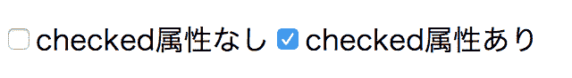

# 实现更新和删除 Todo 项目

> 原文：[`jsprimer.net/use-case/todoapp/update-delete/`](https://jsprimer.net/use-case/todoapp/update-delete/)

在本节中，我们将实现 Todo 应用的剩余功能，即“更新 Todo 项目”和“删除 Todo 项目”。

“更新 Todo 项目”是指单击复选框，如果未完成，则标记为已完成，反之亦然。 它为每个 Todo 项目保留了一个完成状态，并管理了每个 Todo 的进度。

另一方面，“删除 Todo 项目”是指单击按钮后删除 Todo 项目的功能。 可用于删除不需要的 Todo 项目或清除已完成的 Todo 项目等功能。

首先实现“更新 Todo 项目”，然后再实现“删除 Todo 项目”。

## [](#todo-item-update)*更新 Todo 项目*

*目前，Todo 项目的完成状态尚未显示。 因此，首先需要显示 Todo 项目是否已完成。 使用 HTML 的[`<input type="checkbox">`](https://developer.mozilla.org/ja/docs/Web/HTML/Element/Input/checkbox)元素显示复选框，并表示每个 Todo 项目的完成状态。

`<input type="checkbox">`如果没有`checked`属性，则复选框处于未选中状态。 另一方面，如果有`checked`属性，比如`<input type="checkbox" checked>`，则复选框处于选中状态。



首先，请确保在`src/App.js`中，将 TodoListModel 的`onChange`方法注册的监听函数内部修改，以显示复选框。

在代表 Todo 项目的`<li>`元素中添加`<input>`元素，以显示复选框。 为复选框`<input>`元素添加`class`属性作为样式`checkbox`。 同时，如果已完成，则使用`<s>`元素显示删除线。

从`src/App.js`中提取更改内容。

```
this.#todoListModel.onChange(() => {
    const todoListElement = element`<ul></ul>`;
    const todoItems = this.#todoListModel.getTodoItems();
    todoItems.forEach(item => {
        // 完了済みならchecked 属性をつけ、未完了ならchecked 属性を外す
        // input 要素にはcheckboxクラスをつける
        const todoItemElement = item.completed
            ? element`<li><input type="checkbox" class="checkbox" checked><s>${item.title}</s></li>`
            : element`<li><input type="checkbox" class="checkbox">${item.title}</li>`;
        todoListElement.appendChild(todoItemElement);
    });
    render(todoListElement, containerElement);
    todoItemCountElement.textContent = `Todoアイテム数: ${this.#todoListModel.getTotalCount()}`;
}); 
```

`<input type="checkbox">`元素被点击时，复选框的显示会切换。 但是，模型`TodoItemModel`的`completed`属性状态不会自动切换。 这会导致显示状态和模型状态不一致的问题。

您可以通过尝试以下操作来确认此问题。

1.  添加 Todo 项目

1.  给 Todo 项目的复选框打勾

1.  添加另一个新的 Todo 项目

1.  所有复选框的选中状态都将被重置

为了避免这个问题，当`<input type="checkbox">`元素被选中时，需要更新模型的状态。

`<input type="checkbox">`元素在被选中时会触发`change`事件。 监听这个`change`事件，就可以更新 TodoItem 模型的状态，从而同步模型和显示状态。

可以如下所示监听`input`元素分派的`change`事件。

首先，使用`querySelector`方法在`todoItemElement`元素下查找`input`元素。 以前，我们使用`document.querySelector`在整个文档中查找与 CSS 选择器匹配的元素。 使用`todoItemElement.querySelector`方法，我们可以仅在`todoItemElement`下查找元素。

然后，可以为找到的`input`元素注册一个回调函数，以便在`change`事件发生时调用。

```
const todoItemElement = element`<li><input type="checkbox" class="checkbox">${item.title}</li>`;
// クラス名 checkboxを持つ要素を取得
const inputCheckboxElement = todoItemElement.querySelector(".checkbox");
// `<input type="checkbox">`のチェックが変更されたときに呼ばれるイベントリスナーを登録
inputCheckboxElement.addEventListener("change", () => {
    // チェックボックスの表示が変わったタイミングで呼び出される処理
    // TODO: ここでモデルを更新する処理を呼ぶ
}); 
```

总结到目前为止，可以通过以下两个步骤实现更新 Todo 项目。

1.  向`TodoListModel`添加更新指定的 Todo 项目的处理

1.  当复选框的`change`事件发生时，更新模型的状态

现在，让我们开始在`todoapp`项目中实现 Todo 项目的更新。

### [](#TodoListModel-updateTodo)*向`TodoListModel`添加更新指定的 Todo 项目的处理*

*首先，在`TodoListModel`中添加一个名为`updateTodo`的方法来更新指定的 Todo 项目。 TodoListModel 的`updateTodo`方法用于更新与指定 id 匹配的 Todo 项目的完成状态（`completed`属性）。

从`src/model/TodoListModel.js`中提取更改内容。

```
 // ===============================
    // TodoListModel.jsの既存の実装は省略
    // ===============================
    /**
     * 指定したidのTodoItemのcompletedを更新する
     * @param {{ id:number, completed: boolean }}
     */
    updateTodo({ id, completed }) {
        // `id`が一致するTodoItemを見つけ、あるなら完了状態の値を更新する
        const todoItem = this.#items.find(todo => todo.id === id);
        if (!todoItem) {
            return;
        }
        todoItem.completed = completed;
        this.emitChange();
    }
} 
```

### [](#onChange-update-model)*当复选框的`change`事件发生时，更新 Todo 项目的完成状态*

*接下来，在`input`元素的`change`事件的监听函数中，更新 Todo 项目的完成状态。

在`src/App.js`中，将 TodoListModel 的`onChange`方法注册的监听函数内部修改如下。

在`App.js`中，作为`todoItemElement`的子元素添加一个带有`checkbox`类名的`input`元素。 当此`input`元素的`change`事件发生时，调用 TodoListModel 的`updateTodo`方法。 每次切换时都会调用，因此将当前状态的反转（切换）传递给`completed`。

从`src/App.js`中提取更改内容。

```
this.#todoListModel.onChange(() => {
    const todoListElement = element`<ul></ul>`;
    const todoItems = this.#todoListModel.getTodoItems();
    todoItems.forEach(item => {
        // 完了済みならchecked 属性をつけ、未完了ならchecked 属性を外す
        const todoItemElement = item.completed
            ? element`<li><input type="checkbox" class="checkbox" checked><s>${item.title}</s></li>`
            : element`<li><input type="checkbox" class="checkbox">${item.title}</li>`;
        // チェックボックスがトグルしたときのイベントにリスナー関数を登録
        const inputCheckboxElement = todoItemElement.querySelector(".checkbox");
        inputCheckboxElement.addEventListener("change", () => {
            // 指定したTodoアイテムの完了状態を反転させる
            this.#todoListModel.updateTodo({
                id: item.id,
                completed: !item.completed
            });
        });
        todoListElement.appendChild(todoItemElement);
    });
    render(todoListElement, containerElement);
    todoItemCountElement.textContent = `Todoアイテム数: ${this.#todoListModel.getTotalCount()}`;
}); 
```

在 TodoListModel 的`updateTodo`方法内部，通过`emitChange`方法通知`TodoListModel`的更改。 这将触发 TodoListModel 的`onChange`事件注册的监听器，并更新显示。

这样显示和模型就同步了，实现了“Todo 项目的更新处理”。

## [](#delete)*删除功能*

*接下来将实现“Todo 项目的删除功能”。

基本流程与“Todo 项目的更新功能”相同。 在`TodoListModel`中添加删除 Todo 项目的处理过程。 然后在显示中添加删除按钮，并在单击删除按钮时调用删除指定 Todo 项目的处理过程。

### [](#TodoListModel-deleteTodo)*添加删除指定 Todo 项目的处理过程到`TodoListModel`*

*首先，将删除指定 Todo 项目的`deleteTodo`方法添加到`TodoListModel`中。 `TodoListModel`的`deleteTodo`方法将删除与指定 id 匹配的 Todo 项目。

通过从名为`items`的 Todo 项目数组中删除与指定 id 匹配的 Todo 项目来实现删除。

从 src/model/TodoListModel.js 中提取更改点

```
 // ===============================
    // TodoListModel.jsの既存の実装は省略
    // ===============================
    /**
     * 指定したidのTodoItemを削除する
     * @param {{ id: number }}
     */
    deleteTodo({ id }) {
        // `id`に一致しないTodoItemだけを残すことで、`id`に一致するTodoItemを削除する
        this.#items = this.#items.filter(todo => {
            return todo.id !== id;
        });
        this.emitChange();
    }
} 
```

### [](#onChange-update-model)*当点击删除按钮时，删除 Todo 项目*

*接下来添加删除按钮，并在单击按钮时调用删除 Todo 项目的处理过程(`deleteTodo`)的实现添加到`App.js`中。

在`src/App.js`中，将`TodoListModel`的`onChange`方法注册的监听函数内部修改为以下内容。 将`button`元素添加为`todoItemElement`的子元素，并为其添加名为`delete`的类名。 当单击此元素时（`click`），使用`addEventListener`方法注册调用 TodoListModel 的`deleteTodo`方法，并删除指定 id 的 Todo 项目。

从 src/App.js 中提取更改点

```
this.#todoListModel.onChange(() => {
    const todoListElement = element`<ul></ul>`;
    const todoItems = this.#todoListModel.getTodoItems();
    todoItems.forEach(item => {
        // 削除ボタン(x)をそれぞれ追加する
        const todoItemElement = item.completed
            ? element`<li><input type="checkbox" class="checkbox" checked>
                <s>${item.title}</s>
                <button class="delete">x</button>
            </li>`
            : element`<li><input type="checkbox" class="checkbox">
                ${item.title}
                <button class="delete">x</button>
            </li>`;
        // チェックボックスのトグル処理は変更なし
        const inputCheckboxElement = todoItemElement.querySelector(".checkbox");
        inputCheckboxElement.addEventListener("change", () => {
            this.#todoListModel.updateTodo({
                id: item.id,
                completed: !item.completed
            });
        });
        // 削除ボタン(x)がクリックされたときにTodoListModelからアイテムを削除する
        const deleteButtonElement = todoItemElement.querySelector(".delete");
        deleteButtonElement.addEventListener("click", () => {
            this.#todoListModel.deleteTodo({
                id: item.id
            });
        });
        todoListElement.appendChild(todoItemElement);
    });
    render(todoListElement, containerElement);
    todoItemCountElement.textContent = `Todoアイテム数: ${this.#todoListModel.getTotalCount()}`;
}); 
```

在`TodoListModel`的`deleteTodo`方法中，通过`emitChange`方法通知`TodoListModel`的更改。 这样，显示将与`TodoListModel`同步更新，从而可以从显示中删除 Todo 项目。

这样就实现了“Todo 项目的删除功能”。

## [](#section-checklist)*本节的检查清单*

**   添加了一个用于表示 Todo 项目完成状态的`<input type="checkbox">`。

+   在复选框更新时的`change`事件监听函数中更新了 Todo 项目。

+   添加了一个用于删除 Todo 项目的按钮，即`<button class="delete">x</button>`。

+   在删除按钮的`click`事件监听函数中删除了 Todo 项目。

+   Todo 项目的添加、更新、删除功能已经确认可正常运作。

通过这一节，已经实现了 Todo 应用程序所需的要求。

+   可以添加 Todo 项目

+   可以更新 Todo 项目的完成状态

+   可以删除 Todo 项目

您可以在以下 URL 中查看到目前的 Todo 应用程序。

+   [`jsprimer.net/use-case/todoapp/update-delete/delete-feature/`](https://jsprimer.net/use-case/todoapp/update-delete/delete-feature/)

在最后一节中，我们将看到如何对`App.js`进行重构，以便持续开发可持续的应用程序。*******
