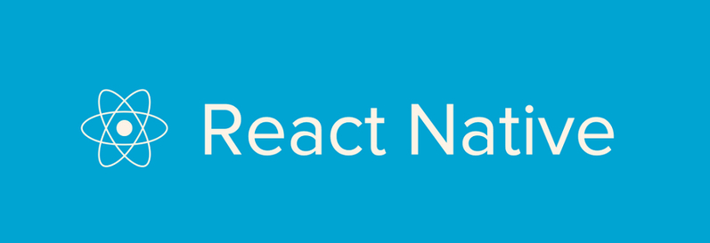
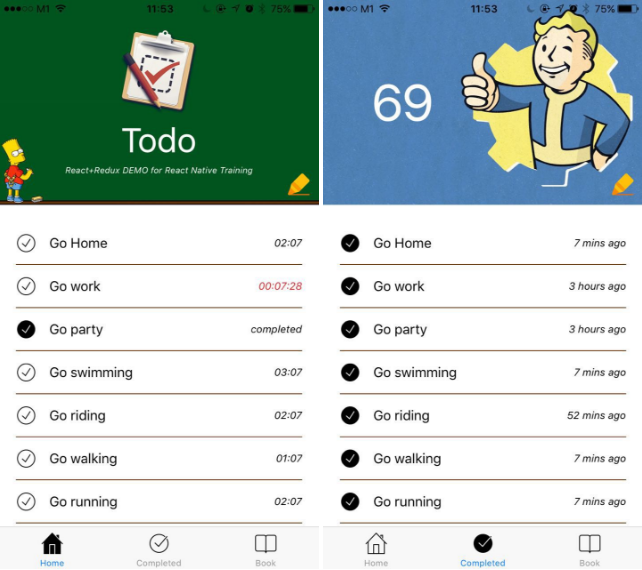

# React Native 培训手册

视频在这里（[YouTube](https://www.youtube.com/playlist?list=PLC_rYRxEnwQGLQqrHR0aho33U6DCeJamC)，[YouKu](http://v.youku.com/v_show/id_XMTYzODIxMDA2MA==.html?spm=a2hzp.8253876.0.0&f=27615900)（中文）！

请[留言](https://www.gitbook.com/book/unbug/react-native-training/discussions)或在 Twitter 上联系[@unbug](https://twitter.com/unbug)以获取进一步咨询。任何帮助将不胜感激 :)

* * *

## 由[@unbug](https://twitter.com/unbug)创建：

+   [MIHTool - iOS Web Debugger Pro](https://www.mihtool.com)：MIHTool 帮助前端工程师在 iPad 和 iPhone 上调试和优化他们的网页。

+   [Codelf - 变量命名神器](https://unbug.github.io/codelf/)：整理你的 GitHub 星标和存储库。从 GitHub 搜索项目，找到真实世界使用的变量名称。

+   [js-middleware](https://github.com/unbug/js-middleware)：强大的 Javascript 中间件模式实现，将中间件应用于任何对象。一个无痛的解决方案，使代码像 ReduxJS 和 ExpressJS 一样可扩展和易维护。

+   [拒绝自杀公共许可证](https://github.com/unbug/snts)：我们失去了许多自杀的天才开发者，比如[Aaron Hillel Swartz（1986 年 11 月 8 日 - 2013 年 1 月 11 日）](https://en.wikipedia.org/wiki/Aaron_Swartz)。作为开发者，社区需要你，世界需要你，请保持活着。
