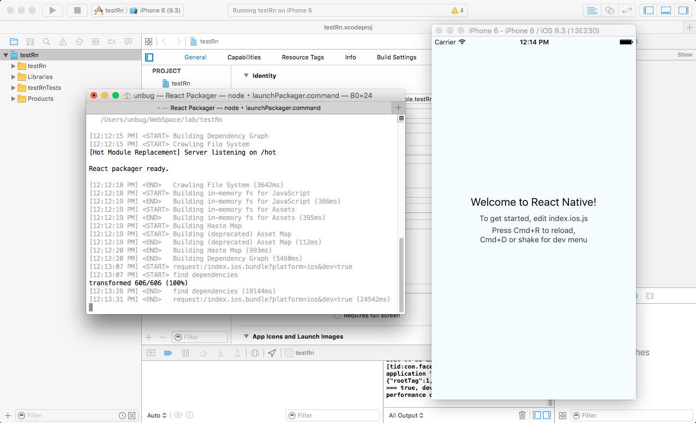
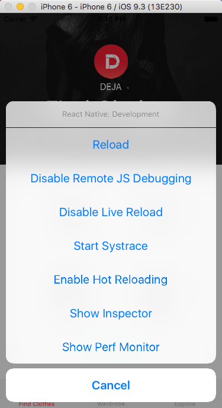
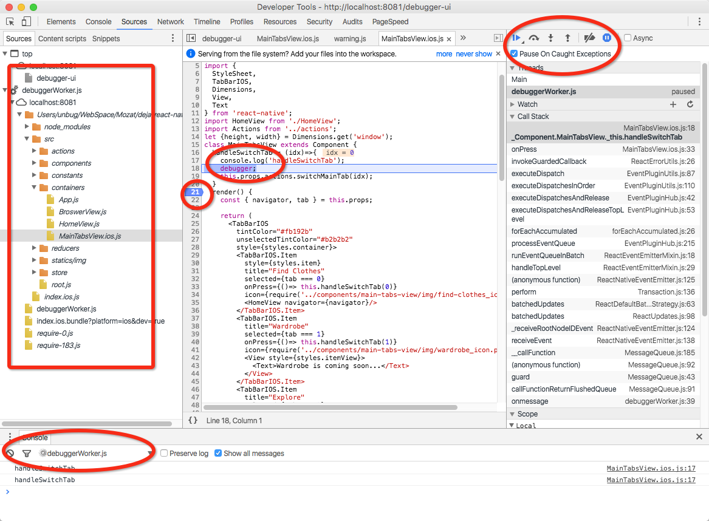
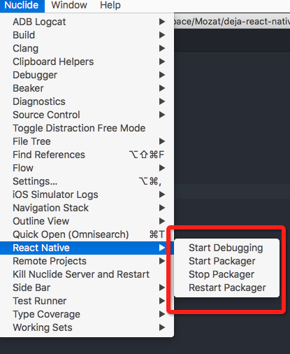
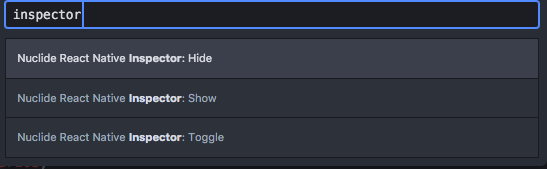
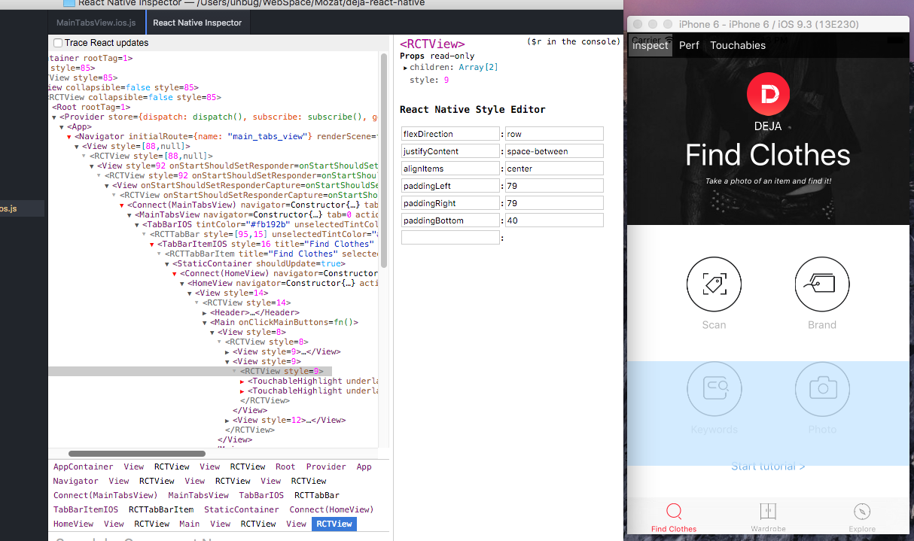
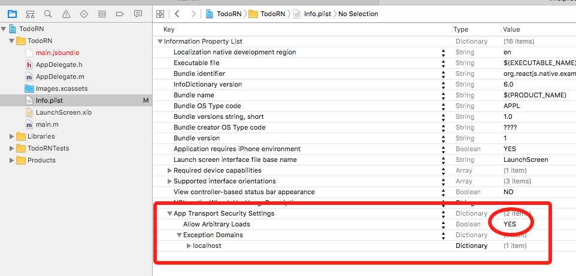

# 1 初次了解

# 1 初次了解

[介绍 React Native](https://facebook.github.io/react/blog/2015/03/26/introducing-react-native.html)

> 我们真正想要的是原生移动平台的用户体验，结合我们在 Web 上构建 React 时的开发者体验。通过一些工作，我们可以让 GitHub 上的完全相同的 React 来驱动真正的原生移动应用程序。移动环境中唯一的区别是，我们不是在浏览器中运行 React 并渲染到 div 和 span，而是在我们的应用程序中运行嵌入式的 JavaScriptCore 实例，并渲染到更高级的平台特定组件。值得注意的是，我们不追求**“一次编写，到处运行”**。不同的平台具有不同的外观、感觉和功能，因此，我们仍然应该为每个平台开发独立的应用程序，但是同一组工程师应该能够为他们选择的任何平台构建应用程序，而无需学习完全不同的技术。我们称这种方法为**“学一次，随处编写”**。

[展示](https://facebook.github.io/react-native/showcase.html)


# 1.1 5 分钟内构建一个应用程序

# 1.1 5 分钟内构建一个应用程序

1.  遵循[入门指南](http://facebook.github.io/react-native/releases/next/docs/getting-started.html)

1.  生成一个新的 React Native 项目

    ```
    react-native init testRn 
    ```

1.  构建并运行项目

    ```
    react-native run-ios 
    ```

    或者打开`testRn/ios/testRn.xcodeproj`并使用 XCode 的播放按钮构建



或者如果应用程序已经构建完成，启动 Web 服务器

```
npm start
//or
react-native start 
```

# 1.2 工作原理

# 1.2 工作原理

1.[JavaScript 桥接](https://www.infoq.com/articles/react-native-introduction)


2.[React Native 打包工具](https://github.com/facebook/react-native/tree/master/packager)


# 1.3 调试工具

# 1.3 调试工具

1.[开发者菜单](https://facebook.github.io/react-native/docs/debugging.html)



2.Chrome Devtools

 3.日志

```
console.log('some text');
console.dir({a:1, b:2, c:3});
debugger;//breaking point 
```

4.[Atom](https://atom.io/) & [nuclide](https://nuclide.io/)



5.检查

使用`cmd-shift-p`打开 Atom [命令面板插件](https://atom.io/packages/command-palette)，搜索"inspector"，然后点击"Nuclide React Native Inspector:Show"





6.[真实设备](https://facebook.github.io/react-native/docs/debugging.html#chrome-developer-tools)

6.1 部署到真实设备 `project_name/ios/project_name/AppDelegate.m`

```
 //jsCodeLocation = [NSURL URLWithString:@"http://localhost:8081/index.ios.bundle?platform=ios&dev=true"];

  /**
   * OPTION 2
   * Load from pre-bundled file on disk. The static bundle is automatically
   * generated by the "Bundle React Native code and images" build step when
   * running the project on an actual device or running the project on the
   * simulator in the "Release" build configuration.
   */

   jsCodeLocation = [[NSBundle mainBundle] URLForResource:@"main" withExtension:@"jsbundle"]; 
```

6.2 在真实设备上调试

1.`project_name/ios/project_name/AppDelegate.m`

```
 jsCodeLocation = [NSURL URLWithString:@"http://172.28.0.230:8081/index.ios.bundle?platform=ios&dev=true"]; 
```

2.`node_modules/react-native/Libraries/WebSocket/RCTWebSocketExecutor.m`

```
 if (!_url) {
    NSUserDefaults *standardDefaults = [NSUserDefaults standardUserDefaults];
    NSInteger port = [standardDefaults integerForKey:@"websocket-executor-port"] ?: 8081;
    NSString *URLString = [NSString stringWithFormat:@"http://172.28.0.230:%zd/debugger-proxy?role=client", port];
    _url = [RCTConvert NSURL:URLString];
  } 
```

3.



# 1.4 文档和 API

# 1.4 文档和 API

+   [ReactJS](https://facebook.github.io/react/docs/getting-started.html)

+   [React Native](https://facebook.github.io/react-native/docs/getting-started.html)

+   [Nuclide](https://nuclide.io/docs/quick-start/getting-started/)

# 1.5 资源

# 1.5 资源

+   [React Native: Bringing modern web techniques to mobile](https://code.facebook.com/posts/1014532261909640/react-native-bringing-modern-web-techniques-to-mobile/)

+   [React Native 通信机制详解](http://blog.cnbang.net/tech/2698/)

+   [React Native 调研报告](http://blog.csdn.net/lihuiqwertyuiop/article/details/45241909)

+   [React Native 概述：背景、规划和风险](https://github.com/tmallfe/tmallfe.github.io/issues/18)

+   [JavaScriptCore](http://trac.webkit.org/wiki/JavaScriptCore)

+   [React Native iOS 真机调试](http://www.jianshu.com/p/cc64bcb58df2)
