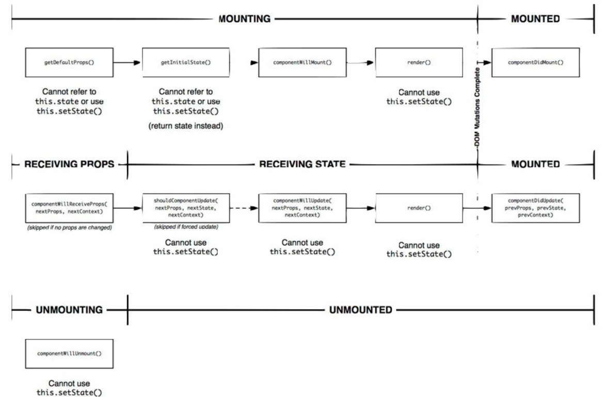
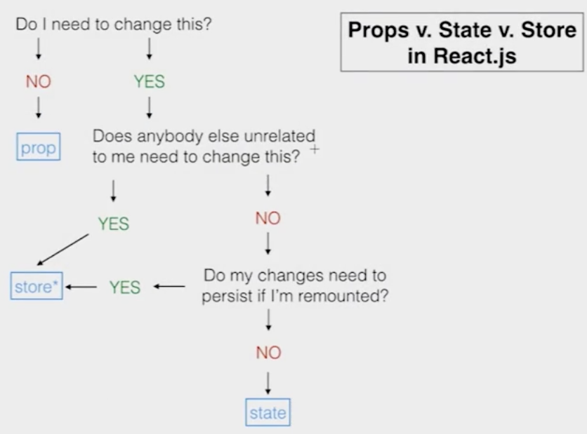
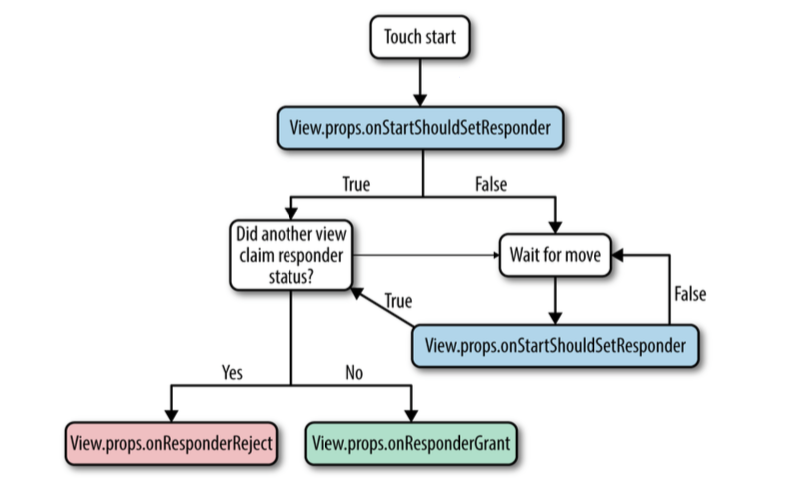

# 2 组件

# 2 组件

1.MyComponent.js

```
//define component
class MyComponent extends React.Component {
  render() {
    return <Text>My component!</Text>;
  }
}
//export component
export default MyComponent; 
```

2.Main.js

```
//import component
import MyComponent from './MyComponent';
class Main extends React.Component {
  render() {
    //use component
    return <MyComponent>;
  }
} 
```

3.AppRegistry

```
AppRegistry.registerComponent('MyApp', () => Main); 
```

# 2.1 渲染 & JSX

# 2.1 渲染 & JSX

```
..
...
render() {
  const txt = 'Hello';
  function say(name){
    return 'I am '+name;
  }
  return (
    <View>
      <Text>This is a title!</Text>
      <Text>{txt}</Text>
      <View>
        <Text>{say('React')}</Text>
      </View>
    </View>
  );
}
..
... 
```

# 2.2 视图、文本、图片等

# 2.2 视图、文本、图片等

1.  [核心组件](https://facebook.github.io/react-native/docs/tutorial-core-components.html)

```
..
...
import {
  StyleSheet,
  Text,
  View,
  Image
} from 'react-native';

class Main extends Component {
  render() {
    return (
      <View>
        <Image source={require('./img/bg.png')}>
          <Image source={require('./img/icon.png')}/>
          <Text>
            some text!
          </Text>
        </Image>
      </View>
    );
  }
} 
```

# 2.3 生命周期

# 2.3 生命周期

1.  实例化

    1.1 首次创建实例时调用的生命周期方法

    +   getDefaultProps

    +   **getInitialState**

    +   componentWillMount

    +   **render**

    +   **componentDidMount**

    1.2 对于该组件类的所有后续使用：

    +   getInitialState

    +   componentWillMount

    +   render

    +   componentDidMount”

1.  生命周期

    +   componentWillReceiveProps

    +   **shouldComponentUpdate // 返回 true|false**

        ```
        shouldComponentUpdate(nextProps, nextState) {
        return nextProps.id !== this.props.id;
        } 
        ```

    +   componentWillUpdate //不会在初始渲染时调用

    +   render

    +   componentDidUpdate

1.  拆卸和清理

    +   componentWillUnmount



# 2.4 属性和状态

# 2.4 属性和状态

1.props：属性传递给组件，可以包含任何数据

```
class User extends Component {
  render(){
    const user = this.props.data;
    this.props.onReady('I am ready!');
    return(
      <View>
        <Text>
          score: {this.props.score}
          type: {this.props.type}
          Name: {user.name}
          Age: {user.age}
        </Text>
      </View>
    );
  }
}
//dufaultProps
User.propTypes = { score: React.PropTypes.number };
User.defaultProps = { score: 0 };

var user = {name: 'foo', age: 21};
class Main extends Component {
  handleReady(str){
    console.log(str);
  }
  render(){
    return(
      <View>
        <User type="Dev" data={user} onReady={this.handleReady}/>
      </View>
    );
  }
} 
```

2.state：状态与 props 不同，因为它是组件内部的。

```
class Timer extends Component {
  constructor(props) {
    super(props);
    this.state = {count: 0};
  }

  componentDidMount() {
    let that = this;
    setInterval(function () {
      that.increase();
    }, 1000);
  }

  increase() {
    this.setState({count: this.state.count + 1});
  }

  render() {
    return (
      <View>
        <Text>count: {this.state.count}</Text>
      </View>
    );
  }
}

class Main extends Component {
  render(){
    return(
      <View>
        <Timer/>
      </View>
    );
  }
} 
```

3.*props* VS *state*

+   使用 props 来通过组件树传递数据和设置。

+   永远不要在组件内部直接修改 this.props；考虑 props 不可变。

+   使用 props 来为事件处理程序与子组件通信。

+   使用 state 来存储简单的视图状态，比如下拉选项是否可见。

+   永远不要直接修改 this.state，而是使用 this.setstate。



4.无状态组件

```
const Heading = ({title}) => <Text>{title}</Text>;

..
...
<Heading title="test title"/>
...
.. 
```

# 2.5 事件

# 2.5 事件

1.基本事件

1.1.[`<TouchableHighlight/>`](https://facebook.github.io/react-native/docs/touchablehighlight.html)

```
class Touch extends Component {
  handlePress(){
    console.log('press');
  }
  handleLongPress(){
    console.log('longPress');
  }
  render() {
    return (
      <TouchableHighlight
        onPress={this.handlePress}
        onLongPress={this.handleLongPress}>
        <View>
          <Text>Press me!</Text>
        </View>
      </TouchableHighlight>
    );
  }
} 
```

1.2\. [`<TextInput/>`](https://facebook.github.io/react-native/docs/textinput.html)

```
class Test extends Component {
  //...
  //handle events
  //...
  render() {
    return (
      <TextInput 
        onBlur={...}
        onChange={...}
        onEndEditing={...}
        onSelectionChange={...}
        onSubmitEditing={...}
      </TextInput>
    );
  }
} 
```

1.3.[DeviceEventEmitter](https://kpetrovi.ch/2015/09/30/react-native-ios-keyboard-events.html)

```
//keyboardWillShow, keyboardDidShow, keyboardWillHide, keyboardDidHide
//keyboardWillChangeFrame, keyboardDidChangeFrame
//add the listener
 var listener = DeviceEventEmitter.addListener('keyboardWillShow', (e) =>{
   console.log('Event is fired!');
 });
 //remove the listener
 listener.remove(); 
```

2.[Gesture Responder System](https://facebook.github.io/react-native/docs/gesture-responder-system.html#responder-lifecycle)

2.1 生命周期  2.2 示例

```
class Test extends Component {
  /* Capture handles */
  //the responder system bubbles up from the deepest component, 
  //a parent View wants to prevent the child from becoming responder on a touch start
  handleStartShouldSetResponderCapture(evt){
    return true;
  }
  //the responder system bubbles up from the deepest component, 
  //a parent View wants to prevent the child from becoming responder on a touch move
  handleMoveShouldSetResponderCapture(evt){
    return true;
  }

  /* Lifecycle handles */
  //Does this view want to become responder on the start of a touch?
  handleStartShouldSetResponder(evt){
    return true;
  }
  //Called for every touch move on the View when it is not the responder: 
  //does this view want to "claim" touch responsiveness?
  handleMoveShouldSetResponder(evt){
    return true;
  }
  //The View is now responding for touch events. 
  handleResponderGrant(evt){
    console.log('you are touching me');
  }
  //Something else is the responder right now and will not release it
  handleResponderReject(evt){
    console.log('please wait in line');
  }

  /* event handles */
  //touch move
  handleResponderMove(evt){
    console.log('touch move at:', 'X='+evt.pageX, 'Y='+evt.pageY);
  }
  //touch end/up
  handleResponderRelease(evt){
    console.log('touch end');
  }
  //Something else wants to become responder. Should this view release the responder?
  handleResponderTerminationRequest(evt){
    return true;
  }
  //touch cancel
  handleResponderTerminate(evt){
    console.log('touch canceled');
  }
  render() {
    return (
      <View 
        onStartShouldSetResponderCapture={this.handleStartShouldSetResponderCapture}
        onMoveShouldSetResponderCapture={this.handleMoveShouldSetResponderCapture}
        onStartShouldSetResponder={this.handleStartShouldSetResponder}
        onMoveShouldSetResponder={this.handleMoveShouldSetResponder}
        onResponderGrant={this.handleResponderGrant} 
        onResponderReject={this.handleResponderReject}
        onResponderMove={this.handleResponderMove}
        onResponderRelease={this.handleResponderRelease}
        onResponderTerminationRequest={this.handleResponderTerminationRequest}
        onResponderTerminate={this.handleResponderTerminate}>
          <Text>Press me!</Text>
      </View>
    );
  }
} 
```

2.3 evt 是一个合成的触摸事件，具有以下形式的 nativeEvent：

+   changedTouches - 自上次事件以来发生变化的所有触摸事件的数组

+   identifier - 触摸的 ID

+   locationX - 触摸的 X 位置，相对于元素

+   locationY - 触摸的 Y 位置，相对于元素

+   pageX - 触摸的 X 位置，相对于根元素

+   pageY - 触摸的 Y 位置，相对于根元素

+   target - 接收触摸事件的元素的节点 ID

+   timestamp - 触摸的时间标识符，用于速度计算

+   touches - 屏幕上所有当前触摸的数组

3.[PanResponder](https://facebook.github.io/react-native/docs/panresponder.html)

3.1

```
this._panResponder = PanResponder.create({
  // Ask to be the responder:
  onStartShouldSetPanResponder: (evt, gestureState) => true,
  onStartShouldSetPanResponderCapture: (evt, gestureState) => true,
  onMoveShouldSetPanResponder: (evt, gestureState) => true,
  onMoveShouldSetPanResponderCapture: (evt, gestureState) => true,
  //touch start
  onPanResponderGrant: (evt, gestureState) => {},
  //touch move
  onPanResponderMove: (evt, gestureState) => {},
  onPanResponderTerminationRequest: (evt, gestureState) => true,
  //touch end/up
  onPanResponderRelease: (evt, gestureState) => {},
  //touch cancel
  onPanResponderTerminate: (evt, gestureState) => {},
  onShouldBlockNativeResponder: (evt, gestureState) => true,
}); 
```

3.2 gestureState 对象包含以下内容：

+   stateID - gestureState 的 ID - 只要屏幕上至少有一个触摸，它就会持续存在

+   moveX - 最近移动的触摸的最新屏幕坐标

+   moveY - 最近移动的触摸的最新屏幕坐标

+   x0 - 响应者授予的屏幕坐标

+   y0 - 响应者授予的屏幕坐标

+   dx - 自触摸开始以来手势的累积距离

+   dy - 自触摸开始以来手势的累积距离

+   vx - 手势的当前速度

+   vy - 手势的当前速度

+   numberActiveTouches - 当前屏幕上的触摸数

3.3 [UIExplorer 中的 PanResponder 示例](https://github.com/facebook/react-native/blob/master/Examples/UIExplorer/PanResponderExample.js)

# 2.6 资源

# 2.6 资源

+   [react.parts](https://react.parts/native)

+   [js.coach](https://js.coach/)

+   [props vs state](https://github.com/uberVU/react-guide/blob/master/props-vs-state.md)

+   [在 React 中思考](https://facebook.github.io/react/docs/thinking-in-react.html)

+   [深入理解 JSX](https://facebook.github.io/react/docs/jsx-in-depth.html)

+   [本章的演示脚本](https://github.com/unbug/react-native-train-scripts)
