# 3 样式

# 3 样式

1.声明样式

```
const styles = StyleSheet.create({
  container: {
    flex: 1,
    backgroundColor: 'blue',
  },
  text: {
    fontSize: 14,
    color: 'red'
  }
}); 
```

2.使用样式

```
class Main extends Component {
  render() {
    return (
      <View style={styles.container}>
        <Text style={styles.text}>I am red.</Text>
      </View>
    );
  }
} 
```

3.属性

+   [视图属性](https://facebook.github.io/react-native/docs/view.html#style)

+   [图像属性](https://facebook.github.io/react-native/docs/image.html#style)

+   [文本属性](https://facebook.github.io/react-native/docs/text.html#style)

+   [Flex 属性](https://facebook.github.io/react-native/docs/flexbox.html#content)

+   [变换属性](https://facebook.github.io/react-native/docs/transforms.html#content)

# 3.1 Flexbox

# 3.1 Flexbox

1.[Flexbox 布局](https://css-tricks.com/snippets/css/a-guide-to-flexbox/)

> 弹性布局背后的主要思想是让容器有能力改变其项目的宽度/高度（和顺序），以最佳填充可用空间（主要是为了适应各种显示设备和屏幕尺寸）。 弹性容器扩展项目以填充可用的空闲空间，或者缩小它们以防止溢出。

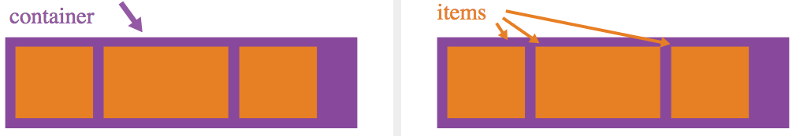

2.flex：1

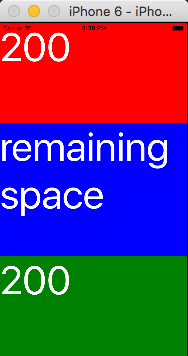

```
const styles = StyleSheet.create({
  container: {
    flex: 1
  },
  header: {
    height: 200,
    backgroundColor: 'red'
  },
  main: {
    flex: 1,
    backgroundColor: 'blue'
  },
  footer: {
    height: 200,
    backgroundColor: 'green'
  },
  text: {
    color: '#ffffff',
    fontSize: 80
  }
}); 
```

3.flexDirection：'row' | 'column'

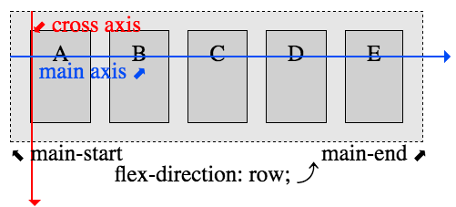

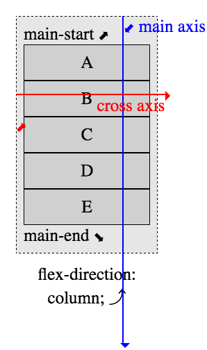

4.justifyContent：'flex-start' | 'flex-end' | 'center' | 'space-between' | 'space-around'


5.alignItems：'flex-start' | 'flex-end' | 'center' | 'stretch'

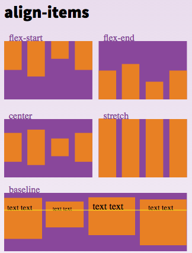

6.alignSelf：'auto' | 'flex-start' | 'flex-end' | 'center' | 'stretch'

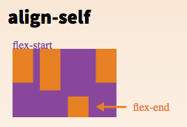

7.flexWrap：'wrap' | 'nowrap'

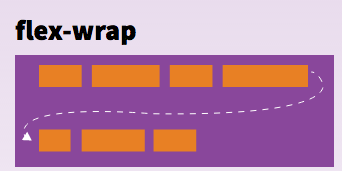

8.盒模型

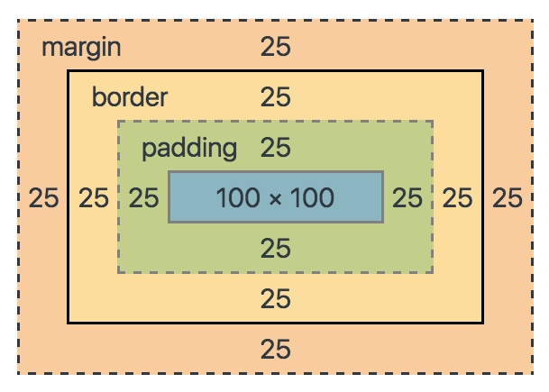

宽度 = borderLeftWidth(25) + paddingLeft(25) + 100 + borderRightWidth(25) + paddingRight(25) = 200

高度 = borderTopWidth(25) + paddingTop(25) + 100 + borderBottomWidth(25) + paddingBottom(25) = 200

```
class Main extends Component {
  render() {
    return (
      <View style={styles.container}>
        <View style={styles.header}>
          <Text style={styles.text}>200X100</Text>
        </View>
        <View style={styles.main}>
          <View  style={styles.mainContent}>
            <Text style={styles.text}>100X100</Text>
          </View>
        </View>
        <View style={styles.footer}>
          <Text style={styles.text}>200X100</Text>
        </View>
      </View>
    );
  }
}

const styles = StyleSheet.create({
  container: {
    flex: 1,
    justifyContent: 'center',
    alignItems: 'center'
  },
  header: {
    height: 100,
    width: 200,
    backgroundColor: 'red'
  },
  main: {
    height: 200,
    width: 200,
    padding: 25,
    borderWidth: 25,
    borderColor: 'black',
    margin: 25,
    backgroundColor: 'blue'
  },
  mainContent: {
    flex: 1,
    justifyContent: 'center',
    alignItems: 'center',
    backgroundColor: 'red'
  },
  footer: {
    height: 100,
    width: 200,
    backgroundColor: 'green'
  },
  text: {
    color: '#ffffff',
    fontSize: 20
  }
}); 
```

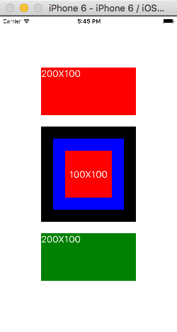

# 3.2 绝对和相对

# 3.2 绝对和相对

1.绝对

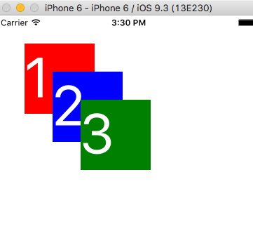

```
class Position extends Component {
  render() {
    return (
      <View style={styles.container}>
        <View style={styles.box1}>
          <Text style={styles.text}>1</Text>
        </View>
        <View style={styles.box2}>
          <Text style={styles.text}>2</Text>
        </View>
        <View style={styles.box3}>
          <Text style={styles.text}>3</Text>
        </View>
      </View>
    );
  }
}
const styles = StyleSheet.create({
  container: {
    flex: 1
  },
  box1: {
    position: 'absolute',
    top: 40,
    left: 40,
    width: 100,
    height: 100,
    backgroundColor: 'red'
  },
  box2: {
    position: 'absolute',
    top: 80,
    left: 80,
    width: 100,
    height: 100,
    backgroundColor: 'blue'
  },
  box3: {
    position: 'absolute',
    top: 120,
    left: 120,
    width: 100,
    height: 100,
    backgroundColor: 'green'
  },
  text: {
    color: '#ffffff',
    fontSize: 80
  }
}); 
```

2.zIndex，[v0.29](https://github.com/facebook/react-native/commit/d64368b9e239b574039f4a6508bf2aeb0806121b) 或 [transform](http://facebook.github.io/react-native/docs/transforms.html)

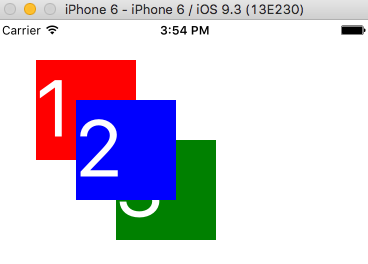

```
 box2: {
    position: 'absolute',
    top: 80,
    left: 80,
    width: 100,
    height: 100,
    backgroundColor: 'blue',
    transform: [{'translate': [0,0, 1]}]
  }, 
```

3.相对（默认）

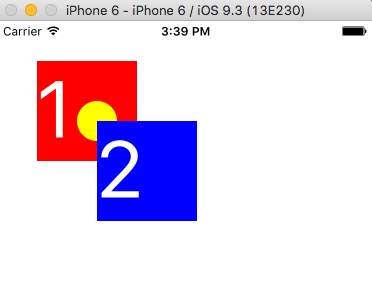

```
class Relative extends Component {
  render() {
    return (
      <View style={styles.container}>
        <View style={styles.box1}>
          <Text style={styles.text}>1</Text>
          <View style={styles.ball}/>
        </View>
        <View style={styles.box2}>
          <Text style={styles.text}>2</Text>
        </View>
      </View>
    );
  }
}
const styles = StyleSheet.create({
  container: {
    flex: 1
  },
  box1: {
    position: 'relative',
    top: 40,
    left: 40,
    width: 100,
    height: 100,
    backgroundColor: 'red'
  },
  box2: {
    position: 'absolute',
    top: 100,
    left: 100,
    width: 100,
    height: 100,
    backgroundColor: 'blue'
  },
  ball: {
    position: 'absolute',
    top: 40,
    left: 40,
    width: 40,
    height: 40,
    borderRadius: 20,
    backgroundColor: 'yellow'
  },
  text: {
    color: '#ffffff',
    fontSize: 80
  }
}); 
```

4.fixed

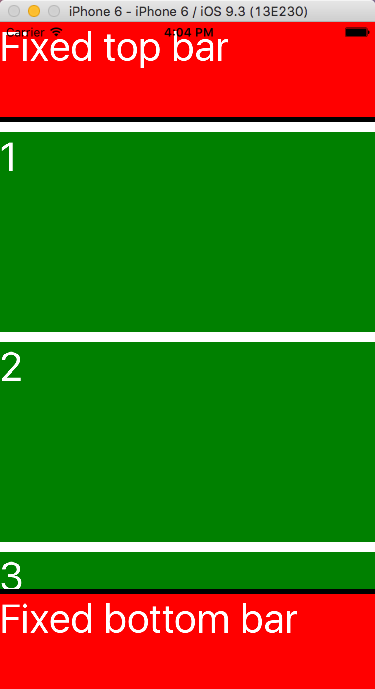

```
 class Fixed extends Component {
  render() {
    return (
      <View style={styles.container}>
        <View style={styles.tbar}>
          <Text style={styles.text}>Fixed top bar</Text>
        </View>
        <ScrollView style={styles.main}>
          <View style={styles.item}><Text style={styles.text}>1</Text></View>
          <View style={styles.item}><Text style={styles.text}>2</Text></View>
          <View style={styles.item}><Text style={styles.text}>3</Text></View>
        </ScrollView>
        <View style={styles.bbar}>
          <Text style={styles.text}>Fixed bottom bar</Text>
        </View>
      </View>
    );
  }
}
const styles = StyleSheet.create({
  container: {
    flex: 1
  },
  tbar: {
    width: 375,
    height: 100,
    borderBottomWidth: 5,
    borderColor: 'black',
    backgroundColor: 'red'
  },
  main: {
    flex: 1
  },
  item: {
    height: 200,
    width: 375,
    marginTop: 10,
    backgroundColor: 'green'
  },
  bbar: {
    width: 375,
    height: 100,
    borderTopWidth: 5,
    borderColor: 'black',
    backgroundColor: 'red'
  },
  text: {
    color: '#ffffff',
    fontSize: 40
  }
}); 
```

# 3.3 尺寸和维度和 onLayout

# 3.3 尺寸和维度和 onLayout

1.窗口大小

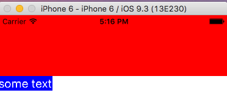

```
let winSize = Dimensions.get('window');
console.log(winSize);
class Size extends Component {
  render() {
    return (
      <View style={styles.container}>
        <View style={styles.block}/>
        <Text style={styles.text}>some text</Text>
      </View>
    );
  }
}
const styles = StyleSheet.create({
  container: {
    flex: 1,
    alignItems: 'flex-start'
  },
  block: {
    height: 100,
    width: winSize.width,
    backgroundColor: 'red'
  },
  text: {
    color: '#ffffff',
    fontSize: 40/winSize.scale,
    backgroundColor: 'blue'
  }
}); 
```

2.[onLayout](http://facebook.github.io/react-native/releases/0.28/docs/view.html#onlayout)

```
class Size extends Component {
  handleTextLayout(evt){
    console.log(evt.nativeEvent.layout);
  }
  render() {
    return (
      <View style={styles.container}>
        <View style={styles.block}/>
        <Text style={styles.text}
          onLayout={this.handleTextLayout}>some text</Text>
      </View>
    );
  }
} 
```

# 3.4 继承

# 3.4 继承

1.将样式作为 props 传递

```
class InheritanceStyle extends Component {
  render() {
    return (
      <View style={this.props.parentColor}>
      </View>
    );
  }
}

class Main extends Component {
  handleReady(str){
    console.log(str);
  }
  render() {
    return (
      <View style={styles.container}>
        <InheritanceStyle parentColor={styles.blue}/>
      </View>
    );
  }
}
const styles = StyleSheet.create({
  container: {
    flex: 1
  },
  blue: {
    flex: 1,
    backgroundColor: 'blue'
  }
}); 
```

2.连接样式

BaseStyles.js

```
import { StyleSheet,Dimensions } from 'react-native';
let winSize = Dimensions.get('window');
const BaseStyles = StyleSheet.create({
  text: {
    fontSize: 40/winSize.scale
  }
});
export default BaseStyles; 
```

```
import BaseStyles from './BaseStyles';

class InheritanceStyle extends Component {
  render() {
    return (
      <View style={this.props.parentColor}>
        <Text style={[BaseStyles.text, styles.text]}> this is a long text </Text>
      </View>
    );
  }
}
const styles = StyleSheet.create({
  text:{
    color: '#ffffff'
  }
}); 
```

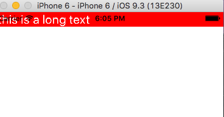

# 3.5 资源

# 3.5 资源

+   [Flexbox 完全指南](https://css-tricks.com/snippets/css/a-guide-to-flexbox/)

+   [CSS3 Flexbox 属性的可视化指南](https://scotch.io/tutorials/a-visual-guide-to-css3-flexbox-properties)

+   [理解 Flex 方向](http://www.standardista.com/understanding-flex-direction/)

+   [本章的演示脚本](https://github.com/unbug/react-native-train-scripts)
