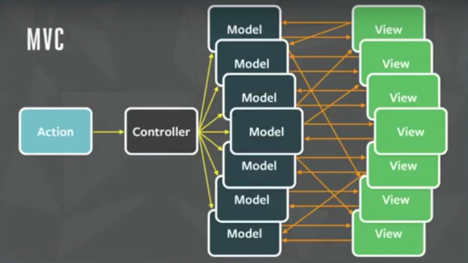
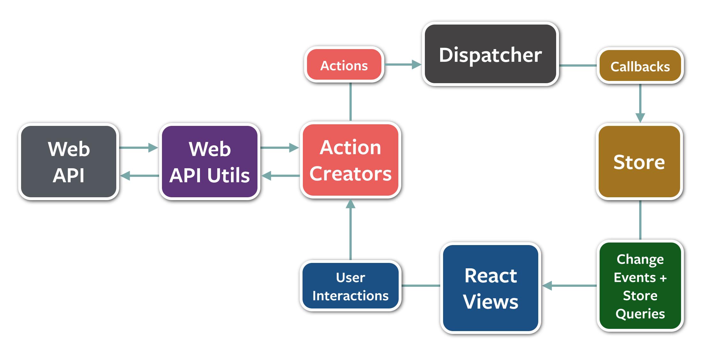
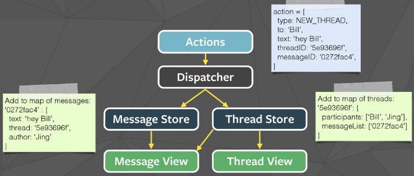
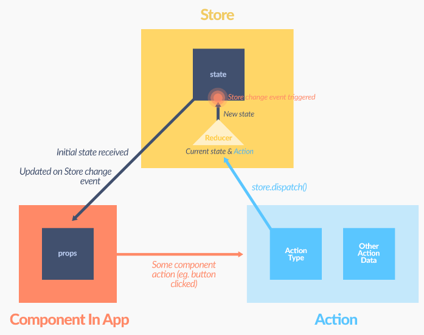
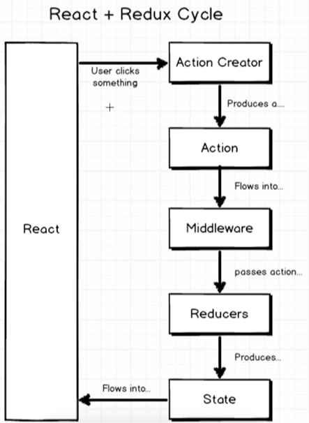
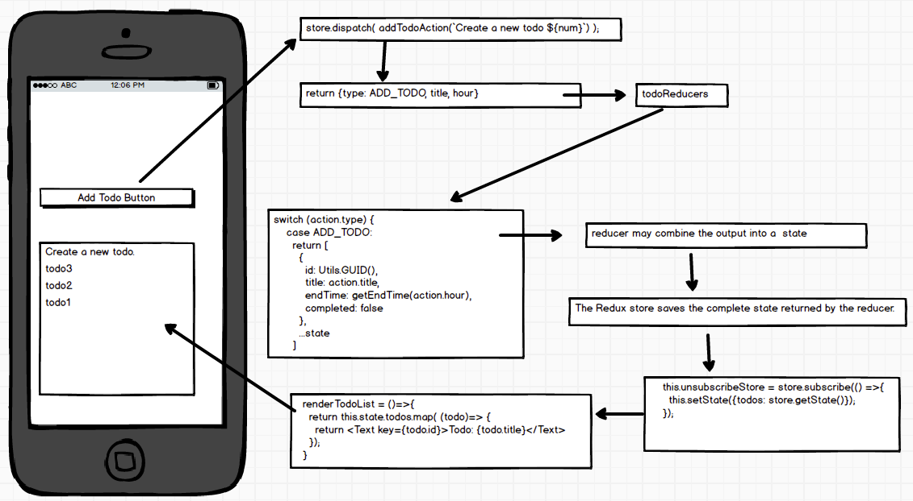
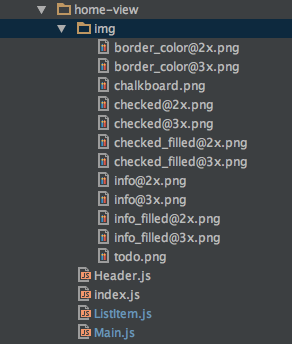
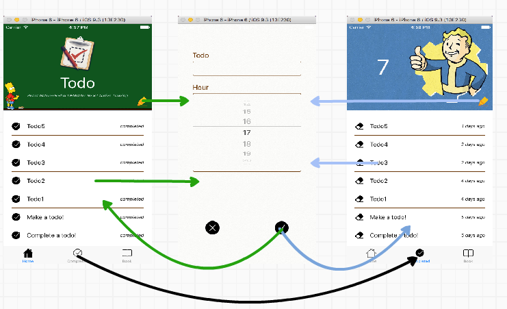
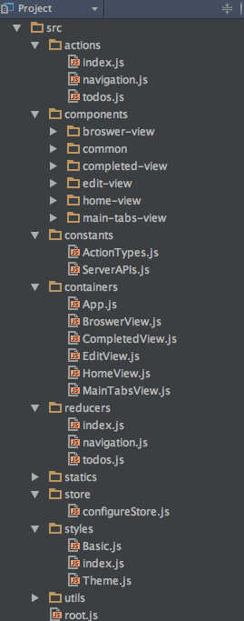
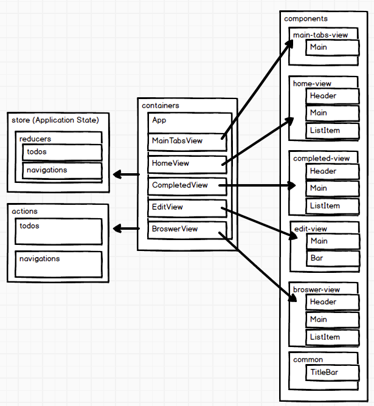

# 4 架构

# 4 架构

1.MVC 问题



2.[Flux](http://facebook.github.io/flux/docs/overview.html)

 3.数据流



[Flux TodoMVC 示例](https://github.com/facebook/flux/tree/master/examples/flux-todomvc/)

# 4.1 Redux

# 4.1 Redux

1.[动作](https://github.com/acdlite/flux-standard-action) & 动作创建者

```
//action type
const ADD_TODO = 'ADD_TODO';

//action creator, semantic methods that create actions
//collected together in a module to become an API
function addTodoAction(title, hour) {
  //action, an object with a type property and new data, like events
  return {type: ADD_TODO, title, hour}
} 
```

2.[Reducers](http://redux.js.org/docs/basics/Reducers.html)

```
//a function that accepts an accumulation and a value and returns a new accumulation.
function todoReducers(state = [], action) {
  switch (action.type) {
    case ADD_TODO:
      //always return a new state, never mutate old state
      return [
        {
          id: Utils.GUID(),
          title: action.title,
          endTime: getEndTime(action.hour),
          completed: false
        },
        ...state
      ]
    default:
      //return default state
      return state
  }
} 
```

3.存储

```
import { createStore } from 'redux';
//1\. define store
let store = createStore(todoReducers);

class App extends Component {
  constructor(props){
    super(props);
    this.state = {todos: []};
  }
  componentDidMount(){
    //2\. subscribe store
    this.unsubscribeStore = store.subscribe(() =>{
      //3\. getState
      this.setState({todos: store.getState()});
    });
  }
  componentWillUnmount(){
    //5\. unsubscribe store
    this.unsubscribeStore();
  }
  renderTodoList = ()=>{
    //reder todo list
    return this.state.todos.map( (todo)=> {
      return <Text key={todo.id}>Todo: {todo.title}</Text>
    });
  }
  handleAddTodo = ()=>{
    //4\. dispatching actions
    store.dispatch( addTodoAction('Create a new todo', 8) );
  }
  render() {
    return (
      <View>
        <TouchableHighlight onPress={this.handleAddTodo}>
          <Text>Add Todo</Text>
        </TouchableHighlight>
        <ScrollView>{this.renderTodoList()}</ScrollView>
      </View>
    );
  }
} 
```

4.数据流







# 4.2 react-redux

# 4.2 [react-redux](https://github.com/reactjs/react-redux)

1.动作

```
import * as  navigationActions from './navigation';
import * as  todosActions from './todos';

export default {...navigationActions, ...todosActions}; 
```

2.combineReducers()

```
import { combineReducers } from 'redux';
import navigation from './navigation';
import todos from './todos';

const rootReducer = combineReducers({
  navigation, todos
});

export default rootReducer; 
```

3.应用状态通过 configureStore()

```
import { createStore } from 'redux';
import reducers from '../reducers';

export default function configureStore() {
  const store = createStore(reducers);
  return store;
} 
```

4.mapStateToProps & mapDispatchToProps & bindActionCreators

```
import { bindActionCreators } from 'redux';
import { connect } from 'react-redux';

class App extends Component {
  renderTodoList = ()=>{
    //reder todo list
    return this.props.todos.map( (todo)=> {
      return <Text key={todo.id}>Todo: {todo.title}</Text>
    });
  }
  handleAddTodo = ()=>{
    this.props.actions.addTodoAction('Create a new todo', 8);
  }
  render() {
    return (
      <View>
        <TouchableHighlight onPress={this.handleAddTodo}>
          <Text>Add Todo</Text>
        </TouchableHighlight>
        <ScrollView>{this.renderTodoList()}</ScrollView>
      </View>
    );
  }
}

function mapStateToProps(state) {
  return {
    todos: state.todos
  };
}

function mapDispatchToProps(dispatch) {
  return {
    actions: bindActionCreators(Actions, dispatch)
  }
}

export default connect(
  mapStateToProps,
  mapDispatchToProps
)(App); 
```

5.使用 `<Provider/>` 传递 Store

```
import React, { Component } from 'react';
import { Provider } from 'react-redux';

import App from './containers/App';
import configureStore from './store/configureStore';

class Root extends Component {
  render() {
    return (
      <Provider store={configureStore()}>
        <App />
      </Provider>
    );
  }
}

export default Root; 
```

# 4.3 容器和组件

# 4.3 容器和组件

1.[展示组件和容器组件](http://redux.js.org/docs/basics/UsageWithReact.html)

|  | 展示组件 | 容器组件 |
| --- | --- | --- |
| 目的 | 外观（标记，样式） | 工作方式（数据获取，状态更新） |
| 感知 Redux | 否 | 是 |
| 读取数据 | 从 props 读取数据 | 订阅 Redux 状态 |
| 改变数据 | 从 props 调用回调 | 分发 Redux 动作 |
| 由手写 | 通常由 React Redux 生成 |

2.`components/home-view` & `containers/HomeView`

2.1 主页视图组件



2.2 主页视图容器

```
import {
  Header,
  Main,
} from '../components/home-view';
import Actions from '../actions';

class HomeView extends Component {
  render() {
    return (
      <View>
        <Header {...this.props}/>
        <Main {...this.props} isVisible={this.state.isVisible}/>
      </View>
    );
  }
}

function mapStateToProps(state) {
  return {
    todos: state.todos
  };
}

function mapDispatchToProps(dispatch) {
  return {
    actions: bindActionCreators(Actions, dispatch)
  }
}

export default connect(
  mapStateToProps,
  mapDispatchToProps
)(HomeView); 
```

# 4.4 待办事项 React Native 应用

# 4.4 [待办事项 React Native 应用](https://github.com/unbug/TodoRN)

1.概述  

2.结构



3.容器和组件 

# 4.5 命名规范

# 4.5 命名规范

1.容器和组件

1.1\. 容器文件:

```
src/containers/ModuleNameView.js 
```

组件文件:

```
src/components/module-name-view
 - index.js
 - Main.js
 - Header.js
 - ...
 - img
   - icon@2x.png
   - icon@3x.png 
```

1.2\. 事件名称:

```
handleEventName = ()=>{//todo}
...
<MyComponent onEventName={this.handleEventName}/> 
```

1.3\. 渲染方法:

```
 renderMethodName = () => {
   //todo
  }
  render() {
    return (
      <View>
        {this.renderMethodName()}
      </View>
    );
  }
` 
```

1.4\. mapStateToProps & mapDispatchToProps

```
function mapStateToProps(state) {
  return {
    todos: state.todos
  };
}

function mapDispatchToProps(dispatch) {
  return {
    actions: bindActionCreators(Actions, dispatch)
  }
} 
```

2.actions `src/actions`

```
index.js
todos.js
navigation.js 
```

2.1`src/constants/ActionTypes.js`

```
export const SWITCH_MAIN_TAB = 'SWITCH_MAIN_TAB'; 
```

2.2```src/actions/todos.js````

```
import * as types from '../constants/ActionTypes'

export function addTodo(title, hour) {
  return {type: types.ADD_TODO, title, hour}
} 
```

3.reducers`src/reducers`

```
index.js
todos.js
navigation.js 
```

3.1.`src/reducers/todos.js`

```
import { ADD_TODO, DELETE_TODO, EDIT_TODO, COMPLETE_TODO } from '../constants/ActionTypes'
const initialState = []

export default function todos(state = initialState, action) {
  switch (action.type) {
    case ADD_TODO:
      //todo
    default:
      return state
  }
} 
```

4.styles`src/styles`

```
index.js
Basic.js
Theme.js 
```

4.1`src/styles/Basic.js`

```
import { StyleSheet, Dimensions } from 'react-native';
let winSize = Dimensions.get('window');
const Basic = StyleSheet.create({
  text: {
    fontSize: 32/winSize.scale
  }
});
export default Basic; 
```

4.2`src/styles/Theme.js`

```
//colors
const color = {
  green: '#00551e',
  brown: '#693504',
  red: '#db2828'
}

//other
const active = {
  opacity: 0.6
}

export default {color, active} 
```

4.3`import {Theme, BasicStyle} from '../../styles';`

# 4.6 资源

# 4.7 资源

+   [Flux](http://facebook.github.io/flux/docs/overview.html)

+   [Facebook: MVC 不适用于规模化，使用 Flux 替代](https://www.infoq.com/news/2014/05/facebook-mvc-flux)

+   [Redux](http://redux.js.org/index.html)

+   [fluxchat 作者 Bill Fisher](https://speakerdeck.com/fisherwebdev/fluxchat)

+   [在实践中介绍 Flux 和 react（KKBOX）](http://www.slideshare.net/randylien/introduce-flux-react-in-kkbox)

+   [react-flux-fluent-2015 作者 Bill Fisher](https://speakerdeck.com/fisherwebdev/react-flux-fluent-2015)

+   [Flux TodoMVC 示例](https://github.com/facebook/flux/tree/master/examples/flux-todomvc)

+   [待办事项 React Native 应用](https://github.com/unbug/TodoRN)
