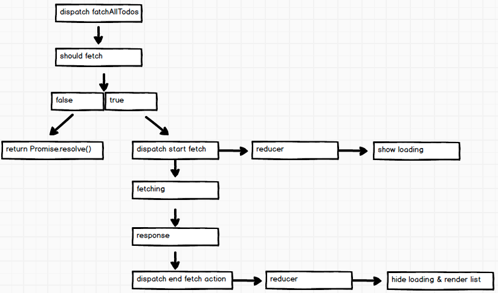

# 5 数据

# 5 数据

1.[网络](http://facebook.github.io/react-native/releases/0.30/docs/network.html)

+   获取

+   XMLHttpRequest API

+   WebSocket

# 5.1 获取

# 5.1 获取

1.应用 [redux-thunk](https://github.com/gaearon/redux-thunk) 中间件

```
import { applyMiddleware, createStore, compose } from 'redux';
import thunk from 'redux-thunk';
import createLogger from 'redux-logger';
import reducers from '../reducers';

var middlewares = compose(applyMiddleware(thunk), autoRehydrate());

export default function configureStore() {
  const store = createStore(reducers, undefined, middlewares);
  return store;
} 
```

2.开始 & 结束动作类型

```
//todo action types
export const START_FETCH_ALL_TODOS = 'START_FETCH_ALL_TODOS';
export const FETCH_ALL_TODOS = 'FETCH_ALL_TODOS'; 
```

3.获取流程

```
import * as types from '../constants/ActionTypes';
import * as APIs from '../constants/ServerAPIs';

function shouldFetchAllTodos(state) {
  const data = state.todos;
  if (data && data.isFetchingAllTodos) {
    return false
  }
  return true;
}

export function fetchAllTodos() {
  return async (dispatch, getState) =>{
    //verify
    if(!shouldFetchAllTodos(getState())){
      return Promise.resolve();
    }

    //dispatch fetch start action
    dispatch({type: types.START_FETCH_ALL_TODOS});

    //fetching
    const response = await fetch(APIs.allTodos);
    //response
    const data = await response.json();

    //dispatch fetch end action
    return dispatch({
      type: types.FETCH_ALL_TODOS,
      data
    });
  }
} 
```

4.减速器

```
export default function todos(state = initialState, action) {
  switch (action.type) {
    case types.START_FETCH_ALL_TODOS:
      return Object.assign({}, state, {isFetchingAllTodos: true});

    case types.FETCH_ALL_TODOS:
      return Object.assign({}, state, {
        isFetchingAllTodos: false,
        data: action.data.data.reduce(function (pre, cur) {
          //remove duplicates
          !pre.find( key=> key.id===cur.id) && pre.push(cur);
          return pre;
        }, [...state.data])
      });
    ...
    ...
    default:
      return state
  }
} 
```

5.调度 & 渲染

```
...
  componentDidMount(){
    //fetch data from server
    this.props.actions.fetchAllTodos();
  }
...
...
  renderLoading = () => {
    if (this.props.todos.isFetchingAllTodos) {
      return (
        <View style={styles.loading}>
          <Text style={styles.loadingText}>Loading...</Text>
        </View>
      )
    }
    return null;
  }
... 
```



# 5.2 持久化

# 5.2 持久化

1.[AsyncStorage](https://facebook.github.io/react-native/docs/asyncstorage.html)

2.应用 [redux-persist](https://github.com/rt2zz/redux-persist) 中间件

```
import { AsyncStorage } from 'react-native';
import { applyMiddleware, createStore, compose } from 'redux';
import thunk from 'redux-thunk';
import {persistStore, autoRehydrate} from 'redux-persist';
import reducers from '../reducers';

var middlewares = compose(applyMiddleware(thunk), autoRehydrate());

export default function configureStore() {
  const store = createStore(reducers, undefined, middlewares);
  persistStore(store, {storage: AsyncStorage});
  return store;
} 
```

# 5.3 资源

# 5.3 资源

+   [Redux 异步操作](http://redux.js.org/docs/advanced/AsyncActions.html)

+   [待办事项 React Native 应用](https://github.com/unbug/TodoRN)
