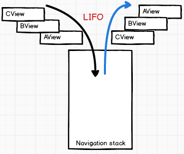
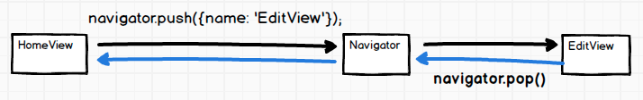

# 6 路由器

# 6 路由器

+   [NavigatorIOS](https://facebook.github.io/react-native/docs/navigatorios.html)

+   [导航器](https://facebook.github.io/react-native/docs/navigator.html)

# 6.1 导航器

# 6.1 导航器

1.定义路由

```
 import MainTabsView from './MainTabsView';
import EditView from './EditView';
import BroswerView from './BroswerView';

const ROUTES = { MainTabsView,  BroswerView, EditView }; 
```

2.配置导航器

```
class App extends Component {
  renderScene = (route, navigator) => {
    let Scene = ROUTES[route.name];
    return <Scene {...route} navigator={navigator}/>;
  }
  configureScene = (route, routeStack) => {
    switch (route.name){
      case 'EditView':
        return Navigator.SceneConfigs.FloatFromBottom;
      default:
        return Navigator.SceneConfigs.PushFromRight;
    }
  }
  render() {
    return (
      <View style={styles.container}>
        <StatusBar barStyle="light-content"/>
        <Navigator
          initialRoute={{name: 'MainTabsView'}}
          renderScene={this.renderScene}
          configureScene={this.configureScene}/>
      </View>
    )
  }
} 
```

3.前进和后退



```
...
  handleEdit = ()=>{
    //Navigate forward to a new scene
    this.props.navigator.push({name: 'EditView', data: this.props.data});
  }
... 
```

```
...
  close = ()=>{
    //Transition back and unmount the current scene
    this.props.navigator.pop();
  }
... 
```



4.在焦点变化时 & 在焦点将要变化时

```
...
componentDidMount(){
    this.currentRoute = this.props.navigator.navigationContext.currentRoute;
    this.bindEvents();
  }
  componentWillUnmount(){
    this.unBindEvents();
  }
  bindEvents = ()=>{
    this.willFocusSubscription  = this.props.navigator.navigationContext.addListener('willfocus', (event) => {
      if (this.currentRoute !== event.data.route) {
        this.setState({isVisible: false});
      }
    });
    this.didFocusSubscription  = this.props.navigator.navigationContext.addListener('didfocus', (event) => {
      if (this.currentRoute === event.data.route) {
        this.setState({isVisible: true});
      }
    });
  }
  unBindEvents = ()=>{
    this.willFocusSubscription.remove();
    this.didFocusSubscription.remove();
  }
... 
```

# 6.2 资源

# 6.2 资源

+   [React Native 中的路由和导航](http://blog.paracode.com/2016/01/05/routing-and-navigation-in-react-native/)
