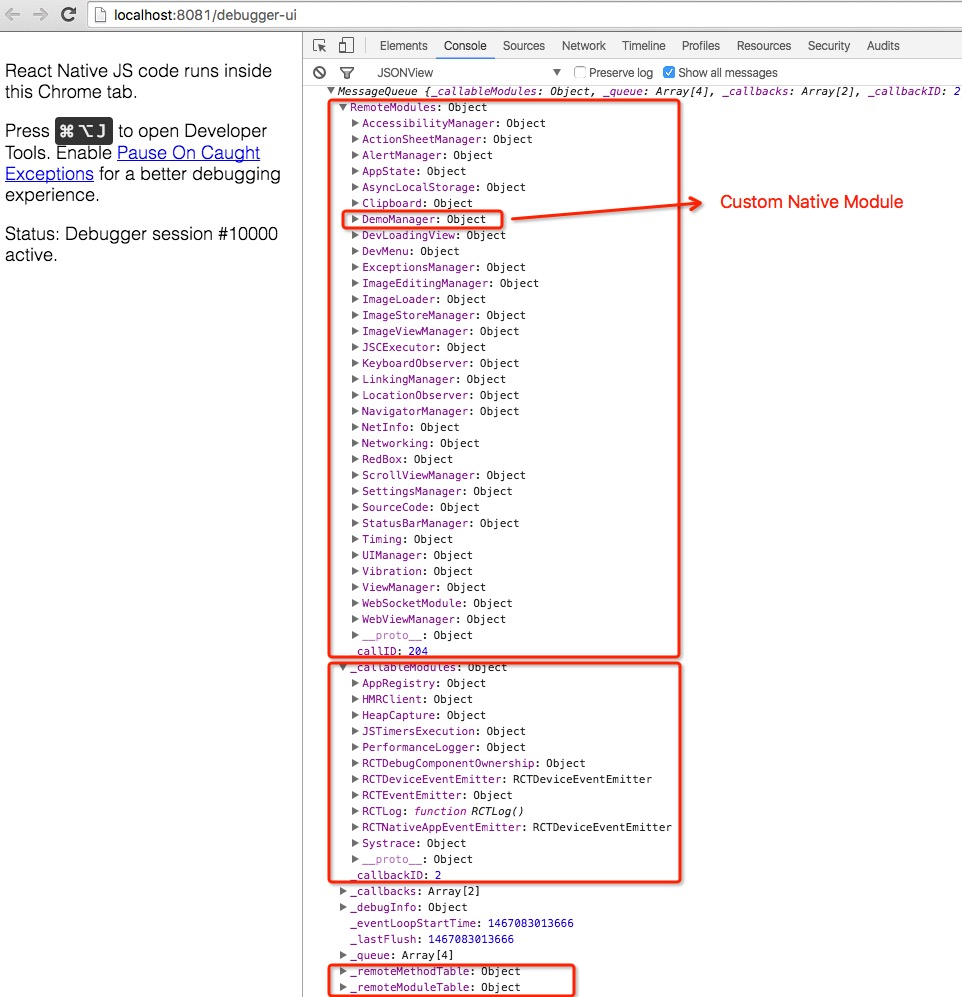

# 7 原生模块（草稿）

# 7 原生模块

在你的 RN 代码中的某个地方插入：

`console.log(__fbBatchedBridge);`

然后在你的调试器([`localhost:8081/debugger-ui`](http://localhost:8081/debugger-ui))中，你会看到类似下面的内容，

 这就是我们将在本章讨论的内容。

# 7.1 iOS

# 7.1 iOS

# 7.2 Android

# 7.2 Android

# 7.3 资源

# 7.3 资源

+   [一个使用 React Native 的 OpenGL 应用](http://jlongster.com/First-Impressions-using-React-Native)
