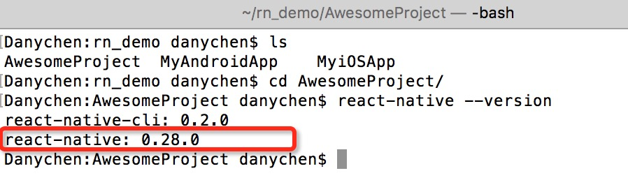
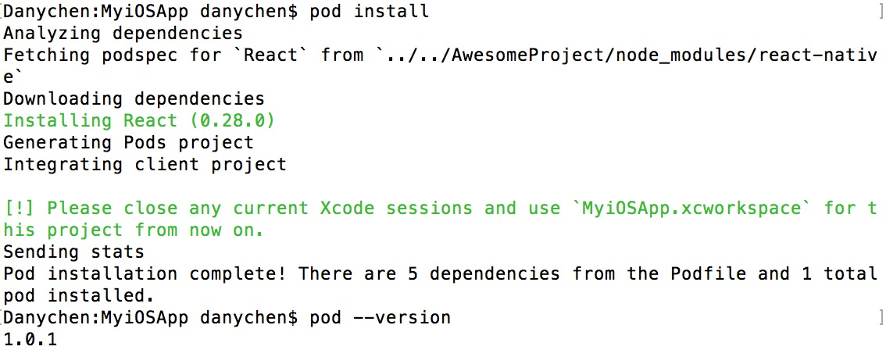
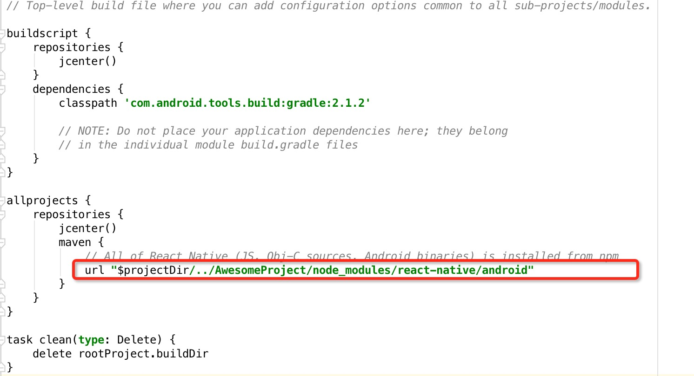
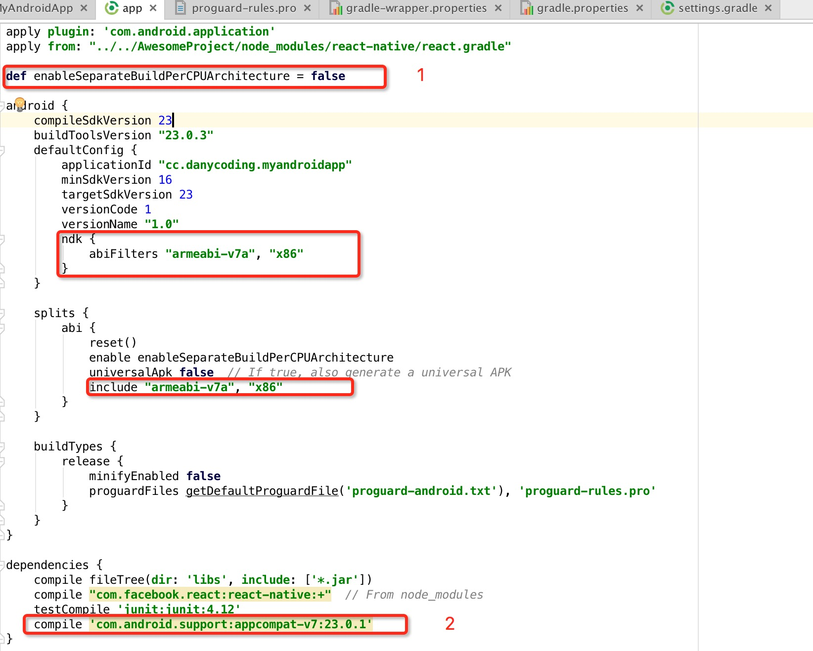
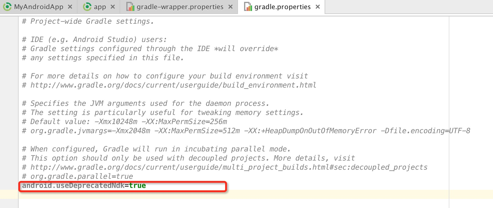
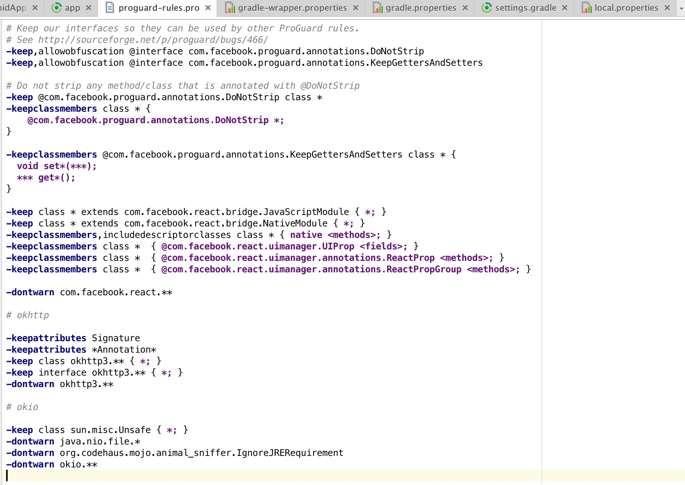
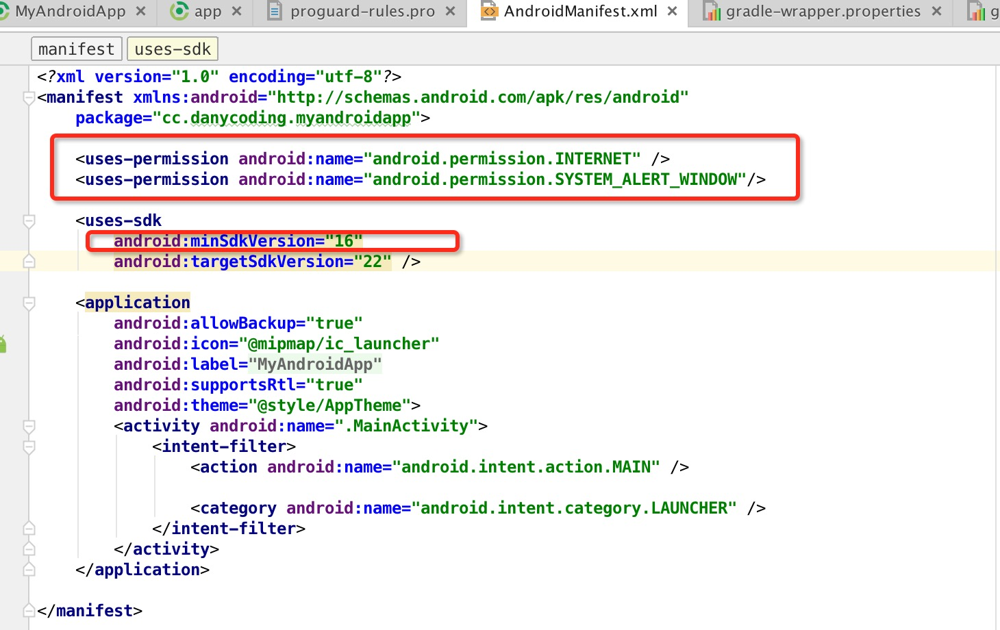

# 8 集成（草稿）

# 8 集成

大多数情况下，我们并不是要启动一个新应用程序，而是想要使用 react-native 来开发一些新功能，因此集成应该是 react-native 开发人员的必备技能。

假设您已经在 AwesomeProject 中创建了一些功能，您想要为当前项目创建完全相同的环境。



**请注意**，版本在您的应用程序发布后非常重要。如果您想要升级 react-native 并打包代码，那几乎意味着您不想再维护旧版本了。

# 8.1 iOS

# 8.1 iOS

+   ## 使用本地路径的 Cocoapods

    要求：[CocoaPods](https://cocoapods.org/)

    在 pod **版本 > 1.0** 之后，您需要识别目标。在项目根文件夹中创建 'Podfile'：

    ```
    target 'MyiOSApp' do 
      pod 'React', :path => '../../AwesomeProject/node_modules/react-native', :subspecs => [
          'Core',
          'RCTImage',
          'RCTNetwork',
          'RCTText',
          'RCTWebSocket',
      ]
    end 
    ```

    然后 `pod install`

    

# 8.1.1 包

# 9.1.1 包

```
react-native bundle 
--platform ios 
--dev false 
--entry-file index.ios.js 
--bundle-output ios/bundle/index.ios.bundle 
--assets-dest ios/bundle 
```

# 8.1.2 图像

# 9.1.2 图像

+   ### 缓存路径

# 8.2 Android

# 8.2 Android

起初我遵循官方说明（看起来非常简单），但出现了许多构建或运行时错误 😂。

例如：

`Can't find variable: __fbBatchedBridge (<unknown file>:1)`

`java.lang.UnsatisfiedLinkError: could find DSO to load: libreactnativejni.so`

`android.view.WindowManager$BadTokenException: Unable to add window android.view.ViewRootImpl$W@5d992cf -- permission denied for this window type`

但演示正常运行，所以我决定复制它的构建设置。最后在我的 Nexus 5X 上正常工作。步骤：

+   添加路径到根 gradle 文件，

+   修改应用 gradle 文件，

    *1\. 官方演示使用此变量来控制是否为不同的 cpu 构建不同的应用程序，这将减小每个应用程序的大小，我在这里只是忽略它。

    *2\. 版本支持包很重要。由于 react-native Android 使用许多开源项目，如果您已经使用了其中一些，您应该检查版本或从依赖项中排除它们。[当前列表](https://github.com/facebook/react-native/blob/master/ReactAndroid/build.gradle)

    ```
     compile 'com.android.support:appcompat-v7:23.0.1'
      compile 'com.android.support:recyclerview-v7:23.0.1'
      compile 'com.facebook.fresco:fresco:0.11.0'
      compile 'com.facebook.fresco:imagepipeline-okhttp3:0.11.0'
      compile 'com.fasterxml.jackson.core:jackson-core:2.2.3'
      compile 'com.google.code.findbugs:jsr305:3.0.0'
      compile 'com.squareup.okhttp3:okhttp:3.2.0'
      compile 'com.squareup.okhttp3:okhttp-urlconnection:3.2.0'
      compile 'com.squareup.okhttp3:okhttp-ws:3.2.0'
      compile 'com.squareup.okio:okio:1.8.0'
      compile 'org.webkit:android-jsc:r174650' 
    ```

+   修改根 gradle.properties，

+   添加 proguard 规则，

+   AndroidManifest.xml，如果不需要调试模式，则可以删除权限。

# 8.2.1 包

# 9.2.1 包

```
react-native bundle 
--platform android 
--dev false 
--entry-file index.android.js 
--bundle-output android/bundle/index.android.bundle 
--assets-dest android/bundle/ 
```

# 8.3 发布前

# 8.3 发布前

+   ### 关闭调试设置。

+   ### 异常处理程序的实现。

# 8.4 资源

# 8.3 资源

+   [与现有应用程序集成 - iOS](https://facebook.github.io/react-native/docs/embedded-app-ios.html)

+   [与现有应用程序集成 - Android](https://facebook.github.io/react-native/docs/embedded-app-android.html)

# 9.3 资源

# 9.3 资源

+   [React Native CodePush 模块](http://microsoft.github.io/code-push/)

+   [JSPatch](https://github.com/bang590/JSPatch)
